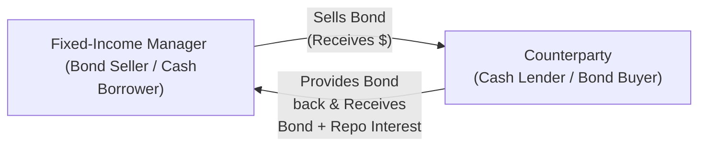

## Introduction

Leverage in fixed-income investing can be an exciting but also nerve-racking topic. I remember chatting with a friend who managed a small bond fund; she enthusiastically explained how leveraging her portfolio with repurchase agreements (repos) boosted her returns. Then, sure enough, a period of market volatility hit, forcing a margin call that turned her excitement into a bit of panic. That’s the double-edged sword of leverage—it can make your best days better and your worst days, well, considerably worse.

In fixed-income portfolios, leverage is the practice of using borrowed capital or derivative-based exposures to amplify potential returns. It’s not just about chasing higher yield, though; investors also deploy leverage to exploit arbitrage opportunities, to counterbalance short-term funding needs, and sometimes to more closely align with liabilities. But, as you’ll see, going big on leverage calls for robust risk management. Let’s explore methods of obtaining leverage, why investors use it, and the various risks it brings to the table.

## Why Use Leverage in Fixed-Income?

Leverage is a powerful tool for fixed-income managers for several reasons:

• Yield Enhancement: Managers might leverage portfolios to capture incremental yield. Low-interest-rate environments often pressure portfolio returns, so using borrowed funds at a lower rate to invest in higher-yielding instruments can boost overall returns.

• Short-Term Funding: Institutions may temporarily finance security purchases through short-term debt structures or by using repos. This approach can help bank treasury operations or fund managers handle cash-flow imbalances.

• Arbitrage Opportunities: In some fixed-income niches, small mispricings between instruments (e.g., on-the-run vs. off-the-run Treasury bonds) can be exploited through leveraged positions. For example, a manager might short one Treasury security and go long another, financing that ‘long’ with forms of borrowing.

Leverage magnifies returns. But remember, it also magnifies losses. If the yield you earn is lower than the cost of borrowing, or if the market moves against you, your leveraged position can sour quickly.

## Common Methods of Obtaining Leverage

Leverage in fixed-income most frequently takes these forms:

• Repurchase Agreements (Repos)  
• Futures and Forwards  
• Swaps (Total Return Swaps, Interest Rate Swaps)  
• Options-Based Strategies  

They share the same basic principle: you gain exposure to a position worth more than your initial outlay, which can juice returns but also raises your potential downside.

### Repurchase Agreements (Repos)

A repurchase agreement is essentially a collateralized short-term loan. One party sells a security (often a Treasury bill, note, or bond) to another, aiming to repurchase it at a later date and a slightly higher price. The difference in prices represents the interest expense.

Mechanics of a Repo:

• The initial seller (borrower) receives cash.  
• The buyer (lender) receives collateral—the bond.  
• When the repo matures, the borrower repurchases the bond at the agreed-upon price.  

“Haircuts” come into play: if you need, say, $1 million in financing, you might have to pledge $1.02 million in bonds. The extra $20,000 (2%) is the haircut, protecting the lender if the bond’s value declines. Repos can be rolled over, but changes in market volatility or credit conditions can alter haircuts or funding rates.

Below is a simplified depiction of a basic overnight repo transaction:

Because repos are such a prevalent tool, the conditions and haircuts can shift quickly in volatile markets. In extreme markets (e.g., a credit crunch), haircuts may widen significantly or lenders might even refuse to extend credit.

### Futures and Forwards

Futures and forward contracts let you gain exposure without paying the full purchase price of the underlying bond immediately. For example, a bond futures contract on U.S. Treasury notes will allow you to lock in a future purchase (or sale) price for the underlying security:

• You post margin (not the full value of the contract).  
• If bond prices rise and you are long, you gain.  
• If bond prices fall, you may face margin calls and potential losses on an amplified scale.  

Futures are exchange-traded, standardized, and often quite liquid. Forwards, on the other hand, are customized agreements traded over the counter (OTC); a forward on a certain corporate bond might be structured between two counterparties. Both are potent sources of leverage since you’re effectively controlling more notional exposure than the collateral posted.

### Swaps

Swaps, particularly interest rate swaps (IRS) and total return swaps (TRS), can mimic leveraged exposures. In an IRS, you might pay a fixed rate on a notional amount while receiving a floating rate (or vice versa). The notional is not exchanged—only the net cash payment. That means you’re gaining economic exposure to a large pool of capital without making a similarly large upfront investment.

In a total return swap, the investor receives the total return (income plus capital gains) of a reference bond or bond index in exchange for paying a floating rate (like LIBOR or SOFR), possibly plus a spread. If the reference bond appreciates, you get an amplified return. If it plummets, so does your position. These instruments allow you to tilt or hedge your portfolio’s interest rate or credit risk profile without On-Balance-Sheet large capital outlays.

### Options-Based Strategies

Option strategies can similarly deliver leverage. A call option with a small premium can control a notional amount of bonds. The payoff can be significant relative to the premium, but if the bond’s price moves in the wrong direction, you could lose your entire premium. Options are often used for yield enhancement (e.g., writing covered calls) or to protect a leveraged position.

## Operational Mechanics of Repos

Among these methods, repos tend to be the bread-and-butter approach for many fixed-income market participants, partly because they’re cost-effective and relatively straightforward once you’re set up with counterparties.

• Transaction Flow: You (the bond owner) temporarily sell your bonds to a repo counterparty. You receive something close to the bond’s fair market value in cash, minus a haircut.  

• Haircuts and Market Volatility: If the market is stable, haircuts might be minimal (1%–3% for high-quality sovereign bonds). However, if volatility spikes, haircuts can balloon to 5%, 10%, or more, decreasing your effective leverage.  

• Pricing: Repo rates fluctuate daily with overall liquidity conditions. When liquidity is scarce, rates can rise (or remain stubbornly high), driving up your cost of leverage.

• Collateral Management: The quality of the collateral is critical. High-grade government bonds demand lower haircuts than, say, lower-rated corporates or structured products.

In practice, many institutions maintain rolling repo positions, renewing them daily or weekly. If market conditions worsen quickly, lenders will adjust the terms (higher rates or bigger haircuts) or demand additional collateral, essentially making a margin call.

## Prime Broker Relationships in Hedge Fund Contexts

Hedge funds typically leverage through prime brokers. A prime broker acts as a comprehensive service provider, facilitating short sales, margin borrowing, and settlement. It’s kind of like having a one-stop shop for your trading and operational needs. However, you might sign up for a prime broker arrangement with an attractive margin rate, only to find that in times of stress, the broker changes margin requirements and asks for more collateral. That can be a rude awakening, especially if you’ve planned certain trades assuming consistent margin terms.

Prime brokerage also introduces legal and counterparty risks:

• If your prime broker runs into trouble, your collateral might be frozen or at risk.  
• Hedge funds often spread relationships across multiple prime brokers to mitigate concentration risk.

## Mark-to-Market and Margin Calls

One of the scariest parts of leveraging is the dreaded margin call. When the market moves against your position, your lender or broker will ask for additional capital to reinstate the required collateral or margin ratio. Failing to meet the margin call promptly can trigger forced liquidation, which often locks in losses.

Mark-to-market simply means re-valuing positions daily to reflect current market prices. This ensures that any shortfall in your margin or collateral is swiftly identified. It helps maintain market integrity but can feel painfully unforgiving if your positions tumble.

## Risk Controls and Best Practices

Leverage, if left unchecked, can quickly spiral out of control. Historically, some of the largest institutional blowups stemmed from too much leverage combined with insufficient liquidity. Let’s look at some best practices:

• Position Limits: Set explicit guidelines on how large your leveraged positions can grow relative to the total capital base.  

• Collateral Quality Requirements: Accept or pledge only high-grade collateral to minimize the risk that large haircuts or illiquidity will leave you underwater.  

• Stress Testing: Conduct scenario analyses to see how leveraged positions behave under extreme interest rate moves, credit spread widening, or market liquidity freezes.  

• Monitoring Liquidity: Maintain a buffer of unencumbered liquid assets that you can draw on to meet margin calls.  

• Documentation: Invest ample time in understanding the legal structure of your repo or swap. Clauses around “termination events” or “cross-default provisions” matter immensely if things go sour.

All these controls may sound overly cautious, but trust me, they’re essential. Perhaps you’ve heard cautionary tales from 2008 or other crisis periods: those who had robust controls often fared better when short-term funding dried up.

## Practical Example of Yield Enhancement with Repos

Let’s say you have $10 million in capital. Normally, you might buy $10 million of AA-rated corporate bonds yielding 3%. However, you’d like to get a bit more juice. You choose to borrow $3 million through a repo at a cost of 2% annualized. Now you have $13 million invested at a 3% yield, paying 2% on the borrowed amount.

• Income from the $13 million bond portfolio = $13,000,000 * 3% = $390,000  
• Repo cost on $3 million = $3,000,000 * 2% = $60,000  
• Net interest income = $330,000  

Without leverage, you’d make $300,000 on your $10 million. With this extra $3 million in borrowed funds, you’ve bumped your net interest income by $30,000, and the net yield on your original $10 million is now 3.3%. Not too shabby. But if interest rates rise and your bond prices drop, your losses are bigger, and if there’s a forced liquidation at the wrong time—ouch.

## A Quick Note on Regulatory and Ethical Considerations

Regulatory bodies worldwide monitor banks, insurance companies, and other institutional investors to ensure they don’t take on excessive leverage that threatens global financial stability. As a CFA candidate or charterholder, you should always keep in mind the ethical obligations (CFA Institute Code of Ethics and Standards of Professional Conduct) to manage leverage responsibly and disclose the risks to clients. Overreaching for returns might violate your fiduciary duty if you fail to properly inform stakeholders of potential downsides.

## Exam Relevance and Key Takeaways

• Leverage remains a cornerstone concept of fixed-income portfolio management.  
• You should be ready to calculate the effects of leverage on returns (and losses).  
• Managerial judgments about leverage revolve around cost of funds, credit quality, market volatility, and liquidity conditions.  
• Stress testing and scenario analysis appear frequently in exam-style questions where you must identify what happens to a leveraged position under shifting market conditions.

Common pitfalls in exam questions include forgetting to account for the borrowing cost in a leveraged yield calculation, ignoring margin calls in a scenario, or overlooking how changes in volatility affect haircuts and thus liquidity needs.

## Glossary

• Leverage: The use of borrowed capital or derivatives to increase potential return (and risk).  
• Repurchase Agreement (Repo): Short-term borrowing where a security is sold and later repurchased at an agreed price.  
• Haircut: The percentage difference between a security’s market value and the amount of the loan or cash advanced.  
• Margin Call: A demand for additional capital to maintain a leveraged position’s collateral requirements.  
• Collateral: Assets pledged to secure a loan or derivative exposure.  
• Yield Enhancement: Strategies to increase a portfolio’s yield beyond a static buy-and-hold approach.  
• Derivative Overlay: Using futures, swaps, or options to adjust exposure without altering existing holdings.  
• Hedge Fund: A private investment vehicle often characterized by the use of leverage, short selling, and derivatives.

## References, Suggested Readings & Resources

• “Repo and Securities Lending” resources from the International Capital Market Association (ICMA):  
  – https://www.icmagroup.org  
• CFA Institute’s Reading on “Using Leverage in Investment Portfolios.”  
• John Hull, “Risk Management and Financial Institutions” (for a deep dive into leverage and risk).  

-------------------------------------------------------------------------------------

## Test Your Knowledge: Leverage in Fixed-Income Strategies



### Which of the following statements best describes the effect of repo transactions on leverage?

- [ ] The use of repo transactions decreases leverage by retiring securities earlier.  
- [ ] Repo transactions have no effect on leverage.  
- [x] Repo transactions increase leverage by allowing the investor to borrow funds against securities.  
- [ ] Repo transactions are exclusively used for hedging interest rate exposure.  

> **Explanation:** Repos are collateralized loans that allow the investor to borrow cash against securities they own, thereby increasing the overall leverage of the portfolio.

### In a total return swap involving fixed-income securities, the recipient of the total return will MOST LIKELY:

- [x] Receive both coupon income and price gains (or losses) on the reference bond.  
- [ ] Only receive interest rate payments on the notional principal.  
- [ ] Only receive the current market price of the underlying bond.  
- [ ] Receive a fixed interest payment in exchange for paying a floating rate.  

> **Explanation:** A total return swap pays the holder the total economic return (coupons plus capital gains/losses) on the reference asset. In exchange, the recipient typically pays a floating rate (e.g., SOFR or LIBOR) plus a spread.

### Why would a bond portfolio manager use leverage in a low-yield environment?

- [x] To enhance returns by borrowing at a rate lower than the yield offered by the bond investment.  
- [ ] To guarantee principal protection.  
- [ ] To eliminate interest rate risk.  
- [ ] To reduce the notional exposure of the portfolio.  

> **Explanation:** In a low-yield market, borrowing at a lower rate than the portfolio yield is an attempt to gain incremental return, sometimes referred to as yield enhancement.

### A widening of haircuts on repo transactions would most likely:

- [ ] Increase the collateral value required for the same cash amount.  
- [x] Decrease the amount of borrowing capacity for a given amount of collateral.  
- [ ] Eliminate the need for collateral monitoring.  
- [ ] Have no effect on the portfolio’s liquidity.  

> **Explanation:** A wider haircut means you must post more collateral for the same financing amount, which reduces your overall borrowing capacity.

### In a prime brokerage arrangement, which risk should a hedge fund especially consider?

- [x] Counterparty risk if the prime broker faces financial instability.  
- [ ] Guaranteed access to unlimited leverage by the broker.  
- [x] Changes in margin requirements over time.  
- [ ] The elimination of any possible forced liquidation.  

> **Explanation:** Prime brokerage arrangements facilitate trading and leverage. However, if the prime broker encounters solvency issues, the fund’s collateral may be at risk. Additionally, the broker can raise margin requirements, affecting the manager’s ability to maintain leveraged positions.

### When are margin calls most likely to arise?

- [x] When the value of the underlying collateral declines, leaving inadequate coverage for the borrowed amount.  
- [ ] Only when interest rates fall significantly.  
- [ ] Only at the end of a repo term.  
- [ ] When a bond’s coupon payment is higher than the prime rate.  

> **Explanation:** A margin call occurs if the collateral weakens in value relative to the borrowed amount. This can happen any time the market price declines enough to trigger a collateral shortfall.

### Which of the following is a sound risk control for a leveraged portfolio?

- [x] Conducting regular stress tests under extreme market scenarios.  
- [ ] Eliminating position limits to allow full freedom in trading.  
- [x] Setting minimal collateral quality requirements for repos.  
- [ ] Extending each expo­sure to a minimum of 10 years.  

> **Explanation:** Stress testing leverages a “what if” scenario approach to foresee the damage done by unexpected events. Also, requiring a certain collateral quality helps maintain an acceptable risk profile.

### A bond fund manager decides to use futures to gain exposure to a basket of Treasury bonds. Which statement BEST describes her position?

- [x] She is using a derivative overlay to gain a large notional exposure while posting only margin.  
- [ ] She is avoiding leverage since futures do not require capital.  
- [ ] Futures instantly hedge all credit risk in the portfolio.  
- [ ] Futures require an upfront purchase of all the underlying securities.  

> **Explanation:** By using futures, the manager commits only margin instead of the full capital required to buy the underlying bonds outright. This approach essentially employs leverage via a derivative overlay.

### How does mark-to-market affect leveraged positions in volatile markets?

- [x] It can trigger frequent margin calls as the likelihood of collateral shortfalls increases.  
- [ ] It eliminates the need for daily collateral updates.  
- [ ] It only matters in upward-trending markets.  
- [ ] It prevents any possibility of counterparty disputes.  

> **Explanation:** Mark-to-market revalues positions daily, which means sudden price swings can cause margin deficits, leading to margin calls that the investor must address promptly.

### True or False: “Using leverage in bond portfolios always improves total return.”

- [x] True  
- [ ] False  

> **Explanation:** This statement can be tricky: if yield on the leveraged position exceeds the borrowing cost, total return can improve. However, “always” is a strong word; leverage magnifies both gains and losses. In adversity, total returns can turn negative at a faster rate.


