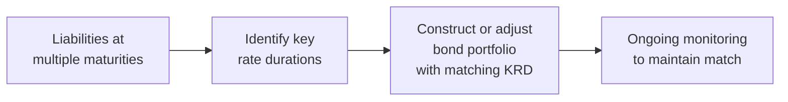

## Overview and Rationale

Liability-Driven Investing (LDI) is, at its core, all about aligning a portfolio’s asset profile with its present and future liabilities. If I were to put it in super-simple terms: imagine you’ve promised to pay someone a certain sum in the future, and you want to minimize the uncertainty around whether you can fulfill that promise. LDI is just a fancy way of structuring your investments so you’re more confident about funding those future cash outflows, especially when interest rates, market conditions, and other factors can fluctuate.

Historically, many large institutional investors—pension funds, insurers, and sometimes endowments—have used “growth-oriented” strategies to try to maintain healthy returns. But certain institutions, especially where liabilities are fixed or semi-fixed, realized they needed a more methodical way to reduce the risk of not meeting those obligations. This is precisely where LDI comes in.

By focusing on the liabilities first (rather than “We have assets; let’s invest somewhere!”), LDI helps ensure the primary objective—paying future obligations—gets the emphasis it deserves. For instance, a pension fund with retirees depending on monthly benefit checks finds LDI appealing: it’s easier to sleep at night knowing your assets match the structure and timing of those benefit payments.

## Duration Matching as a Cornerstone

A key concept in LDI is duration matching. Duration (often measured in years) indicates how sensitive a bond or a bond portfolio is to changes in interest rates. The higher the duration, the more the price shifts when interest rates move. When you match your portfolio’s duration to that of your liabilities, you’re hedging against interest rate risk. In other words, if interest rates rise, your liabilities’ present value declines roughly in tandem with the decline in your asset values—if everything is lined up just right.

Let’s peek under the hood with a simple formula for the present value (PV) of future liabilities, L:


\text{PV}(L) = \sum_{t=1}^{T} \frac{CF_t}{(1 + r_t)^{t}}


Here, CFᵗ represents the expected liability cash flow at time t, and rᵗ is the discount rate at time t. The discount rate might be linked to a long-term government or corporate bond yield—or sometimes a regulatory-based rate. The “duration” of these liabilities is basically how sensitive this present value is to changes in rᵗ.

A straightforward way to see how LDI might help is:

• If interest rates rise, your liabilities’ present value might drop.  
• If your assets have a similar duration, your asset values will also drop by a comparable amount.  
• The difference between assets and liabilities (i.e., your funding status) remains steady, mitigating interest rate risk.

## Credit Risk Considerations

You might say, “Well, hang on, do we only look at government bonds for this?” Actually, not necessarily. Some plans—particularly corporate pension plans—use a discount rate based on the yield of high-quality corporate bonds. If your plan’s discount rate is sensitive to corporate spreads, you might want to hold similar high-quality corporate bonds in your LDI portfolio. If corporate spreads widen, the discount rate rises and liabilities’ present value drops. If you hold corporate bonds, they may also lose value from the same spread widening. That means the net effect on your funded status might be closer to zero.

However, there’s that dreaded credit risk. Remember, while high-quality corporate bonds are generally safe, corporate defaults or downgrades can happen. You might find yourself scrutinizing the credit quality of your LDI bond portfolio just as much as you watch interest rate movements. In real life, plan sponsors often build a combination of government bonds, corporate bonds, and sometimes even interest rate swaps or futures to tweak their portfolio’s exposure.

## Using Derivatives to Fine-Tune LDI

Think about derivatives as the “knobs and dials” you can adjust to get your portfolio to align more precisely with your liabilities. Commonly, pension plans or insurance companies use interest rate swaps, bond futures, or even options to match liability exposures.

• Interest Rate Swaps: In a standard receive-fixed, pay-floating swap, the plan might receive a fixed rate (matching its liability discount rate) and pay a floating rate (short-term interest rate). This setup can hedge against fluctuations in the liability discount rates that move alongside medium- to long-term yields.

• Bond Futures: Another approach is to gain or reduce interest rate exposure quickly without physically buying or selling large bond positions. For instance, if you notice your liabilities have extended to a 25-year horizon, you might add some long-duration bond futures to your portfolio to lock in that interest rate exposure.

These derivatives help because the plan sponsor doesn’t always have to own the physical bonds. Sometimes, derivatives offer more flexibility and less capital outlay, allowing the sponsor to keep part of the portfolio in “growth” assets (like equities or alternatives) while maintaining a tight hedge on interest rate risk.

## Trade-Offs: Return vs. Hedging

So, you might be thinking, “If we’re just focused on hedging liabilities, how do we grow the portfolio enough to fix an underfunded status?” That question highlights the trade-off inherent in LDI. Perfectly hedging interest rate risk usually means a big chunk of the asset portfolio is allocated to low-volatility bonds or derivatives that mirror liability behavior. But if your plan is underfunded—meaning your assets are less than the present value of your liabilities—then you still need to generate returns somewhere.

Different plan sponsors strike different balances:  
• Some choose a partial hedge, maintaining enough long-duration or derivative exposure to offset a portion of the interest rate risk but also investing in equities or alternative assets for growth.  
• Others go for a “completion” or “full hedge” approach, basically matching 90–100% of liability exposure. They might rely on additional contributions or other sources to make up any funding gap.  

Ultimately, the choice depends on risk tolerance, funding regulations, sponsor financial strength, and strategic considerations about future interest rate paths.

## Key Rate Duration Matching

Up to this point, we mostly talked about broad or effective duration. In the real world, though, interest rates can shift differently at different points on the yield curve. Key rate duration matching becomes crucial in sophisticated LDI strategies. Instead of just worrying about the overall duration, you match your exposures at several maturities along the curve.

Let’s say your pension liabilities peak around the 10-year mark for some reason (maybe a big wave of retirements). You want to ensure your assets have heightened sensitivity in that same 10-year region. This way, if the yield curve specifically changes at the 10-year point, your assets’ value moves in tandem with your liabilities. Key rate durations for other points—say 5-year, 15-year, or 20-year—should be similarly matched to the liability profile.

A small visual might help. Here’s a simple mermaid diagram showing how we might align key points along the yield curve:

## Real-World Complexities

LDI, simple as it may appear in theory, can get messy in practice. First, pension funds have to figure out their mortality assumptions—how long beneficiaries are likely to live. If the plan’s participants start living longer, the liabilities increase. Meanwhile, insurance companies have to deal with regulatory frameworks that dictate how they discount liabilities and manage risk-based capital. Changes in regulation can alter discount rates or impose capital requirements that make certain bond holdings more or less attractive.

And let’s not forget the operational side. Maintaining a robust derivatives program requires careful collateral management and an understanding of potential liquidity demands. A well-funded pension plan might allocate some portion of its assets to a growth portfolio, while systematically rebalancing or adjusting the hedge portfolio to keep that duration match intact. It’s a bit like juggling—ensuring neither the “hedge ball” nor the “growth-ball” ends up unexpectedly on the floor.

## Practical Example

Let’s walk through a simplified real-world scenario:

• Suppose a mid-sized corporate pension plan has $1 billion in liabilities with a duration of 12 years.  
• The plan’s assets total $900 million, invested roughly 60% stocks, 40% bonds, with the bond portion having a duration of around 5 years.  

They’re underfunded by $100 million and also have a big mismatch in duration (liabilities at 12 years vs. bond assets at 5). If interest rates plunge, their liabilities balloon in value, but their bond assets only slightly increase in value. Ouch. That could worsen the underfunding.

The plan decides to shift the 40% bond portion into long-duration bonds (duration targeting 12–13 years) and add an interest rate swap overlay to effectively reach 80% LDI coverage. This means 32% of the total portfolio is now fully hedged on interest rate risk (0.8 × 40%). The other 60% remains in equities to try to grow out of the underfunded hole. They’ll monitor monthly or quarterly to see if their interest rate hedge remains aligned with liabilities.

## Case Study: “Wait, Do We Hedge Fully?”

I once chatted with a CFO of a small pension fund who was on the fence about fully hedging liabilities. In her words, “I don’t want to lock in a loss! We’re underfunded, so if I freeze everything in place, I’ll just be stuck paying that shortfall.” She wasn’t exactly wrong. Fully hedging now means you aren’t particularly benefiting from favorable shifts in interest rates (like if rates rise, your asset values drop but so do liabilities, leaving you in the same underfunded state).

Her fund ended up adopting a partial LDI approach: they hedged half of the interest rate exposure and kept half in higher-return assets. Over the next few years, interest rates ticked up a bit, and that helped them shrink their liabilities slightly while their equity portfolio performed modestly well. They eventually reached nearly full funding, at which point they increased their hedge ratio significantly to lock in the improvements. It’s a good example of how LDI can be phased in, depending on market conditions and sponsor risk preferences.

## Implications and Best Practices

1) Align Governance with Strategy: An LDI approach requires clear communication with stakeholders (board members, trustees, regulators, etc.). Everyone needs to buy into the idea that the main objective is to match liabilities, not just chase returns.

2) Monitor Liability Profile Regularly: Mortality assumptions, discount rates, regulatory changes—these can all shift the liability’s value. Keeping your data updated helps you recalibrate your LDI approach.

3) Use Derivatives Judiciously: Derivatives can be powerful but require solid risk management frameworks. Make sure you understand collateral requirements, potential margin calls, and the interplay with your broader portfolio.

4) Consider Multi-Step Implementation: Jumping to 100% LDI might be too big of a leap, especially if you’re underfunded or uncertain about future changes in interest rates. A phased-in approach can provide a better comfort level.

5) Incorporate Credit Spread Risk: If your liabilities are discounted using corporate bond yields, consider corporate exposure in your portfolio (including credit risk controls) to keep the discount rate–asset exposure link strong.

## Common Pitfalls

• Ignoring Key Rate Durations: Only matching overall duration can leave you exposed to curve twists.  
• Underestimating Liquidity Needs: If you’re using swaps or futures, remember margin and collateral demands.  
• Over-Reliance on Static Assumptions: Mortality can improve, and new actuarial data might drastically shift liabilities if you’re not updating regularly.  
• “Set It and Forget It” Mentality: LDI isn’t a one-and-done. You need periodic rebalancing to keep your hedge effective.

## Conclusion

Liability-Driven Investing may sound technical, but the intuition is straightforward: prioritize obligations that must be met and structure assets to mitigate interest rate and credit risk that could derail those obligations. In practice, it can be an artful balance of hedging and return-seeking to manage funding status. Whether you go “all in” on hedging or favor a partial approach, the main objective is the same: protect the sponsor from nasty surprises and ensure beneficiaries get paid.

## Final Exam Tips

• Be ready to calculate the impact of interest rate moves on both liabilities and LDI portfolios.  
• Pay attention to partial vs. full hedging strategies and how they affect funding risk.  
• Understand how to interpret key rate duration, not just the overall effective duration.  
• Practice scenario-based questions where mortality assumptions or discount rates change suddenly.  
• Expect questions on the strategic use of swaps, bond futures, or other derivatives in LDI.  

Remember, both item sets and essay questions might ask you to explain the rationale behind LDI or to propose an investment approach for a hypothetical underfunded pension. You may also be asked to justify partial versus full hedging strategies. Demonstrate that you get why each approach could be appropriate under different conditions.

## References

• CFA Institute, “Pension and Endowment” readings in the Portfolio Management curriculum.  
• Fabozzi, F., The Handbook of Fixed Income Securities (consult sections on LDI).  
• Martellini, L., et al., academic articles in The Journal of Portfolio Management on advanced LDI frameworks.  

## Test Your Knowledge: Liability-Driven Investing



### Which key principle underlies a typical Liability-Driven Investing strategy?

- [x] Matching the duration of assets with the duration of liabilities.
- [ ] Holding only short-term assets to minimize interest rate risk.
- [ ] Maximizing equity exposure to achieve the highest possible returns.
- [ ] Relying solely on alternative asset classes for hedging risks.

> **Explanation:** LDI strategies focus on matching the duration of assets to liabilities to mitigate interest rate risk.

### In an LDI context, if a plan sponsor wants to hedge interest rate risk without drastically changing the overall asset allocation, which instrument is often preferred?

- [ ] High-yield bonds.
- [x] Interest rate swaps.
- [ ] Securitized mortgages.
- [ ] Foreign currency forwards.

> **Explanation:** Interest rate swaps allow the plan sponsor to gain or reduce duration exposure without significantly altering the physical bond portfolio.

### What is “key rate duration” primarily used for?

- [ ] Measuring equity beta exposure of the portfolio.
- [x] Measuring sensitivity to parallel and non-parallel shifts at specific points on the yield curve.
- [ ] Estimating solvency ratios for insurance companies.
- [ ] Calculating the credit risk embedded in a bond portfolio.

> **Explanation:** Key rate duration helps portfolio managers hedge against shifts at specific maturities along the yield curve, not just a parallel shift.

### A fully-funded pension plan with a low risk tolerance might favor which type of LDI approach?

- [x] A very high hedge ratio to match the liability’s duration.
- [ ] A low hedge ratio combined with high equity exposure.
- [ ] No LDI approach, relying on short-term trading tactics.
- [ ] A purely tactical approach that changes durational exposure monthly.

> **Explanation:** A plan that’s already fully funded and has minimal risk tolerance often chooses a high hedge ratio to preserve funding status.

### What is one reason a plan sponsor might choose a partial rather than a full interest rate hedge?

- [ ] They have no obligations to meet in the future.
- [ ] They expect to reduce risk at the cost of increasing the funding gap.
- [x] They hope for favorable market movements to improve their underfunded status.
- [ ] They have excess funds and prefer to hold them in cash.

> **Explanation:** Sponsors sometimes maintain partial hedges to retain some upside potential and potentially close an underfunding gap through higher returns elsewhere.

### When an LDI investor uses corporate bonds that match the discount rate of their liabilities, which risk are they particularly addressing?

- [ ] Foreign exchange risk.
- [ ] Basis risk from commodity price fluctuations.
- [x] Credit spread risk tied to the discount rate.
- [ ] Liquidity risk in emerging markets.

> **Explanation:** If liabilities are discounted using corporate bond yields, matching that corporate exposure helps hedge credit spread risk.

### A plan sponsor uses a receive-fixed, pay-floating swap. Which best describes the effect on duration?

- [x] Increases the plan’s duration exposure, offsetting liability sensitivity.
- [ ] Decreases the plan’s duration since floating rates are less volatile.
- [ ] Has no effect on duration but adds default risk.
- [ ] Only affects credit risk, not interest rate risk.

> **Explanation:** Receiving a fixed rate effectively gives the sponsor the interest rate sensitivity of a fixed-rate bond, increasing overall duration.

### Key rate duration matching is particularly helpful in scenarios where the yield curve:

- [ ] Moves in a strictly parallel manner.
- [x] Twists or changes shape at specific maturities.
- [ ] Falls to zero across all maturities.
- [ ] Shows flat and uniform changes.

> **Explanation:** Key rate duration helps hedge localized movements on the curve rather than purely parallel shifts.

### One of the main operational challenges in using derivatives for LDI is:

- [ ] Excess returns from derivative usage.
- [ ] Lack of regulatory oversight for swaps.
- [x] Collateral management and liquidity requirements.
- [ ] Zero correlation with the underlying liabilities.

> **Explanation:** Derivatives typically require posting collateral, which can create liquidity pressures and operational complexities.

### Liability-driven investing is primarily concerned with:

- [x] True
- [ ] False

> Paying attention to the structure and sensitivity of liabilities and structuring assets accordingly.

> **Explanation:** LDI is all about ensuring assets align with liabilities in terms of risk and return characteristics, especially duration and cash flow timing.


