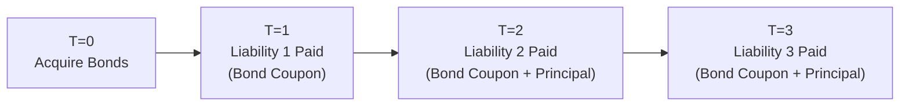

## Introduction and Context

Sometimes, in bond portfolio management, we want to just go for the neatest, safest solution—like building a perfect puzzle. Cash flow matching tries to do exactly that with your bond investment: align the bond coupons and principal repayments with the liabilities you must pay in the future. By ensuring that each liability is exactly paired with a cash inflow from your bond holdings, you minimize the guesswork regarding reinvestment rates or uncertain market price fluctuations. 

I once knew a colleague who managed a modest pension fund for a local organization. They had these well-defined liabilities—like retirees’ monthly checks—that popped up on schedule, no surprise there. The biggest question was: “How on earth do we ensure we always have the money when those checks are due?” That’s basically the driving idea behind cash flow matching. It feels almost like building a Lego set: you line up your bricks one by one (bond coupon dates) so that none of them are out of place or out of time.

## Foundations of Cash Flow Matching

Cash flow matching is a specialized form of portfolio construction that ensures each expected liability aligns exactly with an asset’s incoming cash flow. You identify the liability schedule (the timing and amounts of all required payments) and acquire a series of bonds whose coupon and principal payments coincide with those liabilities.

This stands in contrast to immunization, which focuses on matching the portfolio’s duration and convexity to mitigate interest rate risk. Immunization typically requires active rebalancing if interest rate conditions change. Cash flow matching, on the other hand, seeks to eliminate (or at least drastically reduce) reinvestment risk by locking in specific cash flows for the life of the liability structure.

### Benefits of Cash Flow Matching
• Reduces or eliminates reinvestment risk because coupon and principal flows arrive precisely when you need them.  
• Lowers day-to-day uncertainty about funding obligations.  
• Provides clarity about cash requirements, especially for short-dated liabilities.

### Glossary Terms in Action
• Cash Flow Matching: Strategy aligning bond cash flows with liability outflows, ensuring the latter are fully covered.  
• Liability Schedule: The precise schedule of payments an entity must make in the future (for example, pension payouts).  
• Call Risk: The risk that an issuer redeems a bond earlier than anticipated. This can disrupt carefully structured cash flows.

## Comparison with Immunization

Now, you might say, “Well, can’t I achieve something similar by immunizing my portfolio?” In immunization, you balance the duration of your liabilities with your assets. If everything is perfectly matched, the portfolio is theoretically protected from small parallel shifts in interest rates. But immunization comes with some wiggle room in actual practice:  
• You still have reinvestment risk. As coupons are received, you might have to reinvest them in a less favorable interest rate environment.  
• Changes in yield curve shape can cause mismatches.  
• You often need ongoing rebalancing and monitoring.

By contrast, pure cash flow matching is more precise. You hold bonds that pay exactly what’s needed at each liability date. However, it can be more restrictive—especially if the bonds you need aren’t readily available or are more expensive. And you don’t always get the same flexibility for active management or yield enhancement.

## Step-by-Step Approach

### Identify the Liability Schedule
First, you chart out your liabilities: how much you owe, on what date, and for how long. If this is a pension plan, maybe you have monthly payments. If it’s a large capital project, perhaps you’ve got major lump-sum outflows once every few years.  

### Classify and Prioritize Liabilities
It helps to arrange your liabilities in order of criticality. Some might be certain (like final pension payouts), and others might be less certain or more flexible. 

### Acquire Suitable Bonds
Next, you look for bonds—often high-quality, stable bonds—that produce coupons and principals matching these liabilities in both timing and amount. You may stack them to create a “ladder,” but be aware that true cash flow matching typically requires a more precise alignment than a standard ladder. You might choose U.S. Treasuries or similarly high-credit-quality instruments to securitize your obligations.

### Reinvesting Surpluses
If the bond’s coupon at an earlier date exceeds that specific liability, you can reinvest the surplus to meet (partially or entirely) a later liability. That surplus, though, reintroduces some reinvestment risk if interest rates change between the surplus date and the next liability date. So, total elimination of reinvestment risk might require you to hold the surplus in short-term instruments whose maturity matches the next liability date.

### Confirm Dependability
Alongside timing, credit risk and call features must be considered. A bond that’s callable or has a questionable rating might destroy your perfect alignment if the issuer redeems early or, worse, defaults.  

## Practical Considerations and Real-World Implementation

### Cost and Availability
Cash flow matching can be expensive and tricky to implement in certain markets—especially if you don’t have a robust supply of bonds that match your payment schedule. You might have to pay a premium (narrow yield) for specific maturities.

### Short vs. Long Horizon
Cash flow matching is more common with shorter horizon liabilities—like a near-term pension payment—because you can find bonds maturing in the short term easily and do a near-perfect match. Over a longer horizon (say 20–30 years), the strategy becomes more complex, especially if there are limited long-duration bonds or the cost is prohibitive.

### Credit Considerations
Because reliability of cash flow is key, high credit rating is paramount. Even a single missed payment can unravel an entire matching strategy. You might see pension funds or insurance companies heavily favor government bonds or bonds from financially robust corporations.  

### Call Risk
Callable bonds can throw a serious wrench in your plan. If the issuer redeems the bond at an unfavorable time, you suddenly lose that future coupon stream. When exact matching is critical, many prefer non-callable, bullet maturity bonds.

### Potential Role of Defeasance
Defeasance is fancy talk for setting aside fixed-income securities—often government bonds—in a trust to cover all future obligations associated with an outstanding bond issue. It effectively eliminates the original obligation from your firm’s balance sheet. While not exactly the same as straightforward cash flow matching, defeasance uses a similar principle: the idea that well-defined, dedicated assets will reliably fund future liabilities.  

## Visualizing Cash Flow Matching

Below is a simple Mermaid diagram to illustrate how bond coupons and principal payments can align with liabilities over time.

In this simplified timeline:  
• At T=0, you purchase bonds with specific maturity and coupon schedules.  
• At each liability date (T=1, T=2, T=3), coupons and possibly principal exactly fund the required payment.  

## Case Example: A Small Pension Fund

Let’s imagine a small pension fund that has ongoing monthly payments. The fund manager decides to use a cash flow matching strategy for the next two years of payments, which are known and consistent:

• The fund needs $1,000,000 each month.  
• The manager purchases a set of bonds that have monthly coupon payments aggregating to $1,000,000 plus occasional principal repayments.  

Month 1: The required liabilities are perfectly covered by the monthly coupon.  
Month 2: Again, exact coverage by coupons.  
Month 12: Perhaps a bond matures, providing significant principal. That principal can handle the liability for that month plus a portion for the next few months.  

Because the manager used high-grade bonds, reinvestment risk is minimal if the principal flows line up precisely with the liability. But if there is any mismatch, the surplus might need to be put into a short-term instrument to handle subsequent liabilities. That’s where some minor reinvestment risk creeps in.

## Limitations, Pitfalls, and Flexibility Issues

While cash flow matching can be elegant, it’s not always the cheapest or easiest solution:  
• Higher Costs: Identifying and purchasing precisely maturing bonds might require paying premiums.  
• Limited Universe: In some markets or yield curve segments, it might be difficult to lock in extended maturities at favorable rates.  
• Less Flexibility: You’re locked into a rigid structure, so if your liability schedule changes or if interest rates move dramatically, you might miss out on higher-yielding opportunities.  
• Implementation Complexity: For large institutions with many complicated liabilities, the logistics (and transaction costs) may be huge.

Nonetheless, for many managers, the peace of mind—knowing your scheduled liabilities are covered with near-zero reinvestment risk—can be well worth it.

## Final Exam Tips

• Remember the difference between immunization and cash flow matching. If an exam question emphasizes minimizing reinvestment risk or meeting a liability “exactly,” you’re in cash flow matching territory.  
• Be ready to discuss how call risk or credit downgrades upend this strategy.  
• For longer-dated liabilities, pure cash flow matching typically gets more complicated—and exam questions might hint that immunization is more practical.  
• Know your bond mechanics: coupon payments, principal repayment, credit risk exposures, and redemption schedules.  
• Watch for any scenario that has a “surplus cash flow” that must be reinvested at a new rate—this is a staple for exam-based questions to see if you understand partial reinvestment risk.  

## References, Suggested Readings & Resources

• Bodie, Zvi, et al. “Investments.” This text has a solid discussion on both immunization and cash flow matching strategies.  
• CFA Institute’s “Fixed Income Portfolio Management,” part of the official curriculum. Excellent sections on advanced liability matching techniques.  
• Martin L. Leibowitz’s articles in the Financial Analysts Journal on dedicated portfolio strategies. They provide deeper insights into constructing portfolios for specific liabilities.  

## Test Your Knowledge: Cash Flow Matching Mastery



### Which of the following best describes cash flow matching?

- [ ] Matching the duration of assets and liabilities to protect against interest rate changes  
- [x] Aligning bond coupon and principal payments with the timing and amount of liability outflows  
- [ ] Rebalancing portfolios frequently to maintain a target interest rate exposure  
- [ ] Using futures contracts to hedge short-term interest rate risk  

> **Explanation:** Cash flow matching is about ensuring the bond’s coupons and principal exactly cover liability payments when they fall due.

### Which risk is minimized by a cash flow matching strategy compared to an immunization strategy?

- [ ] Credit risk  
- [x] Reinvestment risk  
- [ ] Exposure to yield curve twists  
- [ ] Inflation risk  

> **Explanation:** Immunization strategies still face reinvestment risk of coupons, whereas pure cash flow matching locks in exact payments.

### Why might bonds with embedded call features pose a challenge for cash flow matching?

- [ ] Because callable bonds generally have floating coupons  
- [ ] Because callable bonds pay higher coupons, making them unsuitable  
- [x] Because the issuer may redeem them early, disrupting predetermined cash flows  
- [ ] Because they are typically available only in very short maturities  

> **Explanation:** If a bond is called, the anticipated coupons might no longer exist, breaking the precise logic of matching.

### Which statement about surplus cash flows in a cash flow matching strategy is correct?

- [x] Surplus cash flows can be reinvested for future liabilities, introducing limited reinvestment risk  
- [ ] Surplus cash flows are ideal because they require no reinvestment  
- [ ] Surplus cash flows must be immediately returned to bondholders  
- [ ] Surplus flows are illegal under most regulatory frameworks  

> **Explanation:** Any coupon or principal amount exceeding the immediate liability can be reinvested, potentially at different yields.

### What is the main difference between duration matching (immunization) and cash flow matching?

- [ ] Duration matching focuses on maximizing total return, while cash flow matching focuses on minimizing default risk.  
- [ ] Duration matching requires fewer transactions, while cash flow matching requires frequent rebalancing.  
- [x] Duration matching aligns average interest rate sensitivity, while cash flow matching ensures specific payment alignment for each liability.  
- [ ] They differ only in the credit quality of bonds held.  

> **Explanation:** Immunization tries to match the portfolio’s sensitivity to interest rates with liabilities. Cash flow matching lines up exact payment dates and amounts.

### Which type of bond is least likely to be chosen for a cash flow matching strategy?

- [x] Callable bonds with uncertain redemption  
- [ ] Zero-coupon Treasury bonds  
- [ ] Marketable Treasury bills  
- [ ] AAA-rated corporate bullet bonds  

> **Explanation:** Callable bonds introduce uncertainty in timing of principal redemption, undermining precise matching.

### In which scenario does cash flow matching become especially appealing?

- [x] When liability amounts and dates are known with certainty and the market offers suitable bonds  
- [ ] When liabilities are uncertain or vary widely in timing  
- [ ] When maximizing capital gains is the primary objective  
- [ ] When the goal is to constantly reallocate assets to capture yield curve shifts  

> **Explanation:** Cash flow matching works best when the liability schedule is certain and bond maturities/ coupons can be aligned.

### For a long-term liability (e.g., 30-year pension obligations), which approach is typically more practical?

- [ ] Exact cash flow matching for all liabilities  
- [ x ] A combination of immunization and partial cash flow matching  
- [ ] Purchasing only floating-rate notes  
- [ ] Avoiding bonds altogether and using derivatives  

> **Explanation:** Over lengthy horizons, exact matching often becomes cost-prohibitive or impractical, leading many to adopt immunization or a blend of strategies.

### Defeasance involves:

- [ ] Selling off all bond positions and holding only equities  
- [ ] Adjusting bond positions to match the average duration of liabilities  
- [x] Setting aside government bonds sufficient to cover future coupon and principal payments of debt  
- [ ] Reallocating surplus funds from bonds to short-term money market instruments  

> **Explanation:** Defeasance is when an entity places assets (usually safe government bonds) in a trust to fully cover outstanding debt obligations.

### Cash flow matching can significantly reduce reinvestment risk. True or False?

- [x] True  
- [ ] False  

> **Explanation:** By locking in coupons and principal to match liabilities, this strategy removes or heavily reduces the risk of reinvesting funds at unknown rates.


