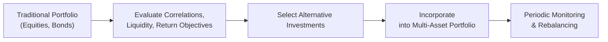

## The Breadth of Alternative Investments

So, you know, sometimes investors tend to treat “alternatives” like it’s one single box. But in reality, the range of alternative investments is massive—spanning private equity, hedge funds, real estate, infrastructure, natural resources, commodities, private credit, and more. Each has its own return drivers, risk exposures, and liquidity characteristics. It’s almost like walking through a grocery store with 10 different aisles labeled “alternatives,” each stocked with unique products; you can’t just pick them off the shelf without understanding what’s inside the box.

Private equity, for example, involves buying shares of companies that aren’t traded on public exchanges. Venture capital (VC) specifically deals with earlier-stage companies, whereas buyout firms typically focus on more established businesses, often leveraging debt financing to enhance returns. Hedge funds, on the other hand, might use a variety of strategies—from long/short equity to global macro—to generate returns disconnected from broader market movements. Then there’s real estate, which can range from direct ownership of buildings to real estate investment trusts (REITs). Infrastructure investing might involve toll roads, airports, or energy assets—these typically produce stable, long-term cash flows and can serve as an interesting inflation hedge. Natural resources and commodities embrace sectors like timber, agriculture, oil and gas, and precious metals.

One time I met an investor so entranced by farmland investing—seriously, farmland—that the person was traveling the world to see how farmland values changed in different countries. Their reason? The possibility that farmland was stable, had a strong link to global population needs, and potentially offered an inflation-hedging characteristic. It just goes to show how broad the alternative universe can get.

## The Role and Motivation behind Alternatives

Why even bother with alternatives? Traditional equities and bonds do most of the heavy lifting in many portfolios, but the typical 60/40 stock-bond mix can have pretty high volatility in certain market environments. Alternative assets often bring diversification benefits because their returns usually aren’t perfectly correlated with traditional asset classes. In many cases, alternatives are also exposed to distinctive risk factors—such as the illiquidity premium or complexity premium—that investors can harness for potentially higher returns.

There’s also this idea that real assets (like real estate, infrastructure, or commodities) carry inflation-hedging characteristics. Picture it this way: If inflation rears its head and your rent or toll charges are adjusted upward, the escalating cash flows might offset purchasing power erosion. The same is often argued for gold, farmland, and other tangible resources.

Enhancing return potential is another big motivation. Private equity is frequently viewed as an engine for outperformance, driven by active management, corporate governance improvements, and strategic expansions. Hedge funds, too, may produce superior risk-adjusted returns if they capture inefficiencies in niche markets. That said, these potential benefits come with additional risk and complexity. It’s not something you pop into your shopping cart without reading the label.

## Growth vs. Defensive Alternatives

It’s helpful to distinguish between alternatives that are more growth-oriented versus those that play a more defensive or stabilizing role. Growth alternatives—like venture capital, growth equity, or certain private credit strategies—usually aim to capture upside in fast-expanding businesses. In these sectors, you often see less liquidity, higher risk, and a potentially larger payoff if the underlying companies (or debt issuers) perform well.

More defensive “alts” might include real estate with stable leases, core infrastructure, or hedge fund strategies like market-neutral or risk parity approaches. These often exhibit lower correlation to equities, acting as shock absorbers during equity drawdowns. For instance, a market-neutral fund could generate steady returns by going long undervalued securities and short overvalued ones, theoretically neutralizing broader market movements. Sure, it’s rarely as straightforward in practice, but the concept is that these vehicles may help preserve capital or even provide “crisis alpha” in periods of turmoil.

I once had a colleague who managed a small foundation that needed capital preservation as much as it needed slow, steady growth. They allocated a big chunk to defensive hedge fund strategies to mitigate severe market dips. Over a five-year period marked by volatile equity markets, the foundation’s alternative portfolio not only reduced overall downside exposure but also contributed modest, positive returns, allowing them to maintain funding for their philanthropic initiatives. It wasn’t the star performer when markets soared, but it provided that stable cushion when needed most.

## Considering Portfolio Context

Integrating alternatives effectively means evaluating how each alternative’s risk and return attributes complement the rest of the portfolio. Specifically, you’d look at correlations, potential drawdowns, liquidity constraints, and expected return differences.

In formal terms, if you have a portfolio of \\( n \\) assets, the variance of the portfolio \\( \sigma_{p}^2 \\) might be represented as:


\sigma_{p}^2 = \sum_{i=1}^n \sum_{j=1}^n w_i w_j \rho_{i,j} \sigma_i \sigma_j


where:
• \\( w_i \\) and \\( w_j \\) are the weights of assets \\( i \\) and \\( j \\).  
• \\( \sigma_i \\) and \\( \sigma_j \\) are the standard deviations of assets \\( i \\) and \\( j \\).  
• \\( \rho_{i,j} \\) is the correlation coefficient between their returns.

Any new asset—alternative or otherwise—should be scrutinized within that framework. If adding a particular hedge fund strategy has a near-zero correlation with the rest of your portfolio, it may reduce overall volatility even if that strategy has moderate standalone volatility. Also consider whether you can tolerate gating provisions or lockups. Illiquid investments can be beneficial to patient investors, granting them what’s referred to as an illiquidity premium. But you have to be ready and able to lock that capital away for years. 

Below is a conceptual diagram illustrating how alternative investments fit into a broader portfolio context:

As you can see, it’s not just about “investing in alternatives.” It’s about analyzing how they jive with the existing portfolio mix, then ensuring ongoing oversight and rebalancing.

## The Complexity Factor: Transparency, Fees, and Specialist Due Diligence

Alright, so let’s be real: alternative investments can be complicated. A transparent long-only equity fund is generally straightforward to evaluate. But private equity, hedge funds, and real estate partnerships might have limited disclosure, complex structures, and intricate fee arrangements (e.g., carried interest, performance fees, waterfalls, clawbacks—the works).

Some hedge funds thrive on black-box strategies that are tough to grasp even for experienced analysts. Private equity managers may not reveal much about their pipeline deals. And real estate or infrastructure projects can come with multi-tier partnership structures that test the patience of even the most detail-oriented. As a result, specialist due diligence is crucial to properly evaluate any prospective alternative investment. You might need external experts or considerable internal resources to look under the hood.

Fees are a big discussion point, too. Many alternative vehicles come with a “2 and 20” arrangement—meaning 2% management fee and 20% performance fee above a certain hurdle. While that can incentivize an aligned interest in performance, it can also erode net returns if the gross performance isn’t sufficiently high. So you want to be mindful of how fees impact your net outcomes.

To manage complexity, robust governance frameworks are essential (which we’ll get into in a moment). Without them, you could find yourself with an entire book of illiquid, complex holdings, lacking any clear plan for ongoing oversight or risk management. That’s not exactly the dream portfolio scenario for any serious institutional or private investor.

## Governance and Operational Complexity

Investing in alternatives isn’t just a capital allocation exercise; it’s also about ensuring you have a governance structure that can handle the intricacies. For instance, performance measurement is more complicated if you have periodic capital calls, staged investments, or side pockets. Valuations can be somewhat subjective in private markets, especially if they rely on third-party appraisals or manager estimates rather than market-based transactions. As a result, your investment committee or board might need more frequent briefings and robust internal controls.

Governance extends to risk oversight. The alternative space is strewn with potential hazards—like leverage, concentration, or style drift (where the manager changes the strategy midstream). Then there’s manager selection risk. A manager with a strong track record might leave the fund, or the fund might grow too large and struggle to replicate past success. It’s also possible certain strategies become overcrowded, eroding the once-attractive risk/return profile.

For many institutional investors, a written governance policy will define how to select, monitor, and if necessary, terminate alternative managers. This might include setting maximum illiquidity limits, outlining a reevaluation process, or requiring that certain strategies meet specific risk-adjusted performance criteria. If the governance structure is well established, it can help keep everyone on track and, hopefully, prevent impulsive decisions.

## Exam Tips and Final Thoughts

Because this is a portfolio construction discussion, remember that any single alternative investment should be analyzed in the broader context rather than isolation. Ask yourself: “Does this investment improve my portfolio’s overall risk/return profile, or am I just enthralled by the hype around a special strategy?” For exam-related questions, you might encounter scenarios where you’re given a current portfolio composition and a short list of alternative investments. Expect to be asked to evaluate the correlation, potential diversification benefits, illiquidity, or the manager’s track record. You should also be prepared to discuss how to measure performance for alternatives, especially private equity or hedge funds, where performance reporting might differ from standard equity or bond portfolios.

A key pitfall is ignoring the time horizon and liquidity needs. Illiquid alternatives can be beneficial for patient capital but disastrous if the portfolio sponsor needs quick redemption. Another common pitfall is oversimplifying the complexities of manager selection (e.g., chasing prior returns without doing deeper due diligence). Finally, watch out for operational errors in fund documentation, compliance, and risk oversight. These are often overlooked but can wreak havoc in the real world.

At the risk of repeating myself: alternatives are powerful, but they’re not magic. They don’t guarantee higher returns or bulletproof diversification. They require more specialized knowledge, prudent governance processes, and an understanding of your entire portfolio’s risk/return dynamics. Set a solid foundation, and you can reap the unique benefits that come with these diverse asset classes.

## References

• CFA Institute. (2020). “Alternative Investments.” In CFA Program Curriculum.  
• CAIA Association. (2020). CAIA Level I Curriculum: Core Topics in Alternative Investments.  
• Preqin. (n.d.). Research and Insights on Alternatives. https://www.preqin.com/  
• Maginn, J. L., Tuttle, L. E., Pinto, J. E., & McLeavey, D. W. (Eds.). (2007). Managing Investment Portfolios: A Dynamic Process (3rd ed.). Wiley.

## Test Your Knowledge: Roles of Alternative Investments in Multi-Asset Portfolios



### Which of the following statements best describes why investors add alternative investments to multi-asset portfolios?

- [x] To achieve diversification benefits and expose the portfolio to unique risk/return profiles.  
- [ ] To guarantee outperforming equity markets in all scenarios.  
- [ ] Because alternatives have no correlation with any other asset class.  
- [ ] To eliminate the need for traditional equities and bonds.  

> **Explanation:** The primary motivation for including alternatives is often seeking diversification and exposures beyond traditional risk factors. There’s no guarantee of outperforming equity markets in all scenarios, and correlations can be low but rarely zero.

### Which alternative investment is often considered more “defensive” in nature?

- [ ] Venture Capital Funds  
- [x] Core Infrastructure Investments  
- [ ] Private Equity Buyout Funds  
- [ ] Distressed Debt Strategies  

> **Explanation:** Core infrastructure investments are known for stable cash flows and can serve as a defensive holding. Venture capital and buyouts are considered more growth-oriented, while distressed debt depends on turnarounds of troubled companies.

### In the context of a portfolio’s overall risk/return profile, how should an investor typically evaluate an alternative investment?

- [ ] Based solely on the alternative’s standalone return potential  
- [ ] Based only on the manager’s historical performance  
- [x] By analyzing correlations, expected returns, and illiquidity in the context of the overall portfolio  
- [ ] By ignoring operational complexities and fees  

> **Explanation:** Alternative investments must be analyzed in conjunction with existing holdings, paying attention to correlation, liquidity needs, and total portfolio alignment rather than focusing on any single metric in isolation.

### What is the illiquidity premium?

- [x] The additional expected return required by investors for holding assets that cannot be readily converted to cash  
- [ ] A discount on the management fees for illiquid alternative investments  
- [ ] A penalty applied only to publicly traded securities  
- [ ] A guaranteed hedge against inflation in private markets  

> **Explanation:** Illiquidity premium compensates investors for tying up capital for extended periods and accepting lower liquidity. It is not specifically a discount on fees or an added penalty on traded securities.

### Which of the following factors complicates performance measurement for alternative investments compared to traditional asset classes?

- [ ] Frequent regulatory disclosures required by alternatives  
- [ ] Absence of correlation with equities  
- [x] Irregular valuation intervals and complex fee structures  
- [ ] Lower nominal returns than equities  

> **Explanation:** Alternative investments often lack frequent market-based pricing, and fee arrangements can be intricate (e.g., performance fees, waterfalls). These factors make performance measurement more cumbersome relative to standard equities.

### What is one common pitfall when selecting hedge fund managers?

- [x] Focusing solely on past performance without conducting in-depth due diligence  
- [ ] Attempting to measure risk-adjusted returns  
- [ ] Considering the manager’s investment style  
- [ ] Reviewing the fund’s fee structure  

> **Explanation:** While fees, strategy fit, and risk-adjusted returns matter, the largest pitfall is chasing high past returns without deeper examination of the manager’s methodology, consistency, and operational risks.

### Which of the following would be considered a growth-oriented alternative investment?

- [ ] Hedge fund employing a market-neutral strategy  
- [x] Venture capital fund focusing on early-stage companies  
- [ ] Core real estate fund with fully leased properties  
- [ ] Infrastructure fund investing in mature toll roads  

> **Explanation:** Venture capital aims to capture the upside of early-stage businesses, making it a growth-oriented alternative. Core real estate, infrastructure, and some hedge fund strategies lean more toward stability and consistent yield.

### In which scenario might an alternative investment allocation be most beneficial?

- [ ] When the core equity/bond portfolio already has extremely high leverage  
- [ ] When the time horizon is very short and liquidity is paramount  
- [x] When an investor seeks additional diversification and can handle illiquidity  
- [ ] When the investor wants an immediate reduction in transaction costs  

> **Explanation:** Alternatives can enhance diversification, often require longer time horizons, and come with higher transaction costs. Short-term liquidity needs can conflict with the typical lock-up structures in alternatives.

### A “2 and 20” fee structure implies:

- [ ] 2% discount on management fees and 20% discount on performance fees  
- [x] 2% annual management fee and a 20% performance fee above a hurdle rate  
- [ ] 2% fixed fee and 20% reduction of net asset value  
- [ ] 2% management fee if at least 20% return is generated  

> **Explanation:** The “2 and 20” structure charges 2% of assets under management and an additional 20% on performance (above a certain hurdle). It’s common in the hedge fund and private equity world.

### True or False: All alternative investments automatically hedge against inflation.

- [x] True
- [ ] False

> **Explanation:** This is a trick question—many alternative investments can help hedge inflation, but not all. Real estate, infrastructure, and commodities often have inflation-hedging attributes. However, hedge funds or private equity must be analyzed on a strategy-by-strategy basis. The blanket statement that all alternatives hedge against inflation is overly broad.


