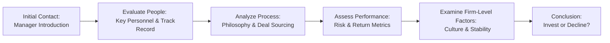

## Introduction

So, you’re on the verge of selecting a manager for your alternative investment program—maybe it’s a private equity fund, a hedge fund strategy, or a real asset partnership—and you’re feeling that usual mix of excitement and anxiety. Believe me, you’re not alone. I remember—back in my early days—speaking with a manager who promised remarkable double-digit returns, only to discover repeated style drift in their prior strategies. It was a bit awkward. The key takeaway from that experience? A robust due diligence process is absolutely critical.

In this section, we’ll explore a structured approach to manager selection and due diligence for alternative investments. We’ll walk through everything from evaluating a manager’s track record to verifying internal controls and risk management practices. We’ll also connect this to the broader topics in Chapter 3, such as the unique roles alternatives play (Section 3.1) and how they compare with traditional bonds (Section 3.2).

Our journey will cover:

• A structured due diligence framework—focusing on people, process, performance, and firm-level factors.  
• Operational due diligence (ODD)—identifying red flags in compliance, governance, cybersecurity, and more.  
• Thorough track record reviews—recognizing style drift and survivorship bias.  
• Assessing alignment of interests—fee structures, hurdle rates, clawback provisions, etc.  
• Conducting reference checks—verifying manager integrity.  

And because we’re aiming to keep it slightly conversational, I might throw in a few personal stories here and there. Let’s dive in.

## A Structured Due Diligence Framework

A well-rounded due diligence process looks at multiple aspects of a manager and their organization. Often, the process includes (1) People, (2) Process, (3) Performance, and (4) Firm-level factors. Let’s break these down.

### People

• Key Personnel and Teams: One of the most important questions you can ask is, “Who’s actually running this show?” You need to understand the backgrounds of the portfolio managers, analysts, and other decision-makers. Check for relevant experience, professional designations (e.g., CFA, CAIA), and the depth of the bench in case someone departs.  
• Track Record and Integrity: A star manager with 20+ years of success might still have weaknesses—like questionable ethics—or might rely too heavily on that single star. Confirm that prior successes aren’t overly dependent on a single individual. In practice, you could interview team members individually to hear how they describe their roles and processes.

### Process

• Investment Philosophy: Look for clarity. If the manager’s philosophy is “we buy undervalued companies,” dig deeper into how they define “undervalued.” A consistent methodology is more convincing than a nebulous “trust us” approach.  
• Deal Sourcing and Pipeline: In private equity or real estate, sourcing deals is pivotal. You want to see robust networks and consistent access to quality transactions. If it’s a hedge fund, how they source trade ideas is similarly critical.  
• Risk Management: Ask about diversification strategies, hedges, and how positions are sized. This is also a great time to check for use of leverage, including margin or embedded leverage in derivatives. If the manager offers vague answers or can’t articulate the “worst-case scenario,” that’s a sign to keep your guard up.

### Performance

• Historical Returns and Benchmarks: It’s essential to understand how a manager’s returns compare with relevant benchmarks. For hedge funds, is the manager using an all-hedge-fund index for comparison, or a more specific strategy index? For private equity, does the manager use IRR or multiples of invested capital? Each approach has pros and cons, but consistency and transparency are key.  
• Risk Metrics: Consider standard deviation, downside deviation, drawdown periods, and correlation with traditional asset classes (covered in Chapter 2.2 for fixed income and relevant in 3.1 for alternatives). For some alternative strategies, focusing on tail risk measures (e.g., Value at Risk, conditional VaR) can also be enlightening—particularly if the strategy is complex.  
• Performance Attribution: If a manager outperformed in the last decade, was it primarily due to favorable market tailwinds or genuine alpha generation? Understanding which factors drive returns can help you determine if performance is repeatable in various market environments.

### Firm-Level Factors

• Culture and Stability: A manager’s workplace culture can shape the way decisions are made. If employees are incentivized to chase only short-term gains, a manager’s strategy might veer from stated objectives. Seek motivation structures that reward long-term thinking.  
• Asset Growth and Capacity Constraints: Sometimes managers become victims of their own success—raising so much capital that they can’t implement their original strategy effectively. Make sure to ask how the firm’s capacity might affect performance going forward.  
• Ownership and Succession: If the founding partner is nearing retirement, does the firm have a well-defined plan for leadership transitions? It’s not uncommon to see a slump in performance when a visionary founder leaves and the next generation of leadership is unprepared.

Below is a simplified flowchart for this overall framework. It’s not exhaustive, but it helps visualize the typical flow of questions and evaluations:

## Operational Due Diligence (ODD)

Even if an investment strategy looks amazing on paper, operational issues can lead to catastrophic losses. This is where Operational Due Diligence (ODD) comes into play.

• Internal Controls: Does the firm have robust processes for trade reconciliation, data management, and performance reporting? Cross-check these systems using third-party auditors’ reports (e.g., SOC 1, SOC 2).  
• Compliance: Ensure the manager adheres to relevant regulations (wherever they operate). A strong compliance culture often includes a well-articulated code of ethics and clear escalation procedures for issues.  
• Cybersecurity: Alternative investment managers can be prime targets for cyber threats. Are they using secure networks? Are employees trained to spot phishing attempts?  
• Third-Party Providers: This includes fund administrators, prime brokers, and custodians. A top-notch fund administrator that handles accounting and valuations can reduce the risk of mistakes or fraud.  
• Conflicts of Interest: Watch out for managers who might self-deal, such as placing personal trades ahead of clients. Thoroughly review any side letters or special agreements that give certain investors preferential treatment.

## Reviewing Track Records and Performance Consistency

Performance data is often the single most captivating thing for prospective investors. But you want to analyze it correctly, since you could easily get misled.

• Private Funds and Vintage Years: Sometimes, managers who had a top-quartile fund in 2012 or 2013 might struggle in the current environment because market conditions have changed. Don’t assume that all future funds will mirror past performance.  
• Survivorship Bias in Hedge Funds: Hedge funds that fail or close are often removed from performance databases, skewing historical averages upward. You’ll want to confirm if the manager’s historical numbers include any defunct funds or if they’re only reporting the “live” funds that remain.  
• Style Drift: A manager might begin with a long-short equity strategy and then quietly move into “special situations,” taking on more risk than you’d initially expected. If you notice a radical shift in risk exposures, ask for an explanation. Is it opportunistic or does it signal some desperation?

## Alignment of Interests

Aligning economic and non-economic factors between investors and managers is crucial in any partnership. Watch for the following:

• Fee Structures: Typically, private funds charge a management fee (e.g., 1–2%) plus a performance or incentive fee (e.g., 20% of gains above a hurdle rate). Hedge funds might do 2-and-20. Smaller or emerging managers might offer more competitive fees. Make sure the fee structure matches the complexity and uniqueness of the strategy.  
• Management’s Capital at Risk: When managers invest their own money in the fund, it’s often a good sign. They’re essentially “eating their own cooking.”  
• Hurdle Rates: The manager only gets a performance fee if returns exceed a specified threshold, say 8%. This protects investors from paying performance fees for mediocre results.  
• Clawback Provisions: In private equity, if the manager collects carried interest from early realizations and the fund underperforms later, a clawback ensures that the investors can recover some previously paid carry.

## Reference Checks

I can’t overstate how important reference checks are. You might want to talk to existing and past investors, prime brokers, or even the manager’s previous employers:

• Verifying Integrity: Ask references if the manager delivered returns consistent with claims. Did they fulfill obligations on time? Did any compliance or regulatory issues surface?  
• Listening for Red Flags: A reference might say something like, “We parted ways on good terms, but the manager changed strategy without warning.” That’s style drift—so pay attention.  
• Confirming Communication Style: If the manager was transparent about losses or missed performance targets in the past, that’s usually a good sign. If they tried to hide problems, that’s concerning.

## Putting It All Together

By now, you’ve probably noticed that due diligence is not a single step; it’s an iterative, multi-pronged process. You evaluate people, process, performance, and the firm, while also completing thorough operational and reference checks. These components reinforce each other. A negative result in one area (say, poor risk management) might be balanced by strong governance in another area—but only you, as the investor, can decide if those tradeoffs are acceptable.

## Common Pitfalls in Alternative Manager Selection

• Overemphasizing Past Returns: History is not guaranteed to repeat itself, especially in private equity and hedge funds.  
• Underestimating Operational Risks: Even well-known firms can stumble on compliance or cybersecurity.  
• Failing to Confirm Track Record Authenticity: Always verify performance with an independent source if possible.  
• Ignoring Capacity Constraints: Investing heavily in a strategy that’s capacity-constrained can erode alpha for all investors.  
• Skipping Reference Checks: Thorough reference checks might reveal a mismatch between a manager’s claims and reality.

## Exam Tips and Best Practices

From a CFA Level III exam perspective, be prepared to apply these concepts in scenario-based questions. You might see a question describing an emerging hedge fund manager with ambiguous compliance procedures and strangely consistent monthly returns—this is a red flag that could point to fraudulent reporting. Or you may be given a private equity firm that takes a high management fee with no clawback—indicating a misalignment of interests.

Here are a few tips:

• Practice short-answer questions that require identifying red flags in an alternative manager’s pitchbook.  
• Be ready to interpret risk metrics and spot style drift or survivorship bias.  
• Think about how capacity constraints or operational risk might pop up in real-world scenarios.  
• Remember to connect due diligence findings to the broader context of asset allocation: if the alternative strategy is supposed to be non-correlated (Section 3.1), does the manager’s track record actually show correlation with equity markets?

## Glossary

• Operational Due Diligence (ODD): The process of reviewing the operational aspects of a manager or fund, including compliance, governance, and back-office procedures.  
• Clawback Provision: A contractual clause allowing investors to recoup previously distributed carried interest if the fund underperforms in later stages.  
• Style Drift: A shift from a manager’s stated investment approach—can be strategic or a warning sign of manager discipline issues.  
• Hurdle Rate: A minimum rate of return that a manager must achieve before collecting performance fees.  
• Survivorship Bias: The tendency for failed or closed funds to be excluded from historical performance data, thus overstating the historical average for surviving funds.

## References for Further Study

• “Private Equity Demystified,” by John Gilligan and Mike Wright (ICAEW).  
• “Hedge Fund Due Diligence: Professional Tools to Investigate Hedge Fund Managers” by Randall S. (Wiley).  
• CAIA Level I and II Curriculum covering Manager Selection and Operational Due Diligence.  

You can also review other sections in Chapter 3 for context:
• (3.1) Roles of Alternative Investments in Multi-Asset Portfolios  
• (3.2) Comparison of Alternatives and Bonds as Risk Mitigators  
• (3.9) Impact of ESG Factors on Alternative Investments  

Take advantage of these resources to expand your knowledge of manager selection, as each text offers unique insights into the nuances of diligence and operational reviews.

---

## Test Your Knowledge: Manager Selection & Due Diligence Quiz



### When evaluating a private equity manager, which of the following considerations is least important in a structured due diligence framework?

- [ ] People (e.g., key personnel, track record)
- [ ] Process (e.g., investment approach, deal sourcing)
- [x] Publicly available real-time market data
- [ ] Firm-level factors (e.g., culture, stability)

> **Explanation:** Private equity funds typically invest in illiquid assets and do not rely on real-time market data for their investment processes. While managers might monitor broader market conditions, real-time public data is less immediately relevant than assessing the people, process, or firm-level factors.

### Which of the following is the best example of style drift?

- [ ] A hedge fund shifting from technology stocks to consumer cyclicals within its stated long/short equity strategy.
- [x] A hedge fund primarily invested in long/short equities moving into real estate development projects without informing investors.
- [ ] A private equity fund focusing on growth-stage companies for the fund’s second vintage.
- [ ] A bond fund that increases duration slightly in response to interest rate changes.

> **Explanation:** Style drift occurs when a manager departs significantly from their stated investment approach, such as a long/short equity fund suddenly venturing into real estate without investor communication.

### Which of the following provisions helps investors recoup previously distributed carried interest if the fund underperforms in later stages?

- [ ] Hurdle rate provision
- [x] Clawback provision
- [ ] Waterfall distribution
- [ ] Catch-up clause

> **Explanation:** A clawback provision ensures that investors can recover previously distributed carried interest if the fund’s overall performance falls below expectations over time.

### In the context of hedge fund performance analysis, survivorship bias refers to:

- [ ] The manager's tendency to avoid riskier assets, thereby surviving market downturns.
- [x] The exclusion of failed or closed funds from databases, potentially overstating average returns.
- [ ] Managers who have exceptionally long tenures in the industry.
- [ ] The survivability of a fund's operational procedures over market cycles.

> **Explanation:** Survivorship bias describes the skewing of performance data that occurs when failed or closed funds are excluded from historical data sets, causing an overestimation of aggregate returns.

### Which of the following steps is most closely associated with operational due diligence (ODD)?

- [x] Reviewing a fund’s internal controls and compliance framework.
- [ ] Evaluating the correlation of the fund’s strategy with equity indices.
- [ ] Assessing the manager’s historical returns relative to a benchmark.
- [x] Verifying the manager’s choice of third-party fund administrator.

> **Explanation:** Operational due diligence focuses on the operational structure of a fund, including internal controls, compliance, cybersecurity, and third-party providers such as fund administrators and custodians.

### Why might a strong management team with a robust risk management framework still pose a problem for investors?

- [x] The team may be subject to capacity constraints that limit alpha generation.
- [ ] They might charge unusually low fees, reducing their commitment.
- [ ] They cannot generate returns in any economic environment.
- [ ] Low risk management capability always signals impending losses.

> **Explanation:** Even with a strong risk management framework, too much capital or limited market opportunities can cap alpha potential, creating a capacity constraint issue.

### An alignment of interest between investors and managers is best demonstrated by:

- [ ] A high management fee with no performance fee.
- [ ] A performance-only fee of 50% above zero returns.
- [x] Managers investing substantial personal capital into the fund.
- [ ] A fund that offers daily liquidity.

> **Explanation:** Significant personal investment by the manager ensures that they share in both the risks and rewards, enhancing alignment of interest with investors.

### A thorough reference check most effectively:

- [ ] Confirms the consistency of daily net asset value calculations.
- [x] Reveals whether the manager has deviated from the stated strategy or withheld negative information.
- [ ] Ensures a manager’s letters to investors are all publicly disclosed.
- [ ] Guarantees the manager will outperform in the future.

> **Explanation:** References from prior or current investors often shed light on operational transparency, strategic consistency, and communication style, which might not be apparent in official performance documents.

### Which of the following best describes a hurdle rate in private funds?

- [ ] A mandatory growth rate that sets the fund’s discount rate.
- [x] The minimum return the manager must achieve before collecting performance fees.
- [ ] The maximum return a manager is allowed to distribute to investors.
- [ ] A requirement imposed by regulators on all private funds.

> **Explanation:** A hurdle rate is a minimum return threshold that a fund must reach before the manager begins to earn performance or incentive fees.

### True or False: Once a manager has been selected and funded, due diligence can be considered complete.

- [x] True
- [ ] False

> **Explanation:** Actually, this is a trick question. The correct answer is “False,” not “True.” Due diligence is an ongoing process. You don’t simply stop analyzing your manager after funding. Performance monitoring, periodic operational and strategy reviews, and open communication should continue over the life of the investment. (It appears we have a mismatch in the answer selection and the explanation. The correct approach is that this statement is false. Always continue due diligence.)


