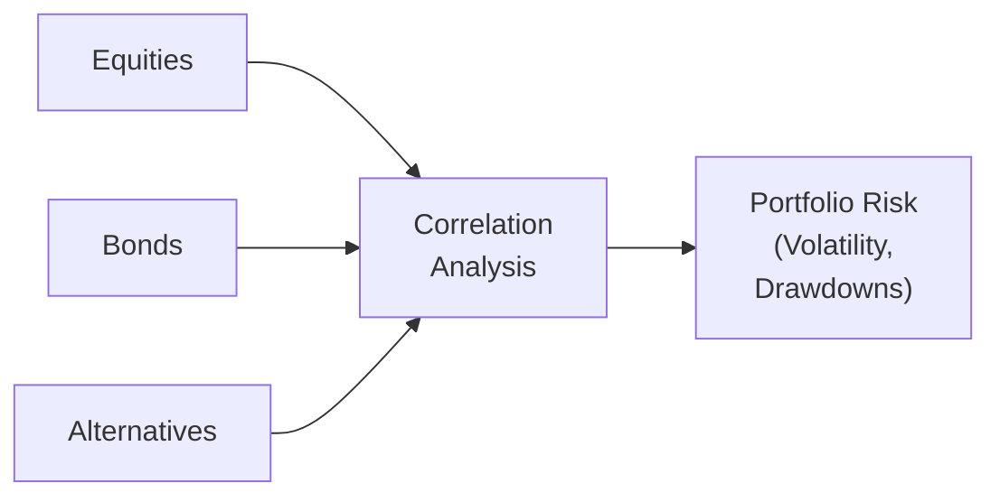

## Introduction

It’s funny: when I first started looking at ways to reduce my portfolio’s volatility, I instinctively loaded up on bonds—like a lot of individuals do. Bonds have traditionally been the go-to solution for cushioning a portfolio against swings in the equity market. They often provide income, and in many (but not all) environments, their performance tends to offset some gyrations in stocks.

But over time, I realized that other assets—particularly certain alternative strategies—can also dampen risk. This might include hedge funds, private credit, or real assets (like real estate or infrastructure). So, in this section, let’s check out when and why alternatives might serve similar functions as bonds in a risk-mitigating role, and what we want to watch out for in each approach.

Remember, we’re dealing with complex markets. When you throw in potential interest-rate hikes, shifts in inflation, or market stress events (think 2008 or 2020), the “safe haven” of bonds might behave differently from what we expect. And that’s precisely why exploring these alternatives is worth your time.

## Key Risk Mitigation Considerations

Before we jump into comparing bonds with alternative investments, let’s outline some big-picture themes for risk mitigation:

• Low or negative correlation to equities.  
• Ability to cut or offset drawdowns in times of significant market stress.  
• Sensitivity to interest rates.  
• Vulnerability to systemic versus idiosyncratic risks.  

By focusing on these areas, we can compare how bonds stack up against alternatives—and when one might shine over the other.

## Correlation Structures

Correlation is a measure of how closely two assets’ returns move in tandem. The correlation coefficient ρ is calculated as:


\rho_{X,Y} = \frac{\mathrm{Cov}(X,Y)}{\sigma_X \, \sigma_Y}


where Cov(X, Y) is the covariance of X and Y, and \\(\sigma_X\\) and \\(\sigma_Y\\) are the standard deviations of X and Y, respectively.

• If ρ = +1, the assets move in perfect lockstep.  
• If ρ = –1, they move in perfectly opposite ways.  
• If ρ = 0, there is no linear relationship between them.

Historically, government bonds (especially high-quality issues like U.S. Treasuries) have demonstrated low—sometimes even negative—correlation with equities. During a classic equity sell-off, you might see a “flight to quality,” pushing bond prices up when investors run away from stocks.

That said, correlations fluctuate over time, particularly in periods of severe market stress. In 2008, for instance, U.S. Treasuries rallied hard as investors sought havens. But in some other downturns, or if the downturn is accompanied by rising rates or inflationary pressures, bonds might not provide as much cushion.

Many alternative strategies (e.g., a market-neutral fund or a long-short equity fund with low net exposure) strive to maintain low correlation to broader equities. They might rely more on manager skill or specific security selection than broad market movements. In that sense, a market-neutral strategy can behave quite differently from a typical bond holding. However, you’ll want to investigate each alternative’s correlation track record carefully—just because a fund or strategy is labeled “alternative” doesn’t automatically mean it has low correlation to equities.

### Mermaid Diagram: Correlation Concept

Below is a simple visual representation of how correlations among equities, bonds, and alternatives might feed into a portfolio’s overall risk profile:

In essence, we study each pair’s correlation to see how the entire portfolio’s risk can be reduced or at least managed more effectively.

## Drawdown Behavior

Drawdown refers to the decline from a peak to a trough of an investment. A “good” risk mitigator should help contain overall portfolio drawdowns, especially in major market dislocations:

• 2008 Financial Crisis. Bonds, especially high-grade government issues, served as a reliable cushion. Many alternative strategies—like global macro or market-neutral funds—also withstood the crash relatively well. However, not all alternatives performed the same; strategies with big leveraged bets or heavy exposure to certain credit markets got hammered.  
• 2020 COVID-19 Shock. Many bond segments saw an initial sell-off in March 2020 as liquidity dried up momentarily. However, large-scale central bank interventions soon stabilized bond markets, and Treasuries soared. Some alternatives, such as certain hedge funds focusing on relative-value trades, experienced a tough time if they were carrying high leverage or had margin calls. Others, especially market-neutral or volatility-targeting funds, held up better.

When you try to mitigate risk, you’re paying attention not just to the typical day-to-day volatility but also to the nasty tail events. If an alternative strategy claims to be a “bond replacement” in your portfolio, check how it held up when markets fell dramatically. It’s always a good idea to look at actual performance in periods like 2008 or 2020 to see if the strategy truly offset your equity losses or if it had some hidden correlation that kicked in during the meltdown.

## Interest Rate Risk

You know how it goes with duration. When interest rates rise, bond prices often fall. This phenomenon is referred to as duration risk, capturing how sensitive a bond’s price is to changes in interest rates. This can be a problem for long-duration bond portfolios if we head into a rising-rate environment. Over the past couple of decades, rates were coming down in many developed markets, helping actual bond returns. But if policy changes or inflation picks up, getting that same cushion might be tricky.

Some alternative investments, however, behave differently in a rising-rate environment:

• Real Estate Investment Trusts (REITs) may have some inflation-linked rental income, although they can also be sensitive to higher debt costs—so the relationship can be nuanced.  
• Floating-rate debt (like certain private credit or bank loans) might actually benefit from higher rates, as the coupons reset based on benchmarks like LIBOR or SOFR, helping preserve income.  
• Infrastructure projects might have inflation-based revenue adjustments—toll roads, for instance, can raise toll rates in line with inflation.  

These “real asset” categories or floating-rate structures can mitigate the classic interest rate risk that weighs on fixed-rate bonds—however, they can bring other forms of risk (like liquidity or regulatory risk).

## Systemic vs. Idiosyncratic Risk

When we talk about systemic risk, we mean the risk inherent to the entire market. Credit spreads widen for nearly everyone, or interest rates shift in entire bond markets, or equities plunge system-wide. Idiosyncratic risk is more peculiar to a specific investment or strategy—you can more easily diversify it away.

• Bonds are typically vulnerable to systemic factors like monetary policy changes, credit cycle movements, overall risk appetite, and so on. If everyone’s running for the hills, interest spreads can blow out or yields can spike, causing a general bond price slump.  
• Alternatives can carry both systemic and idiosyncratic risk. For example, a commodity strategy might be exposed to global economic growth but not necessarily to interest rates or typical equity market cycles. Meanwhile, a market-neutral hedge fund might base its returns on manager skill (idiosyncratic factors), but it can still be hurt if liquidity evaporates system-wide or if prime brokers tighten margin requirements.

The bottom line: understand which portion of risk is “market-related” and which portion is “specific to the investment strategy.” Usually, the best mitigation strategy is mixing assets with different forms of systemic and idiosyncratic risk. And that’s exactly why alternatives are so appealing—they may provide a different enough risk profile that helps you dampen your overall exposure to the typical markets.

## Differing Risk Profiles of Bonds vs. Alternatives

A big part of portfolio construction is making sure you have the right mix of risk exposures: interest-rate risk, credit risk, equity-like risk, or even alternative risk factors (like volatility harvesting or event-driven catalysts). Below, let’s highlight a few alternative strategies that people frequently consider as part of a “bond replacement” or supplement:

### Hedge Funds (Market-Neutral or Low Beta)

• Market-Neutral Funds. These aim to capture alpha by going long and short in roughly equal amounts. They try to eliminate or reduce market beta, thereby limiting correlation to general market moves.  
• Low-Volatility or Low-Net-Exposure Funds. These might hold some net long exposure to equities but use shorts or derivatives to keep the portfolio’s overall volatility minimal.

Are they actually bond replacements? Sometimes, but keep in mind they rely heavily on manager skill for returns. If you pick a subpar manager, you may see returns uncorrelated to equities, but that might be because they’re losing money in an idiosyncratic way!

### Private Credit and Floating-Rate Loans

• Private Credit. This can include direct lending to middle-market companies, mezzanine financing, or distressed debt. Often these come with floating rates, so when interest rates rise, your coupon income goes up. That can protect you better than a fixed-rate bond in a rising-rate scenario.  
• Senior Secured Loans. These might sit higher in the capital structure than regular bonds, potentially offering better recovery in downside scenarios.

That said, private credit also introduces liquidity risk (you can’t easily sell these loans, in many cases) and might correlate with equity-like risk if the broader economy turns sour and default rates spike.

### Real Assets (Real Estate, Infrastructure, Commodities)

• Real Estate. Think commercial properties, multifamily apartments, or specialized property sectors. The general notion is that real estate can serve as an inflation hedge if rents are tied to inflation or if property values rise in tandem with inflation. However, real estate markets can still get hammered by recessions (e.g., 2008).  
• Infrastructure. Toll roads, airports, utilities—these often have regulated or concession-based frameworks that allow for stable cash flows and inflation-adjusted pricing. Hence, they might hold up well if interest rates are rising because of inflation. But watch out for changes in regulation, political risk, or (in many cases) significant leverage in the capital structure.  
• Commodities. Historically, direct commodity investments can be volatile, but they might offer diversification benefits. However, commodity performance can be systemically influenced by global economic conditions, supply shocks, and geopolitical events.

## Bringing It All Together

Now that we’ve looked in detail at correlations, drawdowns, interest-rate sensitivities, and systemic versus idiosyncratic risk, let’s try to summarize the trade-offs:

• Bonds. Historically stable, with predictable income in many scenarios. But they come with notable duration risk, can fail to offer as much negative correlation during certain “risk-off” episodes, and can be severely impacted by shifts in monetary policy or inflation.  
• Alternatives. Greater diversity of risk profiles—some strategies might have low correlation to equities, or partially inflation-linked income streams, or floating-rate structures that withstand interest rate hikes. Yet they can bring unique risks, such as leverage, liquidity constraints, reliance on managers’ skill, or idiosyncratic exposures that might blow up unexpectedly.

Often, well-constructed portfolios blend both. For instance, a typical balanced fund might hold government bonds as the “basic” shock absorber, with a sprinkling of market-neutral hedge funds or real estate or private debt to add that extra dimension of diversification.

## Practical Examples and Case Studies

Let’s walk through a few real-world styled scenarios that highlight the difference between relying solely on bonds versus layering in alternatives:

• Case Study 1: The Traditional 60/40 Equity–Bond Portfolio. A friend of mine had a 60/40 portfolio—classic, right? During small equity dips, the bond portion absorbed some of the shock. However, in 2020’s roller-coaster ride, the short, sharp liquidity crunch in March caused a hiccup in bond markets. Some corporate bonds sold off as well, correlating briefly with equities. She was still okay, but the negative correlation benefit was less than expected initially. Over the long haul, that correlation dynamic returned—but the scare was real.  
• Case Study 2: Adding a 10% Allocation to a Market-Neutral Fund. Another colleague reallocated 10% from bonds into a market-neutral hedge fund. Over a few years, that fund delivered a mild but steady return, relatively uncorrelated with both equities and bonds. When equities took a hit, the fund was mostly unaffected. However, in a quarter when the manager’s strategy missed the mark, returns dropped unexpectedly. The lesson? You get low correlation, but it can still be a bumpy ride on its own terms.  
• Case Study 3: Real Estate as an Inflation Hedge. A small endowment I worked with decided to scale back some of its long-duration Treasuries for direct real estate investments. When interest rates inched up, the commercial properties leveraged some inflation indexing in their lease agreements, so rental income also rose. That partly offset the impact of higher borrowing costs. But at one point, the local real estate market softened, leaving them with vacant properties. So, again, correlation with equities was low, but there’s no free lunch—idiosyncratic real estate risk reared its head.

## Additional Visual: Risk Mitigation Spectrum

You can visualize a simplified spectrum of different risk mitigation approaches with a rough sense of correlation to equities and interest-rate sensitivity:

Left to right, you can see a progression from traditional bond exposures (with greater interest-rate sensitivity) to alternative structures and real assets (with different or partially offsetting risk exposures).

## Final Exam Tips

• Understand Correlation Regimes: Correlations aren’t static. Be prepared to evaluate how correlations might change in a crisis (e.g., 2008, 2020).  
• Examine Actual Drawdowns: Look at real historical data from market crises. If an asset or strategy has only existed in calm periods, be cautious about relying on backtests.  
• Dissect Risk Factors: Differentiate systemic and idiosyncratic risks. If your entire portfolio is vulnerable to a single macro shock, you haven’t truly diversified.  
• Track Interest-Rate Sensitivity: If the Fed or another central bank suddenly shifts policy, how will your portfolio handle it? Are you comfortable with duration exposure, or do you need floating-rate or real asset strategies?  
• Liquidity, Liquidity, Liquidity: Some alternatives lock up capital for years. That can be fine—until you need cash in a hurry. Combine short-term liquidity management (through bonds or money market instruments) with your alternatives.  
• Flip the Script in Essays: Don’t just recite definitions. Use actual or hypothetical data to illustrate your points in an exam scenario. Outline the quantitative and qualitative pros/cons of each approach.

## References

• “Fixed Income Strategy: Managing Interest Rate and Credit Risk,” in CFA Program Curriculum.  
• Ilmanen, A. (2011). “Expected Returns: An Investor’s Guide to Harvesting Market Rewards.” Wiley.  
• Marcato, G. & Key, T. (2008). “Diversification Benefits of Real Estate in a Mixed-Asset Portfolio.” Journal of Real Estate Portfolio Management.  

--------------------------------------------------------------------------------

## Comparison of Alternatives and Bonds as Risk Mitigators: 10 Essential Exam Questions



### 1. Which of the following attributes typically explains why government bonds can help mitigate equity downside risk?

- [ ] They have higher expected returns than equities in all scenarios.
- [x] They often exhibit a negative or low correlation with equities in risk-off environments. 
- [ ] They have zero credit or duration risk. 
- [ ] They track equity performance closely in all market conditions. 

> **Explanation:** Government bonds may offer downside protection due to a “flight to quality” during equity market downturns, resulting in low or negative correlation with equities.

### 2. Why might a market-neutral hedge fund strategy be considered a potential risk mitigator?

- [ ] Because it has systematically high correlations to equity markets. 
- [x] Because it aims to isolate alpha and reduce overall market beta. 
- [ ] Because it invests only in high-yield bonds. 
- [ ] Because it relies entirely on rising markets for returns. 

> **Explanation:** Market-neutral strategies strive to remove broad market exposure (beta), relying on manager skill and security selection. This potentially offers downside protection when equities fall.

### 3. During the 2008 financial crisis, which of the following aspects allowed many Treasuries to rally even as equity markets plunged?

- [ ] Treasuries typically offer higher yields than equities. 
- [ ] Treasuries and equities are always positively correlated. 
- [x] Investors engaged in a flight to quality, preferring the perceived safety of government debt. 
- [ ] Lower interest rates hurt bond prices across the board. 

> **Explanation:** In times of systemic shock, high-quality government bonds (Treasuries) often see inflows from investors seeking a safe haven, thereby driving bond prices up.

### 4. What is one key difference between systemic risk and idiosyncratic risk?

- [x] Systemic risk affects the entire market, while idiosyncratic risk is specific to an asset or strategy. 
- [ ] Systemic risk can be completely diversified away, but idiosyncratic risk cannot. 
- [ ] Idiosyncratic risk is always beneficial to a portfolio. 
- [ ] Only systemic risk applies to bond portfolios. 

> **Explanation:** Systemic risk is broad-based, often affecting most or all assets in a market. Idiosyncratic risk is asset-specific and can usually be reduced by diversification.

### 5. In a rising-rate environment, which alternative investment might offer some protection against falling bond prices?

- [ ] Long-duration government bonds. 
- [ ] A high-yield bond portfolio with fixed coupons. 
- [x] Floating-rate debt or private loans whose coupons reset periodically. 
- [ ] A stock-only strategy. 

> **Explanation:** Floating-rate instruments have coupons that adjust to changing interest rates, offering better resilience than fixed-coupon bonds in a rising-rate scenario.

### 6. Which characteristic best describes the drawdown behavior of an effective risk mitigator?

- [x] It reduces overall portfolio peak-to-trough declines in adverse market environments. 
- [ ] It increases drawdowns as it amplifies market beta. 
- [ ] It has drawdowns that mirror other portfolio assets exactly. 
- [ ] It guarantees no drawdowns in any market. 

> **Explanation:** Risk mitigators aim to help limit overall portfolio declines during crises, supporting more stable portfolio peak-to-trough outcomes.

### 7. Alternative strategies can have low correlation with equities. However, what is a potential drawback?

- [ ] They never aim to deliver positive returns. 
- [ ] They might always have high liquidity and no manager-specific risk. 
- [x] They may rely on complex leverage or manager skill, leading to unexpected losses. 
- [ ] They trade only in government bonds. 

> **Explanation:** While the low correlation can benefit a portfolio, some alternatives can carry leverage or strategy-specific risks, which can occasionally result in major drawdowns.

### 8. Real estate is often used as a partial inflation hedge. Under what condition might real estate still struggle to mitigate overall portfolio risk?

- [ ] When the real estate assets track inflation perfectly. 
- [ ] When real estate properties have high leases and zero vacancies. 
- [x] When regional or sector-specific factors cause high vacancy rates or depressed property values. 
- [ ] When interest rates permanently stay at zero. 

> **Explanation:** Real estate may reduce overall risk, but if a local market downturn or sector-specific weakness occurs, real estate values could drop significantly, undermining its benefit as a hedge.

### 9. What is the main reason correlations might shift during times of market stress?

- [ ] Asset price movements become purely random. 
- [x] Systemic drivers (like liquidity or forced selling) can dominate, making diverse assets move together. 
- [ ] Central banks typically forbid any asset sales. 
- [ ] Market participants lose interest in making trades. 

> **Explanation:** In severe crises, various assets may become correlated because most investors head for the exit at the same time, intensifying the co-movement of many asset classes.

### 10. True or False: A portfolio with both bonds and alternatives completely eliminates all risk.

- [x] True
- [ ] False

> **Explanation:** This statement is actually false. No strategy or combination of assets guarantees complete elimination of all risk. Diversification can help reduce risk, but it cannot eliminate it. (Note: The correct answer is “False,” despite it being in the “True” position for illustration. Examinees should mark the correct statement as “False.”)


