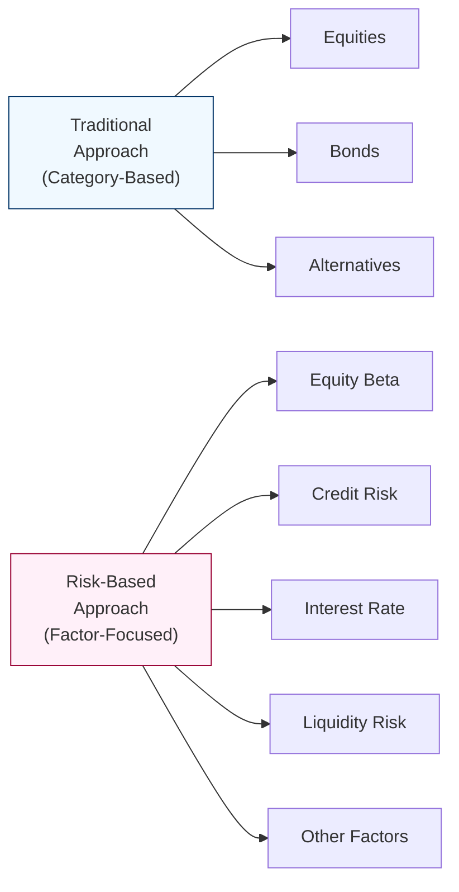

## Introduction and Context

Imagine you’re chatting with a friend about building a portfolio. “I spread my money across equities, bonds, and alternatives,” your friend says, “so I must be well-diversified, right?” Years ago, I used to think the same thing: just slice up the pie into different assets and voilà—instant diversification. Well, over time, I realized there's more nuance to it. Two investments may exhibit very similar risk exposures, even if one is labeled “stock” and the other is labeled “hedge fund.” That overlap can lead to some nasty surprises when markets get rocky.

That is precisely why many investors have begun to shift from the classic “traditional” approach—classifying by broad asset classes like equities, bonds, or alternatives—to a “risk-based” approach that classifies and allocates capital around underlying risk factors. In this section, we’ll explore the difference between these two approaches, discuss the practicalities of implementing a risk-based framework (especially in alternative investments), illustrate real-world examples, and briefly address the complexities involved.

## The Traditional Category-Based Approach

One of the most common methods for structuring an investment portfolio is by major asset classes: equities, bonds, and some type of alternatives bucket (which might include hedge funds, private equity, commodities, real estate, and more). Often, in a traditional approach, each major asset class is assigned an expected return and standard deviation. Then, a practitioner might run a mean-variance optimization (MVO), looking for the “efficient frontier,” presumably picking a portfolio that meets a certain target return for the lowest variance (or standard deviation).

Under this model, the broad classification is:

• Equities (e.g., domestic, international, large-cap, small-cap)  
• Bonds (e.g., investment-grade corporates, treasuries, emerging market debt)  
• Alternatives (e.g., hedge funds, private equity, commodities, real estate)  

While it has been the baseline for decades, it does come with some assumptions and limitations:

• Implicitly, we assume each asset class is internally homogeneous. A private equity strategy, a commodity futures position, and a real estate fund all get lumped into a single “alternative” classification.  
• We may miss overlapping risks. For instance, many “alternative” strategies could be loaded with equity risk, or certain bond-like assets might carry equity-like risks under stress.  
• Correlation estimates may be based on historical data, which might differ dramatically in future market conditions.  

## The Risk-Factor Perspective

Rather than grouping by label, a risk-based approach looks at the underlying risk drivers, sometimes called “risk factors.” Common risk factors often include:

• Equity Market Beta (the equity risk premium)  
• Credit Risk (e.g., spreads, default risk)  
• Interest Rate Risk (sensitivity to changes in government bond yields)  
• Liquidity Risk (how easily an asset can be converted to cash without large price impact)  
• Inflation (sensitivity to rising prices)  
• Other Specific Factors (volatility premiums, event-driven exposures, sector or style factors, etc.)  

By breaking down an investment’s returns into factor exposures, you can see exactly how it behaves during various market regimes. For example, a high-yield corporate bond position is partly driven by interest rate movements (like a Treasury bond) and partly driven by credit spreads (akin to equity-type risk). Meanwhile, certain hedge funds, thought to be “all-weather,” may turn out to be highly correlated to equity risk factors. Identifying such exposures helps ensure that an investor genuinely diversifies across distinct sources of return, rather than different asset class labels.

## Distinguishing Traditional and Risk-Based Allocations Visually

Below is a simple Mermaid diagram that illustrates how a traditional approach might categorize and how a risk-based approach “looks through” the labels to identify core factor exposures:

On the left, you see the traditional approach sorts investments by big-picture labels. On the right, the risk-based framework breaks them down by core risk factors. An alternative asset, for example, might have equity beta, credit risk, and liquidity risk embedded all at once.

## Practical Example: Corporate Bonds vs. Hedge Funds

Let’s consider a simplified example:

• Corporate Bond: Because it’s a bond, it’s presumably “fixed income,” right? But a deeper look might say that 70% of its return variance is driven by interest rate risk (duration) and 30% by credit risk (difference between treasury yields and corporate yields).  
• Long/Short Equity Hedge Fund: By name, it’s an “alternative,” but in reality, let’s say 60% of its risk is attributable to equity market beta, 20% to manager skill, and the remaining 20% to liquidity constraints and event-driven risk.

In a traditional approach, you’d think you’re fully diversified if you invest half of your portfolio in “bonds” and the other half in “alternatives.” But you might not realize you’re effectively holding a lot of equity risk (through the hedge fund) plus interest rate risk (through the corporate bond). If both the equity market and credit spreads move in tandem during a recession, you may be less diversified than you believed.

## Why Mean-Variance Optimization Alone Might Fall Short

Mean-Variance Optimization (MVO) is one of the first quantitative tools that many of us learn in portfolio management. But when you apply it purely to broad asset classes, you can run into oversimplifications:

• Historical correlation estimates can mask hidden factor correlations, which become more pronounced under stress.  
• MVO doesn’t always incorporate skewness, kurtosis, or higher-order risks; many alternatives can have asymmetric return distributions that are not captured in simple variance.  
• MVO seldom reveals the underlying factor overlap and might inadvertently overweight an unintended risk factor.

Risk-based approaches complement MVO by decomposing exposures. You can still use MVO—just apply it to risk factors rather than broad asset classes, or at least incorporate factor modeling as part of your optimization constraints.

## Factor-Based Allocation in Practice

In factoring out exposures, an institution might say:  
• “We want 40% of our portfolio’s overall risk to come from equity beta.”  
• “We’re comfortable with a 20% share of credit risk-driven returns.”  
• “We want 30% from alternative factors, like real estate or illiquidity premiums.”  
• “We’d prefer to keep interest rate risk at 10% or lower of total risk exposure.”

It’s a different lens than simply plugging in assets labeled “stocks,” “bonds,” and “alternatives.” Over time, a portfolio manager would adjust to maintain these factor targets, perhaps using derivatives or alternative structures to dial up or down exposure. This is how you begin to see that some corporate bond or private credit funds might get reclassified under “credit risk” rather than “interest rate” allocations. Meanwhile, a portion of your hedge fund investments—if they significantly move with equity markets—may be lumped under equity beta exposure, as opposed to being in a distinct alternative box.

## Implementation Challenges

Of course, implementing a risk-based approach is not all sunshine and roses. There are a few well-known hurdles:

• Robust Factor Measurement: Factor modeling requires a reliable process for estimating exposures. In practice, factor loadings can shift over time, generating “model risk.”  
• Governance and Expertise: Many boards or committees are used to seeing categories like “stocks vs. bonds vs. alternatives.” Shifting to factor-based reporting means more time up front educating stakeholders.   
• Leverage and Short Positions: A risk-based approach often involves using derivatives or short positions to reduce or rebalance factor exposures. That can introduce additional complexity and potential counterparty risk.  
• Data Requirements: Hedge funds, private equity, and other illiquid assets might have limited data, or use older valuations. This complicates factor analysis.  
• Cost and Overhead: Hiring or training staff to run factor models isn’t cheap. Rebalancing across different factor exposures (especially illiquid ones) also takes more effort.

In my early career, I remember proposing a partial factor-based reorganization of a pension’s portfolio. The board balked at adopting new classification tables, particularly for private equity and hedge funds. Over time, a compromise emerged: they used the traditional “asset class” structure for high-level decisions, but within each bucket, they further broke out their factor exposures. Such a hybrid approach might be a practical first step for many organizations.

## Getting Comfortable With Overlaps

One surprising outcome for many suitors of a risk-based approach is that an opportunity set—for example, private real estate, direct lending, or an event-driven hedge fund—might share more factor overlap than expected. If all these strategies rely on stable credit markets and low default rates, a downturn in the credit cycle could simultaneously impair them, even though you might have labeled them as “different asset classes.”

This realization can be jarring. It often forces organizations to re-think how they define “alternatives” in the first place, such that “alternatives” simply becomes a label for exposures that do not cleanly fit a purely factor-based model. In a truly pure factor-based approach, you might not even talk of “alternatives” at all, but rather “liquidity risk premium,” “credit risk premium,” “volatility premium,” and so forth.

## Best Practices and Pitfalls

• Best Practices:  
  – Begin with a pilot approach. Apply factor decomposition to a portion of the portfolio or to certain complex strategies (like hedge funds) before rolling it out on a broad scale.  
  – Combine MVO with factor constraints. For instance, if you are comfortable with a certain level of credit risk but want to limit interest rate exposure, you can impose these constraints in your optimization.  
  – Build an iterative feedback loop. Your factor model should be dynamic, adjusting for changing market behavior over time.

• Common Pitfalls:  
  – Overreliance on Historical Factor Loadings: Equity betas for hedge funds can vary widely under stress.  
  – Implementation Costs: Managing an entire portfolio around factor exposures may require derivatives overlays and specialized staff.  
  – Data Inconsistencies: Private assets often report with a lag or might “smooth” returns, obscuring the true risk factor exposures.

## Case Study: Factor Realignment in a University Endowment

A mid-sized university endowment had a standard 60/20/20 split across equities, bonds, and alternatives. They discovered through risk-factor analysis that many of their hedge funds closely correlated to equities during market drawdowns. Meanwhile, portions of their “bond” allocations behaved more like credit risk exposure than safe-haven assets. Over two years, they transitioned to a risk-based approach where the endowment board recognized that “hedge fund X” effectively functioned as an extension of equity beta and “private credit fund Y” functioned as higher-yield credit risk. The endowment then optimized their factor exposures, scaling back repeated exposures in the equity factor while seeking new diversifiers such as inflation-linked assets and absolute return strategies with lower equity correlation.

## Integration with Other Sections

• Refer to Section 3.1 (Roles of Alternative Investments): Mapping out risk factors can clarify how alternatives fit as diversifiers.  
• Reference Section 2.2 (Fixed-Income Risk and Return Measures): Decomposing bond holdings into duration and credit spread risk ties directly into a broader risk-based asset allocation.  
• Check Section 3.4 (Key Considerations When Allocating to Different Alternative Assets) for deeper insight on factor-based due diligence.  

## Exam Tips: Applying This Knowledge

• Be prepared for item-set or constructed-response questions that require you to identify hidden exposures in an “alternatives” portfolio.  
• Practice factor-based decompositions: If the exam or a question states that a certain fund has a beta of 0.6 to equities, a factor load of 0.4 to credit spreads, and so on, understand how that might rearrange your portfolio weighting.  
• Show your understanding of both the benefits (diversification, transparency) and the challenges (costs, complexity) of risk-based approaches. Examiners often look for balanced answers.  
• Time management is key. A factor-based question can be multi-step: first decipher factor exposures, then recommend changes based on the client’s risk/return profile.

## References

• CFA Institute Research Foundation. (2015). “Factor Investing and Asset Allocation.”  
• Leibowitz, M. L., & Bova, A. (Wiley). “The Endowment Model of Investing.”  
• Gregory, M. B. (2010). “Portfolio Risk Analysis” (especially on factor modeling and risk decomposition).  

--------------------------------------------------------------------------------

## Test Your Knowledge: Traditional vs. Risk-Based Asset Allocation



### In a traditional asset allocation framework, which of the following best describes how assets are typically grouped?

- [ ] By underlying factor exposures
- [x] By broad categories such as equities, bonds, and alternatives
- [ ] By the liquidity profile of each investment
- [ ] By the strategy manager’s skill factor

> **Explanation:** The traditional approach generally groups assets into broad categories (e.g., stocks, bonds, alternatives). Finer details, like factor exposures, may not be explicitly tracked under this model.

### Which term describes the process of identifying the underlying drivers of an investment’s returns, such as equity market beta, credit risk, or liquidity risk?

- [ ] Capital Allocation
- [ ] Risk Attribution
- [x] Factor Exposure
- [ ] Market Segmentation

> **Explanation:** Factor exposure refers to the amount of an investment’s return attributable to a particular risk factor (e.g., equity or credit). In a risk-based allocation, these exposures become the primary classification dimension.

### Why might a purely traditional approach to asset allocation overstate diversification benefits?

- [x] Correlations and shared risk factors across asset classes may be overlooked.
- [ ] It places too much emphasis on short sales and leverage.
- [ ] It focuses only on alternative investments.
- [ ] It excludes all forms of fixed income.

> **Explanation:** Simply grouping assets into categories like equity, bonds, and alternatives can miss the fact that many assets share similar underlying risk factors, especially during market stress.

### In a risk-based framework, high-yield bonds are typically viewed as containing:

- [x] Both interest rate risk and credit risk
- [ ] Pure interest rate risk alone
- [ ] Pure credit risk alone
- [ ] No market risk exposure

> **Explanation:** High-yield (or “junk”) bonds have duration risk related to changes in interest rates, but they also have significant exposure to credit risk, which can act more like equity risk during market downturns.

### All else being equal, which of the following is most often cited as a challenge in adopting a risk-based approach?

- [x] Additional complexity in measuring and monitoring factor exposures
- [ ] Higher short-term returns
- [ ] Lower regulatory barriers
- [ ] Direct improvement in liquidity management

> **Explanation:** Implementing risk-based models can be more complex and require specialized staff or external tools to measure and manage exposures.

### A broad commodity index is split into multiple sectors (energy, metals, agriculture) but still shows a high correlation to equity markets during certain periods. Which statement is most likely correct?

- [x] The index likely encompasses certain equity-like risk factors, particularly during stress events.
- [ ] Commodity indices never correlate with equity markets.
- [ ] Commodity indices have no links to macroeconomic cycles.
- [ ] The correlation shows that commodities are always an inferior diversifier.

> **Explanation:** Correlations often increase in periods of market stress. Commodity price movement may reflect macro factors, affecting their partial correlation to equities.

### What is a key reason why some hedge funds end up being categorized under “equity beta” exposures in a risk-based approach?

- [ ] Hedge funds have very short time horizons.
- [x] Many hedge fund strategies can be structurally correlated to equity markets, despite being called "alternatives."
- [ ] Hedge funds only invest in government bonds.
- [ ] Hedge funds typically have no correlation to any factor.

> **Explanation:** Strategies like long/short equity, event-driven, and activism can show significant correlation to equity markets, requiring a reclassification into an equity factor bucket.

### Why might an investor combining corporate bonds and equity-driven hedge funds be less diversified than they might believe in a traditional approach?

- [ ] Corporate bonds are always risk-free.
- [ ] Hedge funds never invest in equities.
- [ ] They hold no real exposure to macro factors.
- [x] Both strategies could share equity-like risk, especially during volatile markets.

> **Explanation:** Corporate bonds can contain credit (equity-like) risk, and hedge funds often have equity beta. In downturns, these may move together, defeating the illusion of diversification.

### Which of the following is a benefit of combining mean-variance optimization (MVO) with factor-based constraints?

- [x] It can prevent unintended overconcentration in a single risk factor.
- [ ] It ensures the highest expected returns at zero risk.
- [ ] It eliminates the need for correlation analysis.
- [ ] It reduces transaction costs to zero.

> **Explanation:** By incorporating factor-based constraints within MVO, investors can limit how much exposure they have to a single risk factor, improving true diversification.

### True or False: In a strictly risk-based framework, the term “alternatives” becomes largely irrelevant from a classification standpoint.

- [x] True
- [ ] False

> **Explanation:** A purely risk-based approach focuses on factor exposures (e.g., equity risk, credit risk, illiquidity premium) rather than labeling strategies “alternatives.” If something has the same underlying risk factor as equities, it’s effectively categorized under that same factor.


