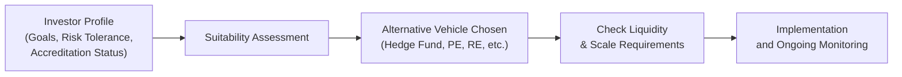

## Introductory Perspective

Well, here we are, talking about alternative investments—those intriguing, seemingly exotic asset classes that promise everything from enhanced diversification benefits to stronger inflation hedging potential. But are those potentials enough to justify jumping aboard without first cracking open your investor’s profile? Probably not. I remember one friend—fresh out of business school—who got fixated on private equity deals. He hoped to score triple-digit returns in no time. But oh boy, did he underestimate the long lock-up and capital calls. “I need that money now,” he said, sounding frustrated and surprised. Even the savviest among us can be startled by the demands of alternatives. 

The concept underpinning all these private equity deals, hedge funds, infrastructure ventures, real estate ventures, farmland, direct lending, or any other alternative investment is suitability. Are these instruments aligned with the investor’s goals, time horizon, liquidity preferences, risk tolerance, scale, and regulatory constraints? If not, then it’s a mismatch that can crush both performance and peace of mind. In this section, we’ll walk through each major factor that helps you decide whether a given alternative is the right fit—or if you should consider something else.

## Aligning Objectives with Investor Profile

One of the first things we learn as portfolio managers is that each investor has distinct goals. Some folks want high-octane growth (think “max gains, please!”), others want stable income, and others still want to protect their capital at all costs. Then there are objectives like inflation hedging, which is why real assets such as commodities and real estate come into play.

• High Growth: Hedge funds with aggressive strategies, private equity buyouts, or venture capital might appeal if the investor can handle their illiquidity and higher volatility.  
• Capital Preservation: Real estate with stable rental income, or certain types of private credit that prioritize senior positions, can help preserve principal but still offer some potential upside.  
• Inflation Hedging: Infrastructure investments—like toll roads or utilities—often link returns to inflation, as do farmland or commodities. These may be a better fit for an investor who’s worried about rising price levels over the long haul.

### Understanding the Return Objective
An investor with a high-return objective often looks at private equity or hedge funds employing high-leverage or sophisticated derivative overlays. Yep, these can offer outsized returns. But in my experience, it’s too easy to forget that outsized returns come packaged with greater tail risk. Alternatively, if the investor’s objective is stable income, a more moderate route—like a conservative real estate fund or specialized private debt—might be more appropriate.

### Shorthand Formula: Expected Return in Illiquid Investments

Sometimes we represent the expected return of an alternative investment as:


\text{Expected Return} = R_f + \beta \times (R_m - R_f) + \text{Illiquidity Premium},


where:
• \\(R_f\\) is the risk-free rate,  
• \\(R_m\\) is the expected return of the market or relevant benchmark,  
• \\(\beta\\) captures systematic risk relative to a benchmark,  
• Illiquidity Premium is the compensation for investing in an instrument that cannot be easily traded.

This is a rough blueprint. Depending on the strategy, you might add or subtract other factors (e.g., credit spread, complexity premium, etc.). But it’s a handy reminder that if you sign up for illiquid investments, ideally you’re paid some extra “thank you” in the form of higher expected returns.

## Assessing Risk Tolerance and Capacity

Risk tolerance measures the level of volatility (or potential losses) investors are willing to accept. But it’s not just about willingness; it’s also about capacity, or how much loss an investor can absorb before it jeopardizes important objectives. Hedge funds, for instance, might introduce strategies that can have significant drawdowns in extreme market conditions.

### Risk Tolerance vs. Risk Capacity
Let’s differentiate these two, because I’ve seen them confused a lot:

• Risk Tolerance: The comfort level an investor has with fluctuations in portfolio value. Some investors lose sleep if the portfolio dips even 10%.  
• Risk Capacity: The financial “room” for error. Even if you don’t mind the volatility, if a certain shortfall threatens your retirement plans or an institution’s ability to fund liabilities, the portfolio’s risk capacity isn’t very high.

#### Tailoring Alternatives to Risk Tolerance
• Low Risk Tolerance, High Risk Capacity: Possibly real assets that have moderate volatility or direct lending that shows stable cash flow.  
• High Risk Tolerance, Low Risk Capacity: Might be contradictory. Typically, the investor is comfortable with risk—psychologically speaking—but can’t afford large losses. They may need structured or hedged exposures.  
• High Risk Tolerance, High Risk Capacity: Potentially robust hedge fund portfolios, early-stage venture capital, or leveraged buyouts.  

## Evaluating Investor Experience and Sophistication

We all know that some alternatives require advanced investment knowledge. A friend of mine—let’s call him Ahmed—once got super excited about convertible arbitrage because of a tip from a well-known manager. But it turned out to be a labyrinth of complex derivative strategies. He quickly realized he needed external guidance because the knowledge requirement was too intense.

Hedge funds that deploy derivative-based overlays, or direct private equity deals requiring operational expertise, generally aren’t recommended for novices unless they have professional support. On the other hand, publicly traded REITs or real estate crowdfunding might be easier to understand and monitor.

### Practical Example of Sophistication
Consider direct farmland ownership. Let’s say you’re buying farmland in a region that expects water scarcity or shifting environmental regulations. If you don’t have the know-how or a full agricultural team to manage the land, you’re in for a steep learning curve. The same goes for derivative-heavy strategies, where lacking experience can lead to significant unexpected outcomes.

## Regulatory Requirements, Net Worth, and Accreditation

In the United States, for instance, the SEC imposes strict definitions of “accredited investors” or “qualified purchasers.” Many hedge funds, private equity funds, and other private placements limit subscription to individuals or entities that meet certain net worth or income thresholds. Other jurisdictions have similar frameworks.

• Accredited Investor or Qualified Investor: Typically must meet specific net worth or income thresholds.  
• Non-Accredited Investor: Often restricted from certain private offerings to “protect them from risk.”  

So, always confirm the regulatory status first. Even the greatest strategy is moot if the prospective investor can’t legally invest. Also, some regulated funds in the “liquid alternatives” category provide partial exposures but in a regulated, more accessible format.

## Matching Liquidity Needs

Liquid alternatives? Illiquid alternatives? Let’s see. Maybe you’re an endowment with a 50+ year horizon—illiquidity won’t really keep you up at night. But if you’re a retiree living off your portfolio distributions, you might need easier access. 

### Lock-Up Periods and Redemption Constraints
Private equity funds, for example, can lock up capital for 7–10 years. Hedge funds often have quarterly or annual redemption windows. Real estate can sometimes be relatively illiquid—especially if you need to liquidate property quickly. 
If an investor anticipates major life events—like paying for a child’s education soon—a long lock-up might be a disaster waiting to happen. Endowments and pension funds, by contrast, might actually relish the illiquidity premium because they have a low need for immediate liquidity.

## Scale and Minimum Commitment

Some alternatives basically require big bucks to play. For instance:  
• Direct ownership of commercial property might need a million-dollar outlay.  
• A farmland investment might require purchase of large acreage.  
• Numerous hedge funds mandate a $1 million minimum.  

If an investor’s total portfolio is $2 million, committing $1 million to a single strategy is dangerously concentrated. Simply put, the scale factor can make or break the feasibility of an investment. 

## Common Types of Alternative Investments and Suitability Profiles

We now turn to a breakdown of popular alternative asset classes alongside typical suitability profiles.

### Hedge Funds
• **Strategy Variety:** From long-short equity to global macro.  
• **Typical Investors:** High-net-worth individuals, institutional investors with moderate-to-high risk tolerance.  
• **Lock-Up & Liquidity:** Ranges from monthly to annual redemption, sometimes with lock-ups.  
• **Key Suitability Points:** Must handle performance volatility, fees, complexity, and potentially limited liquidity windows.

### Private Equity
• **Strategy Focus:** Venture capital, buyouts, growth capital.  
• **Typical Investors:** Institutions and accredited individuals seeking high growth over the long haul.  
• **Lock-Up & Liquidity:** 7–10 years or longer.  
• **Key Suitability Points:** Illiquid, requires patience, potential for high returns but also high failure rates in venture capital.

### Real Estate (Direct Ownership or Funds)
• **Strategy Focus:** Rental income, appreciation, leverage.  
• **Typical Investors:** Retail investors via REITs or crowdfunds, institutions via direct deals, private real estate funds.  
• **Lock-Up & Liquidity:** Can be fairly illiquid unless using publicly traded REITs.  
• **Key Suitability Points:** Solid for diversification, inflation hedge potential, stable income (depending on property type).

### Infrastructure
• **Strategy Focus:** Interpreted as highways, ports, utilities, renewables.  
• **Typical Investors:** Sovereign wealth funds, large pension funds, some specialized retail products.  
• **Lock-Up & Liquidity:** Typically illiquid.  
• **Key Suitability Points:** Inflation-linked revenue in some projects, stable cash flows, large upfront capital.

### Commodities
• **Strategy Focus:** Direct holdings of physical commodities, futures-based strategies.  
• **Typical Investors:** Those seeking inflation hedge or diversification.  
• **Lock-Up & Liquidity:** Futures markets can be liquid, but physical storage is more complex.  
• **Key Suitability Points:** High volatility, advantage in inflationary times, unique correlation patterns.

### Private Credit
• **Strategy Focus:** Direct lending, distressed debt, mezzanine financing.  
• **Typical Investors:** Institutional or high-net-worth seeking steady yields.  
• **Lock-Up & Liquidity:** Often less liquid, but can offer shorter durations than private equity.  
• **Key Suitability Points:** The risk is tied to borrower default; can be a stable yield generator but requires credit expertise.

### Farmland and Timber
• **Strategy Focus:** Agricultural production, commodity price exposure, regulatory constraints.  
• **Typical Investors:** Specialized funds, large family offices, institutions.  
• **Lock-Up & Liquidity:** Illiquid direct ownership.  
• **Key Suitability Points:** Inflation hedge, real asset, but operational complexities (soil, climate, pests, etc.).

## Visualizing the Suitability Assessment

Below is a simple Mermaid diagram to illustrate how you might approach an alternative investment decision process:

This is a simplified model, but it emphasizes how investor-specific details feed into the final choice of which alternative—or whether an alternative is even appropriate at all.

## Case Example: Family Office vs. Individual Investor

• **Family Office**: Typically manages wealth across multiple generations. Usually, they have robust risk capacity because of significant capital, lengthy time horizons, and professional management. They can afford illiquid investments like private equity or direct real estate ownership. They might incorporate farmland as a generational inflation hedge.  
• **Individual Investor**: One needing near-term liquidity may find private equity or farmland’s illiquidity unpalatable. If they’re comfortable with moderate risk and want diversification, perhaps a managed-futures hedge fund or publicly listed real estate might be a more realistic fit.

## Common Pitfalls

While alternative investments can be powerful portfolio diversifiers, they’re not magic bullets. There are pitfalls:

• **Underestimating Liquidity Constraints**: Needing cash unexpectedly and being locked in can force fire-sale or secondary market transactions at steep discounts.  
• **Inadequate Diversification**: Pouring too much capital into one illiquid private equity strategy can blow up a portfolio when the macro cycle shifts.  
• **Lack of Expertise**: Complex hedge fund or direct lending strategies might mask hidden risks.  
• **Overlooking Fees**: Many hedge funds and private equity funds charge high management and performance fees. Over time, this can significantly eat into net returns.  
• **Regulatory Surprises**: Investing in farmland in a country with strict land ownership rules might create legal hurdles for foreign investors.

## Best Practices for Suitability

• **Draft a Clear Investment Policy Statement (IPS)**: Precisely define the roles, constraints, and guidelines for alternatives in the portfolio.  
• **Perform Thorough Due Diligence**: Evaluate the manager’s background, track record, fees, strategy, and any gating or redemption clauses.  
• **Size Positions Modestly**: Avoid concentrated bets unless the investor is fully aware of (and can absorb) big drawdowns.  
• **Monitor Continuously**: Even if it’s a “set and forget” investment, keep tabs on underlying performance, sector trends, and changes to lock-up or redemption terms.  
• **Stress Test**: Conduct scenario and stress testing (see Chapter 2.11 on scenario analysis) to see how extreme events might impact the portfolio.  

## Conclusion and Exam Tips

Alternative investments are an essential piece of the portfolio construction puzzle, especially for investors seeking diversification, inflation protection, or enhanced returns. However, this slice of the pie can test your mettle. The best results come from carefully aligning the alternative’s features (liquidity, risk-return profile) with the investor’s unique situation. Always check for accreditation, confirm risk tolerance, ensure no short-term funding demands, and gauge the operational and knowledge requirements.

For the CFA Level III exam, keep these tips in mind:  
• Grasp how to frame an investor’s alternative allocation in an IPS context.  
• Know how lock-up periods, redemption terms, and liquidity constraints interact with different investor types.  
• Be capable of using scenario analysis or stress testing to illustrate how alternatives behave under market extremes.  
• Understand how regulatory frameworks influence who can invest in certain private vehicles.

As you approach exam questions, be sure to address the “why” behind each allocation recommendation. Don’t just say, “Private equity is good for this client.” Instead, highlight the reason—maybe the investor has a high risk capacity, a very long time horizon, and is accredited. Provide context, not just bullet points.

## References

• CFA Institute. (2022). Private Wealth Management—Suitability and Investor Profiles.  
• The U.S. Securities and Exchange Commission. “Accredited Investor Definition.” https://www.sec.gov/  
• CAIA Level II Curriculum: Advanced Topics in Alternative Investments  

---

## Test Your Knowledge: Suitability in Alternative Investments



### When determining whether a certain alternative investment is suitable for an investor, which of the following is the most important initial consideration?

- [ ] The detailed fee structure of the fund.
- [x] The investor’s objectives, risk tolerance, and time horizon.
- [ ] The benchmark used by the alternative strategy.
- [ ] The magnitude of potential tax savings.

> **Explanation:** Before diving into fee schedules or tax benefits, you need to confirm that the alternative investment matches the investor’s objectives, risk tolerance, and time horizon.

### A hedge fund that requires a high minimum commitment is generally best suited for which type of investor?

- [ ] A small retail investor focused on generating short-term liquidity.
- [ ] An individual investor primarily concerned with daily price fluctuations.
- [x] A family office or institutional investor with substantial capital and a long investing horizon.
- [ ] A retiree with a critical near-term capital need.

> **Explanation:** Large minimum commitments often suit those with a higher net worth and investment capacity, along with a long-term horizon that accommodates periodic lock-ups.

### Under which of the following scenarios is private equity typically most suitable?

- [ ] When an investor needs immediate liquidity within six months.
- [ ] When an investor’s net worth is below accredited investor thresholds.
- [ ] When an investor is focusing solely on capital preservation with minimal risk tolerance.
- [x] When the investor has a higher risk tolerance, meets accreditation standards, and can lock up money for extended periods.

> **Explanation:** Private equity has long lock-up periods and requires a high risk tolerance and accredited investor status.

### Which of the following best explains the primary purpose of the illiquidity premium in alternative investments?

- [ ] To offset future tax liabilities.
- [x] To compensate investors for the inability to quickly convert their holdings to cash. 
- [ ] To reward investors for counting alpha separately from beta.
- [ ] To punish investors who take on too much leverage too quickly.

> **Explanation:** The illiquidity premium is essentially compensation for tying up capital over a longer period with limited or no redemption options.

### Why might a large endowment fund be more inclined toward investing in farmland or infrastructure?

- [ ] Because these assets guarantee above-market returns. 
- [x] Because they have a longer time horizon, can tolerate illiquidity, and seek inflation-linked returns.
- [ ] Because farmland and infrastructure are federally insured.
- [ ] Because there are no regulatory restrictions involved.

> **Explanation:** Large endowments often have multi-decade, if not perpetual, horizons. Their ability to handle illiquidity, along with the potential for inflation-linked and stable returns, makes farmland and infrastructure appealing.

### An investor classifies herself as “moderate risk.” She has also indicated she may reconsider her investment after three years if certain conditions change. Which attributes of an alternative investment should be scrutinized most closely?

- [x] Lock-up requirements and redemption schedules. 
- [ ] Reputation of the fund manager’s personal character. 
- [ ] Whether portfolio managers use convertible arbitrage. 
- [ ] The arrangement of management and performance fees.

> **Explanation:** If the investor has a potential near-term liquidity need, the lock-up period and redemption frequency are particularly important to review.

### A high-income individual is exploring hedge funds. Which scenario could limit her ability to actually invest?

- [x] She fails to meet accreditation standards if much of her wealth is in illiquid property. 
- [ ] She has a moderate risk tolerance. 
- [ ] She is open to long-term lock-ups.
- [ ] She has no plan for tax structure.

> **Explanation:** Even if she’s high-income, she may not meet the accredited investor definition if her liquid net worth is insufficient. Regulatory restrictions can bar entry to certain hedge funds.

### What is the biggest drawback of over-allocating to a single private equity fund?

- [ ] Lower management fees compared to a diversified approach.
- [ ] It guarantees lower returns when the market is bullish.
- [ ] Scarce investor demand for private equity exposure. 
- [x] Concentration risk, because the portfolio will be over-reliant on one fund’s success.

> **Explanation:** Over-concentration in a single private equity fund can result in large portfolio volatility if that fund underperforms or if its sector faces headwinds.

### Which alternative investment is commonly chosen for a combination of inflation hedging and stable cash flow, particularly by large institutional investors?

- [ ] Distressed hedge funds 
- [x] Infrastructure assets 
- [ ] Portable alpha strategies 
- [ ] Commodity ETFs

> **Explanation:** Infrastructure projects (utilities, roads, renewable power) frequently include inflation-linked revenue provisions, appealing to big institutions.

### A client has expressed interest in farmland investing but has no agricultural background. Which factor would most likely be an immediate concern?

- [x] Operational complexity and need for specialized skills to manage or evaluate farmland. 
- [ ] High correlation to publicly listed equities. 
- [ ] Guarantee of capital preservation.
- [ ] Absence of lock-up periods.

> **Explanation:** Farmland requires significant knowledge of agriculture, environmental regulations, and local market conditions. This operational complexity is usually a prime consideration for novices.


