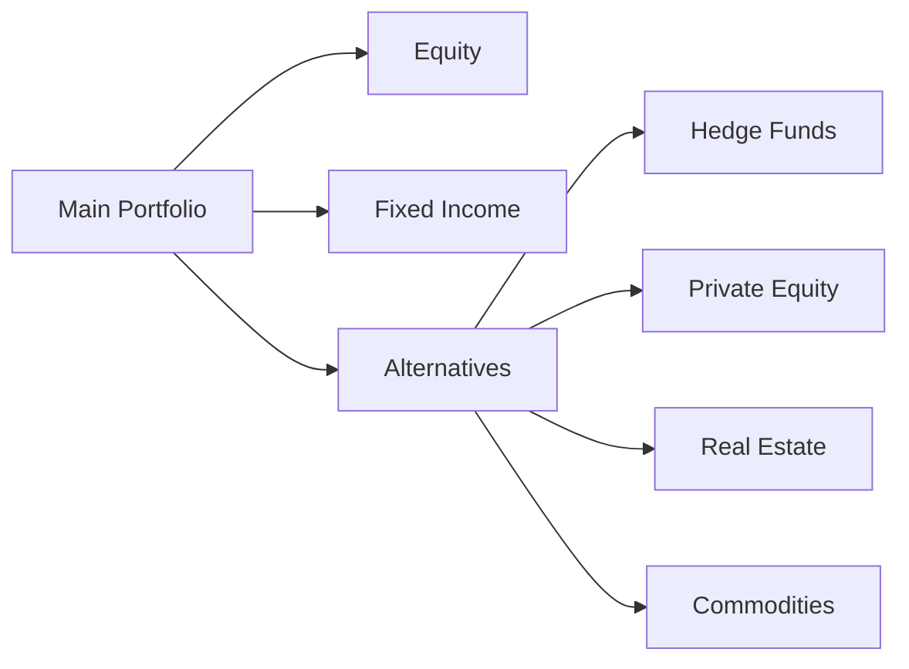
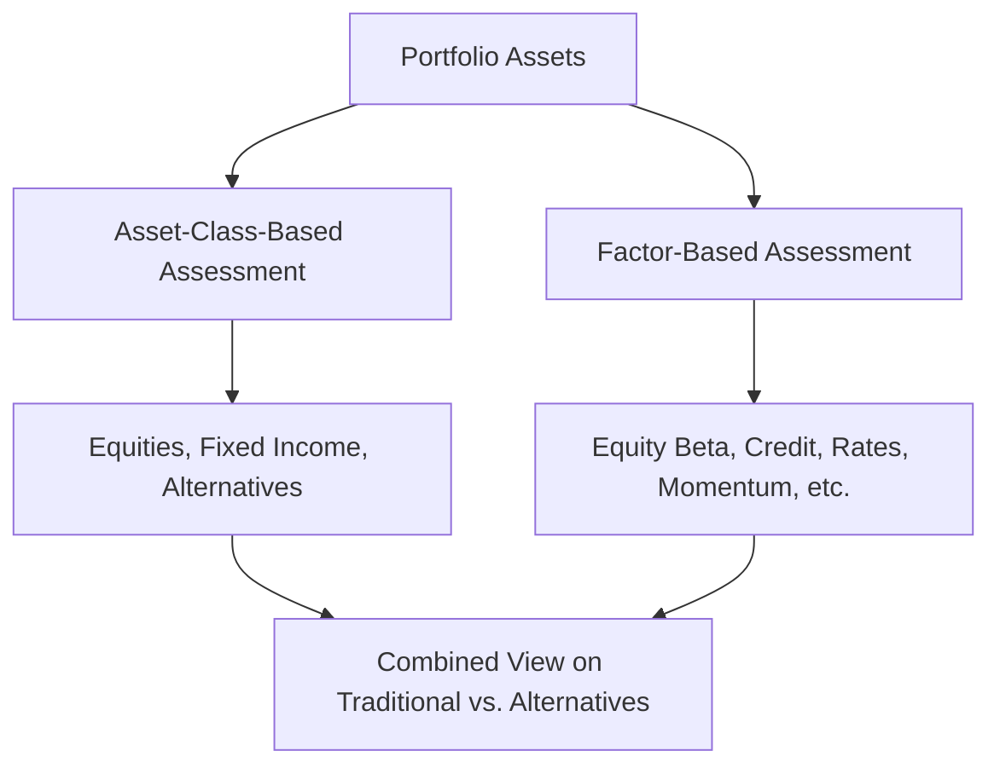

## Introduction and Context

So, you’re sitting there, thinking: “Alternatives. Everyone’s talking about them. But what’s really going on behind the scenes?” If that sounds familiar, you’re not alone. Many investors—from novices to seasoned professionals—wonder how alternative investments fit into a well-constructed portfolio. We’ll walk through the main approaches to asset allocation in alternative investments, highlight potential pitfalls, and give you some real-life examples of how investors put these concepts into practice.

Approaches to asset allocation with alternatives can be more nuanced (and interesting) than one might assume. After all, alternatives are a wide-reaching category (private equity, real estate, hedge funds, infrastructure, commodities, and more). Some managers treat them as a single bucket, while others break them into sub-buckets and attempt to manage each with surgical precision. Add in strategic decisions to match an investor’s long-term policy weights, plus tactical moves to exploit short-term market dislocations, and—believe me—things can get complicated quickly!

This discussion fits under Chapter 3 of our broader exploration of Asset Allocation to Alternative Investments (see 3.1–3.9 for more on roles, risk mitigation, liquidity planning, ESG considerations, and portfolio monitoring). Here, we’ll explore how managers actually make decisions when allocating to alternatives. Let’s get started.

## Strategic vs. Tactical Asset Allocation with Alternatives

Most portfolios begin with a long-term policy portfolio known as the Strategic Asset Allocation (SAA). In the context of alternatives, the SAA might say something like: “We aim to have 15% of our total portfolio in private equity, 10% in real estate, and 5% in hedge funds.” This is the big-risk, big-picture stuff—long-horizon decisions that align with an investor’s liability structure, return objectives, and overall risk tolerance.

But real-life portfolios rarely stick to these weights perfectly. Markets zig and zag. Opportunities arise, or valuations get out of whack. That’s where Tactical Asset Allocation (TAA) steps in. TAA is about taking shorter-term views—maybe one to 12 months—to overweight or underweight certain alternative asset classes when conditions look especially sweet (or scary). For instance, if real estate valuations plummet during an economic downturn (and your moderate research suggests a rebound is likely), you might ramp up the real estate portion above your strategic target to seize the potential future upswing.

There’s a human element to all this. Sometimes, I’ve seen managers skip a golden opportunity because they’re terrified of illiquidity. A friend of mine once told me about passing on the chance to buy real estate assets at distressed prices because the fund simply had no TAA “budget” left for real estate overweights. That kind of story underscores how the interplay of strategic constraints and tactical freedom can drive real-life results.

## Bucket-Based Approaches

An easy way to dip your toes into alternatives is to compartmentalize them. One might say: “We’ll just create a single alternatives bucket, capped at 20% of total assets, to represent everything that’s not public equity, fixed income, or cash.” This is a straightforward approach—helpful for setting broad limits—but it can mask the tremendous variety and risk distinctions within the alternative space.

Alternatively, you can subdivide your alternative bucket into several specialized sleeves:

• Hedge Funds  
• Private Equity (including Venture Capital and Buyouts)  
• Real Estate  
• Commodities  
• Infrastructure  
• Other Niche Strategies (e.g., cryptocurrency, private credit)

My own experience? Breaking alternatives into sub-buckets can really highlight differences in liquidity, time horizon, and risk factor exposures. The manager can set different targets and risk triggers for each category. This helps keep, say, your private equity exposure from ballooning beyond your comfort zone—even if the entire alternatives “bucket” remains under some limit.

### Visual Representation of a Bucket-Based Approach

Here’s a simple Mermaid diagram illustrating a bucket-based framework, where the overall “Alternatives” allocation is subdivided:

In this diagram, you see how each alternative asset type is its own sub-bucket or sleeve within the overarching alternatives allocation.

## Augmented Mean-Variance Optimization (MVO)

It’s no secret that classic MVO tries to balance an expected return vector against a covariance matrix to find that “optimal” asset mix. However, illiquid alternative investments (and their frequently smoothed returns) can make naïve MVO tricky.

### Data Smoothing and Illiquidity
Because alternatives aren’t traded daily, their reported returns may look less volatile than public equity. This phenomenon—often called **data smoothing**—can produce artificially low correlations with other assets. If you feed these numbers into a traditional MVO, you might end up with a more significant allocation to these alternatives than is prudent (they appear “perfectly wonderful” in terms of risk-return trade-off).

In practice, managers might “unsmooth” returns by applying statistical techniques that approximate the true volatility and correlations. Alternatively, they might incorporate scenario analysis, stress testing, or liquidity constraints to ensure the final solution remains robust. For context, see also Chapter 2.11 on **Scenario Analysis and Stress Testing in Fixed-Income Portfolios**, because the same overarching principles can be applied to properly gauge risk in alternatives.

### Simple Mathematical Representation
A stylized version of the optimization might look like this:


\max_{w} \Big[ w^T \mu - \frac{\lambda}{2} w^T \Sigma w \Big]


subject to constraints:


\sum w_i = 1,\quad w_i \ge 0,\quad \text{and custom liquidity constraints.}


Here, \\( \mu \\) is the vector of expected returns for each asset/strategy (including alternatives), \\( \Sigma \\) is the covariance matrix, \\( \lambda \\) is the risk-aversion parameter, and \\( w \\) is the vector of portfolio weights. The twist is that for alternatives, the \\(\sigma\\) and correlation inputs might be derived from less frequent data or from “blended” data.

## Liability-Relative Approaches

For institutional investors—like pension funds or insurers—asset allocation in alternatives has to be considered alongside liability streams. For instance, a defined benefit pension might face predictable outflows to retirees each month, but the magnitude and timing of these outflows can vary with interest rates or longevity assumptions. Alternative investments that provide stable or uncorrelated cash flows may help align and mitigate the risk of underfunding.

One key question that arises is: “Is the illiquidity risk worth it?” If your liability stream is more stable (like a stable pension payout) and you have a long time horizon, you might be able to invest in relatively illiquid private equity and real estate. This extended time frame might be fine—so long as you don’t need to tap the assets immediately to meet benefit payments (and your plan’s regulatory requirements permit it).

In some cases, multi-asset managers integrate liability modeling directly with their SAA and TAA frameworks. Real estate or infrastructure might be appealing because of steady inflation-linked cash flows, so they see them as partial hedges to inflation risk. On the other hand, private equity is typically more about capital appreciation rather than yield or ongoing cash distributions (apart from certain real asset strategies). The goal is to craft an allocation that best meets future liabilities while controlling shortfall risk.

## Factor-Based Approaches

Over the years, many institutional investors have shifted from an asset-class perspective to a factor-based perspective. Rather than labeling an investment “hedge fund,” you break it down by risk factors, such as:

• Equity Market Factor (Beta)  
• Credit Spread Factor  
• Interest Rate Duration  
• Momentum/Trend Factor  
• Value, Growth, or Style Factors  
• Volatility / Tail Risk Exposures  
• Macro Factors (e.g., inflation, commodity prices, currency)

Applying this framework allows you to see that a particular hedge fund may deliver equity correlation plus some additional idiosyncratic alpha (or maybe negative correlation in a meltdown scenario, we hope). Meanwhile, private equity might map largely to equity risk factors and illiquidity premia, whereas real estate might exhibit inflation sensitivity and some local market risk factors. By summing these exposures across all your holdings, you can spot over- or under-concentrations in certain risk factors and adjust accordingly.

It seems to me that factor-based approaches can either complement or fully replace a bucket-based approach. Some large allocators use both. They keep track of asset-class guidelines for governance reasons but run risk management on a factor basis. This is especially relevant in big, sophisticated endowments or sovereign wealth funds (see Chapter 7, which includes a case study in portfolio management for a Sovereign Wealth Fund). You want to ensure you aren’t duplicating risk factors or ignoring them.

### Factor-Based Allocation Diagram

Below is a Mermaid diagram showing a simplified flow of how factor-based thinking might complement a standard asset-class view:

## Practical Implementation and Challenges

### Balancing Return and Liquidity
A big challenge with alternative allocations is the mismatch between liquidity needs and the locked-up nature of many alternative strategies. Hedge funds might offer quarterly or annual redemptions, whereas private equity funds could require 7–10 years. Meanwhile, if you have near-term liabilities (like pension payments) or the potential for a crisis drawdown, you don’t want to be stuck with illiquid positions you can’t sell.

### Vintage-Year Diversification in Private Equity
Some institutional investors try to allocate to private equity consistently year after year, creating multiple vintages to smooth out the J-curve effect and cyclical performance differences. If you invest heavily in one vintage that happens to coincide with an exorbitant environment for valuations, you might be disappointed in results. Instead, layering across vintage years can help reduce timing risk.

### Governance and Complexity
Managing alternatives is often more complex than managing traditional assets. Each type of alternative might have unique legal structures, reporting requirements, fee schedules, and performance metrics. You might need skilled staff, specialized consultants, and advanced risk systems. Many institutional and sophisticated private investors use external managers, so manager selection and due diligence become paramount (see 3.10 in this book for details on manager selection and due diligence in alternatives).

## Best Practices and Common Pitfalls

• **Best Practice:** Perform thorough due diligence and risk factor mapping for each alternative strategy. Make sure that your expectations for risk-return align with reality.  
• **Pitfall:** Relying on reported correlation figures without adjusting for illiquidity or stale pricing can lead to over-allocating to alternatives.  
• **Best Practice:** Incorporate scenario analysis and stress testing to see how alternatives behave in adverse market conditions—especially when liquidity might vanish at the worst time.  
• **Pitfall:** Trying to lump all alternatives into one bucket can obscure significantly different risk profiles and liquidity terms.  
• **Best Practice:** Use a factor-based overlay to identify potential hidden exposures across your entire portfolio.  
• **Pitfall:** Overdoing Tactical Asset Allocation in illiquid alternatives can become a mismatch, as you simply can’t adjust your private equity positions quickly if the market environment changes overnight.

## Encouraging Critical Thinking

Don’t forget to think critically about the reasons for including alternatives in your portfolio. Is it for diversification, return enhancement, liability matching, or inflation hedging? Are you comfortable with the operational and governance complexities?

For instance, if you’re adding a big chunk of hedge funds purely to reduce volatility, ask yourself: “Do I truly believe the hedge fund’s strategy is uncorrelated and properly risk-managed?” Similarly, ask: “What if the manager gates redemptions during a crisis?” These sometimes-forgotten details matter more than the fancy marketing pitch.

## Final Exam Tips

• **Link to Real-World Liabilities:** If you face a liability stream, be sure to articulate how your alternative allocation either matches or hedges these obligations.  
• **Stress the Role of Illiquidity and Data Smoothing:** The exam might prompt you to explain how an otherwise well-intentioned MVO can misallocate capital.  
• **Integrate Factor Analysis:** Prepare to discuss how a factor-based approach can reveal hidden exposures. You might see a question that requires you to map hedge fund returns to underlying beta exposures.  
• **Beware of Overgeneralizing Alternatives:** The exam often expects you to demonstrate that you understand the differences among private equity, real estate, and hedge funds.  
• **Be Specific with TAA Rationale:** If you mention a tactical shift, make sure you can explain the time horizon, catalysts, and triggers for that shift.

## References

• Litterman, Bob (2003). “Modern Investment Management: An Equilibrium Approach.” (Wiley).  
• CFA Institute. (2021). “Asset Allocation and Portfolio Construction” modules.  
• Ilmanen, Antti (2011). “Expected Returns” (Chapters on illiquid asset classes).  

## Test Your Knowledge: Approaches to Asset Allocation in Alternative Investments



### Which of the following best describes Strategic Asset Allocation (SAA) in alternative investments?

- [x] A long-term policy portfolio weight to alternative assets designed to align with the investor’s overall objectives
- [ ] A short-term rebalancing tactic used to capture mispricing in real estate or private equity
- [ ] An approach to manage credit spreads with derivatives overlay
- [ ] A daily adjusted exposure to multiple hedge fund strategies

> **Explanation:** SAA is a long-term framework establishing target weights across asset classes, including alternatives, consistent with the investor’s objectives, constraints, and risk tolerance.

### Why does “data smoothing” often occur with alternative assets?

- [ ] Because hedge funds always deliver stable returns with minimal volatility
- [ ] Because private equity investments are typically marked-to-market every day
- [x] Because illiquid or infrequent valuations cause artificially lower reported volatility
- [ ] Because real estate appraisals come from daily online quotes

> **Explanation:** Illiquid or infrequent pricing in alternatives can lead to systematically lower reported volatility and correlation, a phenomenon referred to as data smoothing.

### Which of the following is most likely a valid reason for employing a liability-relative approach to allocating to alternatives?

- [ ] To speculate on margin calls in private equity funds
- [ ] To boost short-term returns in highly volatile hedge fund strategies
- [x] To better match the timing and size of future cash flows with pension benefit outflows
- [ ] To reduce the management fees paid by the fund

> **Explanation:** Liability-relative approaches emphasize matching portfolio returns and cash flows with the liability schedule (e.g., pension benefit payments) to reduce funded status volatility.

### In a bucket-based approach to alternatives, how are the assets typically organized?

- [ ] By the number of capital calls required
- [ ] By country of operation
- [x] By subcategories such as private equity, hedge funds, real estate, etc.
- [ ] By the last known net asset value

> **Explanation:** A bucket-based approach partitions the alternatives portion into logical subcategories (hedge funds, private equity, real estate, commodities, etc.) based on strategy or asset profile.

### In an augmented Mean-Variance Optimization (MVO) process for alternatives, which of the following is most important to incorporate?

- [x] Adjustments for illiquidity and data smoothing
- [ ] Only the maximum Sharpe ratio from historical returns
- [ ] Complete exclusion of all hedge funds due to minimal liquidity
- [ ] The same parameters for alternatives as for public equities

> **Explanation:** Illiquidity and data smoothing need to be addressed because they understate volatility and correlation, potentially skewing the optimization.

### When employing factor-based approaches, which risk factor is most associated with private equity?

- [x] Equity market beta and an illiquidity premium
- [ ] Government bond duration
- [ ] Currency carry
- [ ] Direct commodity exposure

> **Explanation:** Private equity typically shares significant equity market beta and includes an illiquidity risk premium due to locked-up capital.

### A liability-relative approach to alternatives might prioritize real estate investments for which primary reason?

- [ ] They have zero correlation to global equities
- [ ] They cannot generate rental income
- [x] Some real estate investments have moderately stable, inflation-linked cash flows
- [ ] They always outperform hedge funds in a recession

> **Explanation:** Real estate holdings (especially core real estate) can provide stable, inflation-hedged cash flows that align well with liability needs.

### Which of the following would be a potential pitfall of treating all alternatives as a single bucket?

- [ ] Reduced concentration risk
- [x] Masking distinct risks between different alternative strategies
- [ ] Immediate improvements in liquidity
- [ ] Enhanced transparency in hedge fund strategies

> **Explanation:** Aggregating all alternatives into one category can obscure the very different risk-return and liquidity profiles among private equity, real estate, hedge funds, and other sub-strategies.

### Why might an institutional investor opt for a tactical overweight to real estate?

- [ ] To immediately liquidate the real estate position if returns decline
- [x] To capitalize on depressed valuations and expected rebounds
- [ ] To reduce the illiquidity exposure of the portfolio
- [ ] To replicate the factor exposures of private equity

> **Explanation:** Tactical overweights are driven by shorter-term views, such as buying real estate at depressed valuations to seek stronger returns.

### True or False: A factor-based approach replaces all forms of strategic or tactical asset allocation for alternative investments.

- [x] True
- [ ] False

> **Explanation:** Strictly speaking, a factor-based approach can replace (or at least comprehensively augment) the traditional asset-class view if desired. Many advanced institutions use factor-based approaches as their primary method of portfolio design and risk management, including for alternatives.


