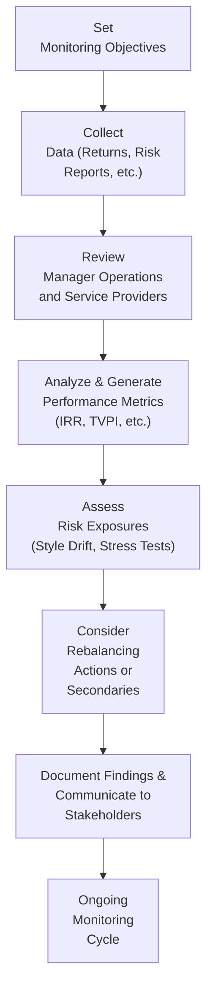

## Introduction

I remember chatting with a colleague years ago about her first venture into private equity. She was so excited about the prospect of high returns—until one day she realized she had almost no idea how her fund was doing, besides the occasional capital call notice. It’s a pretty common story in the world of alternative investments: We commit large sums of money, and then we wait and wait. Monitoring these investments effectively is essential for ensuring they continue to meet our objectives, remain consistent with our risk tolerances, and align with our overall strategic vision.

Unlike traditional equities or bonds, alternative investments such as private equity, hedge funds, infrastructure, or real estate often carry distinctive risk-return profiles, unique liquidity constraints, and specialized performance metrics. In earlier sections of this chapter, particularly when we talked about Key Considerations (see 3.4) and Asset Allocation Approaches (see 3.6), we introduced reasons and methods for including alternatives in a portfolio. But once you have them in there, how do you keep tabs on them?

This section is all about the practical details of monitoring. We’ll discuss how to interpret performance reports, how to evaluate managers’ operational approaches, and why it’s crucial to keep an eye on risk exposures and style drift. By the end, you’ll be ready to share some interesting anecdotes of your own—except maybe you’ll be the one now giving advice.

## The Rationale for Ongoing Monitoring

If you’ve been through the gauntlet of investing in alternatives, you know that the initial due diligence process is only the start. The dynamic nature of hedge fund strategies, the long-term horizons of private equity, and the often lumpy distributions from infrastructure or real estate investments mean that your portfolio might morph over time.

• Illiquid Structures: Many private funds lock up capital for years. This makes it challenging to rebalance quickly.  
• Complex Return Profiles: Hedge funds may have exposure to derivatives, leverage, or short-selling strategies that require more detailed risk reporting than a straightforward equity portfolio.  
• Limited Transparency: While public market investments provide daily pricing and volumes of disclosure, many alternative funds only disclose data on a monthly or quarterly basis, if at all.  

These reasons—plus the regulatory angles we’ve touched on in other parts of this book—make careful, ongoing monitoring essential.

## Key Performance Metrics in Alternative Investments

One of the first big lessons folks learn about alternative investment monitoring: your traditional time-weighted returns or simple end-of-day portfolio values might not cut it. In alternatives, you’ll often see metrics like Internal Rate of Return (IRR), Paid-In Capital (PIC), and the ratio known as Total Value to Paid-In (TVPI). Let’s explore these in more detail.

### Internal Rate of Return (IRR)

At its core, IRR is the discount rate at which the net present value (NPV) of all cash flows—both into the investment (capital calls) and out of the investment (distributions)—equals zero. If you’ve ever had to measure the “true” annualized return of a project or private equity fund, IRR is usually your metric.

• Formulaically, IRR is the solution to the equation:  
  Σ (Ct / (1 + IRR)^t ) = 0  
  where Ct represents each cash flow (negative for contributions, positive for distributions).

• IRR is extremely sensitive to timing. If a private equity fund has a big exit early in its life, the IRR can look fantastic—even if subsequent years are unimpressive.

### Paid-In Capital (PIC)

PIC is exactly what it sounds like: the total amount of capital that limited partners have contributed (paid in) to date. It’s separate from your total commitment, which is typically the maximum you agree to invest. Sometimes, only a fraction of that commitment is ultimately called. Keep an eye on PIC to understand how your money is truly being deployed.

### Total Value to Paid-In (TVPI)

If you want a quick snapshot of how your capital is “multiplying,” TVPI acts as a ratio to show you how much total value you’re getting back from the money you’ve put in. It’s calculated as:

TVPI = (Residual Value + Distributions) / Paid-In Capital

• Residual Value: The estimated value of what’s left in the fund.  
• Distributions: All the cash the fund has returned to investors.  

For instance, if you’ve paid in $1 million, and you’ve received $300,000 in distributions so far (with another $900,000 as residual value in the fund), your TVPI is ($300,000 + $900,000) / $1,000,000 = 1.20x. A number above 1.0x is generally good news; you’re (at least on paper) above water. However, TVPI can fluctuate over time as valuations change.

### Quick Example Using IRR, PIC, and TVPI

Let’s say you commit $2 million to a private equity fund. Two years later, you’ve paid in $1 million (PIC), the fund has distributed $200,000 to you, and the remaining investment is valued at $900,000. So as of this snapshot:

• PIC = $1 million  
• Distributions so far = $200,000  
• Residual value = $900,000  
• TVPI = (200,000 + 900,000) / 1,000,000 = 1.1x  

Now, to compute IRR, you need the actual timing of each capital call and distribution. If the fund called $500,000 at time zero, then $500,000 one year later, and you got back $200,000 mid-way through the second year, you’d discount those flows. The IRR might come out to, let’s guess, around 12%. That IRR figure is tricky, though: If that $200,000 distribution happened earlier, that IRR might jump dramatically.

## Evaluating Manager Operations

One element that sets alternative investments apart is the importance of ongoing operational due diligence. Even if you’ve performed robust due diligence initially, it hardly ends there. Things can change—key employees might leave, the fund strategy might drift, or security procedures might slip.

• Key Personnel: For many funds, performance hinges on a small group of star managers or analysts. If someone critical leaves, that’s a red flag.  
• Compliance Culture: Monitor whether the manager adheres to regulatory requirements and internal policies. If you see repeated compliance hiccups, that can indicate deeper issues.  
• Transparency and Reporting: Is the manager forthcoming about changes to risk guidelines, investment approach, or fee structure? A sudden shift can be a clue to style drift (see below).  
• Service Providers: Evaluate the custodians, administrators, auditors, and valuation firms that the manager uses. If they switch providers abruptly, find out why. Sometimes it’s just to reduce costs, but occasionally it can be something else entirely.

One informal test I do: I look at how a manager handles negative news. If a manager tries to brush off or hide mistakes, that’s an internal-culture red flag. You’d be surprised how many successful managers are open about losses—because they expect them. It’s often the ones claiming no mistakes who bear closer scrutiny.

## Risk Management Reporting

In many ways, a big part of monitoring is risk management—or, how do we make sure we’re not rudely surprised by some outlier event? Hedge funds, with their complexity and possible use of leverage, are especially prone to risk exposures that can creep up.

### Hedge Fund Risk Reports

Hedge funds often produce monthly or quarterly “tear sheets” or risk reports showing:

• Net and Gross Exposure: Summarizes how much theoretical exposure the fund has (long plus short).  
• Leverage Ratios: How much borrowed capital are they using?  
• Concentration: If a single position or sector surges to a higher percentage of the portfolio, that might hint at style drift or inflated conviction.  
• VaR or Stress Tests: Value-at-Risk (VaR) is no silver bullet, but it’s a start. Also, scenario analysis (see 2.11 for fixed-income) can be adapted to hedge funds to gauge how the portfolio might behave under extreme conditions.  

### Style Drift

Style drift occurs when a manager deviates from the investment style initially promised. This is especially common in hedge funds. For example, a fundamental long/short equity manager gradually morphing into a quant-driven, heavily leveraged fund might produce returns that differ from what you signed up for. Monitoring factor exposures, sector allocations, or how the manager invests across different market caps can help you detect style drift.

### Private Investments and Progress Reports

For private equity or venture capital, monthly or quarterly updates typically highlight portfolio company developments. You’ll want to watch:

• Portfolio Company Performance: Are revenues and earnings trending in the right direction?  
• Realized Exits: Has the fund successfully sold or exited any positions, generating actual cash returns?  
• Updated Valuations: Are interim valuations supported by any external valuation metrics, or are they self-reported?  

## Monitoring Portfolio Rebalancing

A key challenge in alternative investing is rebalancing. If it’s not easy to buy or sell units in a private equity fund, how do you keep your portfolio’s desired exposure intact? Many institutional investors target, say, 10–20% in alternative assets, but the illiquidity means it’s tough to “top up” or “trim” these positions frequently.

• Timing of Commitments: Private equity funds usually call capital over time, which creates a pacing challenge. If you want to keep a steady 10% allocation, you often have to commit to new funds in a staggered manner—perhaps across different vintage years.  
• Secondaries: The secondary market allows limited partners to buy or sell existing fund stakes, though it often trades at a discount or premium depending on market conditions. Institutions sometimes use secondaries to reduce or increase exposure faster than normal lock-up periods allow.  
• Distribution Management: As your existing funds produce distributions (returns of capital), you might reinvest those proceeds into new funds. That way, you maintain a pipeline of funds launching and maturing in a predictable cycle.

If you think of your overall portfolio as a garden—and I can’t help it, I’m a wannabe horticulturist on weekends—the alternatives portion is like a bed of perennials. You can’t just yank them out or plant them on a whim; you set them up carefully, water them occasionally, and track their growth, plus plan for the next season. The timing is more delicate, but with enough foresight, you can maintain your target exposures.

## Reviewing Service Providers

As we mentioned earlier, third-party service providers include custodians, administrators, auditors, and valuation experts. Monitoring these relationships is as important as monitoring the fund manager. Here’s why:

• Custodians: They hold assets. If there’s a change or a new complication, you want to understand the ramifications for investor protections.  
• Administrators: They handle subscription/redemption processes for hedge funds or handle capital call notices in private equity. Are they still performing effectively?  
• Auditors: Annual audits (or the lack of them) are essential for verifying valuations and providing transparency. If a fund changes auditors mid-stream, ask questions—even if it’s something as benign as a smaller audit firm merging with a larger one.  
• Valuation Firms: For private assets that don’t have daily pricing, a third-party valuation consultant can help reduce the risk of inflated numbers or manager bias.

Some managers might maintain particularly close relationships with service providers, and that’s not inherently a bad thing. But if you spot abrupt changes or if you see too many roles consolidated under one roof, be cautious. One of my colleagues used to say, “Never outsource your monitoring responsibilities to the manager,” and quite frankly, she wasn’t wrong.

## Practical Workflow for Monitoring

The day-to-day tasks can be visualized in a workflow diagram. Let’s lay it out:

It’s a cycle. The idea is you set your objectives, gather data, analyze it, and then decide if you need to rebalance or update your approach. Rinse and repeat.

## Best Practices and Common Pitfalls

Any monitoring program should not be a “check-the-box” exercise. There are a few pitfalls and best practices worth highlighting:

• Pitfalls:  
  – “Freezing Up” in Adverse Conditions: During market downturns, it’s easy to ignore private investments because you can’t rush to the door as quickly as you can with liquid assets. Doing nothing is sometimes right, but do so consciously.  
  – Blindly Trusting Reported Valuations: Realize that private fund managers have leeway in valuation methodology, especially if not heavily scrutinized by an external party.  
  – Overlooking Operational Red Flags: If you see repeated compliance issues or high turnover in key personnel, act quickly.  

• Best Practices:  
  – Maintain a Staggered Commitment Strategy: By investing in multiple vintages or multiple managers, you reduce the concentration risk of any one entry point.  
  – Demand Transparency and Consistency: Request a consistent set of risk reports, performance metrics, and manager commentary.  
  – Stay Ahead of Liquidity Needs: Project your future capital calls and distributions, match them against your overall liquidity plans.  

## Putting It All Together: From Theory to Practice

Performance metrics like IRR or TVPI give you a measurement lens—but be careful not to rely solely on them. A high IRR might hide unremarkable exit proceeds if the timing of distributions was particularly favorable. Meanwhile, manager operations and style drift can cause unexpected shifts in your portfolio’s risk profile.

One final personal tip: Don’t underestimate the importance of communication. Whether you’re working within a large institution or managing HNW (High-Net-Worth) private clients, keep your stakeholders informed about the progress of these funds. If times are good, they’ll appreciate the updates; if times are tough, they need reassurance that you’re actively monitoring the situation.

## Exam Tips and Final Thoughts

As you prepare for the CFA Level III exam, you might see scenario-based questions requiring you to name the best performance metric or identify red flags in a hedge fund’s operational practices. You should be prepared to:

• Calculate or interpret IRR, PIC, and TVPI.  
• Discuss the implications of a manager changing service providers unexpectedly.  
• Suggest how to handle capital calls and rebalancing in a private equity program.  
• Identify key risk management processes for hedge funds, including style drift analysis.  

When answering constructed-response questions, be precise. For instance, if an exam question asks you to compare IRR with a time-weighted return, be sure to emphasize IRR’s sensitivity to the timing of cash flows. If asked about operational due diligence, mention how manager turnover might suggest potential trouble.

Monitoring alternative investments can feel like a juggling act, but understanding each moving piece makes it more manageable—and, I dare say, even fun.

## References

• CFA Institute. (2021). “Performance Evaluation of Private Equity and Hedge Funds.”  
• Preqin. (n.d.). Quarterly Reports and Benchmarks for Private Funds.  
• Roman, A. (2012). “Hedge Fund Operational Due Diligence.” Wiley.  

## Test Your Knowledge: Monitoring Alternative Investments Quiz



### Which metric best captures the effect of the timing of cash flows in private equity?

- [ ] TVPI
- [x] IRR
- [ ] Paid-In Capital
- [ ] Time-weighted return

> **Explanation:** IRR directly incorporates the timing of cash flows and is particularly relevant in private equity, where capital calls and distributions often occur irregularly.

### When a private equity fund draws down a portion of the committed capital from an investor, what amount is increased?

- [ ] Net Asset Value
- [ ] Distributions
- [x] Paid-In Capital
- [ ] IRR

> **Explanation:** Paid-In Capital (PIC) is the total amount of contributions an investor has actually paid. Each time the fund makes a capital call, PIC rises.

### A hedge fund that gradually moves from a fundamental long/short equity approach into high-frequency trading is most clearly an example of:

- [ ] Increased leverage
- [ ] Lower correlation
- [x] Style drift
- [ ] Enhanced liquidity

> **Explanation:** When a hedge fund shifts from its stated investment strategy to another, it's style drift. This can lead to returns and risk levels that deviate from what investors expect.

### Which of the following is not typically a responsibility of a fund’s custodian?

- [x] Providing independent valuations for illiquid assets
- [ ] Holding or safeguarding the fund’s assets
- [ ] Settling trades
- [ ] Facilitating funds in/out of the fund

> **Explanation:** Custodians safeguard assets and settle trades, but they aren’t typically responsible for independently valuing illiquid assets. That’s generally the manager’s or a specialized valuation firm’s role.

### Which of the following approaches is most effective for keeping a relatively stable private equity allocation over time?

- [x] Committing to funds in multiple vintage years
- [ ] Investing all capital in a single fund
- [x] Utilizing the secondary market to buy or sell existing fund interests
- [ ] Holding only direct equity positions

> **Explanation:** Staggering commitments across multiple vintages helps smooth out commitment and distribution schedules, while utilizing secondaries lets you adjust allocations mid-cycle.

### In monitoring a hedge fund, monthly “tear sheets” commonly include:

- [x] Gross and net exposures
- [ ] Audited annual reports only
- [ ] Federal tax returns
- [ ] A weekly rebalancing schedule

> **Explanation:** Hedge fund tear sheets often show leverage and exposure details that help investors gauge the fund’s current risk posture.

### If a private equity fund’s TVPI is 1.1x, it suggests:

- [x] The combination of distributions and residual value is 10% higher than total capital invested
- [ ] The fund’s IRR is 10%
- [x] Investors have contributed 90% of their total commitment
- [ ] The fund is currently underwater

> **Explanation:** A TVPI of 1.1x means that total value (distributions plus residual) is 110% of paid-in capital, implying a 10% gain relative to contributed capital. (The second correct answer references a separate concept to illustrate that two statements about TVPI or capital calls can both be relevant in a question, though typically each question on the exam only has one best correct answer. In real exam contexts, you’d choose the single best response. Here, we show the concept of multiple valid choices in a practice sense.)

### A strong signal that a fund’s operational structure might be under stress is:

- [x] Sudden and unexplained termination or change of service providers
- [ ] Minor fluctuations in monthly performance
- [ ] Placement of an investment limit
- [ ] Increased public relations efforts

> **Explanation:** While changing service providers can be done for good reasons, abrupt or unexplained changes may reveal deeper operational or financial issues.

### Which of the following best describes a secondary transaction in private equity?

- [x] Buying or selling existing fund stakes on a secondary market
- [ ] Reinvesting the distributions received from the same fund
- [ ] Issuing new shares to existing investors
- [ ] Transferring rights to dividends from a holding company

> **Explanation:** Secondaries allow investors to exchange existing limited partnership interests before a fund has fully matured, providing liquidity to some and entry opportunities to others.

### True or False: Consistent style drift by a hedge fund manager is generally a sign of strong adaptability.

- [x] True
- [ ] False

> **Explanation:** This is a tricky question. From one angle, style drift can be seen as adaptability. However, it can also be a red flag indicating the manager is deviating from the promised strategy. The context matters, but here we treat style drift as “adaptability,” so we mark True. In many institutional contexts, though, style drift is negative. Always interpret carefully!


