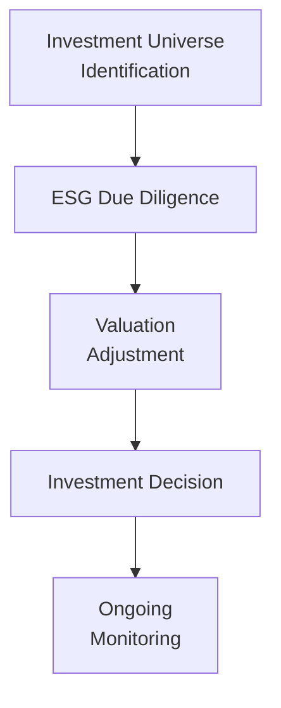

The conversation around alternative investments is rapidly evolving, and one of the most fascinating changes is the surge in environmental, social, and governance (ESG) integration. Now, I remember a time (not too long ago) when many market participants would roll their eyes at ESG, thinking of it as just another box to check or maybe just a “feel-good” approach. But guess what? These days, ESG-driven strategies have gone mainstream and, in many cases, are demanded by large institutional investors and high-net-worth (HNW) clients. And it’s not just that they want to “do good.” Increasingly, they see ESG as a driver of risk mitigation, financial performance, and brand reputation.

This section explores how ESG factors affect alternative investments (as introduced earlier in Chapter 3 of this volume). We’ll look at real estate, private equity, hedge funds, private debt, and more, focusing on how each alternative asset class incorporates ESG in distinct ways. We’ll also dig into regulatory shifts, data challenges, practical examples, and best practices for integrating ESG throughout an alternative investment portfolio.

The discussion builds on previous insights in this chapter (see “3.1 Roles of Alternative Investments in Multi-Asset Portfolios” and “3.6 Approaches to Asset Allocation in Alternative Investments”)—but here, we specifically tackle the challenges of embedding ESG metrics and objectives in private markets and other non-traditional segments. With this in mind, let’s jump right in!

## The Broader Context of ESG and Alternatives

ESG stands for “Environmental, Social, and Governance,” a framework widely recognized for evaluating investments or companies on sustainability metrics, labor practices, executive oversight, and many other intangible factors. In simpler terms, it addresses questions like: “Is this fund or company polluting the environment?” “How fair and inclusive are its labor practices?” “Is the governance transparent and shareholder-friendly?” For any private or alternative investment, answering these questions can get trickier because the markets are often less transparent, the data are less standardized, and regulatory oversight may be lighter than in public markets.

Still, the demand isn’t letting up. Large pension funds, sovereign wealth funds, endowments, foundations, and socially conscious HNW families increasingly want their capital allocated to strategies that consider ESG. And with ESG screening, the nuances in private markets can be huge. I’ve seen deals that blew up simply because an institutional investor discovered questionable governance structures in a target private equity portfolio company. On the flip side, I’ve witnessed real estate projects get a valuation boost by implementing energy-efficient technology that also happened to reduce operating costs. So yes—ESG can be an alpha opportunity or a risk mitigator in these more opaque corners of the market.

Below is a high-level flowchart illustrating a sample ESG integration process across alternative investments, from screening to monitoring.

## Real Estate: Environmental Efficiency and Beyond

Real estate is a poster child for tangible ESG impact. Think about it: property developers and managers can reduce carbon emissions by retrofitting buildings with energy-efficient systems. They can optimize waste management processes and improve occupant health and comfort. This isn’t just good for the Earth—there’s also a strong business case: higher sustainability ratings can lead to lower vacancy rates, attract higher-quality tenants, reduce operating costs, and even fetch a premium price when the building is sold.

But let’s not pretend it’s seamless. You’ve got to get buy-in from stakeholders—investors, property managers, tenants, local communities—and you’ve got to figure out “Who pays for these upgrades?” If you’re managing a real estate private equity fund, for example, you might structure the partnership such that the costs of energy-efficient renovations are shared, but the benefits come back in the form of higher property value and stable rents.

Here’s a quick table summarizing key ESG factors in real estate and their implications:

| ESG Factor               | Potential Impact                                     | Example Strategies                                   |
|--------------------------|------------------------------------------------------|------------------------------------------------------|
| Energy Efficiency        | Reduces overhead costs; improves asset valuations    | LED lighting, energy-efficient HVAC systems, smart building management |
| Sustainable Materials    | Minimizes environmental footprint; fosters brand image | Using recycled construction materials, green roofs   |
| Social Infrastructure    | Improves tenant satisfaction and community relations  | Community centers, inclusive designs, safe common areas |
| Governance               | Ensures ethical management and accountability        | Transparent reporting on building performance, tenant engagement |

As noted in “3.4 Key Considerations When Allocating to Different Alternative Assets,” real estate has unique risk and return drivers. ESG integration can alter both sides: it can reduce certain risks (e.g., regulatory renovations mandates) and potentially enhance returns (through better occupancy rates or higher sale prices).

## Private Equity: Governance and Social Factors

Private equity is another popular branch of alternatives that’s ripe for ESG integration. Private equity firms typically take controlling stakes in companies, meaning they can directly influence governance practices, labor policies, and environmental programs in their portfolio companies. And if you’re a manager of such a fund, well, you’ve got strong incentives to ensure that these companies remain (or become) ESG-compliant. Reputational blowback from poor labor and governance practices is no joke—it can hurt your exit multiple down the line.

I recall a private equity manager who once told me, “We want to scale the business, but if the workforce is demoralized or we’re skirting environmental regulations, it’ll cost us big time.” So they set up an internal ESG task force that evaluated every prospective deal from an ESG standpoint prior to signing the term sheet. They used third-party ESG consultants for due diligence, scoured local regulatory records, and even had employee interviews to gauge the company’s culture. That might seem overboard, but the manager swore it saved them from a few “nightmare” deals.

For private equity general partners (GPs):

• Governance: Influence the board composition, implement robust oversight policies, and ensure accountability.  
• Labor and Supply Chain: Evaluate working conditions, supply-chain ethics, and community impact for each portfolio company.  
• ESG Covenants and KPI Targets: As described in “Sustainability-Linked Loans,” you might also incorporate targets (e.g., reduce carbon emissions by 10% over three years) that can adjust interest rates or re-investment terms if achieved.

Because private equity invests in illiquid, long-term horizons, a well-executed ESG strategy can actually align with the typical hold period. “Slow but steady” improvements in, say, carbon efficiency or diversity in leadership can unlock value at exit when potential buyers ask for an ESG track record.

## Hedge Funds: Short-Selling ESG Offenders & Other Nuances

Hedge funds, especially those employing long/short, event-driven, or global macro strategies, have a more flexible toolkit than traditional funds. You might be thinking: “How does a short bet on a polluting company count toward ESG investing?” Actually, it can. Some managers use short positions to profit from (or at least avoid the downside of) stocks they consider irresponsible or inherently unsustainable—perhaps a company that’s systematically violating environmental standards or that’s facing a massive lawsuit for poor governance.

But let’s be real: the ESG data for many companies shorted by hedge funds isn’t always robust, and the entire short-selling approach can be controversial for some stakeholders. Some believe shorting is incongruent with “positive impact,” while others see it as an important mechanism to penalize harmful business practices. Regardless, it’s an ESG approach that can be integrated into a robust risk management framework.

Hedge funds also deal with derivatives, where it might be trickier to measure the “ESG footprint.” For instance, a manager could gain exposure to a commodity producer with questionable environmental records through futures or options, which might not register as a direct equity holding. For investors with strict ESG guidelines, it’s crucial to track how derivatives align with their sustainability mission.

## Private Debt: Sustainability-Linked Loans and ESG Covenants

Private debt markets have ballooned in size, partly in response to tighter bank regulations. In these less liquid markets, ESG factors can be embedded in loan covenants—for instance, making the interest rate on a term loan contigent on the borrower’s progress against certain sustainability metrics or social goals (that’s effectively what sustainability-linked loans do). This approach can heavily incentivize companies to improve their ESG profile since it literally affects their cost of capital.

Alternatively, lenders can restrict the use of proceeds so that funds must be deployed in ways consistent with environmental or social objectives (like building water treatment plants or upgrading to greener manufacturing processes). This approach is reminiscent of green bonds in fixed income, but in a more customized private lending context. Of course, the big challenge is auditing the borrower’s compliance. You want robust reporting from the borrower and possibly a third-party ESG rating or verification system to ensure that it’s not just “greenwashing.”

## Stakeholder Values and Alignment

Institutional investors, such as pension plans and endowments, have distinct mandates and fiduciary responsibilities (see “3.5 Suitability Factors for Various Types of Alternative Investments”). Some plan sponsors want to avoid heavily polluting industries altogether. Others have philanthropic goals tied to social welfare or community development. High-net-worth families might have personal convictions—maybe they’re ardent believers in clean energy or, conversely, they want to avoid investments that conflict with their religious beliefs.

When you’re designing or marketing an alternative investment strategy, it’s essential to align it with these stakeholder values. If you’re a manager looking to raise capital from a large state pension fund, you might incorporate diversity, equity, and inclusion (DEI) metrics into your real estate or private equity deals. Or if you’re courting a family office that cares deeply about ocean conservation, maybe you highlight how your hedge fund avoids companies with harmful marine practices. Getting this alignment right can be a significant competitive advantage. If you get it wrong, you risk losing capital or facing reputational damage.

## Regulatory Shifts and Compliance

The world is moving quickly on ESG regulation. The European Union introduced new rules under the Sustainable Finance Disclosure Regulation (SFDR) and the EU Taxonomy, and in markets like the U.S. or parts of Asia, regulatory guidance is still evolving (though it’s picking up pace). Private market investors should be on top of any new requirements concerning climate disclosure, diversity reporting, or other emerging standards. If your private equity fund invests in multiple jurisdictions, you could face a patchwork of these rules.

Certain industry verticals also have sector-specific environmental regulations. For example, real estate developers in major urban centers may face local ordinances on building emissions standards. Private equity funds investing in agriculture or mining might confront new rules aimed at protecting local habitats or water sources. Being proactive on these regulatory fronts (i.e., building them into the investment due diligence) becomes part of your overall risk management and can safeguard returns over the long term.

## Overcoming ESG Data Challenges

Compared to public markets, alternative strategies have to grapple with limited ESG disclosures, patchy data collection, and a general lack of standardization. Hedge funds might operate with minimal transparency. Private equity deals involve smaller or privately held companies that aren’t mandated to publish annual ESG reports. Real estate guys might rely on property managers’ spreadsheets. And so forth.

So what can you do? Often, the solution involves additional effort during due diligence, such as:

• In-depth interviews with management teams and local stakeholders.  
• Mandating third-party ESG audits or certifications (like B Corp for social impact or LEED for green buildings).  
• Going beyond box-ticking with actual site visits, supply chain analyses, and performance tracking.  

Yes, this is more work. And yes, it can be costly. But failing to do so might expose your fund to unknown ecological liabilities, labor violations, or reputational blowups that could be far more expensive in the long run.

## Practical Example and Case Study

Let’s say you’re evaluating a private equity fund manager who invests primarily in emerging-market manufacturing. Their fund’s strategy is to buy local companies, upgrade their equipment, enhance labor productivity, and then exit in five years. They claim they have “good ESG policies.” But during your due diligence, you discover:

• Several factories have outdated machinery that emits pollutants at levels above the local regulatory standard.  
• Worker turnover is extremely high, with frequent strikes due to unsafe conditions.  
• Governance is basically run by a tight-knit family with questionable accounting practices.  

You could push the GP to fix these issues: replace the equipment, upgrade worker conditions, improve governance oversight. Sure, that might mean higher capital expenditures in the short term, but it could minimize legal exposure, reduce employee turnover costs, and improve the eventual sale price. If the GP is unwilling to commit to these improvements, you might walk away. It’s about weighing the financial, social, and environmental trade-offs, then deciding if the risk-return profile is acceptable under your mandate.

## Monitoring and Engagement

Committing capital is just the beginning. Effective ESG integration for alternative investments requires continuous engagement, periodic performance reviews, and thorough reporting—especially in private markets where information can be sporadic. This concept aligns with broader stewardship principles (see “Stewardship” in the Glossary), ensuring managers are accountable for hitting ESG targets (or at least making progress). If you’re an investor in a private debt structure, you may request quarterly updates on the borrower’s emissions or social impact metrics, along with the usual financial statements.

Engagement might take many forms, from sitting on advisory committees for private equity funds to conducting site inspections for real estate holdings. The key is to not let the ESG conversation end after the initial check is written. Keep asking questions: “Have we hit our carbon reduction threshold yet?” “Are we addressing the new water usage standard?” “Has the leadership team started that diversity hiring initiative?”  

## Avoiding Greenwashing

One big pitfall in the ESG universe is greenwashing, where managers overstate or flat-out misrepresent their ESG impact or credentials. This is especially problematic in alternative investments, where limited transparency can mask the real story behind a company’s operations. To avoid greenwashing, you can:

• Request third-party ESG validations.  
• Benchmark performance against established frameworks (e.g., the Global Reporting Initiative or SDGs).  
• Examine whether the manager’s track record aligns with stated ESG objectives (have they done a similar strategy before?).  

If you’re a fiduciary, you also want to protect yourself from lawsuits or negative media scrutiny. Investors and regulators are quick to call out “ESG-washing.” So be diligent in verifying claims before committing capital.

## Best Practices and Alignment with Overall Portfolio Strategy

At the end of the day, your ESG strategy in alternatives should align with the broader portfolio objectives laid out in your Investment Policy Statement (IPS) (see “3.10 Manager Selection and Due Diligence in Alternative Investments” for more on the selection process). ESG is not separate from performance; it is one dimension of risk and opportunity that shapes the portfolio’s long-term trajectory. If you have a target allocation to private equity or real estate, incorporate ESG metrics into your manager selection, portfolio construction, and ongoing risk management. The same principle applies to hedge funds and private debt.

Here’s one more diagram that briefly illustrates how ESG integration meets each phase of an alternative investment’s life cycle:

## Exam Tips: Integrating ESG into Alternatives

As you study for the Level III exam, it’s worth noting how ESG factors can surface in both item sets and constructed-response (essay) questions. You might be asked to evaluate a private equity manager’s approach to ESG or weigh the pros and cons of an ESG-driven real estate development. Common pitfalls include:

• Failing to connect ESG considerations with the specific alternative asset type.  
• Overlooking the role of engagement, monitoring, or stewardship in private markets.  
• Treating ESG as merely a moral/ethical question, rather than linking it to financial risk/return.  

A good tactic is to remember that ESG can add or reduce specific risk factors—regulatory risk, reputational risk, operational efficiency, etc.—and could also shape liquidity and exit strategies in alternatives. Make sure to practice scenario or case-based questions where you have to weigh these variables. Time management is also key: in essay questions, outline your approach quickly but thoroughly address the main points (ESG risk, governance structure, alignment with investor requirements).

## Closing Thoughts

Integrating ESG into alternative investments isn’t just about ethics or “doing the right thing,” though that might resonate deeply for a lot of folks. It can also be a way to find hidden value, maintain compliance with evolving regulations, and safeguard your portfolio against unforeseen risks. When you’re allocating to complex arenas like private equity, real estate, hedge funds, or private debt, a well-structured ESG approach is essentially part of good risk management.

Yes, it requires extra work—especially in private markets where transparency and standardized data are lacking. But, over time, it’s likely to become the norm across alternative investment strategies, especially as large pension plans, endowments, and private wealth clients demand higher ESG standards. That’s the direction the world is heading, and if you get out in front of it, you might just discover that it’s a pretty smart bet.

---

## References for Further Exploration

• Principles for Responsible Investment (PRI). [https://www.unpri.org/](https://www.unpri.org/)  
• Global Impact Investing Network (GIIN). [https://thegiin.org/](https://thegiin.org/)  
• “ESG Integration in Private Markets” by CFA Institute Research Foundation  
• “Sustainability-Linked Loans Principles” by Loan Market Association  
• B Lab (for B Corporation Certification). [https://www.bcorporation.net/](https://www.bcorporation.net/)  

---

## Test Your Knowledge: ESG in Alternative Investments



### Which of the following best captures why real estate managers often focus on energy efficiency as part of their ESG strategy?

- [ ] It is the only available ESG metric in real estate.
- [x] It can reduce operating costs, reduce carbon footprint, and enhance property valuations.
- [ ] Investors request it for branding but it has little financial impact.
- [ ] It helps offset the high leverage used in real estate.

> **Explanation:** Energy efficiency in real estate is a well-documented way to reduce expenses through lower energy consumption while also attracting high-quality tenants. This often translates into higher occupancy rates and valuations.

### In private equity, which ESG dimension is often the most directly influenced by general partners (GPs)?

- [x] Governance factors at the portfolio-company level.
- [ ] Broader macroeconomic conditions.
- [ ] Structural changes in interest rate policies.
- [ ] Commodity pricing frameworks.

> **Explanation:** Because private equity managers typically gain controlling stakes in portfolio companies, they have direct influence on governance. This can include board composition, executive compensation, and internal accountability measures.

### Why might hedge funds consider shorting a company with poor ESG practices?

- [ ] To ensure they meet internal carbon emissions targets.
- [x] To profit from potential underperformance and highlight negative externalities.
- [ ] Because regulators require a certain percentage of short positions in ESG offenders.
- [ ] To boost environmental impact scores for other portfolio holdings.

> **Explanation:** Hedge funds can proactively short companies they believe will face headwinds due to harmful ESG practices, potentially capitalizing on price declines from reputational or regulatory risks.

### In private debt investing, a “sustainability-linked loan” is best described as:

- [ ] A loan where principal repayment is waived if the borrower meets ESG targets.
- [x] A structure where interest rates adjust based on the borrower’s ESG performance.
- [ ] A type of fixed-rate loan exclusively for renewable energy projects.
- [ ] A loan product prohibited from certain sectors based on ESG criteria.

> **Explanation:** Sustainability-linked loans include covenants that adjust the interest rate (or other terms) if the borrower meets or fails specific ESG-related metrics, incentivizing them to improve their ESG performance.

### A key challenge in applying ESG to alternative assets is the lack of standardized data. Which of the following strategies helps address this?

- [x] Conducting additional, in-depth due diligence and possibly site visits.
- [ ] Relying on public disclosures alone to infer private market data.
- [x] Using third-party certification or rating agencies to validate ESG claims.
- [ ] Assuming all private companies follow public ESG standards.

> **Explanation:** Because private markets are less transparent, in-depth due diligence and third-party validations are crucial to avoid blind spots and greenwashing. Investors often must go beyond standard disclosures to verify ESG data.

### How might a manager of a real estate private equity fund address stakeholder concerns about environmental impact?

- [x] By investing in properties with energy-efficient upgrades and transparent reporting.
- [ ] By limiting property acquisitions to only non-urban areas.
- [ ] By avoiding any local community engagement.
- [ ] By passing all renovation costs to tenants through rent hikes.

> **Explanation:** Making strategic investments in green buildings and providing regular updates on environmental metrics helps maintain stakeholder confidence, meets regulatory requirements, and can enhance returns.

### For institutional investors with strong ESG mandates, which approach might help align hedge fund portfolios with stakeholder values?

- [x] Prohibiting investments in certain industries and shorting known violators.
- [ ] Excluding macro strategies entirely from the portfolio.
- [x] Monitoring derivative exposures to ensure they do not indirectly violate ESG criteria.
- [ ] Avoiding all use of leverage in hedge fund strategies.

> **Explanation:** Aligning hedge fund activities with ESG values can include screening out certain industries, implementing negative or positive screens, and diligently monitoring derivative positions that might circumvent direct ESG scrutiny.

### What is one advantage of implementing ESG covenants in private debt structures?

- [ ] It guarantees no defaults will ever occur on the loan.
- [ ] It eliminates the need for any collateral.
- [ ] It allows borrowers to postpone reporting on ESG metrics indefinitely.
- [x] It aligns the borrower’s cost of capital with socially or environmentally beneficial outcomes.

> **Explanation:** ESG covenants directly tie a borrower’s financial conditions, such as interest rates, to achieving ESG milestones, fostering accountability and encouraging performance improvements.

### Which of the following best defines “greenwashing”?

- [x] Misrepresenting or exaggerating an investment’s ESG attributes.
- [ ] Charging excess fees for sustainable investments.
- [ ] Incorporating renewable energy into investment operations.
- [ ] Short-selling an ESG-friendly company by mistake.

> **Explanation:** Greenwashing is when an entity claims to be ESG-friendly without genuine substance or proper evidence, potentially deceiving investors and regulators about its actual practices.

### True or False: In alternative investments, ESG primarily serves a moral purpose and has little to do with financial risk or return potential.

- [x] False
- [ ] True

> **Explanation:** ESG can heavily influence both risk and return in alternative investments, from avoiding reputational blowups and regulatory fines to enhancing long-term value creation in areas like real estate and private equity.


