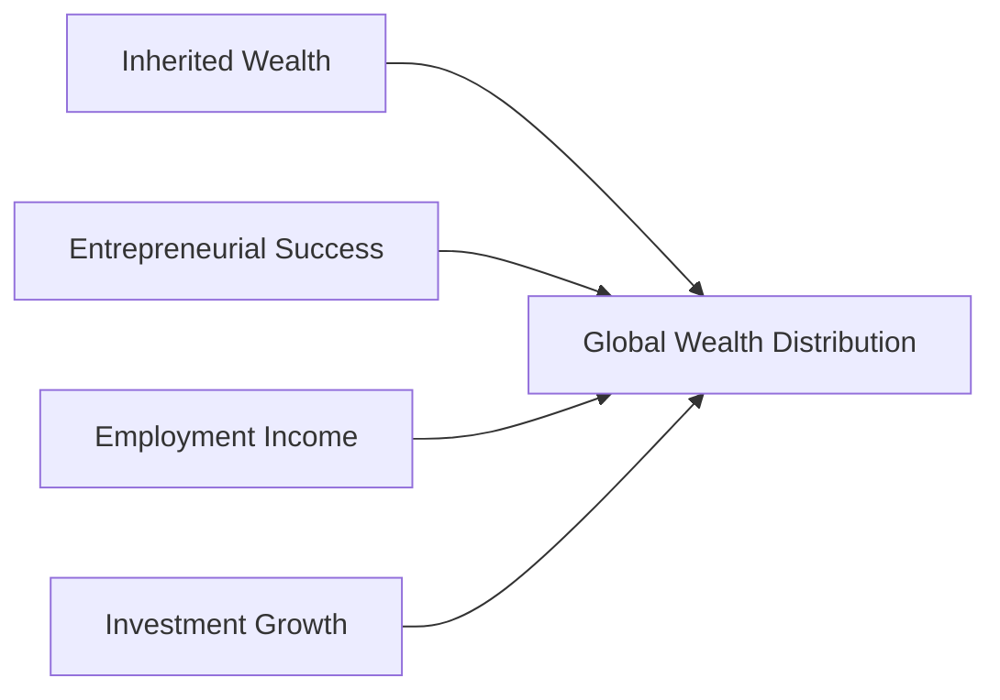

## Introduction and Relevance

I once met an entrepreneur—let’s call her Marina—who turned her small tutoring gig into a multinational education platform. She was filled with excitement about her success, but also questions on how to manage the wealth she had built. Meanwhile, I recall another client, Alex, who inherited a significant estate but seemed more risk-averse and cautious about preserving family traditions.  

These two individuals highlight how wealth can come from vastly different sources—entrepreneurship vs. inheritance—and how those sources shape attitudes toward risk, time horizons, and ultimately portfolio construction. This is exactly what we’ll explore here: the main ways individuals build wealth, how that wealth is distributed around the globe, and why those patterns matter in private wealth management.

## Key Drivers of Individual Wealth

### Inheritance
Inherited wealth involves the transfer of assets—often property, businesses, or investment portfolios—from one generation to another. Historically, families in certain regions have built legacies over centuries, passing large estates along lines of succession. Recipients of inherited wealth may show a greater emphasis on capital preservation and a more conservative outlook toward risk, partly because they feel a sense of stewardship over assets with family history. However, taxes and legal structures (especially estate or gift taxes) can significantly reduce the actual value that transfers.

• Attitude Toward Risk: Often lower, with a strong focus on capital preservation.  
• Liquidity: Depending on the assets passed down, inherited wealth sometimes includes real estate or private business stakes, which can be illiquid.  
• Estate and Gift Taxes: Critical determinants of how much actually transfers across generations.

### Entrepreneurship and Business Ownership
Entrepreneurial wealth stems from founding, owning, or having an equity stake in private or public enterprises. You’ve probably read headlines about tech startups achieving unicorn status overnight—sometimes that’s how new billionaires emerge. But for every success story, there are countless ventures that fail. When it works, though, entrepreneurial wealth can be substantial, often taking the form of concentrated positions in the entrepreneur’s own business.

• Attitude Toward Risk: Can be higher during the wealth creation phase; entrepreneurs are generally comfortable taking strategic risks but can become more conservative once liquidity events occur.  
• Concentrated Positions: Large holdings in a single corporation or industry can expose investors to idiosyncratic risk.  
• Liquidity Events: IPOs, mergers, or acquisitions can convert illiquid stakes into more readily deployable capital.

### Employment Compensation
Steady salaries, bonuses, and equity compensation from full-time employment remain a top source of wealth accumulation for many individuals. Equity compensation (e.g., restricted stock units, employee stock options) may lead to large concentrated positions if the employer’s stock performs well.

• Attitude Toward Risk: Typically moderate, because these individuals rely on their jobs for stable income.  
• Liquidity: Stock options and restricted shares are often subject to vesting periods, affecting short-term access to funds.  

### Investment Growth
Some individuals systematically build wealth simply by investing part of their paycheck. Over time, compounding can be extraordinarily powerful. Think about recurring investments into diversified mutual funds or exchange-traded funds (ETFs). Even moderate returns, when reinvested over 20 to 30 years, can generate impressive portfolio balances.

• Attitude Toward Risk: Varies widely; individuals with long time horizons might pursue higher-return equity strategies.  
• Liquidity: Typically high, as publicly traded assets can be divested fairly quickly.  

### Government Policies and Macro Factors
External forces—don’t forget them. Tax incentives, retirement plan structures, credits for certain industries, and the prevailing interest rate environment can effectively boost or hamper wealth accumulation. In countries that incentivize home ownership, you’ll often see real estate as a major part of families’ net worth. Meanwhile, robust entrepreneurial ecosystems (like certain Silicon Valley–like tech hubs) can see waves of startup-based wealth creation.

## Global Distribution of Wealth

### Overview of Global Wealth Inequality
Wealth distribution around the globe is far from uniform. On a macro scale, we often talk about developed vs. emerging markets, but even within countries, wealth can be extremely polarized.

One commonly used measure for inequality is the Gini coefficient, where 0 represents perfect equality and 1 represents maximum inequality. Nations with lower Gini coefficients (e.g., some European countries) typically exhibit broad-based middle-class wealth, while high coefficients (often seen in emerging or resource-rich nations) imply stark disparities between the ultra-wealthy and those with few assets.

### Role of Geographical, Cultural, and Institutional Factors
• Geographical: Countries endowed with natural resources may see “resource-based fortunes” dominate wealth creation. Coastal regions with thriving ports may develop robust trading or technology hubs.  
• Cultural: Societies that place a high value on entrepreneurship might spawn more self-made millionaires, while collectivist cultures might support broader workforce participation but see fewer outliers.  
• Institutional Infrastructure: Stable property rights, transparent legal systems, and well-regulated banking sectors foster wealth formation. Conversely, corruption or political instability can hinder it.

Here’s a simple illustration of how different sources of wealth feed into the broader concept of global wealth distribution:

Each node leading toward global wealth distribution underscores that individuals from diverse backgrounds—some with inherited capital, others driven by entrepreneurship, or simply building over time through investments—collectively shape the broad global picture.

### Concentrated vs. Dispersed Wealth
A defining aspect of global distribution is how concentrated wealth is in different regions or socioeconomic groups. In certain fast-growing economies, a handful of families may control substantial corporate assets. By contrast, some developed markets show wider share ownership through pension funds or national investment schemes, making wealth relatively more distributed.  

## Implications for Private Wealth Management

### Aligning Investment Strategies with Wealth Source
The origin of a client’s wealth offers clues about their financial priorities and risk tolerance. If an individual’s wealth was created through a successful business exit (entrepreneurial wealth), they might be more persistent in spotting higher-risk opportunities but still need strategies to manage concentrated equity. Conversely, an inheritor might be more sensitive to preserving family legacy and ensuring capital sustainability across multiple generations.

### Liquidity Profiles and Time Horizons
• Highly Liquid Sources: Stock options or cash proceeds from an IPO can be rapidly deployed across a wide range of assets. These clients often have more flexibility in rebalancing or tactical asset allocation.  
• Less Liquid Assets: Ownership interests in a private company or real estate make reallocation more constrained. Time horizons become longer, and planning must account for lock-up periods or physical property dispositions.

### Government Policies and Taxation
Tax policies absolutely matter. From estate taxes affecting inherited wealth to capital gains rates on entrepreneurial liquidity events, government policies can drastically alter net proceeds and shape investment decisions. A critical step in planning is to evaluate how local regulations and international tax treaties (if assets or individuals are globally diverse) will influence the net returns of various strategies.

### Globalization, Technology, and Cross-Border Investing
Rapid globalization means investors are no longer confined to their home markets. Technology platforms make it easier to access exotic opportunities, hedge currency exposures, and diversify internationally. However, cross-border investing entails compliance with multiple regulatory frameworks, exchange controls, and political risks. High-net-worth individuals with global footprints need an integrated approach that balances local and offshore strategies.

## Best Practices and Common Pitfalls

• Don’t Overlook Concentration Risk: Founders or key employees often don’t realize just how exposed they are to a single company’s fortunes.  
• Estate Planning Delays: Inheritors or those expecting to pass on wealth sometimes put off complex legal structures, raising the family’s tax or governance challenges.  
• Not Factoring In Macroeconomic Shifts: Relying too heavily on past returns in an environment with drastically changing interest rates or global trade policies can lead to misguided allocations.  
• Underestimating Liquidity Constraints: Realizing that selling illiquid assets may take months or years can be crucial in meeting near-term liabilities.

## Practical Examples and Case Studies

• Example 1: A 50-year-old client with 70% of her wealth in the family business. The limited ability to sell shares quickly means a major restructuring if she wants to diversify. A staged approach—maybe selling a small stake to a private equity firm—can help rebalance risk.  
• Example 2: A newly minted tech millionaire who holds a large chunk of restricted stock in a public company. He might work with a wealth advisor to implement a covered call strategy or share-sale schedule, providing liquidity and risk management.  
• Example 3: A family with real estate holdings across multiple continents. They must juggle multiple tax jurisdictions, property management issues, currency fluctuations, and local economic cycles.  

## Diagram of Private Wealth Management Considerations

Below is a simplified flow diagram showing major considerations for private wealth managers when evaluating a client’s wealth origin and distribution strategy:

• Start by analyzing how the wealth was accumulated.  
• Understand risk tolerance and time horizons.  
• Design an appropriate portfolio.  
• Work within existing or newly established tax/legal frameworks.  
• Address ongoing liquidity needs and future succession matters.

## Exam Relevance

For the CFA® Level III exam, expect that the Private Wealth Management section will require you to:  
• Identify how differences in wealth origins influence client objectives and risk profiles.  
• Evaluate concentrated positions and propose diversification methods.  
• Integrate tax considerations into portfolio recommendations.  
• Formulate or critique an Investment Policy Statement (IPS) for a private client with unique liquidity constraints, estate-planning considerations, or specific philanthropic goals.  

Given the emphasis on scenario-based learning, practice constructing thorough answers that connect a client’s background (e.g., inherited vs. self-made wealth) to recommended portfolio adjustments, risk tolerance calibrations, and planning horizons.

## Final Exam Tips

• Link Wealth Source to Client Behavior: In practice essay questions, show an awareness that the “why” of wealth accumulation often explains your “how” in structuring the portfolio.  
• Be Specific About Risk Profiles: Distinguish between employees with equity plans, founders with private shares, or inheritors with multi-generational family business holdings.  
• Master Private Wealth Tools: Understand each strategy’s potential tax, legal, and liquidity aspects.  
• Time Management: In the exam’s constructed-response questions, focus on systematically hitting each required point—sources of wealth, risk tolerance, constraints, recommended adjustments—before your time slips away.

## References and Further Reading

• Credit Suisse Global Wealth Reports:  
  https://www.credit-suisse.com/about-us/en/reports-research/global-wealth-report.html  

• Capgemini World Wealth Report:  
  https://worldwealthreport.com/  

• CFA Institute, “Managing Individual Investor Portfolios,” CFA Program Curriculum  

• “Wealth Management Unwrapped” by Charlotte B. Beyer (Wiley)  

• “Investments” by Bodie, Kane, and Marcus (McGraw-Hill)  

• For additional context on asset location and tax-efficient investing, see Section 4.7 of this volume.  

--------------------------------------------------------------------------------

## Test Your Knowledge: Global Wealth Distribution and Private Wealth Management



### Which of the following is a key reason why inherited wealth can lead to conservative risk profiles?

- [ ] They generally come from entrepreneurial ventures.
- [x] Recipients often feel a sense of stewardship for family assets.
- [ ] Vesting schedules tied to company shares.
- [ ] Inability to convert assets into cash easily.

> **Explanation:** Inherited wealth often comes with a strong emotional component related to family legacy. This can make the inheritor more conservative in taking risks.

### Why might a high concentration in a single stock pose a risk to a client’s portfolio?

- [ ] It guarantees strong performance in all market conditions.
- [ ] It maximizes the client’s tax benefits.
- [x] It increases exposure to idiosyncratic (firm-specific) risk.
- [ ] It automatically qualifies the client for estate tax exemptions.

> **Explanation:** Concentrated positions in a single company create significant exposure to that firm’s performance, heightening risk.

### Which of the following macroeconomic factors is least likely to affect individual wealth accumulation?

- [ ] Local tax incentives
- [x] Friends’ spending habits
- [ ] Stable property rights
- [ ] Low interest rates

> **Explanation:** While personal spending habits can affect savings, macroeconomic factors such as taxes, property rights, and interest rates play a more central role in shaping broader wealth accumulation patterns.

### Which measure is commonly used to gauge wealth or income inequality?

- [ ] Consumer Price Index
- [ ] GDP per capita
- [x] Gini coefficient
- [ ] Return on Equity (ROE)

> **Explanation:** The Gini coefficient is a widely recognized statistical measure of distribution inequality, ranging from 0 (equal) to 1 (unequal).

### A 45-year-old entrepreneur has recently sold her tech startup and received proceeds in cash. Which of the following best describes her liquidity profile?

- [ ] Illiquid, because shares in a private business typically cannot be sold immediately
- [x] Highly liquid, because the proceeds are in cash
- [ ] Moderately liquid, because restricted stock units are still vesting
- [ ] Not liquid at all, given nest-egg constraints

> **Explanation:** Selling a private business for cash is among the most liquid outcomes an entrepreneur can achieve. She can invest and diversify right away.

### Why do many inheritors place a strong emphasis on wealth preservation?

- [ ] They have no need for retirement planning.
- [ ] They typically plan to sell everything immediately.
- [ ] Gini coefficients force them to invest conservatively.
- [x] Emotional attachment and desire to maintain a family’s legacy.

> **Explanation:** Inherited wealth often comes with emotional ties and responsibility. Protecting the heritage often supersedes taking on big risks for high returns.

### According to the reading, which scenario reflects entrepreneurial wealth creation?

- [x] Founding a startup that undergoes a successful IPO.
- [ ] Collecting steady income from a government pension.
- [x] Holding a large equity stake in a private manufacturing business.
- [ ] Receiving monthly annuity payments from an insurance settlement.

> **Explanation:** Entrepreneurial wealth typically involves founding, owning, or investing in a private enterprise. An IPO or a large stake in a private firm are classic examples.

### Which factor is most important in helping mitigate a highly concentrated equity holding?

- [ ] Eliminating all company stock immediately  
- [x] Implementing a disciplined diversification plan over time  
- [ ] Transferring all assets into charitable trusts  
- [ ] Converting everything to international bonds  

> **Explanation:** A phased diversification is often best. Sudden liquidation can be problematic for tax, governance, or market timing reasons.

### A client’s wealth is primarily derived from a local business with limited regulatory oversight. Which of the following is a potential risk?

- [x] The business may face sudden legal or political actions limiting operations.
- [ ] No risk exists if the business is profitable.
- [ ] The business is automatically diversified.
- [ ] The client’s personal finances are totally unrelated to the company.

> **Explanation:** Businesses in regions with less regulatory clarity can be at risk of abrupt or politically motivated policy changes, thus potentially harming the client’s wealth.

### Are cross-border investments typically more accessible today due to globalization and technology?

- [x] True
- [ ] False

> **Explanation:** Indeed, advancements in technology and financial markets have simplified cross-border investing, allowing broader diversification and greater opportunities—but with additional regulatory complexities.


