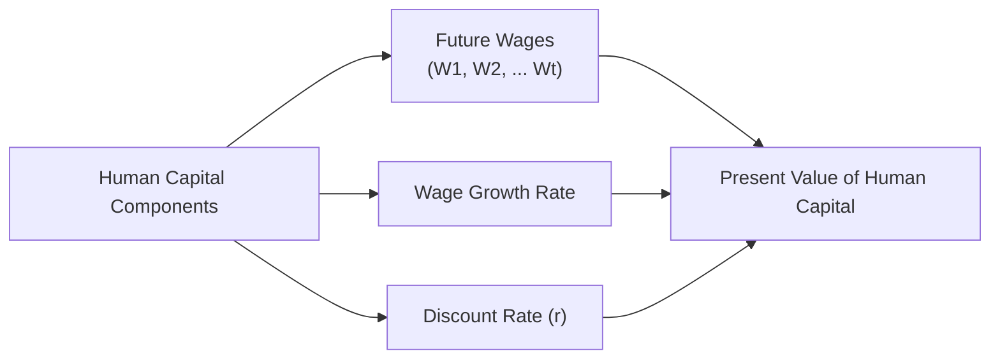

## Understanding Human Capital

Human capital represents the present value of your future earning potential. This might sound a bit abstract, but think of it as placing a dollar value on your capacity to work and earn over your lifetime. The more skilled you are (or the more stable your employment is), the higher the worth of your human capital. I remember a friend—let’s call him Robert—who was a tenured professor at a large university. Because his job security was basically ironclad, people around him used to say, “Robert’s future salary is as reliable as a government bond!” That might be a slight exaggeration, but you get the idea: stable human capital often behaves like fixed income, whereas highly variable human capital—like that of a commission-based real estate agent—acts more like equity.

Human capital is influenced by:  
• Career stability (tenure, union membership, industry health).  
• Professional skill and seniority.  
• Health and longevity factors.  
• Potential wage growth.  

From a financial planning standpoint, if your human capital is relatively “bond-like” (e.g., you’re a teacher with strong job protections), you might be more comfortable investing your financial assets aggressively in equity. On the flip side, if your future salary is volatile—maybe you’re a freelance tech consultant—then conservative investments can help offset that bigger risk.

## Measuring Human Capital

To quantify human capital formally, wealth managers often use present value (PV) calculations. You estimate future earnings (including any expected pay increases) and discount them by an appropriate rate—usually, a rate that reflects some risk premium. That discount rate might get bigger if your job’s stability is questionable.

Mathematically, it often looks something like:

P(HC) = ∑ (E(W_t) / (1 + r)^t),

where:  
• P(HC) = Present value of human capital.  
• E(W_t) = Expected wages (or labor income) at time t.  
• r = Discount rate reflecting risk and time.  

Sure, we can debate which discount rate to use—some folks match it to their personal risk profile or the riskiness of their income industry. But the principle remains: you’re converting your potential future earnings into a lump-sum value in today’s dollars.

## Visualizing Human Capital with a Diagram

Below is a simple Mermaid diagram illustrating how human capital ties to career length, wage growth, and discount rate:

In this diagram, the idea is straightforward: your future wages, adjusted for expected wage growth and discounted for risk and time, yield the present value of your human capital.

## Exploring Financial Capital

Financial capital is a lot easier for most of us to grasp. It’s everything in your investable net worth—stocks, bonds, investment funds, certain types of real estate, or even cash equivalents. Over our lifetimes, we typically want to grow financial capital to take over when we can’t (or don’t want to) rely on labor income anymore.

One nuance is deciding which assets count. For instance, some folks might consider the equity in their primary residence as part of financial capital. But often, your “home sweet home” is not quite the same as a pure investment asset, because you need somewhere to live. So the classification can get tricky. If you can turn real estate into a rental or downsize in retirement to free up equity, that property might be partially considered “financial capital.” 

## Economic Net Worth: A Holistic Vision

Economic net worth seamlessly integrates your human capital and financial capital (along with other assets and liabilities) into a single perspective. It’s basically your entire personal balance sheet:

• Human Capital (the present value of your future earnings)  
• + Financial Capital (your current investments and liquid assets)  
• + Other Personal Assets (possibly your residence, vehicle, collectibles, etc.)  
• – Liabilities (mortgage, student loans, credit card debt, and so on)  
= Economic Net Worth

In practice, it’s easy to overlook intangible but crucial factors, like a defined benefit pension or healthcare benefits. However, these can have significant value and should be factored in at least conceptually, if not with precise valuations. If your employer guarantees a modest pension for life, that’s akin to a fixed income asset. Conversely, if your pension depends on your company’s prosperity or is a defined contribution plan, it is more comparable to a portfolio that might need to be skillfully managed.

## Correlation with Market Risk

It’s important to ask: Does your human capital behave like a stable bond or more like a volatile stock? If your income is highly sensitive to market swings—think of folks who get a large portion of compensation from bonuses that depend on market performance—then your human capital is “equity-like.” In that case, you probably need more stable assets in your financial portfolio to counterbalance. Meanwhile, if your labor income is relatively secure and slow-changing, you may have the freedom to invest more aggressively.

Correlation matters a lot. Two streams of income or capital that are positively correlated tend to fail you at the same time. That’s a big problem if you work in a cyclical sector—like real estate or oil and gas—and you also hold an equity-heavy portfolio that’s subject to those same ups and downs.

## Time Horizon and Life Stages

If you’re early in your career, human capital will likely dwarf your financial capital. That’s great, because you have a lot of future paychecks ahead of you. However, it also means you should carefully assess how stable your job situation is when deciding on an asset allocation policy. Younger people can afford to take more investment risk because their primary resource (human capital) can, in many cases, replenish losses over time.

As you get older and your human capital gradually depletes (because you have fewer working years left), your financial capital typically grows. At that point—somewhere in mid to late career—most investors will readjust their risk levels. They realize that a big drawdown in the markets could be the difference between an easy retirement or a difficult one. That’s why we typically see a “glide path” approach in many target-date retirement funds: more aggressive allocations when you’re young, gradually shifting toward safer investments as you approach retirement.

## Policy Shifts and Future Uncertainty

Naturally, government policies can shift the balance, too. If the retirement age is pushed back, your human capital might be more valuable because you can (or must) work longer. But if your industry gets crushed by automation (hey, it happens!), your future earnings potential may drop. Wealth advisors need to keep an eye on these macro shifts to help clients reevaluate the stability of their human capital. 

For instance, my neighbor used to work at a large technology manufacturing plant, but then the plant closed due to overseas competition. His well-paying job vanished, and that intangible sense of job security he once had basically disappeared overnight. Suddenly, his future income was a giant question mark, and he needed to pivot. That is a stark reminder of how quickly human capital can change if the environment shifts.

## Practical Examples and Case Studies

• Tenured Professor vs. Startup Founder:  
  – The professor’s primary risk is not job security; it’s inflation risk (since wages might not adjust rapidly). Therefore, the professor’s human capital is akin to a bond with a fairly predictable coupon. The professor might lean into equities in their financial portfolio for better diversification and upside.  
  – The startup founder ranks high on creativity, potential for huge future earnings, but also high risk. If her business fails, that cash flow might drop to zero overnight. With that in mind, she may hold a more conservative investment portfolio.  

• Real Estate Broker vs. Municipal Employee:  
  – A real estate broker’s income can be cyclical and depends heavily on economic and market conditions. Because the broker’s human capital correlates with real estate market cycles, the appropriate diversification might involve investing in stable, non-real-estate assets.  
  – A municipal employee’s income is usually stable and may come with robust benefits. This scenario might allow for more equity exposure or risk-taking with financial capital.

## Best Practices and Common Pitfalls

• Overlooking Human Capital: Focusing purely on your investment accounts and ignoring the nature of your labor income is a common oversight. It can lead to a portfolio that’s too risky in the exact same sector where you earn your paycheck.  
• Failing to Rebalance Over Time: Younger investors might put everything into high-volatility assets without a plan for gradually shifting to safer assets as retirement nears.  
• Ignoring Policy Changes: Pension entitlements or retirement ages can shift, changing the value of your human capital. Keep an eye on relevant legislation.  
• Underestimating Correlation: Even stable careers can be correlated with equity market performance. If you work in financial services, your income might drop during economic downturns, just when your stock portfolio is also suffering.

## Bringing It All Together for Portfolio Construction

The essential lesson for private wealth management is that human capital often dictates the “baseline risk” for an individual. High-beta careers or highly variable wages effectively reduce your capacity to stomach risky investments in your portfolio. Conversely, stable job prospects often let you assume more market risk in your financial assets without jeopardizing your overall lifestyle.

Below is an illustrative diagram showing how economic net worth evolves over time, as human capital transitions into financial capital:

• Early Career: Larger portion of economic net worth comes from human capital.  
• Mid-Career: Gradual shift from reliance on labor income to reliance on growing investments.  
• Near Retirement: Net worth is mostly financial capital. Human capital is minimal, so capital preservation becomes a priority.  
• Retirement: Highest financial capital relative to negligible human capital; portfolio management often centers on withdrawal rates and principal protection.

## Exam Tips for CFA Candidates

• Practice integrating human capital discussions into asset allocation questions. The CFA exam often presents case scenarios that require you to propose a portfolio strategy based on career type, income stability, and client risk profile.  
• Pay attention to details such as correlation. The exam might ask you to identify how stable or volatile an individual’s income is and how that should affect the asset mix.  
• Watch for “traps” concerning pension plans. A defined benefit plan is effectively more like a bond, while a defined contribution plan is more equity-like because the benefit is uncertain.  
• Be mindful of the life-cycle approach: Different stages of life call for different weighting between human capital and financial capital. Don’t overlook intangible benefits like health insurance or special retirement perks.  
• Possibly, you’ll get item-set questions involving numerical present value calculations for labor income or scenario analyses about shifting time horizons.

## References

• Dimson, Marsh, and Staunton, “Risk and Return in Human Capital,” London Business School Research  
• “Strategic Asset Allocation and Human Capital” by Ibbotson, Milevsky, Chen & Zhu (Financial Analysts Journal)  
• American Economic Review articles on labor economics and wage growth forecasts  
• “The Lifecycle Approach to Investing,” CFA Institute Study Materials  

---

## Test Your Knowledge: Human Capital, Financial Capital, and Economic Net Worth



### Which of the following best describes "human capital" for an individual investor?

- [ ] The value of the real estate owned by the investor
- [x] The present value of the investor’s future expected labor income
- [ ] The investor’s pension liabilities
- [ ] The assets in the investor’s defined contribution plan

> **Explanation:** Human capital is the present value of all future earnings. It’s a conceptual measure of how much one’s potential to earn is worth in today’s terms.

### How might you classify a tenured professor’s human capital versus that of a freelance consultant?

- [x] The professor’s human capital is more bond-like; the consultant’s is more equity-like
- [ ] The professor’s human capital is more equity-like; the consultant’s is more bond-like
- [ ] Both are equity-like given that wage growth is uncertain
- [ ] Both are bond-like given that labor income is steady

> **Explanation:** A secure job with a stable wage resembles a bond, whereas freelance or variable income is more akin to equity that can fluctuate widely.

### Under which circumstance would you emphasize a more conservative investment approach in one’s financial portfolio?

- [x] The investor’s human capital is highly volatile
- [ ] The investor has a defined benefit pension plan
- [ ] The investor has no outstanding liabilities
- [ ] The investor works in a stable, regulated industry

> **Explanation:** When labor income is uncertain or volatile, it increases overall risk, which in turn supports a more conservative approach to investing financial capital.

### Which of the following statements about time horizon is most accurate regarding human capital?

- [x] Individuals with longer time horizons typically have more human capital relative to financial capital
- [ ] Individuals with shorter time horizons can afford more investment risk
- [ ] Human capital is irrelevant when considering one’s time horizon
- [ ] Time horizon does not change throughout a person’s working life

> **Explanation:** Early in one’s career, human capital (future earnings potential) tends to dominate, giving a longer horizon to recover from potential financial setbacks.

### What is the main rationale for treating the value of a defined benefit pension plan as “bond-like” human capital?

- [ ] Most pension plans invest primarily in equities
- [ ] Contribution amounts vary over the employee’s life
- [x] Defined benefit pensions promise a stable income stream similar to coupon payments
- [ ] Participants can freely direct their pension fund allocations

> **Explanation:** Defined benefit pensions offer a predictable, steady payout in retirement, much like fixed coupons on a bond.

### Which factor would increase the possible discount rate used in valuing human capital?

- [x] Greater uncertainty or volatility in future labor income
- [ ] A stable employment contract with minimal default risk
- [ ] Highly diversified investment portfolios
- [ ] A life-cycle fund with a typical glide path

> **Explanation:** Increased uncertainty in future labor income leads to a higher required discount rate, reflecting greater overall risk.

### What is the primary objective of considering correlation between human capital and investment assets?

- [x] To reduce the combined risk of both income streams
- [ ] To maximize the volatility of the portfolio
- [x] To find tax advantages in the labor market
- [ ] To identify the risk-free portion of net worth

> **Explanation:** If human capital is highly correlated with equity markets, diversifying away from equities in your financial capital can help lower total risk.

### Which of the following best illustrates a shift from human capital to financial capital over time?

- [x] A person’s investment portfolio grows while the amount of future labor income potential declines
- [ ] A person changes jobs but keeps the same base salary
- [ ] A person gains new professional skills and increases hourly pay
- [ ] A person reduces debt and invests in real estate for rental income

> **Explanation:** Over a career, one’s portfolio typically increases and labor income diminishes in relative importance.

### Policy changes that raise the retirement age would generally do what to an individual’s human capital?

- [x] Increase it, since the individual would likely work longer
- [ ] Decrease it, since the discount rate rises
- [ ] Have no effect at all
- [ ] Turn it into purely financial capital

> **Explanation:** Extending the time horizon for earning wages increases the total present value of future labor income (although discount rate assumptions could also be adjusted).

### An individual’s correlation between human capital and equity returns is extremely high. Which statement is most appropriate?

- [x] The individual should consider holding more fixed income and less equity in their financial portfolio
- [ ] The individual should increase equity allocation to align with the correlation
- [ ] The correlation does not influence asset allocation
- [ ] The correlation only matters for individuals older than 65

> **Explanation:** If your labor income behaves like equity, it’s prudent to diversify. Holding more fixed income lowers the overall equity exposure.


