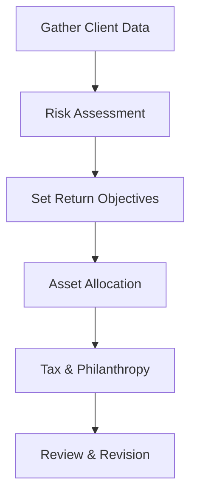

## Introduction

When it comes to managing wealth, it’s a whole different ball game working with an individual client versus an institutional one. Institutions may have large investment committees, formalized governance, and a fairly standardized set of objectives. Meanwhile, private clients often grapple with multiple objectives—retirement, estate planning, philanthropy, you name it—alongside a swirl of emotional considerations. It can even feel a little messy sometimes, with concerns like, “Um, are we sure we can handle the risk of that new alternative investment?” or “How do we plan if the family business is sold next year?” This section explores these unique dynamics, offers a side-by-side comparison of private vs. institutional clients, and wraps up with a clear process for drafting a Private Client Investment Policy Statement (IPS).

## Key Distinctions Between Private and Institutional Clients

Many of us have heard the story of a friend with a successful startup suddenly flush with proceeds from selling the business. The next thing you know, they’re trying to invest, plan for philanthropic goals, and keep Uncle Sam happy by structuring their wealth in a tax-advantaged way. Private wealth can feel deeply personal, with overlapping emotional, family, and legacy motives.

In contrast, consider a big institutional investor like a pension fund or a university endowment. They typically have:

• Formal oversight structures (investment committees, boards).  
• Clear, long-term objectives driven by liabilities or spending requirements.  
• An established governance framework (often with strategic policy targets).  
• Possibly large or perpetual time horizons (like an endowment that wants to exist forever, effectively).

Private clients often share some of the fundamental investment objectives (e.g., preserving capital, ensuring liquidity for future liabilities), yet they also juggle a host of other complexities, including:

• Family governance: coordinating decisions across multiple generations.  
• Trust structures: setting rules for how assets pass on to heirs.  
• Estate planning: ensuring efficient wealth transfer to beneficiaries.  
• Emotional factors: for instance, fear of losing a family legacy.  
• Behavioral stumbling blocks: panicking in volatile markets or chasing trendy investments out of FOMO.  

You can almost think of it this way: The institutional approach is designed to “streamline” decisions with larger pools of capital and robust internal policies. On the other hand, private wealth management is generally more customized, more frequent in revision, and more sensitive to events like divorce or the sale of a family business.  

## Emotional and Behavioral Considerations

Whether it’s a high-net-worth individual seeing a large market drawdown or a family deciding how to invest in the name of a departed founder, private wealth triggers strong emotions. Institutional clients usually separate decision-making by delegating responsibilities to professionals and committees. That said, behavioral pitfalls certainly exist in institutional settings (e.g., “herding” into popular strategies), but individuals often need extra support:

• Behavioral Coaching: reminding clients to stick to the plan when markets tumble.  
• Transparency: clarifying how a selected strategy aligns with personal values (e.g., ESG investing).  
• Comfort with Complexity: private clients might not be as financially savvy, so the advisor must demystify complicated products.

## Governance and Oversight

• Institutional Clients: Typically adopt formal structures—committees that vote on asset allocation, external consultants who conduct manager due diligence, and rigorous documentation.  
• Private Clients: Governance might just be a single family member or a small team making decisions with an advisor’s input. Sometimes it extends to a family office where dedicated staff manage daily finances, taxes, philanthropic giving, and trust administration.

For private clients, “family governance” becomes an essential concept, reflecting the design of how the family collectively decides on wealth matters. It might include who votes on major investment decisions, how philanthropic endeavors are selected, and so on.

## The Role of an Investment Policy Statement (IPS)

The IPS acts like a North Star for both private and institutional investors. It documents objectives, constraints, risk tolerance, return expectations, and the rules for how assets should be managed. An IPS is especially critical for private clients, as it helps keep them on track, fosters discipline during volatile markets, and clarifies how taxes, philanthropic goals, and estate considerations fit into the broader plan.  

### Components of a Private Client IPS

1. Objectives and Constraints  
2. Risk Tolerance Assessment (including behavioral aspects)  
3. Return Expectations  
4. Asset Allocation Guidelines  
5. Tax and Estate Considerations  
6. Review and Revision Protocol  

While an institutional IPS can be fairly stable for several years, a private client IPS might need refreshing if there’s a life change—like a sudden inheritance, a divorce, or a major philanthropic pledge.

## Steps to Drafting a Private Client IPS

Drafting a Private Client IPS can be broken down into six essential steps. Although the approach might seem pretty straightforward, it’s amazing how much detail and nuance can emerge in practice. Let’s walk through each step.

### Step 1: Gather Client Data and Identify Objectives

First, collect all the essential data: current assets, liabilities, sources of income, expenditures, liquidity needs, insurance policies, philanthropic initiatives, and the client’s long-term ambitions. Often, you might also want to note any family business operations (and business valuations), plus the client’s personal preferences—like ethical or religious-based investing constraints.

Many advisors use a formal questionnaire or an interview to uncover hidden details. It’s not just about the finances but also about the client’s life story. For instance:  
• Does the client anticipate supporting aging parents?  
• Are there philanthropic causes the client wants to endow in perpetuity?  
• How does the client want to manage cross-border assets if part of the family resides internationally?

### Step 2: Conduct a Risk Assessment

Risk tolerance goes beyond “Can you handle a 15% market drawdown?” For private clients, it’s also “Will you be able to sleep at night?” and “Do you have enough emergency funds outside the portfolio?” Many advisors administer a formal Risk Assessment Questionnaire to quantify the client’s risk tolerance and risk capacity (the actual ability to sustain losses without jeopardizing financial goals).

• Quantitative Measures: historical drawdowns, correlation across asset classes.  
• Qualitative Factors: personal comfort, investment experience, possible illusions of wealth (in bull markets, some clients think they can handle more risk).  
• Behavioral Patterns: does the client tend to panic-sell?

### Step 3: Set Return Objectives and Benchmarks

Based on the client’s objectives, advisors translate them into target returns. For example, if the client wants a 3% real growth over inflation, that might correspond to a nominal target like 6–7% (depending on the inflation assumption). This step is crucial because it helps define how aggressive or conservative the portfolio needs to be.

Benchmarks might be selected to track performance relative to a mix of equity and bond indices. But for many private clients, success is often measured more personally—for instance, maintaining purchasing power, fulfilling philanthropic spending, funding a grandchild’s education, or achieving a comfortable retirement without eroding principal.

### Step 4: Outline Asset Allocation Guidelines

In the private context, asset allocation often includes a wide variety of instruments:  
• Traditional asset classes: equities, bonds, cash.  
• Alternatives: private equity, real estate, hedge funds.  
• The family business equity (if it’s partially owned by the client).  
• Insurance products or annuities.  

Moreover, the investment horizon might be segmented (e.g., a “short-term bucket” for liquidity, a “growth bucket” for longer-term investing, and a “legacy bucket” for philanthropic or bequest motives).  

### Step 5: Document Tax Considerations and Philanthropic Structures

Tax planning can dramatically shift the net returns for private clients, especially those subject to high marginal tax rates or capital gains taxes. The IPS should note:  
• Asset location (which assets go into tax-deferred accounts, which go into taxable accounts).  
• Methods for charitable giving (direct cash gifts, donor-advised funds, charitable trusts).  
• Estate planning strategies (e.g., generation-skipping trusts).  

Philanthropy is often integral to private wealth. If the client aims to donate a portion of profits each year or eventually fund an endowment for a personal foundation, that should also be baked into the plan.

### Step 6: Establish a Review and Revision Process

Life happens, and for private clients, it seems to happen a lot faster than in big institutions. The birth of a child, sale of a business, major health issues—these can change everything. That’s why a private client IPS should include:  
• The frequency of formal reviews (e.g., annually, semi-annually).  
• Triggers for an ad-hoc review (significant life events, changing tax laws, or market disruptions).  
• Clear roles for the advisor, the client, and any other professionals (tax attorneys, estate planners).

Below is a simple Mermaid flowchart illustrating these steps:

## Quick Case Example

Imagine a family that recently sold its technology startup for $50 million. They have philanthropic aspirations to set up a scholarship fund for underprivileged students, plus they want to ensure a lasting inheritance for their future grandchildren. Their risk profile is moderate: they can handle market volatility, but they’re uneasy about illiquid investments.

1. Step 1 (Gather Data): The advisor compiles all financial information, including the timing of philanthropic gifts and the desire for annual distributions to the scholarship fund.  
2. Step 2 (Risk Assessment): The family’s moderate risk tolerance is confirmed by a formal questionnaire and in-depth discussions.  
3. Step 3 (Return Objectives): They aim for a nominal return of around 6–7% to fund scholarship disbursements and preserve capital for future generations.  
4. Step 4 (Asset Allocation): A core-satellite approach, with a globally diversified equity sleeve, a moderate bond allocation for stability, plus a small bucket for private equity or venture capital (for continued exposure to growth companies).  
5. Step 5 (Tax & Philanthropy): The portfolio is structured with attention to the family’s tax bracket. Part of the proceeds is placed in a donor-advised fund to systematically fund the scholarships.  
6. Step 6 (Review & Revision): The IPS states that the advisor will review performance and potential distributions on a quarterly basis, and a more in-depth review with the entire family once a year.

## Contrasting Private vs. Institutional IPS

• **Frequency of Amendment**: Private IPS might be adjusted more frequently due to life events. Institutional IPS changes often require committee approvals and are less common.  
• **Complexity of Family Structures**: Private clients may have trusts, philanthropic vehicles, or unique estate planning overlays. Institutional investors’ legal structures are typically more standardized.  
• **Decision-Making Process**: Institutions rely on formal committees, policies, and possibly even legislative guidelines (like an ERISA framework in the US). Private clients might make a quick decision over dinner with their spouse.  

All in all, institutional investing tends to revolve around fulfilling the organization’s mandate (like paying pensions or supporting university programs), while private wealth looks more like a tapestry of personal visions, emotional needs, and family legacies.

## Best Practices

• **Maintain Clear Documentation**: Keep the IPS updated and ensure it’s easily accessible to all stakeholders (family members, trustees, etc.).  
• **Integrate Estate and Tax Planning**: Consider that short-term portfolio moves might create implications for estate strategies or philanthropic structures.  
• **Include Behavioral Guidelines**: Outline how to handle rash decisions if markets tank.  
• **Set Realistic Return Targets**: Overly aggressive expectations can derail the plan and create unnecessary stress.  
• **Use Time Horizons Strategically**: Segmenting the portfolio by horizon can help clients stay invested in riskier assets for long-term objectives.

## Common Pitfalls

• **Ignoring Behavioral Biases**: Private clients sometimes panic or become overconfident.  
• **Insufficient Liquidity**: Failing to plan for unexpected needs can force untimely asset sales.  
• **Generic Approach**: Copying an institutional plan for a family with complex estate needs can cause mismatches (“Um, do we really need that many illiquid assets?”).  
• **Overlooking Tax Efficiency**: Failing to structure assets properly can cost thousands in unnecessary taxes each year.  
• **Lack of Regular Reviews**: Old objectives might no longer match the client’s evolving situation.

## Final Exam Tips

• **Know the Structure**: Be prepared to outline the key components of a Private Client IPS quickly.  
• **Illustrate Differences**: Expect exam questions that ask you to contrast private vs. institutional approaches, especially in forward-looking statements or scenario-based items.  
• **Practice IPS Drafting**: A common constructed-response format is to write or critique an IPS. Carefully note how client objectives, constraints, and risk tolerance shape investment guidelines.  
• **Incorporate Taxes and Legacy Goals**: The exam often tests your ability to integrate taxes, philanthropic intentions, and bequest motives into portfolio recommendations.  
• **Remember Behavioral Finance**: Private wealth management sections frequently require you to identify or address common behavioral biases that might influence investment decisions.

## References and Further Reading

• “Investment Policy Statement: Guidance for Prudent Investors,” CFA Institute  
• “Investment Management for Private, Taxable Investors” (CFA Program Curriculum)  
• “Becoming a Trusted Advisor in Private Wealth” by R. Shiller, Yale University Lecture Series  

--------------------------------------------------------------------------------

## Test Your Knowledge: Private vs. Institutional Clients and Private IPS



### Which of the following typically distinguishes private wealth clients from institutional clients?

- [ ] They have more robust governance committees.  
- [x] They often have multiple, interwoven objectives (e.g., family, philanthropic, estate).  
- [ ] They are less susceptible to behavioral biases.  
- [ ] They do not require a formal IPS.  

> **Explanation:** Unlike institutions, private clients often juggle estate planning, philanthropic goals, and personal risk tolerances, which must be carefully integrated into the IPS.

### Which component is most likely a key part of both a private client IPS and an institutional IPS?

- [x] Defining return objectives and constraints.  
- [ ] Specifying philanthropic giving plans.  
- [ ] Addressing family governance structures.  
- [ ] Minimizing generational wealth transfer.  

> **Explanation:** All IPSs—private or institutional—include clearly stated return objectives and constraints. Institutions may not incorporate philanthropic or family considerations, which are typically private-wealth concerns.

### How might a private IPS differ from an institutional IPS in terms of updates and revisions?

- [x] A private IPS is often revisited more frequently due to changing life circumstances.  
- [ ] Institutional IPSs undergo updates monthly.  
- [ ] Private IPSs are not permitted to be modified once signed.  
- [ ] Institutional IPSs typically demand quarterly amendments.  

> **Explanation:** Private clients face events such as divorce, sale of a business, or various personal emergencies, making more frequent IPS reviews necessary.

### A private client is most likely to prioritize which of the following in the IPS?

- [ ] Governance committee charters.  
- [ ] Benchmarking vs. market indexes alone.  
- [ ] Minimization of the tracking error to a global equities index.  
- [x] Legacy and bequest intentions, including philanthropic structures.  

> **Explanation:** Private clients often emphasize passing on assets to heirs or supporting philanthropic causes, an area less commonly central for institutional investors.

### When drafting a Private Client IPS, how does the risk assessment step extend beyond quantitative measures?

- [x] It includes evaluating the client’s comfort with volatility and behavioral tendencies.  
- [x] It factors in the client’s liquidity needs for short-term obligations.  
- [ ] It only considers the standard deviation of potential market returns.  
- [ ] It completely disregards emotional factors.  

> **Explanation:** Private client risk assessments typically incorporate both quantitative metrics and behavioral or emotional preferences, ensuring strategies align with real-life risk tolerance.

### Which of the following statements about philanthropic goals in a Private Client IPS is correct?

- [x] They should be explicitly outlined in the IPS, including funding structure and timing.  
- [ ] They rarely affect asset allocation decisions.  
- [ ] They solely focus on immediate charitable contributions.  
- [ ] They are only relevant if the client has more than $10 million in assets.  

> **Explanation:** Many private clients integrate philanthropy into their broader wealth strategy, which can influence asset allocation, liquidity plans, and tax considerations.

### What is the primary reason asset segmentation (e.g., short-term, medium-term, legacy) can be valuable for private clients?

- [x] It helps match investments to distinct time horizons and objectives.  
- [ ] It is mandated by all private wealth regulators.  
- [x] It removes the need for an overall return objective.  
- [ ] It prevents families from creating philanthropic foundations.  

> **Explanation:** Segmenting assets by time horizon allows private clients to better align risk levels with specific goals, from near-term liquidity to long-term legacy planning.

### Which of the following best describes the integration of estate planning within a Private Client IPS?

- [x] The IPS should reference estate structures, trusts, and bequest goals.  
- [ ] The IPS should exclude estate aspects because they are handled separately.  
- [ ] Estate planning belongs only in institutional policy statements.  
- [ ] Estate planning is irrelevant to ongoing portfolio management.  

> **Explanation:** Private wealth often requires that estate structures and goals be explicitly acknowledged in the IPS to ensure the portfolio strategy is consistent with the client’s legacy objectives.

### How does behavioral coaching typically manifest in private wealth management?

- [x] Advisors reinforce disciplined investing during market downturns.  
- [ ] Advisors ignore client emotions when making decisions.  
- [ ] Advisors frequently encourage market-timing for maximum returns.  
- [ ] Advisors require clients to adopt purely automated trading strategies.  

> **Explanation:** Behavioral coaching involves helping clients remain committed to long-term strategies rather than reacting emotionally to short-lived market fluctuations.

### True or False: Tax considerations and philanthropic goals are typically more prominent in drafting a Private Client IPS compared to an Institutional IPS.

- [x] True  
- [ ] False  

> **Explanation:** Private clients often have personal wealth structuring, estate-transfer needs, and philanthropic intentions that demand thorough tax optimization and philanthropic planning in the IPS.


