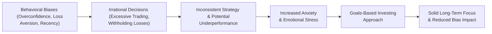
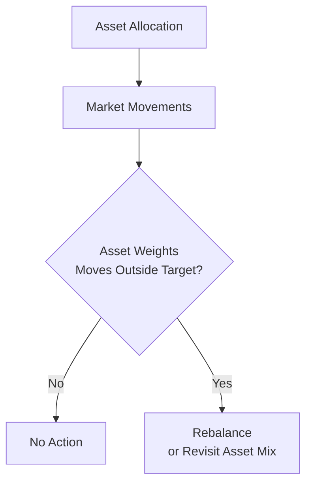

## Introduction and Context

Behavioral biases are, quite simply, those mental shortcuts, assumptions, and emotional knee-jerk reactions that cause private clients—and, honestly, all of us—to make less-than-optimal decisions. In private wealth management, these biases can mess with everything from asset allocation (see Section 3.6 for how some investors approach alternatives) to buying and selling individual stocks at emotional extremes rather than rational times. And the thing is, these biases don’t go away by themselves. They take some effort to recognize and, ideally, mitigate.

Behavioral biases show up in many forms, but overconfidence, loss aversion, and recency bias are among the most common challengers that wealth managers face when working with clients. Each bias can tilt a portfolio away from carefully planned risk–return profiles, or lead to unnecessary churn. Let’s dig into what they look like in practice—and how to combat them.

## Spotlight on Common Behavioral Biases

### Overconfidence

Overconfidence might be the best-known bias in trading circles. We’ve all met the investor (sometimes it’s our own reflection in the mirror) who figures they’re just a genius. They might ignore well-researched market signals, over-rely on gut instinct, or place large bets on narrow slices of the market. It’s the classic “I’m going to beat the market” story. 

They might also trade more often than they should. This can lead to:

• Excessive transaction costs.  
• A portfolio that’s heavily concentrated in one type of stock (for example, tech growth equities).  
• Over-leveraging, which magnifies both returns and losses.  

The real risk is that overconfidence can pile on hidden costs and increase exposure to market volatility. When such traders realize they overplayed their hand, it’s often too late to avoid steep losses.

### Loss Aversion

Loss aversion is the phenomenon that the pain of losses feels more intense than the pleasure of equivalent gains. We see it all the time: a private client who is extremely reluctant to realize losses on an investment, even when better opportunities are available, or the fundamental thesis has changed. That emotional desire to avoid a “real” loss can lead to:

• Holding a losing position far longer than is optimal.  
• Missing out on better investment prospects or using up liquidity.  
• Focusing too heavily on capital preservation at the expense of long-term growth.  

In some cases, even when the math says “cut your losses and redeploy,” loss-averse individuals will wait for a rebound that may never come—delaying the chance to reallocate to something more promising.

### Recency Bias

Recency bias, as the name implies, is about placing too much emphasis on whatever just happened. For instance, if the market has been soaring the last three months, recency-biased investors might extrapolate that it will continue forever, ignoring cyclical or seasonal realities. Alternatively, after a dramatic crash, they might assume the market will never recover, forgetting generations of data that show otherwise.

This “what-have-you-done-for-me-lately?” mentality can lead people to chase hot investments at the top of a bubble or bail out of well-structured portfolios at market bottoms. Staying level-headed is crucial, but recency bias can really sabotage a carefully integrated investment plan.

## How Behavioral Biases Affect Private Wealth Portfolios

It’s clear these biases cause trouble, but how exactly do they show up in real portfolios? Let’s take a short anecdote from my own experience: A few years ago, I had a client who was convinced that a particular tech startup was the next unstoppable juggernaut. Overconfidence was shining through big time. Despite my repeated warnings about the stock’s volatility and the potential need for diversification, they put 50% of their portfolio in it. Sure enough, by the time the broader market corrected, that position lost more than 70% of its value in just a few weeks.

The client was devastated—but ironically, they still didn’t want to sell. Enter loss aversion. Unable to stomach turning those paper losses into realized ones, they froze, hoping for a miracle reversal. During that time, other opportunities arose, and they missed out because the capital was stuck in a losing position.

So, if you ever think these biases are merely theoretical or that they only affect retail investors: think again. People across the wealth spectrum—and even seasoned professionals—are subject to these pitfalls.

## Frameworks for Understanding Behavioral Bias

Behavioral finance as a discipline is dedicated to understanding and explaining these mental pitfalls. Traditional finance assumes people are rational, always seeking to maximize utility (see the Economic Net Worth discussion in Section 4.2). Behavioral finance, by contrast, recognizes that humans are often swayed by emotion, convenience, peer pressure, and so on.

### Simple Utility Example

In rational economics, decisions about gains and losses might be viewed through a utility function like:


U(x) = \sum_{i=1}^{n} p_i \times v(x_i)


Where:  
• \\( p_i \\) is the probability of outcome \\( i \\).  
• \\( v(x_i) \\) is the value (or utility) of outcome \\( x_i \\).  

In the real world, though, \\( v(x) \\) isn’t purely about final wealth. Clients have emotional responses to gains and losses, which skews how they perceive outcomes.

## Mitigating Behavioral Biases

### Thorough Risk Profiling

A big part of mitigating behavioral bias is understanding a client’s risk tolerance and psychological makeup. Some private wealth advisors incorporate psychometric testing. Others rely on long-form, in-depth conversations to figure out whether a client is more prone to overconfidence or to being paralyzed by loss aversion. The idea is to develop a baseline, so you can see biases when they show up.

### Disciplined Investment Processes

When I say “disciplined,” I’m talking about a systematic approach. For instance, employing rebalancing guidelines that automatically shift assets away from overweight positions and toward underweight ones. Or using stop-loss orders or option hedges in ways that are consistent with a long-term plan—without letting emotions rule.

Systems introduce friction that can curb impulsive decisions. For instance, if a client wants to make a big directional bet, you can put them through a structured investment committee process where they have to justify their assumptions. That alone often dampens overconfidence.

### Client Education

Clients frequently make biased decisions because they simply don’t know or understand what’s going on. As a wealth manager, explaining the pitfalls of panic-selling or euphoria-driven buying can help them view the bigger picture. Sometimes you might show them aggregated data on how frequent day-traders often underperform. Other times, you might highlight historical market recoveries to quell recency bias. 

### Goals-Based Investing

Goals-based investing (GBI) is a powerful method to address biases because it redirects the client’s focus from daily or monthly performance fluctuations to long-term objectives—whether that’s retirement, bequests, or philanthropic goals. When clients have a plan tied to personal milestones, they’re less likely to deviate based on short-term emotional triggers.

Below is a simple diagram illustrating how GBI helps anchor clients’ decision-making:

When clients reevaluate a trade or a new investment idea in the context of “Does this serve my long-term goal or is it just chasing short-term excitement?”, they often show more restraint. 

## Communication: Frequency and Depth of Reviews

One of the subtle aspects of private wealth management is deciding how often to engage with clients about performance. Some clients fixate on daily price swings—leading to stress, panic, or euphoria. Others might need regular updates to remain comfortable and confident.

• High-frequency reviews: Can calm some clients who fear the unknown, but for more emotionally reactive clients, it might feed volatile behaviors.  
• Low-frequency reviews: Suitable for long-term, passively oriented clients who prefer a “set it and forget it” approach. But too little communication can breed suspicion or fear.  

That’s why a tailored approach matters. If you sense a client’s recency bias is hurting them, maybe reduce the number of performance glimpses. If a client is more secure with frequent micro-updates, ensure you have processes to present short-term data in the context of longer-term objectives.

## Emotional Decision-Making vs. Objective Analysis

Fear and greed can overshadow data-driven analysis. In times of stress, it’s easy for a client to say, “Let’s pull all our investments and go to cash!” The wealth manager’s role is partly to say, “Let’s look at how that might affect your goal of paying for your child’s college in 10 years.” By re-steering the conversation toward rational outcomes, you help them push back against pure emotion.

If you do sense a client is on the verge of making an emotionally charged move, it may help to:

• Schedule an in-person or video meeting within 24 hours.  
• Calmly discuss the potential range of outcomes.  
• Remind them of their original investment policy statement (IPS).  

That 24-hour “cooling off” can really go a long way in preventing costly decisions.

## Practical Tools for Client Meetings

### Behavioral Checklists

Before finalizing any major portfolio changes, check for possible biases in the reasoning. For instance:

• Have we considered alternative explanations (to avoid overconfidence)?  
• Are we letting recency (recent market performance) overstate the future?  
• Are we ignoring the opportunity cost of holding onto a losing position?  

### Multiple Scenario Analyses

When building or adjusting a private wealth portfolio, consider various scenarios. This technique is helpful to reveal how a highly concentrated or emotion-driven position might perform under stress. If the client sees the potential for large drawdowns, they might become more receptive to diversification (see also Section 4.7 on asset location and tax-efficient investing).

### Automatic Rebalancing Triggers

Giving each client a systematic rebalancing corridor—for example, rebalancing when an asset class is more than 5% off its target allocation—helps remove guesswork. This is a direct tool to combat both overconfidence (by trimming winners) and loss aversion (by not letting a losing position remain overweight in the portfolio).

**Note:** “Market Movements” can be anything from a sector rally to a broad downturn that shifts weightings. The automatic nature of rebalancing imposes discipline—though it should always be coordinated with the client’s IPS.

## Behavioral Finance and ESG

An interesting intersection has emerged between behavioral finance and ESG (Environmental, Social, Governance) investing. Some clients may believe so strongly in certain social causes that they exhibit emotional or confirmation biases toward particular ESG assets, even when the fundamental analysis doesn’t align with their broader portfolio needs. A goals-based approach can be a good “sanity check” here, too—balancing personal values with realistic performance and risk factors. (For more on ESG in private wealth, see Section 4.7 and also Chapter 2.10 regarding green bonds.)

## Putting It All Together: A Quick Roadmap

Here’s a quick summary of how to integrate these ideas into your private wealth practice:

1. Start with a detailed behavioral profile of the client.  
2. Build a goals-based framework so the client’s decisions revolve around personal objectives, not short-term market swings.  
3. Educate them on biases and show real data on how frequently short-term biases lead to underperformance.  
4. Employ rebalancing rules and scenario analyses to keep the investment process disciplined.  
5. Customize communication frequency. Too many updates can fuel recency bias; too few can feed uncertainty.  

This cyclical process ensures each planning or rebalancing session addresses the risk of irrational decision-making.

## Best Practices, Pitfalls, and Continuous Learning

• **Best Practices:**  
  – Use a structured investment policy statement (IPS) that outlines risk tolerance, objectives, and constraints.  
  – Integrate checklists and multi-scenario analyses for major decisions.  
  – Keep a record of decisions, along with rationales, to identify patterns of behavioral bias over time.  

• **Common Pitfalls:**  
  – Underestimating a client’s emotional triggers.  
  – Not adapting communication style to the client’s psychological profile.  
  – Assuming education alone will fix the problem (habits are hard to break).  

• **Continuous Learning:**  
  – Stay up to date with behavioral finance research.  
  – Periodically re-evaluate your own biases as a wealth manager.  
  – Encourage clients to attend seminars, webinars, or read relevant books (like “Thinking, Fast and Slow” by Kahneman).

## Exam Tips for CFA® Level III

• **Constructed Response Questions:**  
  – You might be given a scenario describing a client’s emotional reactions and asked to identify which bias is driving their behavior. Show your understanding by explaining how that bias typically manifests and the best mitigation strategies.  
  – They may also ask you to propose adjustments to the investment policy statement (IPS) to address behavioral issues.  

• **Item Set Questions:**  
  – Expect to interpret text about a client’s trading patterns and figure out which biases are at play. Choose the most appropriate method of mitigation (e.g., rebalancing triggers or adjusting communication frequency).  

• **Time Management:**  
  – In real exam conditions, read each scenario carefully. The client’s backstory often holds subtle clues about which biases they’re demonstrating.  
  – If a question lumps multiple biases together, rank which is most dominant and tackle that first.  

Ultimately, you’ll want to show that you can recognize these biases in practice and propose reasoned steps to mitigate them in a private wealth context.

## References and Further Reading

• Behavioral Finance: Psychology, Decision-Making, and Markets by Lucy Ackert and Richard Deaves (Cengage)  
• Thinking, Fast and Slow by Daniel Kahneman (Farrar, Straus and Giroux)  
• CFA Institute articles on investor psychology and biases  
• Handbook of Behavioral Finance edited by Brian Bruce (Edward Elgar Publishing)

These references offer deeper insights into investor psychology, decision-making frameworks, and practical case studies of how biases can play out in real markets.

## Test Your Knowledge: Behavioral Biases in Private Wealth Management



### Q1. Which statement best characterizes overconfidence bias in private wealth management?

- [ ] It is a bias that primarily affects passive investors.  
- [x] It is the tendency for investors to overestimate their abilities and the accuracy of their information.  
- [ ] It is the fear of missing out on a market rally.  
- [ ] It is the urge to stay in a losing position to avoid concrete losses.  

> **Explanation:** Overconfidence bias leads investors to overvalue their predictive abilities and judgement, often resulting in excessive trading or concentrated positions.

### Q2. What is an example of loss aversion behavior?

- [ ] Buying a broad market index at regular intervals.  
- [x] Refusing to sell a stock that has dropped 50%, hoping it will “bounce back.”  
- [ ] Frequently rotating into new, high-flying stocks.  
- [ ] Always selling after a stock has gained 5%.  

> **Explanation:** Loss aversion focuses on the pain of incurring a realized loss. The investor clings to losing positions instead of selling and reallocating capital more wisely.

### Q3. Recency bias can cause private clients to:

- [ ] Diversify broadly to avoid concentration.  
- [ ] Focus on long-term historical trends over quick market moves.  
- [x] Overemphasize recent performance and extrapolate it into the future.  
- [ ] Conduct more thorough fundamental analysis.  

> **Explanation:** Recency bias leads to giving outsized weight to the most recent market movements or experiences, which often skews future expectations.

### Q4. Which of the following is most likely to help mitigate overconfidence in a private client’s portfolio decisions?

- [ ] Encouraging highly focused bets in new areas.  
- [ ] Speeding up the decision-making process.  
- [x] Employing a structured committee or checklist requiring justification for each trade.  
- [ ] Ignoring any fundamental analysis.  

> **Explanation:** Requiring a systematic review slows the decision process and forces the investor to justify assumptions, thus countering overconfidence.

### Q5. By focusing on long-term personal objectives rather than short-term market fluctuations, Goals-Based Investing:

- [x] Helps reduce the impact of behavioral biases in decision-making.  
- [ ] Increases the likelihood of panic-selling.  
- [x] Strengthens clients’ resolve during market volatility.  
- [ ] Eliminates the need for risk assessment.  

> **Explanation:** Goals-Based Investing encourages an orientation toward broader life goals, deterring reactionary decisions and reinforcing a disciplined approach even when markets fluctuate significantly.

### Q6. How can wealth managers address a client’s loss aversion when markets experience a downturn?

- [x] Conduct scenario analysis to show the impact of holding on vs. selling.  
- [ ] Encourage the client to trade more frequently.  
- [ ] Immediately move all funds into cash to avoid further losses.  
- [ ] Dismiss the client’s concerns to maintain a calm environment.  

> **Explanation:** Scenario analysis provides data-driven insights into potential outcomes, helping clients confront and possibly overcome their bias against realizing losses.

### Q7. Which of the following is NOT a recommended best practice for mitigating behavioral biases?

- [x] Letting clients make major portfolio changes without a “cooling off” period.  
- [ ] Integrating automatic rebalancing criteria in an IPS.  
- [x] Building a behavioral checklist for major investment decisions.  
- [ ] Telling clients about historical patterns and data to promote rational thinking.  

> **Explanation:** A “cooling off” period and a behavioral checklist are recognized as effective strategies. Allowing spontaneous major changes without reflection is generally discouraged.

### Q8. For many private wealth clients, reducing the frequency of performance updates is likely to:

- [x] Help diminish anxiety-driven decisions.  
- [ ] Instantly eliminate overconfidence bias.  
- [ ] Significantly increase trading volume.  
- [ ] Have no effect on loss aversion.  

> **Explanation:** In many cases, seeing every small market fluctuation can fuel emotional trading. Reducing the frequency of performance reviews may lessen recency bias and anxiety.

### Q9. In the context of behavioral finance, which best describes the role of an investment policy statement (IPS)?

- [x] It serves as a reference document that discourages emotional or reactive decisions.  
- [ ] It details how clients should invest solely in alternative assets.  
- [ ] It overrides the need to discuss risk tolerance.  
- [ ] It is unnecessary for long-term investments.  

> **Explanation:** An IPS ensures decisions align with formally stated goals and risk parameters, helping to regulate impulsive actions driven by bias.

### Q10. True or False: Behavioral biases only affect novice investors and can be ignored by professional wealth managers.

- [x] True  
- [ ] False  

> **Explanation:** This is actually a trick statement. The correct conclusion is that biases affect everyone, including professionals, so the statement is false. If you chose “True,” it might be because you momentarily overlooked that many seasoned investors also fall prey to these biases.  


