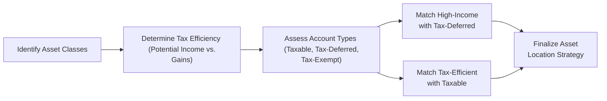

## Introduction

So, I remember having a chat with a friend (let’s call him Rob) who was all excited about picking a few dividend-paying stocks. He was thrilled by the prospect of quarterly payouts—until he got blindsided by the tax bill. Rob’s enthusiastic, “Look at all that dividend income I’m getting,” turned into, “Wait, why is Uncle Sam taking such a big chunk?” That’s basically the essence of why we need to think carefully about asset location and tax-efficient investing. The idea isn’t to avoid taxes (which is neither legal nor ethical), but to optimize how and where we hold different asset classes in order to maximize after-tax returns.

In many markets, the financial system offers a variety of tax-advantaged "pockets" (like retirement accounts or tax-exempt accounts), as well as standard taxable accounts. Placing the right securities in the most appropriate “pocket” can help reduce the drag that taxes place on portfolio performance. And as we’ll see, combining that knowledge with techniques like tax-loss harvesting or investing in municipal bonds (where relevant) can play a massive role in improving long-term wealth accumulation.

## The Concept of Asset Location

Let’s start with the definition. Asset location is the practice of distributing different asset classes across accounts that have distinct tax treatments—such as taxable, tax-deferred, and tax-exempt accounts—to optimize after-tax net returns for a given risk profile. This approach acknowledges that not all income sources, capital gains, or distributions are taxed equally. By paying attention to which investments you place in which type of account, you can strategically reduce taxes over time.

### Why It Matters

• Not all income is taxed at the same rate. Interest from a corporate bond might be taxed at ordinary income rates, whereas long-term capital gains from an equity fund might enjoy more favorable rates.  
• Holding highly “tax-inefficient” assets (like REITs or high-yield bonds) in a taxable account can lead to a hefty annual tax bill.  
• By contrast, highly “tax-efficient” assets (like broad-index equities with low turnover) often create fewer taxable events, so holding them in a taxable account isn’t as painful.  

Modern portfolio theory suggests we focus on overall return and risk, but the real battle is maximizing the net-of-tax outcome for the investor’s actual situation. Asset location is critical to that pursuit.

## Overview of Different Account Types

For many private individuals, especially in jurisdictions resembling the United States, the three broad account types to consider are:  
• Taxable (e.g., standard brokerage)  
• Tax-Deferred (e.g., Traditional IRAs, 401(k) in a U.S. context)  
• Tax-Exempt (e.g., Roth IRAs in a U.S. context)

### Taxable Accounts

In a taxable account, you’ll pay annual taxes on income—the interest, dividends, or short-term capital gains distributions—at the relevant rate. You also pay taxes on realized capital gains if you sell an asset at a profit. An advantage, though, is that you can harvest losses if positions fall in value, using those capital losses to offset gains in the current year or future years (subject to certain restrictions). This is a big deal for portfolio rebalancing and for “tax-loss harvesting,” which we’ll explore shortly.

### Tax-Deferred Accounts

In a tax-deferred account, you usually don’t pay taxes on contributions and investment gains in the current period, but you do pay taxes when you withdraw funds. In other words, everything grows without that annual tax drag, but eventually the IRS (or your local equivalent) gets a cut. Because you’re taxed at ordinary income rates upon withdrawal, it may be advantageous to keep the assets that produce a lot of current income—like bonds, REITs, or high-dividend-paying stocks—inside these accounts. That helps shield your portfolio from immediate taxes on dividends, interest, or realized capital gains.

### Tax-Exempt Accounts

Tax-exempt accounts often require contributions using after-tax dollars, but withdrawals in retirement are (under many circumstances) tax-free, and any gains made along the way are never taxed. This can be extremely powerful. Folks typically put securities that might generate large capital gains in these accounts. In the U.S, if you suspect a company stock might skyrocket in value, you might want it in a Roth IRA so that all that appreciation can come out tax-free later on.

## Evaluating Tax Efficiency of Various Assets

Different asset classes generate distinct tax profiles. Understanding these profiles is vital for your asset location plans.

• Equities: If a stock (or equity mutual fund) is held for over a year before you sell it, the gain is typically taxed at a long-term capital gains rate—often lower than ordinary income. Plus, some jurisdictions favor qualified dividends with similar (reduced) rates.  
• Bonds: Ordinary interest income is usually taxed at your full marginal rate. That can hurt if you’re in a higher bracket.  
• Real Estate Investment Trusts (REITs): Typically distribute a large portion of their income, often taxed at ordinary income rates if held in a taxable account.  
• Municipal Bonds: Offer interest that can be exempt from certain taxes. However, yields tend to be lower than comparable taxable bonds as a result.  

In general, asset classes that produce high levels of ordinary income or short-term gains are prime candidates for tax-deferred accounts, while asset classes generating primarily long-term gains and minimal distributions are more “tax efficient” and can fit well in taxable accounts.

## Tax-Loss Harvesting

Now, let’s talk about the often-referenced “tax-loss harvesting.” It’s one of those strategies that can sound more complicated than it really is. Here’s the gist:  
1. If you have securities in a taxable account that have declined in value (relative to your cost basis), you can sell them to realize a capital loss.  
2. This capital loss can offset capital gains from other assets in the current year, help reduce your tax bill, or even carry forward to offset gains in future years.  
3. The “trick” is to maintain your market exposure by purchasing a similar—but not “substantially identical”—security so that you don’t miss out if the market rebounds.  

For example, if you own a U.S. large-cap equity fund with a cost basis of $100,000 that’s now worth $80,000, you can sell it. You lock in that $20,000 loss for tax purposes—then buy a slightly different but correlated U.S. large-cap fund. Boom, you’ve harvested the loss while still staying invested in that slice of the market. Just watch the wash-sale rules, which generally say you can’t claim a loss if you buy a “substantially identical” security within 30 days before or after the sale.

Although it might feel weird to “lock in” a loss, keep in mind you’re potentially gaining a real tax benefit from that loss. Over decades, tax-loss harvesting can accumulate significant additional value, particularly in volatile markets.

## Deferral Strategies and Compound Growth

Tax deferral might be boring to think about, but it’s powerful. Without the annual drag of taxes, your investments compound more quickly. That’s the entire rationale behind retirement accounts: letting your investments grow in a tax-deferred shell. Many sophisticated investors also rely on products like insurance wrappers—variable annuities or variable universal life—to achieve tax deferral on specific assets. Of course, fees and accessibility become relevant. But if used judiciously, deferral can be a key to boosting terminal wealth.

Let’s do a mini-numerical walk-through to illustrate. Suppose you can invest $100,000 in a growth strategy generating a 7% annual return before taxes. If you must pay taxes at a 30% effective rate on realized gains each year, your net annual growth might only be 4.9%. Over 20 years, the difference in terminal value between a 7% tax-deferred account and a 4.9% annually taxed account can be remarkably large.

We can approximate future value with:

(1) Tax-Deferred Growth for 20 years:  
FVₜ = $100,000 × (1 + 0.07)²⁰  

(2) Taxable Growth for 20 years (simple approximation):  
FVₐ = $100,000 × (1 + 0.049)²⁰  

If you want to see the difference:  

● FVₜ ≈ $100,000 × (1.07)²⁰ ≈ $100,000 × 3.87 = $387,000  
● FVₐ ≈ $100,000 × (1.049)²⁰ ≈ $100,000 × 2.65 = $265,000  

That’s a substantial difference, though remember you’ll pay taxes when you eventually withdraw from tax-deferred accounts. Even so, if timed properly (like in retirement when you might be in a lower bracket), you can potentially come out ahead.

## Municipal Bonds and Tax-Exempt Income

Municipal bonds (or “munis”) can be attractive for investors in higher tax brackets. Typically, the interest on certain munis is exempt from federal income taxes, and if you live in the municipality or state issuing the bond, that interest can also be exempt from state and sometimes local taxes. Yields on munis are usually lower than comparable taxable bonds of the same credit quality and maturity. But when you consider the impact of top-tier marginal tax rates, munis often deliver higher after-tax returns.

A quick way to compare:  
Equivalent Taxable Yield = Tax-Exempt Yield ÷ (1 − Marginal Tax Rate)

So if you can get a 3.0% yield tax-free and your marginal tax rate is 35%, the comparable taxable yield is 3.0% ÷ (1 − 0.35) = 4.62%. If a taxable bond with similar risk yields 4.0%, you’re better off with the muni (from an after-tax viewpoint).  

Of course, if your tax bracket changes or if you move to a different state next year, the relative attractiveness might shift. And if you’re investing through a retirement account that’s already tax-deferred, the tax benefits of munis won’t matter as much.

## Insurance Wrappers

In some jurisdictions, insurance wrappers—like variable annuities or variable universal life policies—can provide tax deferral for the underlying assets. These products often allow policyholders to invest in a menu of funds without paying taxes on current dividends or capital gains. In exchange, you might face higher fees or surrender charges. In private wealth management, we occasionally see these used by high-net-worth clients who have maxed out more conventional tax-deferred vehicles (like 401(k) or IRA) but want to keep deferring. The decision to use an insurance wrapper comes down to comparing the cost of the insurance product’s fees versus the tax savings from deferral.

## Practical Example: Implementation of Asset Location

Let’s pull this together with a quick scenario. Imagine you have the following accounts and asset classes:

• $200,000 in a taxable account  
• $300,000 in a tax-deferred account (Traditional IRA)  
• $200,000 in a tax-exempt account (Roth IRA)  

And you want to invest in:  
1. High-yield bond fund (expected higher yield, taxed at ordinary rates if placed in a taxable account)  
2. Large-cap equity index fund (relatively tax-efficient)  
3. Municipal bond fund (tax-exempt, lower yield but beneficial if held in taxable)  
4. International equity fund with moderate dividend yield

A typical approach might be:

• Place the high-yield bond fund in the tax-deferred account (to shelter high ordinary income).  
• Put the large-cap equity index in the taxable account, because it’s relatively tax-efficient, and you can harvest losses if the market dips.  
• If you want exposure to bond income in the taxable account, consider the municipal bond fund, especially if you’re in a higher bracket.  
• If you want to place the international equity fund, it can also go into a taxable account if the dividend yield is not too high; or if you’re worried about foreign tax credits, you might place it in your tax-exempt or tax-deferred account.  

That’s it in a nutshell. The objective is to keep your tax-inefficient stuff under the roof of tax-sheltered accounts while allowing your tax-efficient stuff to remain in the taxable domain, so you can also harvest losses or pay lower long-term capital gains on appreciation.

## Collaborating with Tax Professionals

Asset location, tax-loss harvesting, or advanced deferral strategies don’t happen in a vacuum. The last thing you want is to run a perfect portfolio from an investment standpoint, only to discover it’s suboptimal from a tax or legal standpoint. So it’s always wise to coordinate with tax professionals and estate lawyers, especially if things like philanthropic giving, business ownership, or estate taxes come into play. Large estates often need advanced trusts, gifting strategies, or philanthropic structures that also intersect with asset location choices.

Additionally, tax codes change. Rates, deductions, exemptions—they all shift over time, so it’s important to remain flexible. That means building a portfolio that can pivot quickly, or systematically rebalancing your location choices as tax regimes evolve (something we saw with the Tax Cuts and Jobs Act in the U.S., for example).

## Potential Pitfalls and Best Practices

• Watch out for short-term thinking: Minimizing the current year’s tax bill is good, but not if it sacrifices the overall returns or leads to unintended asset allocation drifts.  
• Beware of the wash-sale rule: You can’t harvest a loss if you immediately rebuy nearly the same security.  
• Overlooking estate planning: For instance, tax-exempt accounts may be particularly attractive for heirs.  
• Complexity of multiple jurisdictions: For clients living in or moving between multiple tax jurisdictions, asset location can become very intricate.  
• Ongoing rebalancing is needed: Over time, asset classes may grow at differing rates. You may need to reallocate to maintain your desired location strategy.  

## Visual Representation of Asset Location Workflow

Below is a simplified Mermaid diagram to illustrate a basic process for deciding where to place assets based on their tax efficiency.

## Exam Tips for CFA Level III

• Be sure you can articulate the rationale for placing certain assets in certain account types and tie it back to the investor’s constraints and objectives (see also Section 4.3 on user-specific objectives).  
• Practice computations showing the benefits of tax deferral, comparing future values with and without interim taxation.  
• Know the difference between tax-deferred and tax-exempt accounts for essay-style questions.  
• Prepare to explain how and why you would harvest losses and reinvest in a correlated security to keep market exposure intact.  
• Familiarize yourself with typical tax rates for dividends, capital gains, and ordinary income. Expect scenario-based prompts that test your understanding of how to minimize the tax drag.  

## References and Further Reading

• “After-Tax Asset Allocation,” Journal of Wealth Management  
• Morningstar research on tax cost ratio for mutual funds and ETFs  
• CFA Institute publications on managing taxable portfolios  
• “Tax-Efficient Investment Management” by Gordon Pape (Penguin)  

You can also check out advanced resources from local tax authorities or official government websites for the most up-to-date rules on account types, contribution limits, and thresholds.  

---

## Test Your Knowledge: Asset Location and Tax-Efficient Investing Quiz



### Which of the following best describes asset location?

- [ ] The process of deciding which assets to invest in globally to avoid offsetting currency risk.
- [x] The strategy of placing certain assets in specific types of accounts to maximize after-tax returns.
- [ ] The practice of identifying the physical location of a secure vault for holding a client's assets.
- [ ] The method of optimizing real estate asset classes in a highly leveraged portfolio.

> **Explanation:** Asset location is about strategically distributing assets across taxable, tax-deferred, and tax-exempt accounts to minimize the drag of taxes. It is not about physically locating assets or adopting a global currency perspective.

### Which asset class is often considered most suitable for tax-deferred accounts due to its high ordinary income distribution?

- [ ] Low-turnover index funds
- [x] High-yield bond funds
- [ ] Growth-oriented tech stocks
- [ ] Precious metals ETFs

> **Explanation:** High-yield bond funds generate a large amount of interest income, typically taxed at a higher ordinary income rate, making them prime candidates for placement in tax-deferred accounts.

### Why is municipal bond interest often more attractive to high-net-worth investors?

- [ ] Because municipal bond coupons are always higher than long-term Treasury bonds.
- [x] Because the interest is typically exempt from federal and possibly state taxes, leading to higher after-tax yields.
- [ ] Because they are risk-free investments fully backed by the U.S. Treasury.
- [ ] Because they appreciate faster than equity investments.

> **Explanation:** Municipal bond interest is generally tax-exempt, which can be beneficial for investors in high tax brackets. These bonds do not necessarily appreciate faster than equities, but they can deliver better after-tax returns for certain investors.

### What is a key benefit of tax-loss harvesting?

- [ ] It allows you to accumulate indefinite short-term capital gains.
- [x] It enables the investor to realize a capital loss which can offset capital gains and potentially reduce overall taxes.
- [ ] It forces an investor to hold the same security for a full year to achieve a long-term capital gain.
- [ ] It eliminates all future taxes on capital gains.

> **Explanation:** By selling securities at a loss, you can offset your realized capital gains. Reinvesting in a similar—but not identical—instrument ensures continued market exposure while securing the benefits of a current tax loss.

### When comparing two accounts—one taxable and the other tax-deferred—which statement is generally true regarding compounding?

- [x] The tax-deferred account grows faster over time due to the absence of interim taxes.
- [ ] The taxable account always grows faster due to immediate tax credits.
- [x] The taxable account allows you to skip paying capital gains taxes altogether.
- [ ] The tax-deferred account is always riskier and thus grows more slowly.

> **Explanation:** Because tax is not paid annually in a tax-deferred account, the balance can grow more quickly. You do eventually pay taxes upon withdrawal, but the compounding advantage over time can still be significant.

### What does the wash-sale rule prohibit?

- [ ] Holding both municipal bonds and taxable bonds in the same portfolio.
- [ ] Claiming immediate capital gains in a tax-deferred account.
- [x] Claiming a tax loss if a substantially identical security is purchased within 30 days of the sale.
- [ ] Using high-yield bonds for short-term speculation.

> **Explanation:** The wash-sale rule prevents investors from recognizing a loss for tax purposes if they repurchase the same or substantially identical security within 30 days before or after the sale.

### In the context of asset location, which statement is correct regarding equity index funds?

- [x] They are often tax-efficient, generating fewer taxable distributions.
- [ ] They typically produce high short-term capital gains, making them less suitable for taxable accounts.
- [x] They always create a huge tax burden for investors in Roth IRAs.
- [ ] They are considered the riskiest assets for tax-deferred accounts.

> **Explanation:** Broad equity index funds often have low turnover and hence fewer taxable distributions, making them suitable to hold in taxable accounts.

### Why might an investor consider a variable universal life (VUL) policy as part of their portfolio?

- [ ] VUL policies eliminate the need for an investment plan or an IPS.
- [ ] VUL policies are only offered by government agencies.
- [x] They can provide tax-deferred growth of underlying investments, albeit often at higher fees.
- [ ] They are guaranteed to outperform all other tax-exempt instruments.

> **Explanation:** VUL policies can allow funds to grow in a tax-advantaged manner, but the associated policy fees and surrender charges must be weighed against the benefits of tax deferral.

### What is one of the biggest potential drawbacks to placing tax-efficient assets (like low-dividend index funds) in tax-deferred accounts?

- [ ] Low-dividend index funds cannot be traded in IRAs.
- [ ] Placing equities in tax-deferred accounts is illegal in most countries.
- [ ] Qualified retirement plans forbid any equity holdings.
- [x] The tax efficiency of those funds is effectively wasted, since they wouldn’t generate high tax bills if held in a taxable account anyway.

> **Explanation:** Because low-dividend or low-turnover funds aren’t generating large annual tax bills in a taxable account, there might be an “opportunity cost” of using up tax-deferred space for these kinds of investments.

### True or False: Changing tax brackets or relocating to a different state can alter the optimal asset location strategy.

- [x] True
- [ ] False

> **Explanation:** Because tax rates, thresholds, and state-specific exemptions vary, your asset location preferences may shift significantly over time or upon a change of residence.


