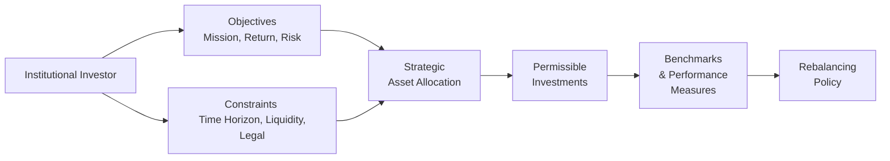

The concept of an Investment Policy Statement (IPS) reminds me of a conversation I once had with the treasurer of a small college endowment. We were chatting over coffee, and he said something like, “Well, we discovered that without a written plan, our board discussions bounced all over the place—every meeting turned into a debate on short-term market views rather than focusing on the endowment’s long-term mission.” That’s exactly where an IPS comes in: it helps keep everyone’s eyes on the real target and avoid those whimsical market distractions. For institutional investors—pensions, endowments, insurance companies, sovereign funds, and foundations—an IPS is the bedrock that ensures consistency in pursuit of the institution’s objectives.

Purpose and Framework of an Investment Policy Statement  
An IPS is a formalized document that guides the portfolio’s objectives, constraints, governance, and strategic asset allocation (SAA). Although each institution has unique parameters (like the need to pay beneficiaries or to preserve capital for a charitable cause), a well-structured IPS is usually anchored by five foundational questions:  
• Why does the institution invest (what is its mission or purpose)?  
• What are the return objectives and risk considerations?  
• Which constraints shape the investment strategy (like liquidity needs, time horizon, regulatory constraints, or sponsor strength)?  
• How should the assets be allocated among different asset classes?  
• How will performance be measured and monitored over time?

The IPS also sets clear guidelines for governance: who oversees the portfolio, how decisions are made, and the scope of any delegated authority (for instance, to external asset managers). What’s wonderful about the IPS is that it documents long-term thinking but remains flexible enough to adapt to changing circumstances—be it the macroeconomic environment or the institution’s evolving mission.

Core Elements of an IPS  

Objectives and Mission  
In simpler terms, the institution’s objectives are the reason it invests. A charitable foundation may aim to preserve capital while meeting annual grants; a defined benefit pension plan might seek to secure employee retirement benefits under uncertain mortality and market assumptions; an insurance company invests to meet policyholder claims while also optimizing surplus. The IPS clarifies these motivations so that everyone—trustees, investment committee members, and external managers—has a consistent sense of purpose.

Return objectives are typically stated in an absolute sense (“achieve 7% total return annually over a full market cycle”) or relative to a benchmark (“outperform the plan’s composite benchmark by 100 basis points, net of fees”). Stating return targets in an IPS can help avoid strategic drift when short-term market noise gets loud.

Risk Tolerance  
An institution’s risk tolerance is shaped by factors such as sponsor strength (for pensions), funding ratio, liquidity demands, time horizon, and regulatory constraints. A large, well-funded endowment might take on a higher equity weighting (and more illiquidity) than a smaller foundation with a short operating horizon. One anecdote I recall: a regional foundation committed too heavily to private equity just before the Global Financial Crisis, failing to acknowledge the potential pinch on liquidity. With redemption demands hitting all at once, the foundation had to sell certain assets at distressed prices. That’s the cost of ignoring real-world constraints. A well-crafted IPS spells out the maximum tolerable volatility or drawdown and the liquidity cushion needed for ongoing expenditures.

Constraints and Governance  
In many ways, constraints are simply the institution’s real-world operating conditions. Is there a requirement that a certain portion of distributions be made annually (like a 5% spending rule for many US endowments)? Must the assets comply with regulatory or accounting rules that limit certain types of investments? Do external stakeholders impose ESG restrictions, or is social investing a priority? The IPS must reflect all these constraints in an explicit manner. For instance, some regulatory frameworks forbid insurers from holding below-investment-grade bonds above a certain threshold, or a public pension plan might be restricted from investing in certain derivatives. And it’s not just about listing constraints—an effective IPS explains the reasoning behind them.

The governance framework adds clarity about who makes decisions. A typical structure might have an investment committee that sets policy, delegates day-to-day decision-making to the staff or an external advisor, and regularly monitors results. The IPS specifies meeting frequencies, required approvals for major changes, and escalation procedures if guidelines are breached.

Strategic Asset Allocation (SAA)  
Most institutional investors rely on SAA as the primary driver of long-term returns and risk. In the IPS, SAA is where the committee actually enumerates target weights for different asset classes—like equities, fixed income, real estate, private equity, and hedge funds—and identifies permissible ranges around those targets. For example, an endowment might fix a 60% target equity allocation, 25% target in alternatives, and 15% in fixed income. Then they might allow, say, ±5% drift in each category before rebalancing. The key idea is that SAA is not a forecast of which asset class will do best in the next quarter—it’s about aligning the portfolio with the institution’s risk-return profile over the long haul.

Below is a simple visual flowchart illustrating how various IPS components connect with each other:

You can see the journey from an institution’s objectives and constraints, flowing into its strategic decisions and ultimately culminating in performance measurement procedures and rebalancing methods.

Allowable and Prohibited Investments  
Once the SAA is set, the IPS identifies specific investments or strategies that are allowed—or off-limits. Some institutions may prohibit futures or swaps, while others require managers to incorporate ESG criteria. A few might even allow short sales or leverage within certain guidelines. This helps external managers understand the boundaries: “Yes, we can use derivative overlays for duration management,” or “No, we can’t invest in tobacco stocks because of our charitable mission.” For instance, some religious organizations or university endowments adopt negative screens for gambling, weapons, or fossil fuels. The clarity of the IPS can save countless hours of debate (and potential reputational risk) later on.

Performance Measurement Guidelines and Benchmarks  
Setting up robust performance measurement guidelines is a critical step in the IPS. A large pension plan might compare its global equity allocation to the MSCI ACWI or a regionally focused index. Meanwhile, its bond portfolio could be measured against the Bloomberg Global Aggregate Index. The point is to ensure each asset class has an appropriate, investable benchmark capturing the systematic risk exposures.

The IPS also clarifies how often performance is evaluated. Quarterly measurement is common, but typical institutional practice is to judge success over 3–5 years at a minimum—especially for alternative asset classes with a longer lock-up. I once saw an institution hire a global macro hedge fund manager with a 3-year lock-up, then start complaining about short-term drawdowns in the first six months, which ironically contravened what they’d agreed upon. That’s exactly the scenario a well-defined IPS (with spelled-out measurement horizons) tries to avoid.  

Rebalancing Policy  
Rebalancing ensures the portfolio realigns with the SAA after market fluctuations cause drifts in asset weights. An IPS typically states an acceptable deviation from targets (say ± 5%) or sets a schedule (e.g., quarterly rebalancing) or a combination of both. Institutions that adopt dynamic rebalancing might tilt away from expensive asset classes and towards cheaper ones, but that’s usually within the broader rebalancing framework—again, documented right in the IPS.  

In practice, rebalancing can be a challenge, especially when markets are volatile. I recall an endowment in 2020 that watched its equity portfolio plummet during the onset of the pandemic. The board was hesitant to rebalance into risk assets when headlines were screaming doom. Yet the IPS mandated systematic rebalancing. In the end, they stuck to the policy. Their equanimity paid off: the subsequent market recovery rewarded their discipline. 

Developing Risk Tolerance in Detail  
Determining an institution’s risk tolerance typically starts with a deep analysis of funding status, prospective cash inflows and outflows, sponsor backing, and the overall economic environment. For a defined benefit pension plan, one might measure risk in terms of surplus volatility (assets minus liabilities). In an endowment, risk could be measured by the probability of failing to meet spending requirements for a certain number of years in a row. The IPS should articulate these risk measures explicitly—whether it’s a standard deviation of returns, value-at-risk, shortfall risk, or a simpler measure like probability of failing to meet the spending rate.

For instance, a corporate pension plan with a shaky sponsor wants to minimize the risk of underfunding, possibly adopting liability-driven strategies that align bond durations with future pension liabilities. By contrast, a well-funded public pension plan might feel comfortable with a higher equity allocation if it has a strong sponsor and favorable demographics. Either way, the IPS addresses how the plan will handle these scenarios, which fosters clarity if financial conditions deteriorate.

Special Considerations: ESG and Mission Alignment  
Many institutions incorporate environmental, social, and governance (ESG) factors directly into the IPS. The statement outlines the rationale (from values-based considerations to risk mitigation) and the strategies used—negative screening, positive tilting, or active stewardship. Some institutions go further, adding an entire separate policy known as a “Responsible Investment Policy” or “Sustainable Investing Policy,” referencing how managers will be evaluated on ESG criteria. For example, certain philanthropic foundations or university endowments may absolutely prohibit investments in fossil fuels. Others might actively seek green bonds or renewable energy private investments. If your institution is heading in that direction, you definitely want that clarity in the IPS so everyone is on the same page.

Implementation and Monitoring  
After designing the IPS and SAA, the next question is how to implement the portfolio. The IPS might allow for active management or might require an entirely passive approach. Monitoring ensures the managers adhere to guidelines, risk exposures remain aligned with the plan, and results track the benchmarks over time. Some institutions add quite a bit of detail about manager selection and diligence processes—though often that material is in a separate procedures manual, with the IPS setting out the broad principles.

Maintaining discipline is huge. I sometimes joke with colleagues that institutional investing is 10% strategy and 90% not messing up your own plan. The greatest plan in the world is worthless if you can’t stick with it when volatility spikes or if new board members push for a complete direction shift on a whim. That’s why a good IPS is anchored in a well-thought-out governance structure, robust manager evaluation, and a measured approach to portfolio adjustments.

Common Pitfalls and Challenges  
• Vague or Overly General Language: If the IPS simply states “we want high returns with low risk,” it’s practically useless. An effective IPS is specific about constraints, tolerance bands, and benchmarks.  
• Failure to Update: Institutions evolve, risk appetites shift, regulations change. Failing to refresh the IPS can leave the portfolio in a mismatch with reality.  
• Lack of Clarity on Delegated Authority: Who can hire or fire managers? Who can override policy constraints in an emergency? It’s vital to document these processes.  
• Ignoring Liquidity Needs: Overcommitting to illiquid assets can hamper an institution’s ability to service unexpected cash needs, as some endowments discovered during financial stress events.  
• Unrealistic Return Expectations: Setting a 10% target when the environment suggests a lower equilibrium real return can lead to excessive risk-taking. The IPS must be grounded in reality.  

Best Practices for IPS Construction  
• Seek Input from All Stakeholders: Involve trustees, staff, consultants, and sponsor representatives (for pensions) early in the process.  
• Clearly Define Mission and Risk Tolerance: Tie explicit risk measures (like maximum drawdown or funded ratio volatility) to the desired returns.  
• Integrate Rebalancing Rules: Spell out how and when rebalancing will happen—this is your operational blueprint.  
• Set Actionable Benchmarks: Use relevant, investable benchmarks for each asset class, and measure performance across appropriate time horizons.  
• Keep It Flexible but Definitive: The IPS should guide decisions without being so rigid that normal portfolio adjustments become impossible.  
• Communicate, Communicate, Communicate: Educate board or committee members on the IPS contents, so everyone knows why it exists and how it frames decisions.

Exam Tips and Practical Advice  
For the CFA Level III exam—particularly for essay (constructed response) questions—be ready to articulate how an IPS for an institutional investor addresses risk, return, liquidity needs, and time horizon. You might also be asked to critique or propose modifications to a hypothetical IPS. Key steps include:  
• Identifying flaws: e.g., a mismatch between stated risk tolerance and strategic allocations.  
• Recommending changes: e.g., adjusting allocations to align with liquidity constraints.  
• Explaining reasonableness: referencing sponsor strength, legal restrictions, or relevant benchmarks.

If an item set scenario describes a pension plan with an unfunded liability, they might ask how to reflect that in the IPS or to discuss whether a higher equity allocation is suitable. Always connect your arguments to the plan’s mission (e.g., protecting the pensioners). If it’s an endowment, highlight spending requirements and perpetuity goals. If it’s an insurance company, focus on regulatory constraints and matching asset durations to liabilities.

Ultimately, showing you understand the real-world constraints and how they shape risk tolerance is what earns points. The exam is designed to test application, not just memorization. So, remain calm and apply the underlying principles of an IPS whenever you see an institutional scenario.

References for Further Reading  
• Maginn, J. L., Tuttle, D. L., McLeavey, D. W., & Pinto, J. E. (2021). Managing Investment Portfolios: A Dynamic Process (4th ed.). CFA Institute Investment Series.  
• Swensen, D. F. (2009). Pioneering Portfolio Management. Free Press.  
• CFA Institute. (2025). CFA Program Curriculum Level III, Volume 2: Portfolio Construction.  

Test Your Knowledge: Investment Policy for Institutional Investors



### For an institutional investor, which factor is most relevant when defining risk tolerance in an IPS?

- [x] Liquidity needs and time horizon  
- [ ] The current inflation rate  
- [ ] Historical outperformance of equity securities  
- [ ] Lack of staff to manage active mandates  

> **Explanation:** Risk tolerance must take into account constraints like liquidity (how quickly the institution needs cash) and time horizon (how long the money needs to be invested). Inflation or staff expertise can matter, but they are secondary compared to fundamental constraints.

### A pension plan's IPS states that the fund must remain fully funded to protect beneficiaries. Which asset allocation guideline is most aligned with this requirement?

- [x] Emphasizing liability-matching assets such as long-duration bonds  
- [ ] Allocating 100% to equities for maximum growth  
- [ ] Maintaining an even split between equities and real estate  
- [ ] Diversifying into high-yield bonds and commodities  

> **Explanation:** Matching liabilities involves long-duration or liability-driven strategies. This helps ensure the pension remains funded regardless of interest rate fluctuations.

### An IPS for a university endowment is most likely to include which detail?

- [x] Spending policy outlining the annual withdrawal rates  
- [ ] Monthly rebalancing instructions to minimize transaction costs  
- [ ] A daily maximum drawdown threshold of 1%  
- [ ] Strict prohibition on donation acceptance  

> **Explanation:** Endowments typically focus on perpetuity. They outline how much they will distribute each year to fund the institution’s operations. This is part of the core IPS structure.

### If an IPS mandates that the portfolio avoid excessive single-issuer risk, which policy instrument would enforce this mandate?

- [x] Diversification limits on position sizes  
- [ ] Daily trade confirmations to external auditors  
- [ ] Mandated short selling in equity portfolios  
- [ ] Strict rebalancing only at year-end  

> **Explanation:** To avoid single-issuer risk, institutions typically set maximum weights for individual securities. This ensures proper diversification and protects against defaults or large swings in any single name.

### Which best describes a strategic asset allocation in an IPS?

- [x] Approximate long-term target allocations across major asset classes  
- [ ] Weekly adjustments to capture market trends  
- [ ] Custodial requirements for managing securities lending  
- [ ] Short-term speculation in FX markets  

> **Explanation:** SAA is a long-term blueprint defining how much of the portfolio goes into various asset classes, consistent with the institution’s risk tolerance and objectives.

### A large foundation includes a prohibition on tobacco stocks in its IPS. This is an example of:

- [x] Values-based investing constraint  
- [ ] Tactical asset allocation  
- [ ] Enhanced indexing  
- [ ] A rebalancing mechanism  

> **Explanation:** Excluding tobacco stocks is a values-based or mission-driven restriction. It reflects ethical or social considerations within the portfolio’s guidelines.

### In the event that market movements cause the portfolio to deviate from strategic targets, the IPS typically requires:

- [x] Rebalancing to align allocations back to target ranges  
- [ ] Immediate liquidation of all equity positions  
- [x] Communication with the board only if the deviation extends beyond 12 months  
- [ ] Halting any further contributions until the portfolio realigns  

> **Explanation:** Rebalancing policies govern how and when an institution restores the portfolio to its target allocations. Some IPS documents also require notification to the investment committee or board if deviations last too long, though automatic rebalancing can be used too.

### Within the context of performance measurement, the IPS should specify:

- [x] Benchmarks for each asset class and an overall performance benchmark  
- [ ] Instructions to ignore market volatility completely  
- [x] Only broad peer group comparisons  
- [ ] Penalties for underperformance if it persists for two weeks  

> **Explanation:** Proper benchmarking is key. Each asset class should be compared against a suitable index. Then, the entire portfolio might have a composite benchmark. Peer comparisons can be used, but typically after the primary benchmark references.

### Why might an IPS require a detailed governance process for manager selection?

- [x] To ensure consistent decision-making and reduce conflicts of interest  
- [ ] To emphasize short-term performance goals over long-term strategy  
- [ ] To guarantee that asset managers never underperform the benchmark  
- [ ] To prioritize daily manipulation of existing positions  

> **Explanation:** A documented manager selection process aims to reduce conflicts, ensure transparency, and align with the institution’s goals by having a consistent and objective framework for hiring and firing managers.

### True or False: An IPS should be revised monthly to reflect current market trends.

- [x] True  
- [ ] False  

> **Explanation:** While this might occasionally be debated, in practice, frequent revisions can undermine the long-term stability of an IPS. However, some institutions feel monthly or quarterly updates are beneficial if conditions change quickly or if new constraints arise.  


