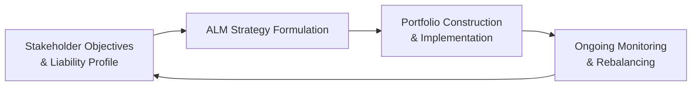

## Introduction

Well, let’s be honest here: handling institutional portfolios can feel like a juggling act. You’ve got many parties—some visible and vocal, others quietly observing—who all have their own objectives, preferences, and time horizons. Then, to add to the complexity, you’ve got liabilities looming on the horizon, be they future pension payments, insurance claims, or ongoing operational funding for a university endowment. And of course, you need to ensure that the portfolio’s time horizon and liquidity profile line up with those obligations in a seamless (or at least manageable) way.

But how does one pull this off effectively, especially under the pressure of fiduciary responsibilities, regulatory constraints, and the occasional 3 a.m. phone call about a major claim payment? Let’s walk through some fundamental considerations—covering stakeholders, liabilities, time horizons, and liquidity needs—so you can approach institutional portfolio management with clarity and confidence. I remember once being on a conference call with a plan sponsor who was panicked about short-term funding pressures, while the board insisted on focusing on the 20-year horizon. That tension, as you’ll see, is all too common. Understanding how to balance such conflicting needs is central to successful institutional investing.

## Stakeholder Analysis in Institutional Investments

Institutional portfolios don’t exist in a vacuum. Each institution has key stakeholders whose inputs and interests shape investment policy. For instance:

• Pension Plans (DB Plans): Think about plan participants (employees, retirees), the plan sponsor (often a corporation or government), and regulators. Plan participants are counting on secure retirement benefits; sponsors want stable contributions and minimal volatility. Regulators need assurance that liabilities are met.

• Insurance Companies: Stakeholders may include policyholders, shareholders (for publicly traded insurers), and regulators who monitor solvency. Policyholders want claims to be paid in a timely manner with no unpleasant run-arounds. Shareholders look for profitability, while regulators ensure that statutory requirements—like risk-based capital—are upheld.

• Endowments and Foundations: Primary stakeholders might be donors, trustees, the charitable entity’s beneficiaries, and sometimes society at large. Donors hope funds will be used responsibly, while recipients want stable, ongoing support. Trustees wrestle with balancing current spending needs against preserving assets for the future (a principle often called intergenerational equity).

• Sovereign Wealth Funds (SWFs) and Government Entities: Citizens, government officials, and perhaps future generations of taxpayers all have a stake in these giant pools of capital. They often require thorough oversight and robust governance structures (you’ll see more in Chapter 7’s discussion on SWF governance).

When considering stakeholder needs, you want to translate “interests” into “investment constraints.” For instance, a public pension fund might be extremely sensitive to periodic drawdowns because any shortfall could raise contribution requirements for taxpayers. Meanwhile, an endowment’s stakeholders might encourage more growth-oriented strategies, believing that smoothing distributions over time can tolerate short-term market volatility.

## Liabilities in Institutional Portfolio Management

If you’ve ever worn multiple hats—say, balancing personal credit card debt, mortgage, and day-to-day expenses—you’ve got a taste, albeit a small one, of how complex institutional liabilities can be. Each institution has some form of promised payment or funding need that shapes its risk tolerance and portfolio design:

• Pension Plans: Their liabilities are future retiree benefit payments. These must be carefully estimated using actuarial assumptions about longevity, inflation, and discount rates. A mismatch between assets and liabilities can have severe consequences—case in point, underfunded pension plans that face abrupt sponsor contributions or benefits cuts.

• Insurance Companies: For life insurers, liabilities could be policies that pay out upon policyholders’ death or annuities that pay retirees over many years. Property and casualty (P&C) insurers have more variable and sometimes unpredictable claims, particularly if a natural disaster hits. If you manage a P&C insurer’s portfolio, you might keep a bigger chunk of assets in safe, liquid holdings to meet sudden claim spikes.

• Endowments & Foundations: Technically, these don't carry “liabilities” in the sense of a legal payout, but they do have obligations to distribute funds for scholarships, research, or philanthropic activities. Many endowments adopt a target spending rule—say 4–5% annually—so the liability is the ongoing spending requirement, plus the implicit obligation to preserve capital for future beneficiaries.

• Banks: Their liabilities (deposits) can be withdrawn in the short term, so banks must hold sufficient high-quality liquid assets to meet potential withdrawals. This shorter-term orientation significantly affects their portfolio’s liquidity structure.

• Government Entities & SWFs: These might have designated goals—funding future budget expenses, stabilizing national finances, or saving for post-oil economies, for example. Each goal can be seen as a distinct type of liability or future funding commitment.

Understanding the nature (and volatility) of these liabilities is job one. You can’t possibly build or manage a portfolio if you don’t know how money will leave the organization.

## Time Horizons

One of my favorite topics in institutional investing is the notion of time horizon. We often assume DB pension plans or a large endowment have “infinite” horizons—especially compared to individuals. But in reality, time horizons can be segmented:

• Short-term: Certain obligations, like a near-term lump-sum payment to retirees or upcoming settlement of claims.  
• Medium-term: Funding milestones that arise five to ten years in the future, like meeting intermediate business strategic goals.  
• Long-term: Ongoing obligations that might span 20, 30, or more years (typical for pension plans or endowments).

Even in a long-horizon scenario, there can be shorter-term constraints. For example, a pension plan sponsor who is subject to credit ratings might face constraints if the plan’s underfunded status balloons in the near term (leading to big sponsor contributions). So the time horizon for investment decisions might be complicated by what I call “near-term optics.”

An insurer with a very long duration life insurance product might invest in long-term corporate bonds or other yield instruments. But a property and casualty insurer with unpredictable claim severity might maintain a more conservative, short-duration approach—effectively having a shorter investment horizon.

## Liquidity Needs

I remember early in my career, we had these “just in case” cash pools for an insurance client that turned out to be deployed exactly one year later when a major hurricane caused an unexpected deluge of claims. Liquidity matters, and building it into portfolio planning is essential:

• Pension Funds: Typically, pension payments can be somewhat forecastable—though not perfectly. If the plan is closed to new participants or has a high ratio of retirees to active participants, liquidity needs rise. Otherwise, DB plans can often tolerate less liquid assets, especially if sponsor contributions are stable.

• Insurance Companies: Liquidity needs can swing widely, especially for P&C insurers that face catastrophic exposures. It’s not uncommon to see them hold large pools of high-quality bonds, T-bills, or other short-term instruments. Conversely, life insurers with stable payouts from mortality assumptions might invest in longer-term instruments.

• Endowments & Foundations: These groups often have moderate liquidity demands—regular distributions that might be 4–5% of the portfolio each year—while striving for returns that outpace inflation. With that said, many endowments have embraced alternatives such as private equity or venture capital for higher returns over the long term, burdening themselves with somewhat heavier illiquidity. This can be fine as long as the trustees confirm that future distributions aren’t threatened by limited partner capital calls.

• Banks: They must comply with strict liquidity coverage ratios (LCR) or analogous regulatory requirements. That means a portion of their balance sheet is allocated to highly liquid securities.

Ultimately, it’s about matching the institution’s liability profile—and the unpredictability of those liabilities—with the portfolio’s ability to generate cash on time and at a fair price.

## Asset–Liability Management (ALM)

One of the most robust frameworks for dealing with all of these complexities is Asset–Liability Management (ALM). Put simply, it’s the process of aligning an institution’s assets to the behavior, timing, and risk profile of its liabilities. This can be as simple as a duration-matching strategy for a pension plan (where the portfolio tries to match bond durations to the plan’s liability duration) or as complex as a multi-period scenario analysis factoring in inflation, interest rates, and sponsor contributions.

Below is a simplified Mermaid diagram illustrating the ALM cycle:

By considering stakeholder requirements (A) first, we shape the portfolio construction (C) in alignment with the nature and timing of liabilities. Then we continuously monitor and rebalance (D) to ensure consistency with changing objectives, market conditions, or regulatory shifts. And the cycle keeps going.

### ALM Techniques

• Duration Matching or Immunization: Commonly used in DB pension plans or life insurers.  
• Surplus Optimization: Looks at asset returns minus liability growth to optimize the plan’s surplus.  
• Cash Flow Matching: For instance, building bond ladders that match outflow schedules.  
• Scenario Analysis & Stress Testing: Vital in cases where interest rates, inflation, or claim events can drastically impact the ability to meet liabilities (see Chapter 2.11 and also Chapter 7 on risk exposures in institutional settings).

## Diversification and Correlation Considerations

An institution’s liabilities are often influenced by macroeconomic or industry-specific factors. For example, a property and casualty insurer’s liabilities may spike after a natural disaster, which might also coincide with capital market volatility if the event has broader economic reverberations. A thorough approach to diversification should consider correlations not just among asset classes but also between assets and liabilities.

• DB Pension Plans: If wage growth is correlated with inflation, the plan’s liabilities could rise along with inflation. In that scenario, inflation-linked bonds or real assets might provide a hedge.  
• Endowments: Market cycles affect both the asset base and philanthropic contributions, meaning a recession could result in reduced donations and a falling portfolio simultaneously.  
• P&C Insurers: They might face significant equity drawdowns alongside large claim outflows. Diversifying into safe-haven bonds or reinsurance instruments might help mitigate that double whammy.  

## Common Pitfalls and Best Practices

• Overlooking Stakeholder Alignment: Failing to engage with key stakeholders (like a board of trustees or major donors) can lead to mismatched expectations and surprise changes in investment policy.  
• Neglecting Near-Term Liquidity: Even if you’ve got a 30-year horizon, big short-term obligations can create forced selling at depressed prices if the portfolio is too illiquid.  
• Overemphasis on a Single Metric: For example, focusing exclusively on asset-only portfolio performance without factoring in liability movements can be dangerously myopic.  
• Lack of Scenario Testing: Stress scenarios aren’t just for reading about in textbooks—they can reveal vulnerabilities that plain-vanilla optimization might miss.  

## Practical Examples

1) A Public DB Pension Fund with a Long-Term Horizon but Politically Sensitive Contributions  
   • Their liabilities stretch decades.  
   • However, local government budgets are tight. If the fund’s funded status dips below a threshold, the sponsor must raise taxes or cut spending.  
   • That near-term political pain might prompt the fund to favor liability-driven investing (LDI) strategies or immunization, lowering the risk of big funded status swings.

2) A University Endowment with an Intergenerational Mandate  
   • Must preserve capital to fund scholarships and research (spending rate ~4–5% yearly).  
   • Grows assets through equity, real estate, and private equity.  
   • Maintains a liquidity sleeve to manage any unexpected capital calls and short-term spending.  
   • Stakeholders (donors, board members, students) are keen on stable annual distributions and alignment with ESG principles (see Chapter 5.10 for ESG integration in institutional portfolios).

3) A Property & Casualty Insurer  
   • Large, unpredictable claim potential from hurricanes or industrial accidents.  
   • Liquidity is critical, so the insurer invests heavily in high-grade bonds that can be liquidated on short notice.  
   • Uses scenario analysis to gauge exposure to catastrophic events and invests in reinsurance to offset tail risks.  

These examples illustrate real-world tensions between wanting to maximize returns (for future obligations) and ensuring enough liquidity to handle near-term or emergency cash outflows.

## Conclusion: Key Takeaways and Exam Tips

• Identify each major stakeholder group and pinpoint how their objectives and constraints shape portfolio decisions.  
• Categorize the liabilities—both their timing and uncertainty. Think about how precise (or not) your estimates can be for retirement benefits, claims, or spending distributions.  
• Assess time horizons with an eye to short-term optics and potential sponsor or regulatory pressures.  
• Maintain enough liquidity to handle large, unpredictable outflows without being forced to liquidate assets at inopportune times.  
• Use an asset–liability management framework to align the portfolio with the liability stream, balancing risk exposure across different time periods and business cycles.  
• Diversify thoughtfully by factoring in liability characteristics and how they might correlate with macroeconomic shocks.  

For the exam, remember that scenario-based prompts often present conflicting stakeholder pressures or a mismatch between the portfolio’s time horizon and its liquidity needs. Make sure you articulate the rationale for your recommended approach, referencing liability characteristics, stakeholder risk tolerances, and the bigger ALM picture. Many essay questions demand you demonstrate how you would respond to changing market conditions that affect both assets and liabilities.

## References

• Fabozzi, F. J. (2012). Bond Markets, Analysis, and Strategies (8th ed.). Pearson.  
• Viscione, J. A., & Taqi, A. (2019). Asset-Liability Management: A Practitioner’s Guide.  
• Blake, D. (2006). Pension Economics. Wiley.  

• For additional background on liquidity standards, see the Basel Committee on Banking Supervision’s guidelines on the Liquidity Coverage Ratio (LCR).  
• CFA Institute (2022). CFA Institute Code of Ethics and Standards of Professional Conduct.  
• Chapters 2.11, 5.5–5.6, and 7.1–7.4 provide more in-depth coverage of risk measures, pension risk, and managing institutional vulnerabilities.  

--------------------------------------------------------------------------------

## Test Your Knowledge: Stakeholders, Liabilities, Time Horizons, and Liquidity



### An institutional investor that has the most predictable liability schedule would likely be:
- [ ] A property and casualty insurer.
- [x] A traditional defined benefit pension plan with stable demographics.
- [ ] A foundation relying solely on donations.
- [ ] A government entity funded by volatile oil revenues.

> **Explanation:** A traditional DB pension plan with stable participant demographics often has more predictable future benefit payments, especially if it has been operating for many years. Property and casualty insurers can face large, unpredictable claim events, and foundations relying on donations can see volatile inflows.

### A key difference between endowments and defined benefit pension plans is that:
- [x] Endowments usually focus on preserving intergenerational equity rather than matching specific future payouts.
- [ ] Endowments have stricter regulatory capital requirements.
- [ ] Defined benefit pension plans face no external stakeholder pressure.
- [ ] Defined benefit pension plans typically have no fixed liabilities.

> **Explanation:** Endowments are not legally required to make specific payments in the same way as pension plans; they aim to preserve capital for future generations while also funding current spending. Pension plans have legally binding liabilities tied to retiree benefits.

### One potential downside of a heavy allocation to illiquid private equity in a university endowment is:
- [x] Difficulty meeting unexpected cash needs without liquidating positions at a discount.
- [ ] Expected returns that are too high to be sustainable.
- [ ] Lower correlation benefits with other asset classes.
- [ ] Reduced pushback from donors and university boards.

> **Explanation:** Illiquid investments may offer higher long-term returns, but they also limit the endowment’s ability to raise cash quickly in a downturn or if unforeseen institutional needs arise.

### Which of the following best describes a scenario heavily influenced by stakeholder preferences?
- [ ] Investing purely in risk-free assets to trivialize interest rate risk.
- [ ] Ignoring sponsor requests to avoid near-term volatility.
- [x] Adjusting the pension fund’s equity exposure downward because the sponsor is sensitive to short-term contribution volatility.
- [ ] Concentrating the portfolio in a single commodity for potential high returns.

> **Explanation:** Sometimes sponsors or plan trustees prioritize stability over maximum potential returns. In this example, the sponsor’s preference to reduce short-term volatility drives the equity exposure adjustment.

### If a life insurer holds a portfolio primarily in long-term bonds to match the duration of its liabilities, this approach is known as:
- [ ] Surplus optimization.
- [ ] Laddering.
- [x] Duration matching (immunization).
- [ ] Cash flow matching.

> **Explanation:** Duration matching attempts to align the average duration of the assets with that of the liabilities, thus immunizing the portfolio from interest rate changes affecting the surplus.

### When an institution uses an asset–liability management approach, it primarily seeks to:
- [ ] Eliminate all possible investment risks.
- [ ] Maximize returns at any cost.
- [x] Align the maturity and risk profile of assets with the timing and uncertainty of liabilities.
- [ ] Minimize management fees through passive investment strategies only.

> **Explanation:** ALM deals with coordinating assets to effectively meet liabilities, targeting an optimal balance of risk and return that accommodates the institution’s obligations.

### An endowment manager who invests heavily in venture capital and real estate but retains a significant allocation to treasuries is likely doing so to:
- [ ] Leverage returns and increase the portfolio’s risk exposure.
- [ ] Apply a pure indexing strategy to match market performance.
- [ ] Hedge equity exposure with currency positions.
- [x] Maintain enough liquidity to meet expected spending and potential capital calls.

> **Explanation:** Balancing illiquid assets like venture capital and real estate with a liquid treasury component allows an endowment to handle near-term spending and any unexpected capital calls without liquidating private positions prematurely.

### A property and casualty insurer might face significant liquidity demands because:
- [x] Claims can escalate rapidly following a catastrophic event, requiring quick access to funds.
- [ ] They only invest in safe government bonds.
- [ ] They have very stable and predictable liabilities.
- [ ] Their policies only pay out upon the insured person’s death.

> **Explanation:** P&C insurers face potentially large and unpredictable claims from natural disasters or accidents, which can force them to raise cash quickly.

### A common pitfall in institutional portfolio management is:
- [x] Failing to stress test the portfolio for simultaneous asset declines and liability increases.
- [ ] Conducting scenario analysis and adjusting accordingly.
- [ ] Monitoring funded status in the case of pension plans.
- [ ] Matching short-term assets with short-term liabilities.

> **Explanation:** Stress testing is often underutilized. Neglecting to test for scenarios where claims spike or liabilities surge exactly when markets turn south is a major oversight.

### Under a liability-driven investing (LDI) approach:
- [x] The focus is primarily on matching asset characteristics to the liability stream.
- [ ] The institution invests entirely in equities to maximize returns.
- [ ] Liquidity is no longer a concern for the institution.
- [ ] The approach ignores stakeholder concerns.

> **Explanation:** LDI centers on structuring the portfolio to match, hedge, or otherwise offset the risk factors tied to the institution’s liabilities, ensuring that obligations can be met under various conditions.


