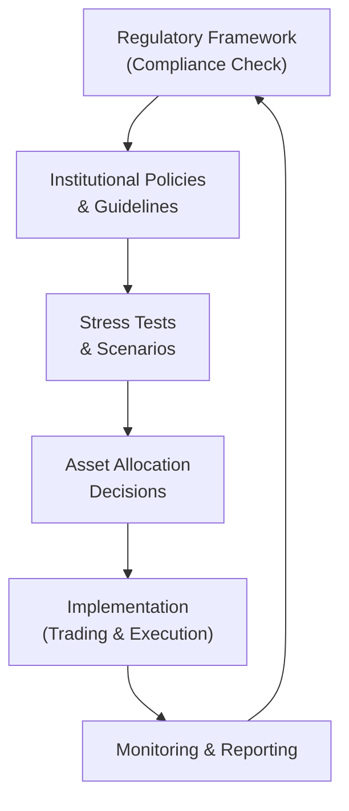

## Introduction
Imagine you’re managing a large endowment fund, feeling quite proud of your newly crafted growth strategy—until your counsel taps you on the shoulder to point out a critical regulatory constraint you (oops) nearly forgot. Been there, done that. When it comes to institutional portfolios, legal and regulatory factors can be just as influential as market sentiment, risk preferences, or even the institution’s overall investment objectives. In this section, we’ll explore how these constraints work in practice, highlighting key frameworks such as ERISA, Solvency II, and Basel III, while also looking at some of the unique tax nuances different institutions face.

Legal, regulatory, and tax constraints are particularly relevant for preparing your Institutional Investor Investment Policy Statements (as introduced in earlier sections like 5.2 and 5.3). Let’s walk through key institution types—pension plans, banks, insurance companies, foundations and endowments—and see how the rules shape, limit, and sometimes entirely dictate asset allocation and risk management decisions.

## The Evolving Legal and Regulatory Landscape
Institutional investors operate within complex webs of domestic and international regulations. These frameworks—matched to the nature of the institution—help ensure solvency, protect participants or policyholders, and maintain market stability. Sure, they can feel restrictive at times. But, boy, do they provide a blueprint for ensuring that stakeholder interests remain protected.

While these rules often differ by region (e.g., U.S. vs. Europe vs. other jurisdictions), you’ll notice a few common themes:

• Minimum capital requirements to safeguard against adverse market events.  
• Risk-based frameworks that tie capital or portfolio composition to measured risks (credit, market, liquidity, operational, etc.).  
• Mandatory disclosures and reporting obligations (e.g., standardized stress tests, scenario analyses).  
• Tax policies that encourage or discourage certain investments and holding periods.

In Chapter 5.1, we introduced the idea that institutions have unique objectives, constraints, time horizons, and liability structures. Legal, regulatory, and tax constraints are a massive element in shaping these differences—particularly because they often carry legal penalties or cause major disruptions if not followed.

Below is a simple flowchart illustrating the relationships among regulators, their rule setting, and the institutions that must comply:

## Pension Funds
Pension funds—particularly in the U.S.—often operate under strict guidelines established by the Employee Retirement Income Security Act (ERISA). ERISA mandates fiduciary responsibilities, funding requirements, and specific disclosures to protect the interests of plan participants. Other countries have equivalent laws or regulatory frameworks that serve similar purposes, ensuring that pension plans maintain enough reserves to pay out promised benefits.

### Key ERISA Provisions
• Fiduciary Duty: Plan sponsors must act in the best interest of participants, which often means focusing on prudent asset allocations, controlling fees, and monitoring investment managers.  
• Prudent Man Standard: Under ERISA, fiduciaries must invest with the care and skill that a prudent individual would use in a similar situation.  
• Funding Requirements: Many pension plans are required to maintain a certain funded ratio (plan assets vs. plan liabilities). This can materially impact how a fund invests—for instance, if a plan is underfunded, it might be pressured to invest more aggressively (or increase contributions) to catch up.  
• Prohibited Transactions and Concentrations: Pension plans may face limitations on certain investment strategies—like heavy self-dealing transactions or large allocations to a single security.

So, if your private pension client is subject to ERISA, your investment strategy might hinge on strict funding targets or diversification criteria. Minimizing concentration risk becomes essential. Also, watch out for any specialized plan-level constraints, like minimum liquidity thresholds to ensure benefit payments or plan-specific guidelines driven by union negotiations.

### International Perspectives
Regulatory frameworks in other jurisdictions, such as the United Kingdom’s Pensions Act or Canadian pension regulations, similarly emphasize funding ratios and prudent management. Across Europe, some pension funds are subject to additional layers of oversight via national legislation or pan-European directives that promote consistent solvency and risk management standards.

## Banks
Banks typically face capital adequacy constraints from the Basel Committee on Banking Supervision—Basel III being the most recent iteration of these standards (with ongoing enhancements scheduled well into the decade). Frankly, I remember having quite the headache deciphering “risk-weighted assets” (RWAs) for a mid-sized bank’s portfolio. But once you get into the swing of things, it’s fascinating to see how regulatory capital drives so many daily decisions.

### Basel III Core Requirements
• Minimum Common Equity Tier 1 (CET1) Capital: Banks need to hold a certain percentage of their risk-weighted assets in high-quality capital (like common stock and retained earnings).  
• Capital Conservation Buffer: On top of the minimum CET1, banks have to maintain an additional capital buffer that can absorb losses during periods of stress.  
• Leverage Ratio: This requirement sets a cap on how leveraged a bank can become relative to its overall assets.  
• Liquidity Coverage Ratio (LCR) and Net Stable Funding Ratio (NSFR): These ratios ensure banks hold sufficient high-quality liquid assets to meet short-term obligations and demonstrate stable funding over a longer horizon.

Basel III effectively limits how aggressively banks can allocate capital to higher-risk assets. If a bank invests in complex derivatives or high-volatility equities, for example, it faces a higher capital charge—thus, limited capacity to deploy capital elsewhere. From a portfolio standpoint, this is huge: it leads banks to either hold more capital or shrink their risk exposures to maintain compliance.

## Insurance Companies
Insurance companies—both life and non-life—are heavily regulated due to their long-term guarantee obligations and the systemic risks they may pose. In the U.S., risk-based capital (RBC) requirements guide minimum capital levels. In Europe, Solvency II is the go-to framework for overall solvency, risk management, governance, and disclosure.

### Risk-Based Capital (RBC)
Under RBC frameworks, an insurer’s required capital is directly tied to the riskiness of its asset portfolio and the underwriting risks on its balance sheet (e.g., for property and casualty insurance, or life insurance products). The RBC ratio is typically calculated as:

( Total Adjusted Capital ) / ( RBC Requirement )

If the ratio falls below a certain trigger, regulators can impose restrictions—like halting dividend payments, demanding a capital infusion, or in extreme situations, taking over the insurer’s operations. This RBC approach practically forces insurers to keep watch on asset duration, credit quality, and concentration risk. For instance:

• Higher-Yield Debt: Typically assigned a higher RBC charge (e.g., lower-rated corporate bonds require more capital held against them).  
• Equities: Often assigned a higher charge per dollar invested than high-grade fixed income.  
• Real Estate or Alternatives: May come with significant capital ring-fencing, depending on local rules.

### Solvency II in Europe
Solvency II is a more holistic approach that sets out ‘Pillar 1’ capital rules (quantitative requirements), ‘Pillar 2’ governance and risk management requirements, and ‘Pillar 3’ disclosure requirements. It aims to align regulatory capital more seamlessly with actual risks. Insurers must calculate a Solvency Capital Requirement (SCR) that fits various risk modules: market, credit, underwriting, and operational risk. They also perform an Own Risk and Solvency Assessment (ORSA)—an internal, forward-looking review that explores capital adequacy under different scenarios.

One advantage of Solvency II over earlier frameworks is the recognition of hedging and diversification benefits—so if an insurer invests in assets that genuinely reduce or offset existing portfolio risks, it can see a lower capital requirement. This is where skillful portfolio optimization can pay off big time.

## Foundations and Endowments
Foundations and endowments can enjoy tax-exempt status but might face:

• Minimum Spending Requirements: In some jurisdictions (e.g., the U.S.), charitable foundations are required to distribute at least 5% of their assets annually. This can tilt the portfolio toward more liquid or income-producing investments, though some will maintain highly diversified portfolios spanning private equity, hedge funds, and real assets.  
• Restrictions on “Jeopardizing Investments”: Some foundation guidelines (or local laws) discourage or prohibit extremely speculative investment activity that could put the endowment’s charitable mission at risk.  
• Unrelated Business Income Tax (UBIT): If the institution engages in activities not substantially related to its exempt purpose—like operating a for-profit venture—income from that business may be taxed. This influences how endowments structure partnerships, especially in alternatives.

If you’ve ever worked with a university endowment, you know how carefully they weigh illiquid investments (like private equity, venture capital) against annual distribution needs. Most endowments seek long-term growth, but they have to keep an eye on annual operational expenses funded by the portfolio’s income or realized gains.

## Tax Considerations Across Institution Types
Tax rules can strongly influence how institutions invest, because tax advantages or penalties shift the after-tax risk/reward trade-off:

• Short-Term vs. Long-Term Gains: Some institutions are taxed more heavily on short-term gains. This can discourage frequent trading.  
• State and Local Tax Exemptions: Certain institutions enjoy local tax benefits, especially nonprofits like hospitals or educational entities.  
• Offshore Structures: In global markets, some institutions use offshore funds (in jurisdictions like the Cayman Islands) to optimize taxes or reduce withholding burdens.  
• UBIT for Not-for-Profits: Even for a tax-exempt foundation or endowment, certain types of income could incur tax liabilities if they are considered unrelated business activity.

In practice, effective tax planning—sometimes referred to as “asset location” (discussed also in 4.7 for private wealth, but equally relevant in institutional contexts)—can be a critical differentiator. For instance, housing higher-yield, more rapidly trading strategies inside a tax-exempt vehicle can reduce your tax drag.

Below is a simple conceptual table illustrating the interplay of key regulations and tax rules:

| Institution     | Key Regulation     | Capital Requirements        | Tax Treatment           |
|-----------------|--------------------|-----------------------------|-------------------------|
| Pension Funds   | ERISA (US), etc.   | Funding Ratio Requirements  | Tax-Deferred/Exempt     |
| Banks           | Basel III          | Risk-Based Capital Adequacy | Corporate Tax           |
| Insurers        | RBC (US), Solvency II (Europe) | Risk-Based Capital or SCR | Varies; Corporate Tax   |
| Foundations/Endowments | State Charity Laws | Not Applicable in Traditional Sense | Generally Tax-Exempt; Some UBIT |

## Real-World Anecdotes and Lessons Learned
I recall a scenario where an eager CIO of a newly formed charitable foundation wanted to allocate half of the portfolio to a local tech startup for “impact” reasons. That’s great for supporting innovation, but it created a massive concentration risk. The legal advisors quickly flagged that this might be considered a jeopardizing investment if it wasn’t aligned with prudent standards or the foundation’s charitable mission. So, that well-intentioned philanthropic strategy had to be scaled back and diversified to avoid regulatory or reputational blowback.

On the insurance side, one life insurer tried to chase higher yields in long-duration bonds just as interest rates were about to rise. Regulatory stress tests under RBC calculations made the CFO realize that capital charges would balloon if credit spreads widened. They ended up pivoting to a more balanced duration strategy, which in hindsight turned out to be a huge relief given subsequent market volatility.

## Common Pitfalls and Best Practices
• Pitfall: Ignoring or Underestimating Regulatory Capital Requirements.  
  – Best Practice: Integrate capital rules early in your asset allocation modeling. Conduct scenario tests to see how capital shortfalls might arise.
• Pitfall: Overlooking the Impact of Tax on Trading Strategies.  
  – Best Practice: Use asset location (see also 4.7) and other tax-optimization techniques. Recognize the different capital gain treatments or UBIT exposures that can hamper performance.
• Pitfall: Inadequate Stress Testing.  
  – Best Practice: Adopt or adapt frameworks like ORSA (Own Risk and Solvency Assessment) or standardized stress tests to ensure compliance and uncover vulnerabilities.
• Pitfall: Overconcentration (especially in private markets or specialized assets).  
  – Best Practice: Maintain broad diversification consistent with fiduciary duty. Monitor large positions rigorously.

## Visualizing the Regulatory Puzzle
Here is another diagram to show how various regulatory frameworks connect to the institution’s internal risk management processes:

In this loop, once institutions internalize the regulatory framework, they run it through stress tests, set asset allocation accordingly, implement trades, and then carefully monitor to ensure compliance. If something changes—like a new regulation or market shock—they update their policies, re-run stress tests, and potentially adjust the portfolio.

## Exam Relevance and Key Takeaways
From a CFA Level III exam perspective, understanding these constraints is critical. You might see scenario-based questions where a pension plan is underfunded and needs an asset allocation overhaul, or an insurer that must adjust its portfolio to keep RBC or Solvency II compliance in good standing. Sometimes you’ll be asked to recommend how a foundation might balance illiquid alternative investments with annual spending requirements. The exam could also test your ability to incorporate taxes into portfolio management, adjusting strategic asset allocations to reflect after-tax returns.

A few final reminders:

• Don’t forget the “why” behind every rule. Regulations exist to protect participants, ensure solvency, and maintain market stability.  
• Incorporate the effect of these rules into your strategic and tactical asset allocation from day one.  
• Keep thinking about the big picture—liabilities, liquidity, risk tolerance, and now, of course, compliance.  
• For exam questions, watch for tricky constraints—like tax rules or unusual exposures—that can alter your recommended solution.

## References for Further Exploration
• U.S. Department of Labor: ERISA. https://www.dol.gov/general/topic/retirement/erisa  
• EIOPA (European Insurance and Occupational Pensions Authority). https://www.eiopa.europa.eu/  
• Basel Committee on Banking Supervision. (2023). Basel Framework. Bank for International Settlements  

You may also want to revisit the relevant sections in the official CFA® Institute curriculum on Institutional Investors and Risk Management, along with specialized journals focusing on pension law or insurance risk-based capital standards for deeper insights.

---

## Test Your Knowledge: Regulatory and Tax Constraints Quiz



### In a U.S. private pension plan subject to ERISA, which of the following is most likely to be the primary regulatory focus?  
- [ ] Maximizing plan sponsor profitability.  
- [x] Ensuring fiduciaries act in the best interest of plan participants.  
- [ ] Avoiding all investments in movements of market interest rates.  
- [ ] Maximizing short-term investment returns only.  

> **Explanation:** ERISA emphasizes fiduciary responsibility, requiring plan sponsors to act prudently and solely in the interests of plan participants and beneficiaries.

### Under Basel III, which measure most directly limits a bank’s ability to use excessive leverage?  
- [ ] Minimum Risk-Weighted Asset (RWA) ratio.  
- [ ] Stress Testing Requirements.  
- [x] The Leverage Ratio.  
- [ ] The Occupational Pension Directive.  

> **Explanation:** The leverage ratio sets a limit on how much a bank can borrow relative to its total assets, regardless of risk weighting.

### What is the main purpose of the Minimum Spending Requirement for many private foundations in the United States?  
- [x] To ensure that philanthropic funds are allocated to charitable causes promptly.  
- [ ] To minimize capital gains within the foundation’s portfolio.  
- [ ] To encourage the foundation to invest only in short-term debt.  
- [ ] To penalize foundations for holding illiquid assets.  

> **Explanation:** The 5% minimum annual distribution rule is meant to ensure foundations distribute funds toward their charitable missions rather than hoarding assets indefinitely.

### Which of the following best characterizes the RBC (Risk-Based Capital) framework for insurance companies in the United States?  
- [ ] A flat capital requirement, unrelated to asset risk.  
- [x] A capital calculation that adjusts according to the insurer’s asset and underwriting risk profiles.  
- [ ] A minimum guaranteed compensation for executive officers.  
- [ ] A single capital ratio for all insurance lines.  

> **Explanation:** RBC ties required capital to measured risks, ensuring that riskier portfolios or underwriting profiles require more regulatory capital.

### Which best describes Solvency II’s three-pillar structure?  
- [x] Quantitative requirements, governance and risk management, and supervisory reporting and disclosure.  
- [ ] Credit risk, market risk, liquidity risk.  
- [ ] Funding ratios, interest rates, and discount rates.  
- [ ] Leverage, capital buffers, and stress tests.  

> **Explanation:** Solvency II is commonly described by three pillars: Pillar 1 sets quantitative capital requirements, Pillar 2 governs risk management and governance, and Pillar 3 establishes detailed reporting and disclosure.

### An underfunded pension plan aiming to comply with strict funding requirements might do which of the following?  
- [x] Increase contributions or adopt a more aggressive investment strategy to improve the funded ratio.  
- [ ] Avoid all equity investments.  
- [ ] Eliminate all bond allocations to boost returns.  
- [ ] Stop offering retirement benefits entirely.  

> **Explanation:** To improve a low funded ratio, plans can add more contributions from sponsors, adopt higher-return (riskier) asset allocations, or a mix of both—while still managing risk responsibly.

### A bank subject to Basel III that invests heavily in high-volatility equities is likely to face:  
- [x] Higher risk-weighted assets and thus higher capital requirements.  
- [ ] Lower capital ratios due to tax advantages.  
- [x] Potential constraints on dividend distribution if capital buffers erode.  
- [ ] Automatic elimination of deposit insurance.  

> **Explanation:** High-volatility equities increase RWAs, requiring the holding of additional capital. If the bank’s capital ratios drop below required thresholds, regulators may restrict dividends or require extra capital issuance.

### Which of the following might trigger UBIT (Unrelated Business Income Tax) for a college endowment?  
- [x] Generating revenue from a commercial real-estate development unrelated to the educational mission.  
- [ ] Capital gains from a buy-and-hold stock portfolio.  
- [ ] Dividend income from a group of widely traded equities.  
- [ ] Interest from U.S. Treasury securities.  

> **Explanation:** UBIT applies to income from activities not substantially related to the endowment’s exempt purpose. Rental income from real estate used purely in commercial ventures could be considered unrelated business income.

### Why might an institution subject to tax on short-term capital gains avoid frequent portfolio turnover?  
- [x] To reduce tax drag and increase the after-tax return.  
- [ ] To meet minimum distribution requirements.  
- [ ] Because it never invests in liquid assets.  
- [ ] Because RBC calculations penalize turnover directly.  

> **Explanation:** Frequent portfolio turnover can generate short-term capital gains, which may be taxed at higher rates, eroding after-tax returns.

### A foundation that is required by law to spend 5% of its assets every year for charitable purposes is:  
- [x] True  
- [ ] False  

> **Explanation:** In the United States, many (but not all) private foundations must distribute at least 5% of their assets annually for charitable programs to maintain their tax-exempt status.


