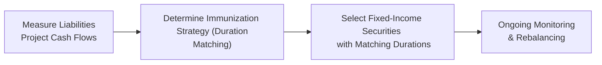
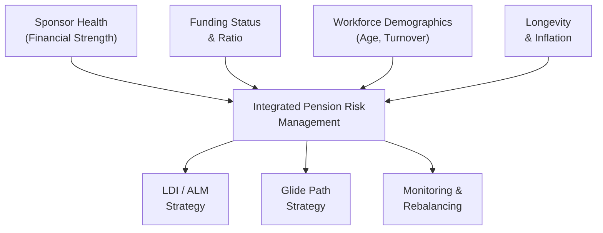

## Introduction

I remember chatting with a friend who worked at a mid-sized manufacturing firm. He was super worried about the company’s pension plan—they had promised their employees generous retirement benefits, but the plan's funding ratio was slipping. Every time bond yields inched down, the firm’s pension liabilities ballooned. And let's be honest: it’s no fun watching your future obligations swell while your plan assets struggle to keep pace.

Defined benefit (DB) pension plans can be a dream come true for participants seeking financial security in retirement, but they can also be a big headache for sponsors and asset managers. Here we’ll take a close look at how DB plans face risks related to sponsor strength, funding imperatives, workforce demographics, longevity, and inflation. We’ll also talk about strategies like liability-driven investing (LDI) and glide paths, plus the regulatory environment that envelops it all.

If you recall earlier sections of this volume—like the discussion of liability-driven investing (see section 2.7)—a lot of these ideas overlap. But DB plans also have their own distinct challenges and complexities related to risk. Let’s walk through these step by step.

## Plan Sponsor Risk

Plan sponsor risk—sometimes called employer risk—refers to the financial health of the organization that promises to fund the pension benefits. If the sponsoring employer is financially fragile, the security of the plan can definitely come under pressure. For instance, imagine you work for a struggling airline that’s made big pension promises. Those promises might not mean much if the sponsor is teetering on the edge of bankruptcy.

• Risk of insolvency or restructuring: A sponsor with weak finances might be forced to reduce or discontinue contributions to the plan.  
• Pressure for higher returns: Employers with limited cash flow often press their pension managers to aim for higher investment returns to cover shortfalls, thus potentially taking on higher risk.  

It’s sort of like an umbrella: as long as the sponsor’s finances are strong, the DB plan has a safety net. But if the sponsor’s bottom line deteriorates, that umbrella might fold when you need it most. That’s why DB plans and corporate sponsors frequently move in tandem. A sponsor in a cyclical industry (like automotive, if you’ll excuse the personal anecdote—I once dealt with an auto supplier whose fortunes rose and fell with the broader car market) sees its business fortunes and pension plan risk swirl together in an intricate dance.

## Funding Status Influence

A DB plan’s funding ratio—often defined as:


\text{Funding Ratio} = \frac{\text{Market Value of Plan Assets}}{\text{Present Value of Plan Liabilities}}


—drives the plan’s risk tolerance and investment strategy. We can also represent the surplus (or deficit) succinctly in KaTeX as:


\text{Surplus} = A - L


where \\(A\\) = plan assets and \\(L\\) = plan liabilities.

• Underfunded plans: If assets are below liabilities (a funding ratio under 100%), the plan is underfunded. Underfunded plans might feel pressured to take on additional equity risk or leverage in the hope of closing that gap. But that can quickly turn into a double-edged sword because higher return potential is accompanied by higher volatility.  
• Overfunded plans: If the plan is overfunded, the plan sponsor may not want to lose that surplus from an equity market crash. They might adopt a more conservative posture (with more fixed income, for example).  

I once spoke with a pension risk manager at a regional bank who had an 88% funded plan. She felt compelled to shift part of the portfolio into higher-yielding assets, figuring, “What’s the alternative?” But that very shift gave her some sleepless nights during volatile markets. That’s the irony: the same risk exposures that can help you catch up can also dig the hole deeper if markets move against you.

## Workforce Characteristics

The structure and demographics of the sponsoring organization’s workforce heavily influence a DB plan’s liquidity needs and time horizons:

• Aging workforce: If a large proportion of the plan’s participants are already retired or are close to retirement, the plan experiences bigger regular cash outflows in the near term. That short horizon might limit how much risk the plan can take because it needs to preserve enough liquidity to meet benefit payments.  
• Younger employees: If the plan population skews younger, the plan can invest with a longer time horizon. In theory, this can support a higher equity allocation.  
• High employee turnover: A workforce with high turnover might push participants to leave the plan early, possibly accelerating certain types of payout obligations (depending on plan rules).  

Think of it like planning a family vacation: if you have older kids with busy schedules, you might need to keep your plans flexible. If you have young kids, maybe you schedule a big outing way in advance. Pension plans often work the same way, aligning benefits with the typical age profile of their participants.

## Longevity Risk

Longevity risk is that oh-so-human problem: people might outlive the initial assumptions built into the plan’s mortality tables. If participants live longer than expected, then the plan pays out benefits for more years than planned, raising total liability. That’s excellent news from a human perspective—you get to enjoy more time—but it’s a cost challenge for the plan.

• Updated mortality tables: Plans rely on actuarial data to estimate lifespan. As medical advances and healthier lifestyles extend average lifespans, sponsors might need to adjust liabilities upward.  
• Longevity hedges: Just like you can hedge interest rate risk with interest rate swaps, you can hedge longevity risk with instruments like longevity swaps or insurance products designed to pay out if participants exceed their expected lifetime.  

I once followed a UK-based pension plan that implemented a longevity swap because they were worried about their retirees surpassing the life expectancy used in their calculations. And guess what? Some of those retirees lived well into their 90s. Good for them, though it meant the plan needed that hedge to stay on track.

## Inflation Risk

Many DB plans include cost-of-living adjustments (COLAs), tying benefit payouts to inflation. This feature helps retiree purchasing power but raises the plan’s obligations if inflation runs hot:

• Real liabilities: If benefits are inflation-linked, liabilities behave like bonds with an inflation component, meaning they grow with rising price levels.  
• Asset mismatch: If the plan invests mostly in nominal bonds, it could lag behind unexpectedly high inflation.  
• Inflation-hedging assets: Some DB plans use Treasury Inflation-Protected Securities (TIPS) or real assets (e.g., real estate, commodities) to offset inflation risk.  

You might recall from earlier chapters that inflation risk management can be important for both private and institutional clients (compare with section 4.4, “Effects of Taxes and Inflation on Private Wealth Decisions”). DB plans, given their obligations, take it even more seriously.

## Asset–Liability Matching

Asset–liability matching, or liability-driven investing (LDI), forms the core risk management approach for many DB plans. The plan’s guiding principle is to align the asset portfolio’s duration, cash flows, and risk exposures with those of the liabilities. Essentially, the plan invests in assets whose value changes in tandem with liabilities, typically by focusing on long-duration bonds if the liabilities themselves are bond-like.

Below is a simple Mermaid diagram summarizing the asset–liability matching process. Think of it as a conceptual flow of how DB plans combine liability measurement with asset selection:

When interest rates move, the market value of liabilities (i.e., the present value of future payments) moves as well. A plan that invests in bonds with a similar duration can offset those swings. Of course, the plan might still allocate to equities or alternative assets if it has the risk appetite and the need to generate a higher return—but those decisions must be balanced against the plan’s liability profile.

## Regulatory Environment

DB plans typically face stringent regulatory requirements around funding. In many jurisdictions, regulations require:

• Minimum funding thresholds: Sponsors must maintain a certain minimum funding level or face mandates to contribute more.  
• Regular actuarial valuations: Plans must produce periodic assessments of liabilities and funding ratios.  
• Penalties for underfunding: Some regulations impose penalties or additional oversight on underfunded plans to protect the retirees’ interests.

This regulatory overlay is crucial for plan sponsors and influences everything from risk budgeting to asset allocation. I’ve seen sponsors scramble to meet year-end tests after a big drop in their plan’s investment portfolio. That can create urgent liquidity demands or forced de-risking—neither of which is pleasant.

## Glide Path Strategies

A “glide path” is a systematic approach to reducing the plan’s equity risk exposure as the funding ratio improves—think of it as a slow and steady landing pattern that aims to lock in gains and reduce volatility:

• Pre-specified triggers: The sponsor might say, “When we reach a 95% funded ratio, we’ll shift 10% out of equities into long-duration bonds.”  
• Reducing risk as you approach full funding: The idea is that once the plan is nearly fully funded, it would be a shame to lose that surplus in a market downturn.  

In a sense, a glide path is the DB plan’s version of “taking your chips off the table” as you near the target. A well-designed glide path can also help sponsors limit the emotional or ad-hoc decision-making that often accompanies big market swings.

## A Closer Look at Practical Examples

It might help to see how all these elements come together in a risk management framework:

• A plan sponsor in the tech sector, with a 105% funded ratio, a fairly young workforce, and a robust sponsor balance sheet: They might maintain a balanced portfolio with a modest tilt to growth assets like equities, given the younger demographic and strong sponsor support. They may also have a well-defined glide path to de-risk once they dip to 100%.  
• A plan sponsor in a declining manufacturing sector, with a 90% funded ratio, a largely older workforce, and shaky finances: They might be forced to “swing for the fences” in equities or alternative assets to close the gap but must weigh that gamble against the possibility of further underfunding. They could also consider embracing a partial LDI approach for at least a segment of the liabilities to reduce interest rate risk.  

The real art in DB plan risk management is figuring out how much you can rely on a strong sponsor, how quickly you need to meet obligations, and how comfortable you are with volatility in the path to fully funded status.

## Best Practices, Common Pitfalls, and Strategies

• Best Practices:  
  – Align risk management with plan liabilities. Where feasible, use liability-driven investing or partial immunization to reduce interest rate and inflation mismatch.  
  – Understand workforce demographics thoroughly—forecasts for retirements matter.  
  – Develop a glide path that sets clear funding-ratio triggers to reduce risk systematically.  

• Common Pitfalls:  
  – Overreliance on a struggling sponsor. You might let the sponsor’s short-term cash needs push the plan into too-risky strategies.  
  – Neglecting longevity risk. If participants live longer than you’ve priced in, that mismatch can blow up your funding forecasts.  
  – Poor rebalancing discipline. Plans sometimes skip rebalancing during volatile markets, ending up with a misaligned portfolio that no longer tracks liabilities.  

• Strategies to Overcome:  
  – Embrace derivatives (e.g., interest rate swaps, longevity swaps) if permitted by regulations and if they serve to hedge risk.  
  – Maintain a robust oversight structure with a governance committee that understands both sponsor health and plan objectives.  
  – Communicate regularly with stakeholders. For instance, let employees know that plan investment changes might affect future contributions or benefits.

## Mermaid Diagram on Comprehensive Risk Management

Below is another Mermaid diagram that summarizes how the various risks feed into an integrated risk management framework for a DB plan:

As you can see, each piece—sponsor health, funding level, workforce demographics, longevity, and inflation concerns—feeds into a central risk management approach involving LDI, glide paths, and ongoing monitoring. That’s the integrated mindset that separates a well-run DB plan from a vulnerable one.

## Glossary of Terms

Defined Benefit (DB) Plan: A retirement plan where the sponsor promises a specific monthly benefit, typically based on salary and years of service.  
Plan Sponsor: The employer or organization setting up the retirement plan for employees.  
Funding Risk: The chance that plan assets fall short of future obligations.  
Glide Path: A systematic approach to reducing investment risk (often by lowering equity exposure) as the plan’s funding ratio improves.  
Liability-Driven Investing (LDI): An approach that aligns assets with the plan’s liability profile, typically by matching duration or hedging interest rate and inflation risk.  
Longevity Hedge: A derivative or insurance product that offsets risk if participants live longer than initially expected.

## Conclusion and Exam Tips

Navigating a DB plan’s risk profile isn’t trivial—you’re dealing with multiple moving parts, from the sponsor’s finances to interest rates that fluctuate daily, plus workforce aging, changing regulations, and more. It’s basically a juggling act. But if you keep a clear line of sight on your plan’s liabilities, set up the right governance structures, and adjust your asset allocation using liability-driven principles and glide paths, you’ll be in a better spot.

For the CFA Level III exam, be ready for scenario-based questions. They might hand you an underfunded plan with an older workforce, ask how you’d address interest rate risk, and expect you to integrate sponsor health in your recommendation. Stay focused on the big picture: how do the plan’s liabilities interact with its assets, regulations, and sponsor capabilities?

• Practice writing constructive-response answers that highlight the interplay of sponsor risk, asset allocation, and liability hedging.  
• Don’t overlook details like workforce demographics or the presence (or absence) of COLAs in a plan.  
• Understand that sometimes the best answer is a balanced approach that doesn’t entirely immunize but also doesn’t chase after extremely high returns.

Good luck—this material might feel daunting, but it’s all about connecting the dots between risk management, plan participant wellbeing, and sponsor constraints.

## References and Further Reading

Blake, D. (2021). Modelling Longevity-Related Risks for Pension Schemes and Annuity Providers. Institute and Faculty of Actuaries.  
Antolín, P., Schich, S., & Yermo, J. (2011). The Economic Impact of Protracted Low Interest Rates on Pension Funds and Insurance Companies. OECD Journal.  
CFA Institute. (2025). CFA Program Curriculum Level III, Volume 2: Portfolio Construction.

## Test Your Knowledge: Risk Considerations for Defined Benefit Pension Plans



### Which of the following best describes Plan Sponsor Risk?  
- [ ] The risk that market volatility reduces asset values below plan liabilities.  
- [x] The risk that the employer's financial instability compromises required contributions.  
- [ ] The risk that inflation will outpace plan returns.  
- [ ] The risk that participants will retire earlier than expected.  

> **Explanation:** Plan Sponsor Risk focuses on whether the employer has the financial strength to make good on the pension plan’s funding requirements.  

### How does an underfunded plan typically respond to its funding gap?  
- [ ] By decreasing equity exposure to limit downside risk.  
- [x] By taking on greater investment risk in hopes of higher returns.  
- [ ] By halting all benefits until the plan becomes fully funded.  
- [ ] By restricting plan members from retiring.  

> **Explanation:** Underfunded plans often feel pressured to accept higher risk to quickly improve their funded status, though this can exacerbate losses if markets move unfavorably.  

### Which workforce characteristic is most likely to require a reduction in equity exposure?  
- [ ] A very high ratio of younger employees.  
- [ ] Low turnover in a mid-career workforce.  
- [x] A significant portion of retirees already drawing benefits.  
- [ ] Employees in multiple countries.  

> **Explanation:** A large segment of retirees indicates near-term cash outflows for benefit payments. Plans often reduce equity exposure to meet liquidity requirements with lower market risk.  

### What is the main purpose of a longevity hedge in a DB plan context?  
- [ ] To offset equity market volatility.  
- [ ] To lock in current interest rates for future liabilities.  
- [ ] To ensure plan sponsors can skip contributions.  
- [x] To protect the plan against the financial impact of participants living longer than expected.  

> **Explanation:** Longevity hedges are aimed at mitigating the liability increase when participants outlive standard mortality assumptions.  

### What is the primary concern when a plan has inflation-linked liabilities but invests mostly in nominal bonds?  
- [x] The plan’s assets may lag behind its inflation-driven liabilities.  
- [ ] The plan needs to adopt a longevity swap.  
- [x] The plan can reduce its credit risk exposure.  
- [ ] The plan will have too much equity risk.  

> **Explanation:** If liabilities are tied to inflation, holding nominal bonds alone can create a mismatch when inflation rises, causing liabilities to grow faster than assets.  

### In a liability-driven investing (LDI) approach, which risk is most directly mitigated?  
- [x] Interest rate risk on the plan’s liabilities.  
- [ ] Market risk in equity allocations.  
- [ ] Plan sponsor insolvency risk.  
- [ ] Workforce turnover risk.  

> **Explanation:** LDI primarily addresses interest rate sensitivity by matching the duration of assets to the duration of liabilities.  

### Under a regulatory regime with strict minimum funding standards, an underfunded plan most likely faces which immediate challenge?  
- [x] The need to make additional sponsor contributions or face penalties.  
- [ ] Being forced to hold only government bonds.  
- [x] The allowance to reduce participant payouts.  
- [ ] The requirement to offer immediate lump-sum payouts.  

> **Explanation:** Regulations often require underfunded plans to boost contributions to maintain certain funding thresholds or face remedial measures.  

### What is the main rationale behind a glide path strategy for DB plans?  
- [ ] Increase equity exposure as the plan becomes better funded.  
- [x] Systematically reduce equity exposure to lock in gains as funded status improves.  
- [ ] Eliminate all bonds from the portfolio once fully funded.  
- [ ] Hedge longevity risk using inflation-linked bonds.  

> **Explanation:** A glide path aims to preserve a strong funding ratio by gradually shifting away from volatile assets like equities as the plan gets closer to its fully funded target.  

### Which of the following is a typical best practice for a DB plan seeking to mitigate risk?  
- [ ] Concentrating investments entirely in high-growth stocks.  
- [ ] Ignoring workforce demographics to maintain simplicity.  
- [x] Aligning the duration of fixed-income assets with the duration of plan liabilities.  
- [ ] Halting plan contributions when the plan is fully funded.  

> **Explanation:** Ensuring the fixed-income portfolio has a duration similar to the plan’s liabilities is a cornerstone of liability-driven investing and helps mitigate interest rate risk.  

### True or False: A sponsor with a strong balance sheet can fully offset investment losses in the plan, eliminating all risk for participants.  
- [x] True  
- [ ] False  

> **Explanation:** While a strong sponsor balance sheet can provide a cushion by making additional contributions, it does not eliminate all risk. Markets can be highly volatile, and even a strong sponsor may face financial stress depending on economic conditions, changing business dynamics, or future regulatory actions.  


