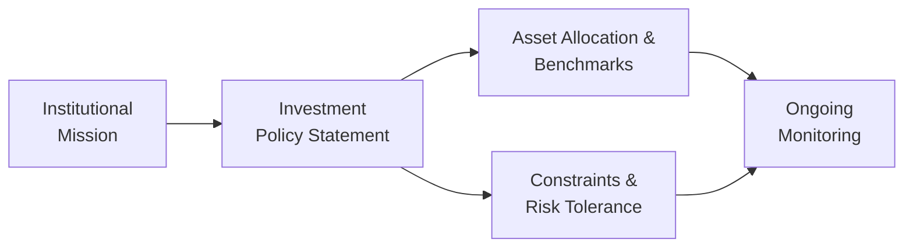

## Setting the Context

I remember chatting with a friend who worked at a university endowment. She told me how their well-intentioned Investment Policy Statement (IPS) had become so outdated that nobody on the team could really explain how it aligned with the university's current goals. And, honestly, that happens more often than you'd think. An IPS can end up just sitting on a shelf if it isn’t carefully evaluated and updated on a regular basis.

For institutional investors—such as pension funds, endowments, sovereign wealth funds, or charitable foundations—the IPS acts like the team’s playbook. It documents investment objectives, constraints, performance benchmarks, risk tolerance, and governance structures. A robust IPS keeps everyone focused, helps maintain discipline under market stress, and provides a framework for accountability. But how do we ensure it’s doing all those things effectively? That’s where evaluating the IPS comes in.

## Why the IPS Matters

An institutional investor’s mission statement can range from “providing retirement security to beneficiaries” to “funding charitable activities in perpetuity.” The IPS sits at the intersection of that mission and the portfolio’s actual structure. You really want everyone to buy into the official policy. If the IPS is off-target—perhaps by overemphasizing return at the expense of liquidity—then the entire approach can be misaligned, which can be quite devastating if circumstances shift. Think about a foundation that needs periodic distributions to fund scholarships: if liquidity constraints aren’t spelled out clearly in the IPS, the foundation might end up in illiquid private equity investments and have to scramble to meet disbursements.

## Key Components to Examine

Objectives and Constraints  
It’s critical for an IPS to specify return objectives and risk tolerance in a way that’s consistent with the institution’s mission. If a pension plan is underfunded, for instance, it might need more aggressive returns. But that higher risk can’t ignore the plan’s near-term liabilities or regulations restricting certain speculative investments. Evaluating the IPS starts with checking: Do the objectives red-flag any contradictory aims, like “maximum returns” under “extreme liquidity constraints”? If yes, that mismatch needs resolution.

A typical formula for the expected portfolio return under strategic asset allocation might look like:

$$
E(R_p) = \sum_{i=1}^{n} w_i \, E(R_i)
$$

where:  
• \\( w_i \\) is the weight of each asset class in the portfolio  
• \\( E(R_i) \\) is the expected return of asset class \\(i\\)  

If the IPS has set a target return of 7%, but the strategic allocation only sums up to an expected 5% on a forward-looking basis, that’s a red flag. Either the institution needs to increase risk, or adjust its goal. This discrepancy should jump out immediately when evaluating the IPS.

### Risk Tolerance and Risk Monitoring

Institutions approach risk in different ways—some are quite comfortable with equity-like volatility if they have a long horizon. Others, like certain insurance companies or banks, have capital adequacy constraints that strictly limit how much risk they can assume at any given time. The IPS needs to articulate these constraints clearly.

In practice:

• Does the IPS specify what kind of drawdown is tolerable?  
• How is risk measured (standard deviation, Value at Risk, shortfall risk)?  
• Are there scenario tests or stress tests?  

If the IPS simply states, “We are conservative,” but invests heavily in high-yield bonds or levered strategies without a robust monitoring process, there’s a disconnect.

### Liquidity Needs

If you’re dealing with an endowment that needs to pay out 5% annually to fund scholarships, the portfolio has to maintain enough liquidity. Alternatively, a sovereign wealth fund with a truly generational horizon can perhaps lock assets away in private markets for a decade or more. When evaluating liquidity stipulations in the IPS, you want to see clarity:

• Specific references to short-term cash flow requirements.  
• Guidelines on permissible asset classes and lock-up periods.  
• Plans for potential liquidity shortfalls (lines of credit or secondary market strategies).  

## Aligning Strategy and Mission

One of the first questions I typically ask institutional clients is: “Wait, do your strategic investments actually match the reason this institution exists?” If an institution’s top priority is capital preservation for future generations, you might expect a portfolio with moderate growth targets, lower leverage, and diversified exposures. On the other hand, an underfunded pension plan with near-term obligations needs growth, but also must carefully manage contributions and risk. A mismatch might show up as:

• Investing heavily in alternative assets while claiming to require daily liquidity.  
• Pursuing very high returns while listing capital preservation as the primary objective.  

In such cases, your evaluation would flag inconsistent priorities. Furthermore, when reviewing the IPS, check how effectively it references the underlying mission or corporate objectives: is there clear articulation of how the stated strategic asset allocation (SAA) helps deliver on the mission?

Below is a conceptual diagram of how the mission, IPS, and investment practices connect:

## Performance Benchmarks and Measurement

Evaluating an IPS also requires a careful look at benchmarks. You might have a total return target and then break it down by asset class. For example, a global equity segment might be benchmarked against the MSCI All Country World Index. If the IPS states performance targets without establishing the right benchmarks, it becomes difficult to assess success or track accountability.

Sometimes, I see an IPS that sets an overall target—“We want to beat a 60/40 comparative index.” But the sub-portfolios have no specified benchmarks, or the benchmarks are outdated (like referencing an index that’s no longer widely used). If you can’t measure performance at the asset class level, how do you know if a manager is adding value? It’s crucial that benchmarks be relevant, investable, and understood by all stakeholders.

## Evaluating Constraints

Constraints in an IPS include everything from legal and regulatory requirements to environmental, social, and governance (ESG) considerations. Many institutions now embed ESG restrictions. For instance, some endowments incorporate “no investment in tobacco or firearms.” The key is clarity: does the IPS define which industries or behaviors fall under these exclusions? Are there permissible thresholds (like 5% of revenue from a targeted industry)? And how is compliance measured?

A mismatch between stated constraints and actual practice quickly leads to trust issues. Suppose the foundation invests in a private equity fund that subsequently backs a high-polluting mining operation. If the IPS prohibits such activities, that’s a direct violation of the constraints. Evaluating the IPS means confirming that these constraints aren’t just lip service—they must be operationally enforceable and consistent with the rest of the policy.

## Governance and Revision Procedures

Many institutional IPSs mention boards, committees, or staff who oversee investments. Usually, they outline who has the authority to modify the policy. Trouble can arise if no one has spelled out the frequency of updates or if the policy states an unrealistic revision cycle. Let’s say the IPS says it’s reviewed annually, but in practice, the committee hasn’t touched it in five years. Um, that’s a recipe for drift and confusion.

Additionally, the IPS should specify how changes are triggered. Do major market shifts automatically prompt a policy review? Is the board required to vote on any deviation from the strategic asset allocation? If these governance details are absent or contradictory, that’s a major gap.

## Manager Selection and Monitoring

A thorough IPS includes a formal process for hiring and firing investment managers. This might define selection criteria: track records, style consistency, team stability, alignment with the institution’s objectives, and so on. And it should describe how often reviews occur and under what conditions a manager could be replaced.

If the IPS is silent about accountability for managers, you might end up in a place where no one knows who is responsible for poor performance or excessive costs. So as you evaluate, watch out for missing or vague statements about:

• Manager due diligence: Are there adequate references to performance analytics, style analysis, or operational suitability checks?  
• Ongoing supervision: Does it mention performance review frequency (quarterly? annually?), risk reports, compliance audits?  
• Termination triggers: Are thresholds for underperformance spelled out?

## Identifying Contradictions and Gaps

Sometimes an IPS is contradictory without anyone realizing it. For instance, I’ve seen an IPS that says “pursue high-risk strategies” but also says “minimize drawdowns at all costs.” That’s obviously unworkable. Or it might say, “managers should avoid excessive turnover,” but also carry a policy that sets narrow maximum tracking error targets for each asset class, effectively giving managers zero latitude to deviate from benchmarks.

When contradictions arise, it’s important to figure out which piece is truly a “must-have” and which piece is flexible, or whether the constraints and objectives can be adjusted so they make sense together. As part of your due diligence, interview key stakeholders—like board members, CFO, or investment committee chair—to see if they’re aware of these inconsistencies.

## Real-World Illustrations

Imagine a large public pension plan in a region with strict local investing rules. The government might require that a portion of the pension invests in domestic infrastructure to spur job creation. The IPS might reflect that, but also mention that the plan aims for global diversification. If the ratio of domestic infrastructure is spelled out in law, you can’t simultaneously achieve a high portion of global equities. The IPS might need a carve-out or a well-defined corridor to remain consistent with the mission. An evaluation of the IPS would pinpoint these challenges, prompting either a legislative adjustment or a revision of the portfolio targets.

Or consider a small charitable foundation with a big reliance on donations. In a down year, donations might decrease, but the foundation may still have the same annual spending requirements. Their IPS might need to specify rules for tapping into principal, reducing grant disbursements, or adjusting the asset allocation. If the IPS is silent on these issues, the entire philanthropic mission can get caught in last-minute decisions.

## Best Practices for Evaluation

• Align with Mission: Revisit the institution’s fundamental purpose. Then ensure the IPS’s objectives, constraints, and strategic asset allocation logically follow from that mission.  
• Clear Benchmarks: Verify each sub-portfolio or asset class has a reliable performance benchmark. Aggregate benchmarks should also be set at the total fund level.  
• Transparent Constraints: Affirm that regulatory, liquidity, and ESG constraints are precisely described and feasible to implement.  
• Governance and Updates: Check who has the authority to revise the IPS, how often it’s revised, and what triggers such changes.  
• Manager Oversight: Confirm that the document outlines how to select, monitor, and terminate managers.  
• Ongoing Due Diligence: Keep an eye out for contradictory or outdated clauses and ensure the IPS remains a living document that matches the institution’s reality.

## Exam Tips

From a CFA Level III perspective, you can expect exam questions that present a hypothetical institution—maybe a foundation, an insurance company, or a public pension fund. They might give you an IPS snippet with certain contradictory goals or incomplete constraints, and then ask how to improve it. Focus on:

• Summarizing key deficiencies  
• Recommending realistic amendments consistent with the institution’s mission, risk tolerance, and time horizon  
• Demonstrating an understanding of liquidity needs, regulatory constraints, or manager oversight processes  

Be prepared for item-set or constructed-response questions where you’ll have to identify if the IPS is consistent with the client’s stated objectives and constraints, or if you’d advise certain changes.

## Key Terms

• Investment Objectives: The main goals of the portfolio, often expressed in quantitative return and risk terms.  
• Constraints: Factors that limit or shape investment decisions, including liquidity requirements, time horizon, regulatory limitations, and ESG preferences.  
• Risk Monitoring: The processes used to measure, evaluate, and manage portfolio risk.  
• Manager Selection Process: The approach used to find and retain high-quality external or internal investment managers.  
• Due Diligence: The thorough investigation of managers, strategies, and processes to ensure they meet required criteria.

## References

• Redington, F. M. (1952). “Review of the Principles of Life-Office Valuations.” Journal of the Institute of Actuaries.  
• Endowment & Foundation Funds Management: Governance Best Practices. Commonfund Institute.  
• CFA Institute. (2025). “CFA Program Curriculum Level III, Volume 2: Portfolio Construction.”

---

## Test Your Knowledge: Evaluating Institutional Investment Policy Statements



### Which of the following scenarios indicates a mismatch between the institution’s mission and its IPS?

- [x] A pension plan aims for aggressive equity exposure but states a strict conservative stance on risk. 
- [ ] An endowment invests in international equities when its IPS allows for global diversification.
- [ ] A foundation with moderate liquidity needs holds a portion of its portfolio in high-quality bonds.
- [ ] A sovereign wealth fund invests in long-duration assets aligned with its long-term mission.

> **Explanation:** Stating a conservative stance on risk tolerance while pursuing aggressive equity exposure is a clear mismatch.

### What is a typical red flag that would prompt revisions to an Institutional Investment Policy Statement?

- [x] The IPS sets expected returns much higher than a feasible sum of asset-class returns.
- [ ] The IPS references a credible global market benchmark for fixed-income assets.
- [ ] The IPS includes well-defined liquidity constraints.
- [ ] The IPS is reviewed on an annual basis.

> **Explanation:** If the portfolio’s strategic allocation produces a significantly lower expected return than the stated target, that is a strong indication of a misalignment.

### Why is it important to have well-defined benchmarks at both total fund and asset class levels?

- [x] So that clarity is provided when monitoring sub-portfolios and holding managers accountable.
- [ ] To simplify the IPS by removing granular detail on each asset class.
- [ ] To ensure that each alternative investment manager uses identical strategies.
- [ ] To comply with regulatory requirements in all jurisdictions.

> **Explanation:** Different asset classes require tailored benchmarks for performance assessment and manager evaluation. A total fund benchmark alone is insufficient.

### Which best illustrates a contradiction in an IPS?

- [x] Stating a strong preference for low-volatility investments but targeting high alpha through leveraged futures strategies.
- [ ] Incorporating sustainable investing guidelines for ESG compliance.
- [ ] Enforcing an annual review to capture market changes.
- [ ] Diversifying across asset classes to reduce risk.

> **Explanation:** A preference for low volatility contradicts the plan to use leveraged futures strategies (generally high volatility). 

### What factor would most likely prompt immediate IPS revisions?

- [x] A sudden regulatory change affecting permissible asset classes.
- [ ] The portfolio exceeding its benchmark in a single quarter.
- [x] The board noticing contradictory constraints in the existing IPS.
- [ ] A manager underperforming the index by a small margin.

> **Explanation:** Major external or internal changes—like regulatory shifts or discovering blatant contradictions—commonly trigger immediate IPS revisions.

### Which approach is an effective component of evaluating institutional IPS benchmarks?

- [x] Comparing asset-class returns against recognized broad market indices regularly.
- [ ] Maintaining a single benchmark for all asset classes and strategies.
- [ ] Allowing managers to self-define their performance benchmarks without oversight.
- [ ] Ignoring past performance entirely when setting forward-looking targets.

> **Explanation:** Using recognized indices for relevant asset classes on a consistent basis ensures transparent performance evaluations and accountability.

### Why is it critical to specify procedures for manager selection, monitoring, and termination in the IPS?

- [x] It clarifies accountability and ensures discipline in managing external partnerships.
- [ ] It allows managers to operate without scrutiny or performance targets.
- [x] It prohibits the board from reviewing a manager’s performance data.
- [ ] It lowers research and due diligence costs by eliminating rigorous oversight.

> **Explanation:** By clearly outlining manager oversight, the IPS provides structure for holding managers accountable and maintaining a high-quality program.

### Which of the following constraints in an IPS might conflict with a high expected return objective?

- [x] A minimum allocation to government bonds for regulatory reasons.
- [ ] A small, permissible weighting in alternative strategies.
- [ ] A broad allowance for international equity investments.
- [ ] Periodic rebalancing to maintain target weights.

> **Explanation:** Forcing a large minimum allocation in low-risk bonds often reduces the expected return if the rest of the portfolio is not sufficiently risk-oriented to meet performance targets.

### What is a sign that an institution’s IPS liquidity requirement is properly formulated?

- [x] The bureaucracy for large asset sales is spelled out, ensuring enough time to raise funds for obligations.
- [ ] All funds are locked up for ten years without referencing cash flow needs.
- [ ] The IPS prohibits any short-term holdings like T-bills or money market funds.
- [ ] The institution invests solely in private equity across all sub-portfolios.

> **Explanation:** Liquidity requirements demand specifying practical processes, such as how to quickly convert assets to cash while meeting near-term obligations or disbursement needs.

### True or False: Contradictory mandates in an IPS often surface as inconsistencies between stated risk tolerance and the actual portfolio strategy.

- [x] True
- [ ] False

> **Explanation:** Contradictory mandates, such as proclaiming a high return objective while simultaneously listing extremely conservative constraints, create internal inconsistencies between risk tolerance and investment strategy.




