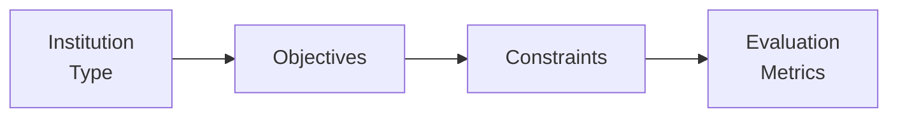

## Introduction

Sometimes when friends ask me about investing for big institutions—like a retirement fund for teachers or a foundation supporting a local university—I can’t help but smile. Managing such portfolios is sort of the “major leagues” of finance. It’s exciting but also challenging because each institution has unique goals, constraints, and stakeholder expectations. Evaluating these portfolios requires us to think carefully about liabilities, policy objectives, spending rules, and a ton of other factors.

We’ll look at four main categories: Defined Benefit (DB) pension plans, Sovereign Wealth Funds (SWFs), Endowments, and Foundations. Each has its own quirks. Let’s walk through them, one by one, and talk about how to evaluate each type of portfolio. We’ll also dig into stress testing, scenario analysis, benchmark selection, and the all-important topic of governance. Get ready to unpack some finance fundamentals and sprinkle in a few real-life stories along the way.

The diagram above is a simple way to visualize how we plan to go about this process. First, identify the institution type, then its objectives, then constraints, and finally how we measure success.

## Defined Benefit (DB) Pension Plans

I once worked with a small municipal DB plan that was severely underfunded because of unrealistic assumptions about future returns. They had an aging participant base, and contributions just weren’t enough to keep up with benefit payments. It was a difficult conversation, but an important wake-up call. DB plans can indeed get into dire straits if liabilities balloon out of control.

### Funding Status and Liability Management

• Liabilities are driven by actuarial assumptions (mortality rates, discount rates, etc.).  
• The funding ratio (assets ÷ liabilities) is critical: if it’s below 1.0, the plan is underfunded.  
• Some sponsors adjust the discount rate to manage reported liabilities, but that can mask true economic risks.

Evaluating a DB plan starts with analyzing the net pension liability. A typical approach involves:

(1) Estimating future pension payments based on participants’ service and benefit formulas.  
(2) Discounting these liabilities at a rate aligning with high-quality corporate bonds or a risk-free rate (depending on local regulations).  
(3) Comparing the present value of liabilities to the plan assets.

### Asset–Liability Matching (ALM)

Many DB plans use an ALM strategy to reduce mismatch risk. The idea is that the portfolio should generate a return sufficient to meet pension obligations while also managing the duration of these liabilities. A common approach is liability-driven investing (LDI), where a portion of the portfolio is allocated to long-duration bonds or derivatives that match the liability structure.

• Example:  
  Suppose a plan has liabilities with an average duration of 12 years. The plan invests in a mix of 12-year treasury bonds and interest rate swaps to stabilize the plan’s funded status. If interest rates rise, asset values may fall, but the present value of liabilities also decreases, offsetting some of the losses.

### Maturity of Participant Base

If most participants are retired or near retirement, the plan may adopt a more conservative portfolio to protect funding levels—there’s less time to recover from a market downturn. Conversely, a younger participant base might tolerate a higher allocation to growth assets like equities or alternative investments.

In short, DB pension plan evaluation is all about measuring if the plan can pay out promised benefits without bankrupting the sponsor. It’s a delicate balance between seeking returns (to reduce contributions) and mitigating volatility (to protect the funded status).

## Sovereign Wealth Funds (SWFs)

Sovereign Wealth Funds are government-owned investment vehicles—often funded from surplus revenues such as oil exports (think Norway’s Government Pension Fund Global) or foreign currency reserves. I remember being fascinated by how some SWFs prioritize intergenerational equity: they want to preserve wealth for future citizens. Others are more about stabilizing the national budget during economic shocks.

### Policy Objectives and Mandates

SWFs can have distinct mandates:
• Stabilization Fund: Provide a buffer during commodity price swings or crises.  
• Savings or Intergenerational Fund: Accumulate wealth for future generations.  
• Strategic Development Fund: Invest in key domestic sectors to spur growth.  

Evaluating performance for SWFs involves examining alignment with these objectives. For instance, a stabilization fund might hold liquid, low-volatility assets like short-term government bonds or developed market equities. Meanwhile, a development fund might have large exposures to local infrastructure or strategic industries.

### Governance and Diversification Constraints

Because SWFs are publicly owned, there can be intense political and public scrutiny. Some SWFs are required to invest in “socially beneficial” projects, which may limit diversification or push the portfolio into suboptimal risk-return profiles. Evaluations typically weigh:

• Overall returns, net of fees.  
• Risk metrics (volatility, drawdowns, correlation to local economy).  
• Compliance with policy goals, such as local job creation or ESG mandates.

In practice, you’ll also want to check if the SWF’s governance structure is robust enough to protect it from short-term political interference. If a government meddles every time there’s an election, the portfolio might lack consistency and discipline.

## Endowments

Endowments are generally established by institutions like universities or charitable organizations. The endowment portfolio supports the institution’s operations in perpetuity. My friend once joked, “If you manage a university endowment, it’s like you can’t EVER liquidate it—they’ll need those funds forever.” Indeed, perpetual existence is the name of the game. 

### Spending vs. Growth

Endowments typically follow a spending policy (for instance, 4% to 5% of the endowment’s average market value over three years). The challenge is to ensure that this spending level, combined with inflation, doesn’t erode the endowment’s real value over time. Evaluations focus heavily on:

• Return relative to the required spending rate plus inflation. If inflation is 2% and the annual spending rule is 4%, the endowment effectively needs 6% returns annually (before fees) to maintain purchasing power.  
• Asset allocations commonly span a diverse mix of equities, fixed income, alternatives (private equity, real estate, hedge funds), and sometimes direct venture capital.  

Performance is measured not only in raw return terms but also in how well the endowment meets long-term real return targets.

### Maintaining Purchasing Power

Endowments exist to support programs reliably. Real purchasing power must be preserved. If an endowment draws down too much or invests too conservatively (or aggressively), it risks failing future beneficiaries. Evaluations typically incorporate a time horizon that’s effectively infinite, paving the way for heavier risk-taking than many institutions.

## Foundations

Foundations resemble endowments but often have slightly different rules around annual distribution requirements. Some jurisdictions mandate that private foundations distribute at least 5% of assets annually to maintain tax-exempt status (this figure can vary).

### Distribution Requirements and Time Horizon

Foundations tend to have an ongoing philanthropic mission, so portfolio evaluations focus on whether they can:
• Meet mandated distribution levels.  
• Cover operating costs.  
• Preserve, or ideally grow, the real value of the portfolio.

If a foundation invests too aggressively, a market downturn may jeopardize near-term distributions. Conversely, investing too conservatively might yield insufficient returns to support their cause over the long haul.

### Comparison with Endowments

Foundations typically have:
• Similar goal of perpetual existence (in many cases).  
• Comparable emphasis on long-term capital appreciation offset by distributions.  
• Possibly greater near-term constraints because the annual distribution is often non-negotiable (by law or mission statements).

## Stress Testing and Scenario Analysis

Stress testing is like imagining the worst rainy day—because it eventually rains. Each of these institutions needs to test how their portfolios might react to events like a global recession, spike in inflation, equity market crash, or real estate downturn. Doing so helps highlight if their risk exposures are consistent with their obligations and mission.

Scenario analysis is a bit broader: we test a variety of plausible but not necessarily extreme scenarios—for example, moderate inflation, mild recession, geopolitical tension, etc. For DB plans, you’d check how interest rate changes or equity downturns would affect the funded ratio. For SWFs, you might examine how an oil price crash or political risk could reduce the portfolio’s liquidity. Endowments and foundations might measure how a sudden drop in equity markets affects the ability to distribute required funds or maintain spending levels.

## Benchmark Selection

Each institution’s benchmark should reflect its unique mandate. This is especially important for evaluating performance in a fair and relevant way.

• DB Pension Plans:  
  Sometimes the “benchmark” is the growth of the plan’s liabilities plus a certain margin (e.g., liabilities + 2%). A more refined approach is using a custom bond index matched to liability duration plus an equity or alternative benchmark for the growth portion.

• SWFs:  
  Many SWFs adopt multi-asset benchmarks combining global equity and fixed-income indices. Some use a strategic benchmark weighting in line with their long-term policy mix. Others might factor in local economy exposures.

• Endowments and Foundations:  
  The typical reference point is a policy portfolio—a weighted combination of equity, fixed-income, and alternative benchmarks. The goal is to compare actual performance to the “if we just followed the policy mix” scenario.

At the end of the day, if the benchmark doesn’t align with the portfolio’s objectives, the performance evaluation will be misleading. For example, an SWF with a mandate to invest in infrastructure can’t be fairly judged against a broad global equity index alone.

## Governance and Transparency

Strong governance keeps these institutions from being derailed by short-term distractions or political interference. It’s about a robust framework:

• Who sets the investment policy?  
• Who oversees portfolio construction and rebalancing?  
• What reporting requirements are in place?  

For SWFs, transparency can be mandated by public accountability. DB plans might have official statements to regulators, and endowments/foundations commonly release annual reports for donors and stakeholders. Clear governance structures foster discipline, enabling long-term strategies despite inevitable market shifts.

## Best Practices, Common Pitfalls, and Strategies

• Best Practice for DB Plans: Align the asset duration with liability duration to minimize interest rate risk.  
• Pitfall for SWFs: Overcommitting capital to illiquid assets for political reasons, jeopardizing short-term liquidity needs.  
• Strategy for Endowments: Use a smoothing rule for spending (e.g., smoothing the portfolio’s market value over three to five years) to avoid big swings in annual distributions.  
• Pitfall for Foundations: Underestimating inflation. If you assume only 2% inflation but it’s 4%, the real value of the portfolio can decline quickly, compromising philanthropic goals.  

Always keep an eye on correlation structures—especially in a crisis. Diversification typically looks good on paper, but if your assets are all correlated in a meltdown, you’ll wish you had a more robust hedging strategy. Scenario and stress testing can uncover these hidden correlations.

## Conclusion

Evaluating portfolios of DB pension plans, SWFs, endowments, and foundations requires a holistic view of their objectives, constraints, liquidity needs, and liability structures. Each institution type has different yardsticks for success, so it’s not always about “highest return.” It’s about fulfilling obligations and missions sustainably over the long run.

In your exam preparations (and in real-world practice), consider the bigger picture: how do investment strategies intersect with liability profiles, government policies, philanthropic missions, or spending rules? When you combine these perspectives with rigorous scenario analysis and stress testing, you can help these institutions weather storms and thrive well into the future.

## Final Exam Tips

• Remember to tie portfolio strategies back to each institution’s primary objective.  
• For DB Plans, underscore the importance of matching assets to liabilities (LDI approach).  
• For SWFs, talk about policy objectives and governance structures.  
• Endowments and Foundations revolve around spending policies and preserving purchasing power.  
• Incorporate scenario analysis into your essay answers; the CFA® exam often asks how you’d handle a sudden interest rate spike, equity crash, or other shocks.  
• Time management in the exam: Start with the highest point questions, outline your approach carefully, and make sure each step references the objectives and constraints of the institution.

## References

• Inderst, G. (2009). Pension Fund Investment in Infrastructure. OECD Working Papers on Insurance and Private Pensions.  
• Das, U. S., Lu, Y., Mulder, C., & Sy, A. (2009). Setting up a Sovereign Wealth Fund: Some Policy and Operational Considerations. IMF Working Paper.  
• NACUBO (National Association of College and University Business Officers). Publications on Endowment Management.

## Test Your Knowledge: Evaluating Institutional Portfolios Quiz



### Which of the following best captures the main objective of a Defined Benefit pension plan's evaluation process?

- [ ] Maximizing short-term returns to reduce current pension contributions.
- [ ] Minimizing interest expense for corporate sponsors.
- [x] Ensuring sufficient assets to meet promised liabilities while managing volatility.
- [ ] Maximizing growth without regard to liability management.

> **Explanation:** DB pension plan evaluation revolves around asset–liability matching and managing the plan’s funded ratio, ensuring promised benefits can be paid.

### What is the primary rationale behind liability-driven investing for a DB plan?

- [x] To align the duration of the plan’s assets with the duration of its liabilities.
- [ ] To increase equity exposure for higher expected returns.
- [ ] To eliminate currency risk via hedging.
- [ ] To avoid alternative assets altogether.

> **Explanation:** Liability-driven investing (LDI) specifically addresses interest rate risk by matching asset duration and liability duration, thereby stabilizing the plan’s funded status.

### A sovereign wealth fund whose main goal is to provide liquidity during a national budget deficit is most likely which type of fund?

- [x] Stabilization fund
- [ ] Intergenerational fund
- [ ] Strategic development fund
- [ ] Private equity fund

> **Explanation:** A stabilization fund is designed to offset revenue shortfalls during economic or commodity price downturns.

### Compared to foundations, endowments typically place a stronger emphasis on:

- [ ] Meeting legal requirements for annual distributions.
- [ ] Rapidly spending principal within a finite time horizon.
- [x] Maintaining perpetual support and preserving real purchasing power.
- [ ] Raising supplemental funds via government grants.

> **Explanation:** Endowments generally have a perpetual existence and focus on preserving purchasing power far into the future.

### Which of the following is a common best practice for endowments seeking stable spending levels?

- [x] Using a smoothing rule based on average portfolio values over multiple years.
- [ ] Tying annual spending directly to last year’s market performance.
- [x] Factoring inflation into nominal return objectives.
- [ ] Setting the spending rate arbitrarily at 2%.

> **Explanation:** Endowments often use smoothing mechanisms to avoid sudden fluctuations in annual expenditures and factor in inflation when determining return targets.

### The most likely benchmark for evaluating a liability-driven DB pension plan portfolio is:

- [x] A blended benchmark reflecting the plan’s liabilities and growth assets.
- [ ] A single global equity index.
- [ ] A short-term Treasury bill index.
- [ ] The sponsor’s weighted average cost of capital.

> **Explanation:** DB plans often use a custom benchmark that captures liability characteristics (e.g., long-duration bond indices) plus components for growth assets.

### Sovereign wealth funds focusing on infrastructure and domestic economic projects face unique risks compared to globally diversified SWFs. One primary risk is:

- [x] Concentration in local projects lacking diversification.
- [ ] Reduced accountability to the government owner.
- [x] Political interference leading to suboptimal allocation.
- [ ] Elimination of liquidity risk.

> **Explanation:** SWFs with local economic mandates may face political pressures, leading to potentially concentrated exposures and suboptimal asset mixes.

### Stress testing for DB plans primarily involves assessing how extreme changes in which variables affect the funded status?

- [ ] Commodity prices and currency exchange rates.
- [x] Interest rates, equity market performance, and longevity assumptions.
- [ ] Real estate valuation and corporate earnings forecasts.
- [ ] Duration mismatch in private equity portfolios.

> **Explanation:** DB plans are particularly exposed to interest rates (affecting liabilities), equity markets (affecting assets), and shifting longevity assumptions (affecting total liability payouts).

### For foundations, complying with annual distribution requirements can significantly impact:

- [x] Asset allocation decisions and liquidity management.
- [ ] The need for a smoothing rule in liabilities.
- [ ] The tax status of donors.
- [ ] Benchmark selection for short-term government bonds only.

> **Explanation:** Because foundations must often distribute a certain percentage, they must maintain appropriate liquidity and balance near-term distributions with long-term growth.

### True or False: A sovereign wealth fund’s performance is always evaluated solely by measuring absolute returns against a global equity index.

- [x] True
- [ ] False

> **Explanation:** In practice, many sovereign wealth funds with broad, multi-faceted mandates compare performance to custom benchmarks reflecting different asset mixes. However, some do evaluate part of the portfolio against typical global equity or bond indices, plus alternative sub-benchmarks. The key is that not all SWFs rely on a single global index; some do—but many others use more nuanced benchmarks. (The question is a bit tricky. When it states “always,” that’s rarely correct in reality, but it can be true that some portion is measured this way. This might be a debatable item in real-life contexts, so interpret carefully.)


