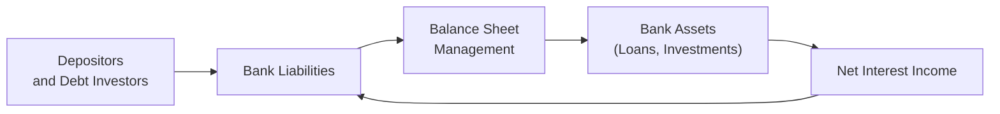

## Overview and Context

Balance sheet management for banks and insurers is, at its core, about aligning assets and liabilities in a way that ensures both solvency and profitability. That may sound straightforward—until you realize that each institution has unique patterns of cash inflows and outflows, regulatory constraints, and stakeholder expectations. While banks juggle deposit liabilities and lending operations, insurers grapple with premium revenues and future claim obligations in ways that shape how their portfolios are invested. In Section 5.2 of this volume, we discussed broad investment policy considerations for institutional investors. Here, in 5.8, we’re going to narrow the focus to two major financial institutions—banks and insurers—and examine the interplay between capital structure, liquidity, and risk management.

Maybe you’ve heard folks joke that a bank’s job is to “borrow short and lend long,” meaning it takes in short-term deposits and extends longer-term loans. This mismatch is often the biggest source of risk for banks, especially during volatile market conditions. Insurers, for their part, aren’t exactly off the hook. They have to forecast claims, maintain healthy investment returns, and meet regulatory capital requirements. Each path has a unique set of challenges. Let’s dig deeper.

## Banks: Key Balance Sheet Considerations

Banks typically see themselves as intermediaries between depositors and borrowers. They invest depositors’ money into loans, bonds, and other assets. This is subject to a host of regulations and constraints aimed at maintaining the safety of the broader financial system.

### Asset Composition and Strategy

A bank’s assets often include:
• Loans to businesses, individuals (mortgages, auto loans, personal loans), or other entities.  
• Investment securities, such as government bonds, corporate bonds, and even equities (though typically in limited amounts).  
• Reserves with the central bank, which may be mandated fully or partially by regulatory requirements.  

Quality of assets matters a lot. To be frank, if there’s one thing you can’t let slip, it’s your loan underwriting standards. I remember hearing a senior banker say, “Bad loans are like rotting fruit in the fridge; ignoring them doesn’t make them fresher.” The point? Deterioration in loan quality eventually shows up in decreased asset values and higher non-performing loans (NPLs), hurting solvency.

### Liability Structure

Banks’ liabilities are primarily:
• Customer deposits (demand deposits, savings accounts, time deposits).  
• Short-term borrowings (commercial paper, interbank loans).  
• Long-term debt (bonds or other debt instruments).  
• Equity capital (common stock, retained earnings, and additional capital instruments).  

Deposits can be volatile. If depositors lose confidence (hello, bank run!), you might see massive outflows in a short time. That’s why liquidity planning is crucial. To prepare for scenarios in which depositors unexpectedly withdraw funds, banks maintain liquidity buffers—high-quality liquid assets (HQLA)—that can be sold quickly with minimal price impact.

### The Duration Mismatch and Interest Rate Risk

A major theme across all banks is the mismatch between the duration of assets and liabilities. Loans and bonds generally carry longer maturities than deposits or short-term debt. When interest rates change, the bank’s net interest income (difference between interest earned on assets and interest paid on liabilities) can be hit if not carefully managed.

Banks use duration-gap analysis to quantify the difference between the weighted-average durations of assets and liabilities. A positive duration gap implies that assets are more sensitive to interest rate changes than liabilities, meaning potential gains if rates fall—but also bigger losses if rates rise. Conversely, a negative duration gap might protect against rising rates but can pinch profits if rates fall.

### Capital Adequacy and Regulatory Considerations

Banks must adhere to capital adequacy requirements set forth in frameworks like Basel III (implemented through local regulatory authorities). The Common Equity Tier 1 (CET1) Ratio, for instance, ensures the bank has enough high-quality capital to absorb losses. Additional key metrics include:
• Liquidity Coverage Ratio (LCR): requires holding enough HQLA to cover potential cash outflows over 30 days of stress.  
• Net Stable Funding Ratio (NSFR): ensures banks have sufficient stable funding to match longer-term asset profiles.  

Just how important are these ratios? Extremely! They put the guardrails on how aggressively a bank can lend or invest, essentially shaping the institution’s business model. In Chapter 6.1, we explored transaction costs and different liquidity considerations in trading environments. Those concepts tie directly back to how banks manage their liquidity through constant interplay of short-term funding, central bank reserves, and capital markets access.

### Tools and Approaches

• Interest Rate Swaps: Suppose a bank is worried about rising rates on its floating-rate liabilities. It might enter into a swap to pay fixed and receive floating, creating a hedge.  
• Securitization: Banks sometimes transform a portfolio of loans into asset-backed securities, thereby freeing up capital for further lending.  
• Stress Testing: Regulators and internal risk teams frequently run scenarios to gauge the solvency and liquidity of a bank under extreme conditions (like sudden spikes in interest rates or major economic downturns).

The diagram above sketches out a simplified loop, highlighting how depositors and debt holders fund the bank’s balance sheet, which invests in assets that generate net interest income, cycling back to pay liabilities.

## Insurers: Key Balance Sheet Considerations

If you look at an insurance company’s balance sheet, you’ll see similarities to a bank—plenty of liabilities and an investment portfolio. But the core difference is that, for insurers, liabilities usually represent future claim obligations rather than depositors at the door. And those claim obligations can be uncertain in timing and size, so it’s crucial that insurers maintain sufficient liquid assets (especially for P&C) and a well-aligned asset base for longer-term liabilities (often the case for life insurers).

### Life Insurance

Life insurers have a more predictable liability stream because actuaries can estimate mortality rates and the timing of payouts fairly accurately—though not perfectly. As a result, life insurers typically hold long-duration bonds to match the duration of their contracts. In doing so, they adopt a liability-driven investing (LDI) approach, similar to what we saw in Section 2.7 regarding pension funds.

Why LDI? Well, if your liabilities are going to come due in 20 years, you probably want your assets to also mature around 20 years, giving you the best chance of covering those payouts without excessive reinvestment or redemption risk.

### Property and Casualty (P&C) Insurance

By contrast, P&C insurers face liabilities that can be highly variable. Catastrophic events like hurricanes or large-scale accidents can create a sudden surge in claims. As a result, P&C insurers hold more liquid assets, such as investment-grade bonds with shorter maturities, or even cash equivalents. Some also allocate to equities and alternative assets (e.g., hedge funds) to boost returns, but they generally keep that portion lower compared to the more predictable liabilities of a life insurer.

### Regulatory Frameworks and Solvency

Insurers typically fall under RBC (Risk-Based Capital) regulations in the US or Solvency II in Europe, each requiring sufficient capital relative to the insurer’s risk profile. Risk categories might include:
• Underwriting risk: possibility that claims exceed premiums by a large margin.  
• Market risk: declines in investment portfolio value.  
• Credit risk: default or downgrade on bonds.  
• Operational risk: internal or external failures, though usually overshadowed by the larger underwriting and market risks.  

Solvency II in Europe, for instance, uses a “three-pillar” approach—quantitative requirements, governance and supervision, and disclosure—to ensure insurers meet minimum capital thresholds. RBC in the US similarly calculates required capital based on the type and scale of underwriting and investment risks. Keep in mind, as liabilities shift and interest rates vary, insurers often rely on scenario testing (like we saw with banks) to confirm that they can withstand market stress.

### Duration Matching and ALM (Asset-Liability Management)

Like banks, insurers face duration mismatches, but the timeline is usually longer. Life insurers, in particular, might use advanced ALM strategies that incorporate derivatives (e.g., swaps, caps, floors) to hedge interest rate risk. This approach ensures that the insurer’s assets remain aligned with liabilities, even if there’s a sudden drop in interest rates that could increase the present value of future payouts.

Let’s visualize an insurer’s simplified balance sheet:

Here, policyholder premiums feed into the insurer’s liability structure—future claims. The investment portfolio, managed with ALM techniques, aims to ensure that assets will be available to meet those claims as they arise.

## Risk Management Tools and Techniques

Both banks and insurers rely on tools to measure and mitigate the impact of diverse risks. Some are more interest-rate-focused, while others tackle underwriting or market risk.

• Derivative Overlays: Swaps, futures, and options are used to fine-tune interest rate exposure, hedge currency risk, or manage equity exposure.  
• Scenario Testing: Typical scenarios include “parallel shift in the yield curve,” “credit spread widening,” “currency shock,” and “catastrophic insurance event.”  
• Stress Testing (Regulatory and Internal): Regulators often mandate certain stress tests for systemically important institutions. Internally, risk managers tailor stress tests to the biggest vulnerabilities in the business model.  
• Gap Analysis and Duration Matching: By calculating the duration gap, managers can see if their assets and liabilities respond differently to rate changes and adjust as needed.

If you recall from earlier chapters, we’ve seen that a disciplined approach to risk measurement is often the backbone of institutional resilience. Indeed, stress testing is mentioned across various sections of this Volume—particularly in 2.11 (Scenario Analysis in Fixed-Income Portfolios)—and the same concept is relevant here, though with the added dimension of regulatory oversight.

## Regulatory Oversight and Capital Management

In addition to meeting internal objectives (like profitability and growth), banks and insurers must align with their respective regulatory frameworks, which can differ by region but generally share common themes:

• Maintain adequate core capital.  
• Ensure consistent liquidity or solvency under stressed conditions.  
• Establish robust governance and risk controls.  

### Differences in Regulation for Banks and Insurers

Banks typically follow Basel III (and evolving Basel IV) guidelines, which emphasize standardized or internal ratings-based approaches to risk-weighting assets. Meanwhile, insurers who operate under Solvency II or RBC frameworks often have more granular approaches to matching liabilities with assets because the timing and magnitude of claims can be somewhat random (especially for P&C).

## Putting It All Together: Practical Example

Let’s say we have a mid-sized bank, EZBank, with the following simplified profile:  
• Assets: $100M in loans and $30M in bonds (mostly short-term government bonds).  
• Liabilities: $120M in customer deposits and $5M in longer-term debt.  
• Equity: $5M Tier 1 capital.  

EZBank’s biggest fear might be deposit flight if interest rates suddenly spike, prompting customers to move funds elsewhere. The bank uses part of its bond portfolio as a liquidity buffer and also has an interest rate swap to hedge exposure on certain floating liabilities.

Now let’s shift to a life insurer, SafeLife, which collects $50M in annual premiums and invests heavily in 15- to 20-year corporate and government bonds to match the duration of life policies. SafeLife also has a small equity portfolio to enhance yield, but uses equity futures to reduce downside risk if the stock market crashes. Although its liabilities (like death benefits) are relatively predictable, SafeLife must stay vigilant about changes in mortality, interest rates, and credit risk on the bonds it holds.

In both cases, you notice how each institution juggles a unique set of assets and liabilities to match its business model. Different? Absolutely. Similarities? You bet—both rely on robust risk management and capital buffers to remain solvent.

## Common Pitfalls and Best Practices

• Over-Exuberance in Booming Markets: If interest rates are low and credit is plentiful, it’s easy to chase yield and ignore credit risk. This can lead to concentration risk and blow up a portfolio if defaults spike.  
• Inadequate Liquidity Planning: Both banks and insurers can fail if market conditions tighten. Banks may face a run on deposits, while insurers may see higher than expected claims.  
• Ignoring Regulatory Ratios: Failing to meet capital requirements can lead to restrictions on business activities or forced recapitalization.  
• Short-Termism: Constantly targeting immediate profits might undercut the long-term solvency strategy, particularly for insurers with long-dated obligations.

Best practices include:
• Periodic Asset-Liability Reviews: Even if you think everything is matched, the market changes can be swift and brutal.  
• Detailed Stress Testing: Combine macro-economic stressors, market shocks, and operational risk scenarios.  
• Diversification: Whether it’s a bank loan portfolio across industries or an insurer’s investment portfolio across various durations and credit qualities.  
• Dynamic Hedging Programs: Use derivatives carefully to manage risk exposures (especially interest rate risk).

## Exam Tips for CFA® Level III

1. When you see a question on bank balance sheet management, remember to focus on liquidity, capital adequacy, and interest rate risk. Keep those Basel III rules in mind (e.g., LCR, NSFR).  
2. For insurers, watch for scenarios differentiating life and P&C lines. Life insurance typically demands a deeper discussion of duration matching; P&C will emphasize liquidity and uncertainty in claim timing.  
3. Always consider the interplay between assets and liabilities in the context of regulatory constraints—this is the hallmark of institutional portfolio management at Level III. If you see a constructed-response question, highlight ALM strategies and risk coefficients.  
4. Don’t just memorize definitions; practice scenario-based calculations. For instance, how does a 1% rise in interest rates affect the net interest margin of a bank? Or present value of future claims for a life insurer?  
5. Think about the bigger picture. Tying Risk Management (Chapter 7) to these concepts can give you an edge in bridging the gap between theoretical frameworks and real-world implementation.

## References

• Hull, J. (2018). Risk Management and Financial Institutions (5th ed.). Wiley.  
• Dickson, D. C. M. (2020). Insurance Risk and Ruin (2nd ed.). Cambridge University Press.  
• BIS (Bank for International Settlements). (2023). Basel Framework.  

Also consider revisiting earlier chapters of this Volume for connections to scenario analysis (Chapter 2), private wealth parallels (Chapter 4), and the role of stakeholders in institutional investment policies (Chapter 5.2).

--------------------------------------------------------------------------------

## Test Your Knowledge: Balance Sheet Management in Banking and Insurance



### A bank’s biggest challenge in managing its balance sheet often stems from what main factor?

- [ ] High equity capital requirements
- [x] The duration mismatch between assets and liabilities
- [ ] Excess reserves at the central bank
- [ ] Overreliance on derivative overlays

> **Explanation:** Banks typically face lengthier asset maturities (loans and bonds) compared to their often short-term liabilities (deposits). This mismatch creates exposure to interest rate and liquidity risks.

### Which best describes why life insurers favor longer-duration bonds?

- [ ] To maximize capital gains in a bull market
- [ ] To gain an advantage in short-term trading
- [ ] To reduce premium volatility
- [x] To match the longer-term nature of their policy liabilities

> **Explanation:** Life insurers typically have long-dated liabilities (e.g., life policies), so investing in longer-duration bonds helps match assets with anticipated cash outflows.

### Under Basel III, which metric ensures a bank holds sufficient high-quality liquid assets to survive 30 days of outflows?

- [ ] Common Equity Tier 1 Ratio
- [x] Liquidity Coverage Ratio (LCR)
- [ ] Solvency II coverage ratio
- [ ] Risk-Based Capital (RBC) requirement

> **Explanation:** The LCR compels banks to maintain enough liquid assets to cover projected cash outflows over a 30-day stressed scenario.

### A large property and casualty (P&C) insurer is concerned about catastrophic events. Which asset allocation strategy is most appropriate?

- [ ] Allocating primarily to long-duration bonds
- [ ] Allocating heavily to emerging-market equities
- [x] Maintaining a higher portion of short-duration and liquid assets
- [ ] Using only equity futures to hedge market risk

> **Explanation:** P&C insurers face unpredictable timing and magnitude of claims, so liquidity is crucial. Shorter-duration assets help deal with sudden claim payouts.

### Which of the following is a correct statement about duration-gap analysis?

- [ ] A negative duration gap means assets are more sensitive to interest rates than liabilities.
- [ ] Banks always desire a positive duration gap.
- [ ] Duration-gap analysis is ignored under RBC frameworks.
- [x] It measures the sensitivity of a bank’s asset and liability values to interest rate changes.

> **Explanation:** Duration-gap analysis calculates how changes in interest rates affect assets vs. liabilities, helping to manage interest rate risk.

### Solvency II primarily applies to which institutions?

- [ ] US-based banks
- [x] European insurance companies
- [ ] All global financial institutions
- [ ] Only property and casualty insurers worldwide

> **Explanation:** Solvency II is a European regulatory framework for insurers, requiring them to hold capital in proportion to the risks they face.

### When a bank securitizes a portfolio of loans, what is the main motivation?

- [ ] Increase deposit inflows
- [x] Free up capital for new lending
- [ ] Shift deposits to long-term fixed rates
- [ ] Eliminating the need for an LCR analysis

> **Explanation:** By bundling and selling loans, the bank removes them from its balance sheet, thereby freeing up capital to engage in further lending or meet regulatory requirements more comfortably.

### In times of rising interest rates, which hedge position would a bank typically prefer if it wanted to protect net interest income on its floating-rate liabilities?

- [ ] Pay floating, receive fixed in an interest rate swap
- [x] Pay fixed, receive floating in an interest rate swap
- [ ] Enter a currency forward contract
- [ ] Sell equity futures

> **Explanation:** If floating-rate liabilities become more expensive when rates rise, the bank can hedge by receiving floating and paying fixed, stabilizing the net cost of liabilities.

### For a life insurer that invests in long-duration bonds, which of the following is the best hedging strategy to protect against a sudden drop in interest rates?

- [ ] Selling equity call options
- [x] Buying interest rate floors or swaptions
- [ ] Taking short positions in government bonds
- [ ] Purchasing a currency futures contract

> **Explanation:** If interest rates drop, the present value of liabilities increases. Instruments like interest rate floors or receiver swaptions can offset part of that liability increase.

### A scenario test that examines the effect of a severe economic depression combined with global health crises on an insurer’s reserves is an example of:

- [x] Stress testing
- [ ] Operational efficiency analysis
- [ ] Credit risk analysis only
- [ ] Liquidity coverage assessment

> **Explanation:** Combining multiple adverse factors is a hallmark of stress testing, where institutions evaluate resilience against extreme events.


