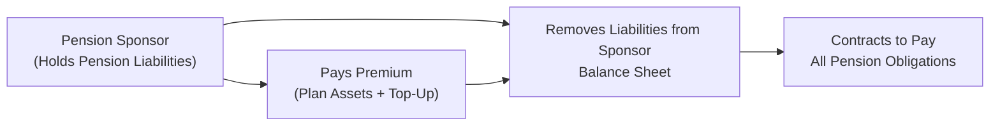
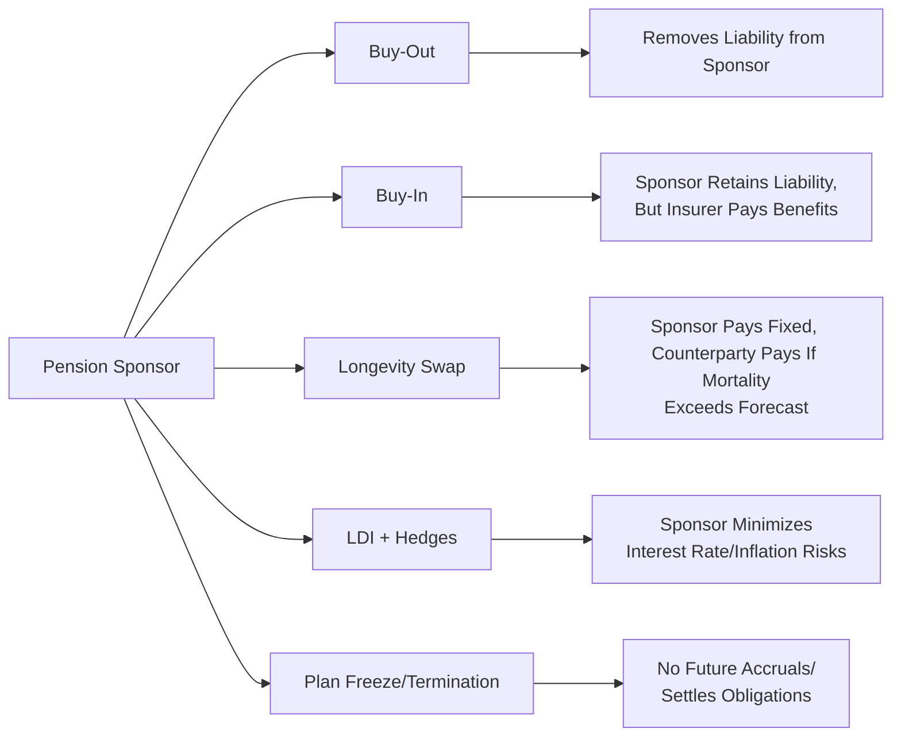

## Background and Rationale for Pension Risk Transfer

Let’s be honest: The longer we live, the more pension payments need to be made. And if you’re the sponsor of a defined benefit (DB) plan, that longevity is both a good thing for humanity and a big, looming concern for your bottom line. Sponsors who manage DB plans juggle multiple types of risk—from interest rate fluctuations to potential underfunding, from longevity surprises to changes in inflation. Over time, these risks can create big swings in the sponsor’s financial statements, complicating capital allocation decisions and occasionally causing a bit of sleeplessness. 

Pension risk transfer strategies can come to the rescue by shifting some or all of that volatility to other entities, especially insurance companies or swap counterparties. As we’ve seen in earlier discussions on institutional investing (see sections on Evaluating Portfolios of DB Plans), pension schemes have unique liability characteristics, which often require specialized solutions to manage or offload risk. In this article, we’ll unravel the main types of risk transfer strategies: buy-outs, buy-ins, longevity swaps, liability-driven investing (LDI) with hedges, and plan freezing or termination. We’ll talk about the why, how, and real-world considerations that sponsors have to face, and we’ll sprinkle in a bit of personal experience to drive the points home.

## Buy-Out Versus Buy-In: Understanding the Differences

Whenever I think about buy-out and buy-in strategies, I’m reminded of a conversation I once had with a CFO who said: “After years of DB headaches, we just want to hand the entire plan off to an insurer—poof—gone.” That is basically a buy-out strategy in a nutshell, but let’s walk through these concepts in a bit more detail.

### Buy-Out

A buy-out is essentially a handoff. The sponsor’s pension liabilities are completely removed from its balance sheet by purchasing an insurance contract. That insurer, in turn, promises to pay future benefits to the plan’s participants. The sponsor’s risk in making those pension payments—whether participants live longer than expected, or interest rates unexpectedly change—totally shifts to the insurance company. Because it eliminates large uncertainties, a buy-out can have a favorable impact on the sponsor’s financial statements, reduce Pension Benefit Guaranty Corporation (PBGC) premiums (in jurisdictions where that applies), and even help reclaim management bandwidth for other corporate priorities.

But every silver lining has a cloud: Buy-outs can be expensive. The insurer, naturally, charges a risk premium for the service. Furthermore, if the plan is underfunded, the sponsor typically needs to top up funding to a level that will attract an insurer’s interest. Thus, buy-outs typically occur when the plan is at or near full funding. Let’s represent the simplified flow in a diagram:

### Buy-In

A buy-in is like a buy-out’s close cousin, but the plan sponsor keeps the legal responsibility for the liabilities. In a buy-in, the sponsor purchases an insurance contract (an annuity policy) that matches the plan’s future benefit payments. The insurance company sends those benefit amounts back to the plan, effectively reimbursing it. This can work especially well if the sponsor wants an extra layer of security for paying benefits—like a safety net—but isn’t quite ready to part ways with the plan entirely.

When would someone choose a buy-in over a buy-out? One scenario is if a sponsor expects plan rules to evolve further or wants to maintain some control. Another scenario is if the sponsor eventually wants to transition from a buy-in to a full buy-out, once the plan reaches better funding levels. It’s also beneficial for sponsors who are comfortable with narrower forms of de-risking but prefer, for example, to retain some optionality around plan design changes.

## Longevity Swaps and the Quest to Tame Longevity Risk

Longevity risk rests on a simple question: “What if people live longer than you (or your actuaries) originally expected?” This can drive DB plans to pay benefits for more years than calculated, increasing liabilities. Longevity swaps let the sponsor transfer that risk to a third party—often an insurer or a bank—by swapping fixed payments linked to expected longevity for variable receipts tied to actual experience.

Here’s the typical arrangement: The sponsor pays a fixed amount (based on some projected mortality assumption); in return, if retirees outlive that assumption, the counterparty covers the excess. If retirees pass earlier than expected, the swap counterparty profits. This arrangement can be an elegant solution if the concern is purely or mostly about uncertain lifespans—and if other factors like interest rates or inflation are either hedged already or not a primary worry.

A key advantage of longevity swaps is that sponsors can specifically target longevity risk without moving the entire plan off their books. However, these swaps involve derivative contracts, so the sponsor must consider credit risk, collateral requirements, and the complexities of ongoing administration.

## Liability-Driven Investing with Hedges

Consider those times when you want to manage a plan’s risk profile but still keep the plan alive and well under your corporate wing. This is where Liability-Driven Investing (LDI) comes in. If you recall from earlier sections on risk considerations for defined benefit pension plans, LDI is an approach to constructing a portfolio so that its sensitivity to interest rates, inflation, or other variables more closely matches that of the liability stream. 

Some sponsors, in an LDI framework, choose to integrate interest rate swaps, inflation swaps, or even longevity risk solutions. Instead of shifting the entire burden to an insurer or fully swapping out longevity risk, LDI with hedges helps manage risk exposures in a more flexible and perhaps cost-efficient manner. You’re still transferring risk—just in smaller, more targeted bits. For instance, you could hedge 80% of your interest rate exposure using interest rate swaps or purchase a longevity hedge for only the plan’s older active members.

This approach allows plan sponsors to remain engaged in investing (particularly if they believe they can generate alpha or investment outperformance) while mitigating the biggest threats to plan solvency. But be forewarned: The sponsor still carries those liabilities on the balance sheet. If there’s a serious mismatch or if some unexpected factor (like a big change in medical technologies that extends lifespans) arises, the sponsor retains that residual risk. 

## Plan Freezing and Termination

Sponsors who anticipate rocky roads can partially or fully freeze their plans. A freeze typically stops future accrual of benefits for participants, capping the sponsor’s potential obligation. It’s basically telling employees: “You still have the benefits you earned up until now, but future accruals will no longer grow under this plan.” While not exactly warm and fuzzy, it’s a method of controlling the growth of liabilities.

A total freeze is a step toward plan termination, but they aren’t the same. Plan termination is a legal closure of the plan, which usually requires the sponsor to fully fund or settle its obligations (e.g., via lump-sum payouts or by purchasing annuities for participants). In some cases, a buy-out can be used as a path to plan termination—once an insurer is handling the liabilities, the plan can effectively cease to exist on the sponsor’s books. 

## Regulatory and Accounting Implications

We can’t talk about pension risk transfers without mentioning the alphabet soup of accounting rules, such as IFRS, US GAAP, and local statutory requirements. From a sponsor’s perspective, a buy-out typically removes the plan from its balance sheet: no more recorded pension obligations, no more associated pension expense or asset volatility. This can be a big plus, making the company’s results look smoother and potentially improving credit ratios. 

Buy-in arrangements, on the other hand, don’t remove liabilities from the balance sheet but can often reduce the plan’s perceived riskiness and help stabilize the sponsor’s reported pension expense. Longevity swaps can also reduce volatility, but the precise accounting treatment can vary by jurisdiction. Derivative-based solutions can lead to new disclosures or new lines on the balance sheet. In short, always consult your friendly neighborhood accountants—this stuff can get complicated!

If you’re subject to PBGC premiums, transferring risk can reduce that cost, too, since PBGC premiums can hinge on how underfunded the plan is. Of course, each arrangement might involve additional fees and contract expenses.

## Real-World Example: The Automotive Sector

I recall reading about an automotive manufacturer that was dealing with a major legacy DB plan. The plan was well-funded on paper, but changes in mortality assumptions were threatening to blow out the sponsor’s liability. Initially, they opted for a partial buy-in: They purchased an annuity policy covering a portion of retired participants. This stabilized part of the plan. Later, once the rest of the plan improved in funding status (thanks to favorable markets and some sponsor contributions), they pivoted to a full buy-out. The result was a big improvement to the sponsor’s balance sheet, though the CFO admitted the premium cost was substantial. Still, sometimes the intangible benefits of stable operations and reduced risk can be worth the price of admission.

## Common Pitfalls and Challenges

• Sticker Shock: Buy-outs and buy-ins can be pricey, especially if you’re underfunded or if insurance market capacity is limited at the time. Always assess the financial impact carefully.  
• Counterparty Risks: Whether it’s a longevity swap or interest rate swap, your hedge is only as good as the counterparty’s credit. Robust due diligence is essential.  
• Complexity: Derivative-based solutions like longevity swaps require ongoing administration, periodic resets, and potential collateral calls. Sponsors must ensure they have the expertise to manage these complexities.  
• Regulatory Hurdles: Plan termination is not just a flick of the switch. You must comply with a myriad of legal requirements, participant notices, and possibly union negotiations.  

## Best Practices for Pension Risk Transfer

• Conduct a Thorough Risk Assessment: Understand precisely what’s driving volatility in your plan—interest rates, inflation, longevity, or a combination.  
• Evaluate Incremental Approaches: A hybrid solution—like a partial buy-in plus interest rate hedges—can be less disruptive. Don’t assume you have to do everything at once.  
• Compare All-In Costs: Factor in insurance premiums, transaction costs, and potential top-up funding. Sometimes the less-sexy, partial hedges are better than a full buy-out if your plan isn’t quite ready.  
• Maintain Clear Communication: Keep employees, retirees, and stakeholders informed about plan changes. Rope in your HR team to ensure participants understand what’s happening.  
• Align with Corporate Goals: If your company is shifting its strategic focus, it might make sense to de-risk or offload the pension plan altogether. Conversely, if you’ve got strong cash flows, you might prefer targeted hedges instead.  

## Diagram: A Simple Comparison of Transfer Methods

## Exam Tips and Considerations

From a CFA Level III exam perspective, pension risk transfer can appear in scenario-based questions involving a DB plan sponsor grappling with funding deficits, high liability volatility, or uncertain mortality assumptions. You might be asked to:

• Evaluate which strategy best meets the sponsor’s objectives and constraints.  
• Compare costs, advantages, and limitations of buy-in vs. buy-out.  
• Calculate the impact on balance sheet or pension expense if the sponsor uses swaps or an annuity purchase.  
• Identify how plan freezing or termination (with buy-out) might reduce the sponsor’s overall risk profile.  

Remember, the CFA exam loves testing your ability to connect a sponsor’s broader financial situation (like liquidity needs, risk tolerance, and regulatory environment) to the choice of risk transfer solution. 

## References and Further Reading

• Merton, R. C. (2006). The Future of Retirement Planning. Harvard Business Review.  
• Campion, M., & Hudson, J. (2022). Pension De-Risking: The Buy-In and Buy-Out Market. Pension Policy Institute.  
• CFA Institute. (2025). CFA Program Curriculum Level III, Volume 2: Portfolio Construction.

## Sample Exam Questions: Mastering Pension Risk Transfer Strategies



### Which statement best describes one key difference between a buy-out and a buy-in?
- [x] A buy-out removes pension liabilities from the sponsor’s balance sheet entirely, while a buy-in does not.
- [ ] A buy-in is only executed for participants over age 65.
- [ ] A buy-out typically involves ongoing sponsor contributions after purchase.
- [ ] A buy-in and a buy-out have precisely the same financial impact on the sponsor.

> **Explanation:** Under a buy-out, an insurer fully assumes the plan’s obligations, eliminating them from the sponsor’s balance sheet. With a buy-in, the sponsor still carries the liability, although an insurance contract backs benefit payments.

### In a longevity swap, which party shoulders the increased cost if retirees live longer than expected?
- [ ] The plan sponsor pays additional amounts.
- [x] The swap counterparty bears the extra payments.
- [ ] Federal regulators reimburse the sponsor for higher costs.
- [ ] The participant’s beneficiary fund handles the extra cost.

> **Explanation:** Longevity swaps transfer the longevity risk to the counterparty. If participants live beyond expected mortality rates, the counterparty compensates the plan for the additional cost.

### What is a primary advantage of using longevity swaps compared to a buy-out?
- [ ] They fully remove pension liabilities from the sponsor’s balance sheet.
- [x] They allow the sponsor to specifically target and hedge only longevity risk.
- [ ] They are typically cheaper than all other de-risking solutions.
- [ ] They eliminate all counterparty risk.

> **Explanation:** Longevity swaps allow plan sponsors to focus on hedging only longevity risk. However, the liabilities remain on the sponsor’s books, and the sponsor faces some degree of counterparty risk.

### A plan sponsor wants to reduce interest rate and inflation risk but still retain control of the investment portfolio. Which approach might be most appropriate?
- [ ] Plan termination.
- [x] Liability-Driven Investing with derivative hedges.
- [ ] Buy-out of all plan liabilities immediately.
- [ ] Purchasing a lump-sum life insurance contract.

> **Explanation:** Liability-Driven Investing (LDI) commonly uses interest rate and inflation swaps to match the plan’s liability profile, allowing the sponsor to keep control over investments and incrementally manage or reduce risk.

### Which of the following is an example of a partial risk transfer method?
- [x] Purchasing a buy-in policy for a portion of retirees.
- [ ] Terminating the plan for all participants at once.
- [x] Executing a longevity swap for the older cohort only.
- [ ] Stopping payment of all future benefits immediately.

> **Explanation:** A buy-in can be arranged for a specific subset of the plan (e.g., retirees only), and a longevity swap can be structured to cover a particular group. These are partial methods targeting specific risk exposures or participant segments.

### What is a top concern when undertaking a longevity swap?
- [x] Counterparty credit risk.
- [ ] Immediate plan termination.
- [ ] Benefit calculations become unregulated.
- [ ] Major reductions in plan sponsor autonomy.

> **Explanation:** Longevity swaps involve a derivative contract with a counterparty. The success of the risk transfer relies on the counterparty’s creditworthiness and the arrangement’s legal structure.

### Why might a plan sponsor choose to freeze its pension plan?
- [x] To limit the growth of future liabilities and stop additional accruals.
- [ ] To reduce the monthly checks retirees are already receiving.
- [x] To prepare for a potential future plan termination.
- [ ] To automatically eliminate all existing liabilities.

> **Explanation:** A freeze halts further benefit accrual, capping future obligations. It does not remove existing liabilities but can be a precursor to eventual plan termination.

### Which statement about buy-outs is correct?
- [x] They typically require the plan to be near or fully funded.
- [ ] They reduce the sponsor’s net cost of capital to zero.
- [ ] They never require an additional cash contribution.
- [ ] They grant participants higher monthly benefits than promised.

> **Explanation:** Buy-outs usually need the plan to be well-funded, since the insurer will price the annuity accordingly. Underfunded plans must bring assets up to par to complete a buy-out.

### What can be a regulatory advantage of a buy-out for a plan sponsor?
- [x] It removes or drastically reduces PBGC premiums (where applicable).
- [ ] It exempts the sponsor from all standard labor laws.
- [ ] It raises the required contribution rates for the sponsor.
- [ ] It makes the sponsor’s retirement plan free for employees.

> **Explanation:** In jurisdictions with PBGC-style coverage, reducing or eliminating the plan removes or decreases PBGC premiums that are tied to underfunding or the existence of DB liabilities.

### True or False: Under a buy-out arrangement, the plan sponsor remains fully responsible for paying participant benefits if the insurer fails.
- [x] True
- [ ] False

> **Explanation:** In many jurisdictions, once a buy-out is executed, the insurer is responsible for paying benefits. However, if the insurer defaults, legal responsibility may revert to the sponsor or to a state guarantee association, depending on local regulations. In practice, sponsors often remain exposed, at least reputationally, if not legally.


