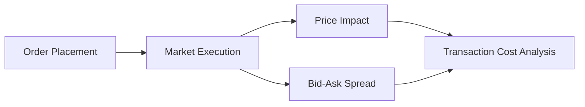

## Introduction

Let’s talk about something that might sound a bit dry at first: trading costs. But believe me, understanding trading costs can be a real game-changer when you’re trying to eke out every last bit of performance from a portfolio. You can think of it as studying the friction that stands between your initial investment idea and its final execution. In an ideal world, you’d spot a great investment opportunity, buy it (or sell it) at the exact price you want, and call it a day. But in the real world—especially if you’re dealing with large trades or time-sensitive market opportunities—it almost never pans out so neatly.

Trading costs can be broken down into two main buckets: explicit and implicit. “Explicit” charges are your direct, easy-to-see line item costs. Then there are “implicit” charges—those hidden or indirect costs that creep into your trades and can hurt performance without you even noticing. Both matter a lot, especially in active portfolio management where, you know, every basis point of performance can feel like it’s written in gold.

Below, we’ll dive into the details of these costs and offer a few ways to think about measuring and containing them. We’ll also look at some real-life examples so that, hopefully, it all becomes a little more intuitive. By the end, my goal is to have you feeling more confident about this topic and maybe even motivated to incorporate cost awareness into your trading strategies.

## Why Transaction Costs Matter

This might be obvious, but let’s say it anyway: transaction costs reduce your net returns. If you’re managing a portfolio actively—maybe trying to outperform a benchmark or chase alpha—transaction costs eat into those returns. And if you’re just passively indexing, well, you still have to rebalance occasionally and face some transaction costs. Over longer horizons, the cumulative effect of these costs can be a pretty big deal.

Market conditions today, with their fragmentation (covered more in Section 6.5) and complex order types (explored in Section 6.11), have made cost analysis even more essential. Also, the rise of electronic trading platforms, low-latency trading, and algorithmic execution have introduced new ways to measure, manage, or even exploit these hidden frictions. But in any environment, cost minimization is a powerful lever in your overall strategy.

## Distinguishing Between Explicit and Implicit Costs

An easy way to decide if a cost is explicit or implicit is to ask yourself: “Can I see this cost on my trade confirmation or brokerage statement?” If the answer is “yes,” that’s probably an explicit cost. If you have to infer the cost from a deviation in price or a change in the market, that’s an implicit cost.

### The Nature of Explicit Costs

Explicit costs are straightforward because they are billed to you or deducted right away. Examples include:  
• Commissions: The most familiar explicit cost. If your broker charges $0.02 per share, and you buy 1,000 shares, you pay $20 in commissions.  
• Exchange Fees: Some exchanges charge transaction fees for providing or taking liquidity. You’ll often see these broken out as separate line items on your trade confirmations.  
• Regulatory Fees and Stamp Duties: In certain jurisdictions, regulators impose fees per share or per transaction, sometimes called “Section 31 Fees” in the United States or “stamp duties” in various markets across Asia and Europe.  
• Taxes: Depending on where you operate, transaction-based taxes or capital gains taxes might be relevant.  

Explicit costs are usually easy enough to sum up and factor into your trade decision. And by the way, if you’re planning a cross-border transaction, you might face additional costs, such as currency-conversion fees or foreign transaction taxes. All of this is considered explicit if it shows up clearly on your invoice.

### The Nature of Implicit Costs

Implicit costs are tricky because they aren’t itemized in obvious ways. They sneak into your trade and can be measured only by comparing your execution to a benchmark or by reconstructing the cost of each trade using detailed market data. The primary types of implicit costs include the following:

• Spread Costs (Bid-Ask Spread): Ever notice that for any particular stock, there’s a difference between the highest price buyers will pay (the bid) and the lowest price sellers will accept (the ask)? If you buy at the ask and immediately sell at the bid, you lose the spread. That’s essentially an implicit cost. The narrower the spread, the cheaper it is to trade.  

• Market Impact: Large trades can move the market. If you’re buying a huge block of shares, your purchases might drive the stock’s price up; if you’re selling, you might push it down. The final execution price ends up worse than it would have been if the order were smaller or the market were deeper in liquidity. Market impact can be a big deal in less liquid securities like small-cap stocks or certain corporate bonds.  

• Slippage: This is the difference between the expected trade price (when you decide to trade) and the actual executed price. Maybe the market moves against you in the seconds (or milliseconds) after you submit the order. Slippage is more likely with volatile assets, large orders, or in fast-changing markets.  

• Opportunity Cost: Sometimes the cost is simply that you didn’t trade when you should have (or you traded too slowly). The price ran away from you. Let’s say you wanted to buy a stock at $50, but you didn’t act quickly, and a day later it shot up to $52. That $2 difference per share is part of the opportunity cost.  

Implicit costs don’t appear on a brokerage statement. They show up when you do more advanced transaction cost analysis (TCA) or do a “post-trade” or “pre-trade” evaluation. In Sections 6.2 and 6.3, we’ll discuss various ways to quantify these, like comparing execution against Volume Weighted Average Price (VWAP) or measuring Implementation Shortfall.  

## Comparing the Categories Using a Table

Sometimes, a quick reference table helps clarify the differences between explicit and implicit costs:

| Cost Category    | Definition                             | How It’s Measured                                                                 | Visibility       |
|------------------|----------------------------------------|-----------------------------------------------------------------------------------|------------------|
| Commissions      | Fee paid to a broker per trade         | Shown on trade confirmation                                                      | High (Explicit)  |
| Exchange Fees    | Fees charged by an exchange            | Shown on trade confirmation or monthly statement                                 | High (Explicit)  |
| Regulatory Taxes | Taxes on volume or capital gains       | Shown on trade confirmation or after settlement                                  | High (Explicit)  |
| Bid-Ask Spread   | Difference between bid and ask price   | Observed through real-time quotes, or TCA (spread analyses)                      | Medium (Implicit)|
| Market Impact    | Price shift caused by one’s own trade  | Analyzed with intraday prices, volume data, and execution logs                   | Low (Implicit)   |
| Slippage         | Gap between expected and actual price  | Compared against a chosen benchmark (e.g., arrival price, VWAP)                  | Low (Implicit)   |
| Opportunity Cost | Missed favorable price or trade timing | Not directly billed; must compare actual outcome with a “what-if” scenario       | Low (Implicit)   |

## The Role of Transaction Cost Analysis (TCA)

To figure out exactly how much you paid for your trade—beyond the straightforward fees—you can conduct a Transaction Cost Analysis. TCA is essentially a way of evaluating how your trade performed relative to some benchmark. Some managers compare executions to the average price over the day (VWAP), or the price when they first decided to trade (arrival price), or the midpoint of the bid-ask spread at the time of order submission.

If your trades, on average, price out better than your benchmark, you might be capturing positive price improvements. If they regularly underperform your benchmark, you might need to adjust your strategy—maybe by breaking up orders more carefully, using specific algorithms, or trading at different times of day.

### Timing Benchmarks

• Arrival Price: Measures the difference between the price when the trading decision was made and the final execution price. If the final price is higher and you were buying, that difference is considered slippage.  

• VWAP (Volume-Weighted Average Price): Compares your execution price to the day’s average price weighted by volume. If your average execution is below the VWAP on a buy order, you generally did well (and vice versa for selling).  

• TWAP (Time-Weighted Average Price): Compares your execution to the simple average over a specific timeframe, ignoring volume. It’s less common but used in certain algorithmic contexts.  

### Why TCA Matters

A robust TCA helps you see the big picture—both the direct and indirect costs that might be plaguing your performance. By doing TCA, you can identify patterns, test changes in your trading strategy, and measure how well your broker or algorithmic trading platform is performing for you.  

Moreover, TCA can inform the conversation with clients or internal stakeholders by offering data-driven insights: “Here’s how we’re controlling cost, and here’s where we might pivot our approach.” It’s not just about playing defense. Sometimes you uncover alpha by understanding market microstructure and timing your trades to minimize costs or even exploit short-term price movements.

## How Large Orders Magnify Implicit Costs

One of the consistent themes you’ll hear is that large orders are especially prone to implicit costs. Let me share a quick personal anecdote. I remember once, a few years back, I wanted to buy a thinly traded micro-cap stock. So I just plugged in a market order. Big mistake. I watched in real time as the share price literally jumped upward with every partial fill. By the time my order fully executed, I’d paid way more than my initial assumption. Not only that, but the market ironically slumped back down after I was done. That’s how you learn about market impact the hard way.  

When dealing with large orders, investors often break them into smaller chunks—using algorithmic trading strategies that rely on historical and real-time data. This approach tries to hide or mask the total order size from other market participants, thereby reducing big price swings that work against you.  

## Diagrams: A Visual Take on Transaction Cost Components

Sometimes, it helps to see a process flow of where these different costs come into play. Let’s have a look at a simple Mermaid.js diagram:

In this simplified diagram, you place an order (A), it goes to the market for execution (B), which induces potential impacts on price (C) and faces the bid-ask spread (D). Finally, you can analyze that trade in your TCA platform (E) to see how much it really cost you.

## Best Practices for Managing Transaction Costs

Let’s pivot to some best practices for reducing these costs so you can keep more of your alpha:

• Shop Around for Brokers: Commissions, platform fees, and spreads can vary significantly. Even in an era of “zero commissions,” your broker might be making money through wider spreads or payment for order flow.  

• Use Limit Orders (Judiciously): Market orders guarantee execution but not the price. Limit orders help control slippage but might introduce opportunity cost if you fail to get filled.  

• Algorithmic Trading Solutions: Algos split your large order into smaller slices. They can follow various schedules—VWAP, TWAP, Implementation Shortfall—each designed to manage different cost objectives.  

• Trade During Liquid Times: Market liquidity often goes up near market open or close, or at certain times when important news or economic reports are released. Liquidity can be higher, which can reduce bid-ask spreads and market impact. But it can also come with higher volatility, so you must weigh both.  

• Monitor Broker Performance: Continually evaluate how your trades are executed. If your broker is slow or routing orders poorly, you might be losing out on better prices.  

• Evaluate Crossing Networks and Dark Pools: These are venues where large blocks of shares can be traded with less market impact, but watch for hidden costs or “toxic flow” that might degrade your price execution.

## Common Pitfalls

• Placing Large Market Orders: As mentioned, a huge market order in a thinly traded security can get you hammered with slippage and market impact.  
• Ignoring Time Zones or Reporting Rules: If you’re trading internationally, local rules or currency conversions might layer on extra explicit costs.  
• Over-Trading in Choppy Markets: You might get whipsawed, incurring repeated bid-ask spreads and slippage.  
• Failing to Adapt: Volatile market conditions require different strategies than stable ones. A rigid approach can yield higher transaction costs.  
• Piling On “Just in Case” Limit Orders: Setting tight limit prices for each micro-block can lead to partial fills and missed trades—creating opportunities for the market to run away from you.

## Putting It All Together: Controlling Costs to Improve Performance

At the end of the day, your performance net of costs is what truly matters. Let’s say you achieve a 7% gross return on your equity positions, but you pay away 1% in explicit and implicit costs. That net 6% might be less attractive when your benchmark is up 6.5%. If you can optimize your trading strategy and slash half of that 1% cost, you gain a vital edge—including better alignment with your fiduciary duty to clients.

In the broader context of Chapter 6, controlling transaction costs ties directly into the development of electronic markets (6.4), market fragmentation (6.5), and algorithmic trading (6.11). Each of these topics expands on specific solution sets or complications that come from a more technologically advanced trading environment.

## Practical Exam Tips

• Know Your Benchmarks: The CFA Level III exam often expects you to differentiate between different cost-measurement approaches (VWAP, TWAP, Implementation Shortfall). Understand how each is calculated and what scenarios they suit best.  
• Be Explicit About Implicit Costs: When asked for total transaction costs, don’t forget implicit components like market impact. Summarize how to measure these.  
• Manage Time in Constructed-Response Questions: You could be asked to compare or draw out how a portfolio manager might better manage transaction costs in a scenario. Get straight to the formulas and the main points—don’t bury your answer in fluff.  
• Use Real-World Examples: In an essay-style question, highlighting a scenario of a large market order in a thinly traded stock can demonstrate your awareness of implicit cost pitfalls.  

## References and Further Reading

• CFA Institute. (2025). CFA Program Curriculum, Level III, Volume 2: Portfolio Construction.  
• Harris, L. (2003). Trading and Exchanges: Market Microstructure for Practitioners. Oxford University Press.  
• Kissell, R. (2014). The Science of Algorithmic Trading and Portfolio Management. Academic Press.  

• You might also explore academic journals on market microstructure if you want deeper mathematical perspectives on transaction cost modeling.  

## Test Your Knowledge: Transaction Costs in Practice



### Which of the following best describes explicit transaction costs?

- [ ] Costs related exclusively to market impact.
- [x] Direct fees like commissions and regulatory charges reflected on trade confirmations.
- [ ] The opportunity cost of missed trades.
- [ ] Changes in the stock price resulting from placing a large order.

> **Explanation:** Explicit costs are the on-the-surface charges that you can see on your confirmations or invoices, such as brokerage commissions, stamp duties, and exchange fees.

### A large buy order in a thinly traded stock causes the share price to rise significantly by the time the order is fully executed. This situation best illustrates:

- [ ] Better execution due to high liquidity.
- [ ] Opportunity cost.
- [x] Market impact.
- [ ] Lower bid-ask spreads.

> **Explanation:** A major order pushing the stock’s price up describes market impact, a primary component of implicit transaction costs.

### An investor compares her execution price to the stock’s Volume-Weighted Average Price (VWAP) over the day. The difference primarily captures:

- [x] Slippage due to intraday price movements.
- [ ] Explicit commissions charged by her broker.
- [ ] Only the bid-ask spread.
- [ ] The total measure of unrealized gains.

> **Explanation:** Measuring the execution price relative to VWAP is a common way to analyze slippage and market impact implicitly impacting the trade.

### Which is the best explanation for why opportunity cost is considered an implicit cost?

- [ ] It is normally listed on the broker statement.
- [ ] It arises only when trades are fully executed.
- [ ] It is included in regulatory fees but not clearly labeled.
- [x] It reflects missed profits or losses avoided, which do not appear as a direct line item charge.

> **Explanation:** Opportunity cost is hidden in the “what-if” scenario and cannot be found on a trade confirmation.

### A manager notices that final executed prices for buy orders are consistently higher than the price at the time of the buy decision. This difference can be considered:

- [x] Slippage.
- [ ] Opportunity cost.
- [ ] Exchange fees.
- [ ] Commissions.

> **Explanation:** By comparing the price when the decision was made to the actual fill price, the manager pinpoints slippage.

### Which method is typically used to break large orders into smaller pieces to minimize market impact?

- [x] Algorithmic trading.
- [ ] Stop-loss orders only.
- [ ] Direct negotiation with the exchange.
- [ ] Double commissions to ensure priority.

> **Explanation:** Algorithmic trading strategies (like VWAP or TWAP algos) are designed to minimize market impact by slicing big trades into smaller portions.

### When measuring trading performance versus a chosen benchmark, which type of cost is most challenging to attribute accurately?

- [ ] Commission.
- [x] Implicit costs like slippage and market impact.
- [ ] Exchange fees.
- [ ] Taxes.

> **Explanation:** Implicit costs require deeper analysis or modeling relative to a benchmark. They’re not directly listed and are more subtle to quantify.

### An investment firm uses crossing networks (dark pools) to execute large block trades out of public view. This approach mainly seeks to reduce:

- [x] Market impact.
- [ ] Commissions.
- [ ] Regulatory costs.
- [ ] All taxes.

> **Explanation:** Dark pools often help large traders avoid broadcasting their order size to the open market, thus reducing price disturbance (market impact).

### A trader who focuses on systematic measurement and reduction of bid-ask spread, market impact, and timing risk is applying:

- [ ] Execution risk strategy.
- [x] Transaction cost analysis (TCA).
- [ ] Buy-and-hold strategy.
- [ ] Market-timing approach.

> **Explanation:** TCA is the process of understanding and managing all forms of trading costs to improve execution quality.

### True or False: An investor’s explicit costs include both the announced commission rate and the difference between the bid and ask quote.

- [x] True
- [ ] False

> **Explanation:** Commissions are explicit costs, while the bid-ask spread is often classified broadly under “implicit cost.” However, in certain contexts, the portion of the spread actually incurred can also be seen as an unavoidable “explicit-like” transaction expense. It depends on the literature and the delineation used, but many practitioners consider the spread to be an implicit cost. This question is intentionally tricky—some sources might treat any immediate and predictable part of the spread as quasi-explicit. In the strictest sense, the bid-ask spread is implicit, but some practitioners lump it into direct costs of execution.


