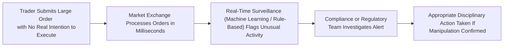

## Introduction

Have you ever looked at the flashing lights of a market order book and thought, “Wow, how can anyone possibly track all these trades in real-time?” It can feel overwhelming, especially with high-speed electronic trading dominating the market these days. And guess what—market participants sometimes exploit these complexities to engage in sneaky, manipulative behaviors. They do stuff like placing orders they never plan to fill, or they jump ahead of your trades to turn a quick profit. These are known collectively as abusive trading practices, and they can wreak havoc on market integrity if left unchecked.

In this section, we’ll explore some of the main forms of abusive trading practices and dive into the powerful (and, honestly, pretty impressive) world of real-time surveillance systems. We’ll discuss how regulators, market participants, and technology providers are collaborating to detect and deter manipulative conduct in modern markets. Whether you’re an individual investor feeling a bit intimidated by those algorithmic wizards, or a portfolio manager wanting to ensure compliance and maintain a fair marketplace for your clients, understanding these practices and the surveillance used to monitor them is crucial. Let’s get rolling.

## Common Abusive Trading Practices

Abusive practices come in various forms, but typically share a common goal: to tilt the playing field and manipulate prices for personal gain. In this section, we’ll cover some of the most prevalent manipulative tactics—things like spoofing, layering, front-running, quote stuffing, and wash trading. We’ll also see how these behaviors can be surprisingly subtle and tough to detect without sophisticated monitoring.

### Spoofing and Layering

Spoofing (and its close cousin, layering) is basically the art of deception at lightning speed. The trader places large orders with no genuine intention to fill them. Here’s how it often goes:

• A spoofer might submit a massive buy order (or multiple orders—then it’s layering) at a price just off the inside quote.  
• These orders can spook other traders into thinking that demand is huge, sparking a mini price rally.  
• Shortly after, our sneaky trader cancels the initial orders, then places orders on the opposite side of the market to profit from the artificially inflated or deflated price.  

In my early days on a trading desk—when I was still figuring out how to manage my coffee intake—I remember how some days we’d see a flurry of buy orders that suddenly disappeared in a blink. It was almost like watching a magic trick, but the only folks impressed were the ones pulling it off.

#### Table: Key Characteristics of Spoofing vs. Layering

| Aspect                     | Spoofing                                    | Layering                                                     |
|----------------------------|---------------------------------------------|--------------------------------------------------------------|
| Number of Orders           | Usually a few deceptive orders              | Multiple layers of deceptive orders                          |
| Primary Goal               | Trick the market into moving                | Amplify the illusion of supply or demand across price levels |
| Common Speed of Execution  | Very high-speed (possible via algorithms)   | Also high-speed, often using multiple price levels           |
| Regulatory Focus           | High—considered a key unfair market practice | High—regulators see it as a variant of spoofing               |

### Front-Running

Front-running is a breach of trust that happens when someone (often a broker or an insider with knowledge of a large pending order) trades ahead of a client’s order or a proprietary order. Imagine you’re about to place a gigantic buy order that will almost certainly drive the price higher, and I, knowing this, decide to sneak in beforehand and buy shares at the lower price. Then once your order hits the market and drives the price up, I sell for a quick profit. It’s shady, and it undercuts the premise of fair markets.

In many jurisdictions, front-running is not just unethical—it’s outright illegal. And the penalties can be enormous if regulators find out. The CFA Institute Code of Ethics and Standards of Professional Conduct also explicitly condemns front-running.

### Quote Stuffing

Quote stuffing is, in a sense, a bit like spamming an inbox. A quote stuffer floods the market with an extraordinarily high volume of orders and cancellations in mere milliseconds. This can clog or slow down the processing of market data for other traders. In practice, it might look like a sudden spike in order messages, which confuses or overloads some automated strategies that rely on ultra-fast data processing.

Why do it? If you can partially degrade your competitors’ ability to read the order book, you might trade on a fleeting advantage—say, if your own systems (in a perfect scenario) keep functioning at top speed while your rivals are overwhelmed. But regulators are catching on to quote stuffing, especially because it’s often fairly obvious when an account is blasting the market with cancellations.

### Wash Trading

Wash trading is when a trader (or related parties) buys and sells the same instrument simultaneously, essentially trading with themselves (through multiple accounts) to create a façade of genuine market activity. This practice can inflate trading volumes and trick outsiders into thinking there’s more interest or liquidity than really exists. Historically, wash trading was sometimes used in money-laundering schemes, but more commonly, it’s just an attempt to artificially hype a security. For instance, you might see a penny stock jump in volume with no real catalysts—often a sign that something fishy might be going on.

## Implications of Abusive Practices

Abusive practices distort price discovery, hamper market liquidity, and shake investor confidence. As we studied in previous parts of this chapter (like sections 6.1 and 6.2 on transaction costs), fair pricing and transparency are paramount to efficient markets. If large institutional investors can’t trust the signals they glean from order books, they’ll struggle to implement best execution, and that has ripple effects on real economies.

Some potential impacts include:

• Increased volatility in the short term.  
• Heightened risk for unsuspecting participants who might be tricked into poor trading decisions.  
• Reputational damage to brokers or dealers found culpable.  
• Regulatory scrutiny leading to fines, sanctions, or revocation of trading licenses.

## Real-Time Surveillance: Overview

So, how do we counter these manipulative tactics? In today’s high-speed, data-driven world, real-time surveillance systems have become the backbone of market integrity. Picture powerful algorithms sifting through billions of data points—orders, quotes, price movements, cancellations—in real time, flagging anomalies like your credit card company might flag a suspicious purchase.

### Key Components of Real-Time Surveillance

1. Big Data Analytics: Sourcing massive streams of trade data and quotes, often from multiple exchanges or trading platforms.  
2. Pattern Recognition: Using machine learning or rule-based systems to detect suspicious spikes in activity, abnormally high cancel-to-fill ratios, or known footprints of spoofing strategies.  
3. Alerts and Case Management: Generating real-time alerts that are passed to compliance professionals or regulators who can quickly investigate.  
4. Cross-Market Correlation: Linking data across various asset segments (equities, fixed income, commodities, derivatives) to identify multi-asset manipulation attempts.

### The Importance of Automation

With literally millions (or billions) of messages hitting markets daily, it’s humanly impossible to spot manipulative trades by simply eyeballing an order book. Advanced software tools can flag suspicious patterns—say, a repeated strategy of bidding up the price and then canceling. Humans do the final check, but the initial detection is largely automated.

### How These Systems Work (At a High Level)

Below is a simplified diagram to illustrate the flow of orders and the process of real-time surveillance. It’s not perfect, but it should give you a feel for what’s happening under the hood.

Notice how the surveillance system sits in parallel with the normal trade-processing workflow, ingesting the data streams as quickly as they arrive. The biggest challenge is the speed: these schemes can unfold in a matter of milliseconds.

## Regulatory and Ethical Landscape

When it comes to policing these practices, regulators worldwide take them very seriously. In the United States, for instance, the Securities and Exchange Commission (SEC) and the Commodity Futures Trading Commission (CFTC) have ramped up efforts to crack down on market manipulation. In Europe, ESMA (European Securities and Markets Authority) influences how member states approach real-time surveillance. We also see major exchanges (e.g., NYSE, NASDAQ, CME) investing heavily in advanced surveillance tech.

The CFA Institute Code of Ethics and Standards of Professional Conduct also underscores that professionals must adhere to principles of fairness and integrity. For instance, front-running can be considered a direct violation of duties to clients and the market. Meanwhile, wash trading or spoofing is typically a violation of potential market-manipulation regulations and can subject individuals or firms to serious penalties—both financial and reputational.

## Practical Example: Spoofing Detection in Action

Let’s illustrate a real-world scenario, simplified here to help consolidate our learning:

• A high-frequency trader starts placing large buy orders on the order book at staggered price levels (this is layering).  
• Suddenly, the best bid jumps up, and other algorithms see this as a bullish signal, meaning more buyers are entering the market.  
• The high-frequency algo quickly cancels the buy orders and places a large sell order to capture the newly inflated price.  
• The real-time surveillance system spots a pattern of (1) repeated large orders just below the current best bid, (2) quick cancellations, and (3) an immediate reversal of position.  
• Due to its rule-based configuration, the system triggers an alert for a potential spoofing maneuver.  

Compliance officers investigate, see repeated examples of the same behavior, and confirm that it’s intentional manipulation rather than normal market-making. The end result? A regulatory action or internal disciplinary measure.

## Common Pitfalls and Best Practices

• Overreliance on Manual Checks: Some firms still perform manual reviews of suspicious trades once a day or once a week. By then, you might be days late to catch real-time manipulation, which can happen in seconds.  
• Inadequate IT Infrastructure: Real-time surveillance systems require massive processing power and secure data handling to avoid being overwhelmed by the sheer volume of order flow.  
• False Positives: A well-intentioned liquidity provider might frequently cancel orders due to dynamic inventory management. Good surveillance systems calibrate thresholds to reduce false alarms while still catching authentic misconduct.  
• Cross-Market Complexities: Some traders manipulate not just a single asset (like equities), but also derivatives tied to that asset (options, futures). Best practice is to integrate data across multiple markets to see the full picture.

## Exam Relevance

In the CFA Level III exam setting, you might encounter a case study describing suspicious trading activity—like a large order placed and then quickly canceled, or consistent patterns of front-running. Be prepared to:

• Identify the manipulative tactic in question (spoofing, quote stuffing, front-running, wash trading, etc.).  
• Understand the ethical and regulatory implications.  
• Suggest or describe how real-time surveillance and compliance can mitigate these behaviors.  
• Argue for best practices in designing or implementing surveillance systems.

If you see a question that describes, for instance, a scenario with large orders repeatedly popping on the bid side and then vanishing, it’s practically screaming “spoofing” or “layering.” Summarize how that contravenes market integrity and which real-time detection methods might flag it as suspicious.

## Conclusion

Abusive trading practices are a genuine threat in modern markets. Fortunately, the same technology that enables lightning-fast trades can also be harnessed to detect and deter manipulative behavior. With carefully configured real-time surveillance systems, rigorously enforced regulations, and well-trained compliance officers, the market can remain robust, transparent, and fair to all. Keep these insights and examples in mind as you continue your journey in portfolio construction and advanced trading strategies. Fairness isn’t just a theoretical ideal; it’s pivotal for maintaining confidence and efficiency in the global financial ecosystem.

## References and Further Reading

• SEC Enforcement Actions and Litigation Releases on Market Manipulation: https://www.sec.gov/litigation  
• CFA Institute. (2025). CFA Program Curriculum, Level III, Volume 2: Portfolio Construction.  
• CFTC Educational Resources: https://www.cftc.gov/LawRegulation/Enforcement/ResourcesForIndustry/index.htm  
• ESMA Guidelines on Automated Trading: https://www.esma.europa.eu  

## Additional Exam Tips

• Watch out for scenario-based questions that mix ethics and market microstructure.  
• Know how to differentiate spoofing from legitimate market-making tactics.  
• Review the concepts of order book dynamics, best execution, and how transaction cost analysis might be affected by manipulative behaviors.

## Abusive Trading Practices and Real-Time Surveillance Quiz



### Which of the following best describes spoofing?

- [ ] Executing large block trades on behalf of a major client without disclosure
- [x] Submitting large orders with no intention to execute, then canceling to mislead other traders
- [ ] Buying and selling the same security simultaneously to create artificial volume
- [ ] Submitting rapid-fire quotes to slow down rivals’ market data

> **Explanation:** Spoofing involves placing orders that are never meant to be filled, aiming to create a false sense of market direction or liquidity.

### Which activity involves placing multiple false orders at different price levels on one side of the order book?

- [ ] Front-running
- [ ] Wash trading
- [ ] Quote stuffing
- [x] Layering

> **Explanation:** Layering, closely related to spoofing, uses multiple levels of deceptive orders to amplify the impression of a strong demand or supply.

### Which of the following is the MOST direct ethical concern in front-running?

- [ ] Reducing volatility for clients
- [x] Using insider knowledge of a large order to trade before it
- [ ] Enhancing order book depth
- [ ] Generating artificial liquidity through false orders

> **Explanation:** Front-running occurs when a trader abuses privileged information about a client’s order by executing a personal or firm trade in advance.

### What is the primary goal of quote stuffing?

- [ ] To socialize high-frequency trading technology
- [ ] To fulfill regulatory obligations for best execution
- [x] To flood the market with orders and cancellations, slowing down competitors
- [ ] To create a stable price environment

> **Explanation:** Quote stuffing is a manipulative tactic intended to overload or delay the data processing of competing traders.

### Which of the following statements about wash trading is correct?

- [x] Wash trading can artificially inflate volume without changing a trader’s net position
- [ ] Wash trading is purely accidental and not considered manipulative
- [x] Wash trading often involves colluding or affiliated accounts
- [ ] Wash trading only occurs in commodity futures markets

> **Explanation:** By both buying and selling the same security or contract (often in collusion with related accounts), a trader can inflate perceived volume while not changing overall exposure.

### Why do regulators place heavy emphasis on real-time surveillance systems?

- [x] Because manual monitoring alone isn’t fast enough to detect manipulative trades at high speeds
- [ ] Because real-time systems guarantee none of the trades will ever be flagged
- [ ] Because front-running can only be detected in offline analysis
- [ ] Because real-time surveillance is cheaper than manual oversight

> **Explanation:** Real-time surveillance uses automated algorithms to process and flag suspicious trades in milliseconds—a necessity in today’s electronic markets.

### Which of the following is a valid reason for a surveillance system to generate a false positive?

- [x] A legitimate market maker frequently adjusting quotes and canceling orders
- [ ] The system is not configured to detect layering behavior
- [x] The system has incomplete data across multiple trading venues
- [ ] The system identifies possible front-running only after the fact

> **Explanation:** Even legitimate trading strategies—like rapid order book updates by market makers or incomplete cross-venue data—might trigger an alert in an over-sensitive system.

### In which scenario would a surveillance system label an activity as potential spoofing?

- [ ] A trader placing one small order and letting it fill completely
- [x] A trader placing large orders that are canceled the moment prices move
- [ ] A portfolio manager fulfilling a client’s block trade over multiple days
- [ ] A trader collecting short-term capital gains on publicly available information

> **Explanation:** The hallmark of spoofing is the cancellation of large orders once the market has moved, signaling that the trader never intended to let them execute.

### What is one advantage of using machine learning in real-time surveillance?

- [x] It can detect complex, evolving patterns of abuse that simple rule-based systems might miss
- [ ] It requires no maintenance or oversight once implemented
- [ ] It can guarantee zero false positives
- [ ] It eliminates the need for compliance staff

> **Explanation:** Machine learning can adapt to changing abusive strategies, identifying behavioral patterns that are not explicitly programmed in fixed rules.

### True or False: Front-running, spoofing, layering, quote stuffing, and wash trading all compromise market fairness and can lead to regulatory action.

- [x] True
- [ ] False

> **Explanation:** All these tactics intend to manipulate or exploit other market participants, undermining fairness and leading to serious regulatory scrutiny.


