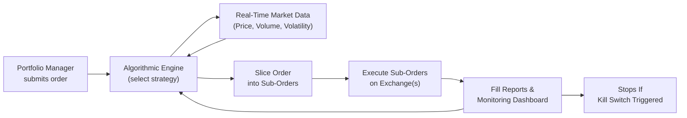

## Introduction and Context

Algorithmic trading strategies can sometimes feel like magic: you push a button, and suddenly, a complex code engine is buying or selling securities while you’re sipping coffee. But trust me, the magic comes from math, market microstructure knowledge, and continuous monitoring, not merely from a wand. Around the industry, “algos” help traders slice gigantic orders into smaller chunks, measure real-time market movements, and attempt to capture decent execution prices without tipping off the entire market. For many portfolio managers—especially those running large institutional mandates—algorithmic trading has become indispensable. And from personal experience, once you see a well-tuned algo quietly work through your trades, it’s hard to go back.

Algorithmic trading is closely tied to the broader discussion of transaction costs, as introduced in Section 6.1 (Components of Transaction Costs) and 6.3 (Implementation Shortfall for Measuring Transaction Costs). Understanding how algorithms operate and what benchmarks they typically target is essential for designing a trading plan that addresses your portfolio’s cost and risk objectives. The following sections break down some of the most common strategies—VWAP, TWAP, Percentage of Volume, liquidity-seeking, and implementation shortfall—to give you the “what” and “why” of how they work. We’ll talk about risk management, common pitfalls, and best practices, weaving in a couple of stories, a few diagrams, and hopefully, a bit of fun along the way.

## Key Algorithmic Strategies

### VWAP (Volume-Weighted Average Price) Algorithms
Let’s begin with a tried-and-true protagonist in the algo world: the Volume-Weighted Average Price (VWAP) strategy. This approach aims to execute trades at, or better than, the average price weighted by trading volume over a specific horizon (e.g., from market open to market close). 

• How It Works: The algorithm slices your total order into smaller increments, timing those increments so they align with expected intraday volume patterns. If the market typically sees a surge in volume at the open and close, the algo attempts to trade more aggressively at those intervals.  

• Rationale: A VWAP strategy is often chosen when you want to minimize impact costs in highly liquid names. It’s a benchmark-based approach; if you manage to beat the VWAP (i.e., buy lower than the VWAP or sell higher), you can pat yourself on the back for a job well done.

• Example in Action: Let’s say you manage a portfolio of mid-cap stocks. You must purchase 500,000 shares of Company X by the end of the trading day. A VWAP algo will study historical trading volume patterns in Company X, forecast likely volume spikes, and systematically break down your 500,000-share order to coincide with those forecasted liquidity windows. The hope is that you blend in with the “noise” of regular trading flows.

### TWAP (Time-Weighted Average Price) Algorithms
If VWAP is all about volume distribution, TWAP is about evenly spacing trades over time. By dividing your entire order into comparable slices and releasing them incrementally across a set period, the strategy attempts to replicate the “average price” over that timespan. 

• Why This Matters: TWAP assumes volume is somewhat evenly distributed or that you don’t want to “guess” market volume. Instead, it’s perfect if you have to trade illiquid stocks or if your goal is to avoid large lumps of trades that might spook the market. 

• The Math: The Time-Weighted Average Price is computed by taking the simple average of the stock’s price at equally spaced intervals. Practitioners sometimes measure the performance of a TWAP algo by comparing their fill price to the actual TWAP over the same window.

• Personal Anecdote: Once, when I was managing a small-cap portfolio, I tried a VWAP strategy for a highly illiquid, lesser-known security. The algo aggressively purchased shares at the open, where the volume was abysmally thin, pushing the share price up more than 3%. After that fiasco, I realized a TWAP approach might have been more appropriate for a lightly traded name.

### Percentage of Volume (POV) Algorithms
Sometimes called a Participation strategy, POV algorithms execute slices of your order as a fixed percentage of the overall market volume at any point in time. If, for example, you set the POV at 15%, your algo tries to represent around 15% of the total shares traded in each time interval.

• Flexibility: If the market picks up steam and volumes spike (e.g., a big news release), your algo speeds up to stay at roughly 15%. If volumes dwindle, your algo slows down. 

• When to Use: POV can be especially helpful if you want to ensure your trades do not exceed a certain portion of normal market flow, which helps minimize market impact. It also adjusts automatically to intraday volume fluctuations, making it more dynamic than a standard TWAP approach.

• Edge Cases: If you absolutely must complete your entire trade by the day’s close, but the stock trades below the expected volume, you might not get your full order executed. Some advanced POV algos can dynamically switch strategies (like going more aggressive near the close) to finalize the trade.

### Liquidity-Seeking Algorithms
Liquidity-seeking algorithms are a different beast. Instead of focusing on a straightforward pace, they attempt to sniff out hidden liquidity—like dark pools or crossing networks—to find opportunities for minimal market impact. 

• Mechanism: These algos often ping various Alternative Trading Systems (ATSs), crossing networks, or dark pools to see where blocks of shares might be matched without displaying that interest on a public order book. This can be useful in high-cap orders where you really don’t want to show your hand in the open market. 

• Benefits: Lower market impact, especially if large blocks can be matched off-exchange. Also, certain crossing networks or dark pools might offer price improvement or reduced transaction fees. 

• Caution: There’s always a risk of “information leakage” if unscrupulous liquidity providers see your order flow. Moreover, dark pools can occasionally present limited liquidity—like searching for water in the desert. It’s there, but not always in the quantity or price you want.

### Implementation Shortfall Algorithms
Implementation shortfall (IS) algorithms strive to minimize the difference between the price at the moment you decided to trade and the actual execution price. Often, portfolio managers measure this difference as a combination of delay costs and market impact costs. (For a deeper discussion on measuring Implementation Shortfall, see Section 6.3.)

• Strategy: Implementation shortfall algos dynamically balance the trade-off between urgency (executing quickly to reduce slippage from the initial decision price) and market impact (not pushing the price too far by being too aggressive). If the price starts moving away from your reference price, the algo might accelerate to reduce the risk of further drift. 

• When to Choose IS: If your investment thesis is time-sensitive—for instance, you just learned some price-sensitive information (legitimately, of course) and want to lock in the advantage—the algo aims to minimize regrets from missed profits or bigger losses once the market figures it out. 

## Real-Time Data Integration and Adjustments
A big reason algorithmic trading strategies are so effective is their ability to integrate real-time market data, such as:

• Price Movements: If the stock price surges or plummets, the algo can recalculate in seconds whether to pause, accelerate, or seek alternative venues.

• Volume Changes: Updates in the tape (market volume feed) can prompt a quick pivot, especially for POV or greedier liquidity seekers. 

• Volatility Metrics: Some advanced algos monitor intraday volatility and shift from a more passive strategy (like TWAP) to a more active one if a sudden spike in risk or an abnormal price trend arises.

## Risk Management and Monitoring
Algorithmic trading can be powerful. But, as with any power, it needs careful guardrails.

### Overfitting to Historical Data
Algos often rely on backtests: “If these signals worked in the past, they’ll work in the future.” That’s the idea, anyway. Overfitting occurs when you design your strategy too specifically around historical quirks, including random noise. The result? You might get fantastic “in-sample” performance that crumbles in real markets.  
• Best Practice: Use robust testing with out-of-sample data, parameter stress tests, and scenario analysis (see Section 2.11 for a discussion of scenario analysis in fixed income, which can also be applied in equity contexts).

### Monitoring and Kill Switches
One essential safeguard is a kill switch—a built-in command that terminates the algo if it starts behaving erratically (like trying to buy a zillion shares of your target stock at any price, or showing repetitive order errors).  
• Real-Life Mishap: Picture an algo that misreads the data feed and initiates an infinite loop, placing repeated buy orders at incrementally higher prices. If no one is watching, that could end in either comedic or catastrophic results. Usually catastrophic.  
• Recommendation: Maintain real-time oversight tools with dashboards that highlight unusual trade behaviors. Include dynamic risk limits (e.g., maximum shares, maximum notional amounts in a short period, etc.).

## Practical Example and Diagram

Let’s illustrate a hypothetical scenario in which a portfolio manager uses an Implementation Shortfall algorithm. Suppose you manage a $2 billion equity portfolio and need to buy 300,000 shares of a fast-moving technology company. You base your reference price on $50.00 as of 9:31 AM Eastern Time.

• At 10:00 AM, the stock ticks up to $50.50. The algo sees that the price is drifting away from your reference and speeds up to fill shares faster, capping shortfall.  
• By 10:30 AM, the stock has spiked to $51.20, but the algorithm has already filled roughly 75% of your desired quantity. It’s now carefully finishing the last block, reevaluating real-time liquidity.  
• If the stock had drifted in your favor (down from $50.00 to, say, $49.70), the algorithm might have slowed down to let that beneficial momentum continue, capturing a lower price.  

Below is a mermaid diagram showing a simplified flow of an algorithmic order process:

• Explanation: The portfolio manager puts an order into the system, which decides on the best strategy (e.g., Implementation Shortfall). It slices the big order into smaller chunks, referencing real-time data on volumes, prices, volatility, and sends chunks to the market(s). The fill reports flow back into the monitoring system, which can alert the manager if something looks off, at which point a kill switch might be triggered.

## Common Pitfalls and Best Practices
• Undervaluing Hidden Liquidity: Focusing solely on lit markets might mean missing big crossing opportunities. Keep an eye out for dark pool or block liquidity.  
• Interpreting Benchmarks: VWAP or TWAP might be less relevant if your biggest concern is implementing trades quickly for time-sensitive trades. Make sure the chosen benchmark aligns with your actual objectives.  
• Overtrading: If your algo is set to “monitor and react” too frequently, you might incur excessive commissions, technology fees, or inadvertently drive up your own impact costs.  
• Regulatory Compliance: Many jurisdictions regulate algorithmic trading with specific guidelines (e.g., MiFID II in Europe or the SEC’s rules in the US). For example, high-frequency trading has come under scrutiny for manipulative practices, so ensure your algorithms are fully above-board.

## Cross-References Within the Curriculum
• For a deeper dive into measuring and analyzing transaction costs, check out Section 6.2 (Effective Spreads and VWAP for Cost Analysis) and 6.3 (Implementation Shortfall).  
• Large orders often require specialized Transaction Cost Analysis, see 6.12 (Transaction Cost Analysis for Large-Scale Trades).  
• If you’re building multi-asset strategies involving both equity and fixed income, you might want to review how bond liquidity (covered in Section 2.3) influences your overall trading posture.

## Exam Relevance and Practical Tips
When it comes to the CFA® Level III exam, you could see scenario-based questions referencing a manager’s need to reduce cost or compare benchmarks (VWAP vs. TWAP vs. POV). Expect to articulate why one approach fits better than another. Implementation shortfall questions often appear in item sets, requiring you to calculate slippage. So practice your math and become comfortable with differences between theoretical and actual fill prices.  

And watch out for questions focusing on risk management within electronic trading—things like kill switches or overfitting warnings could be tested. The exam might ask you to evaluate the pros and cons of a particular strategy for a hypothetical client with unique constraints (e.g., high-latency environment, illiquid security, short time horizon).

## References
• Chan, E. (2013). Algorithmic Trading: Winning Strategies and Their Rationale. Wiley.  
• CFA Institute. (2025). CFA Program Curriculum, Level III, Volume 2: Portfolio Construction.  

## Final Exam Tips
• Know the difference between VWAP, TWAP, POV, and Implementation Shortfall strategies—both conceptually and in practice.  
• Understand how each strategy might be impacted by real-time conditions like sudden volume spikes or volatility changes.  
• Watch out for potential pitfalls like overfitting historical data. Use robust scenario analysis to confirm your strategy is adaptable to changing markets.  
• Anticipate integrated item-set questions that combine risk management, ethics, and transaction cost analysis into a single scenario.  
• Always keep an eye on the “big picture”: an algorithm’s primary function is to execute your investment idea efficiently, not to chase ephemeral alpha in the execution process.

## Test Your Knowledge of Algorithmic Trading Strategies



### When executing a large equity order, a fund manager chooses a VWAP algorithm. Which of the following best characterizes this strategy?
- [ ] It attempts to permanently match the fund manager’s trades with dark pool volumes only.
- [x] It slices the total order to align with expected intraday volume patterns to match a volume-weighted price benchmark.
- [ ] It consistently participates at a fixed percentage of market volume without regard for intraday volume spikes.
- [ ] It targets the average of the security’s price at evenly spaced intervals over the day.

> **Explanation:** VWAP algorithms aim to trade in proportion to the typical intraday volume distribution, so the execution price approximates the volume-weighted average price observed in the market.

### What is the primary objective of a Time-Weighted Average Price (TWAP) algorithm?
- [ ] To ensure final execution costs are lower than a reference price established at the market opening.
- [x] To execute an order using evenly spaced intervals over a given time period, minimizing market impact in illiquid securities.
- [ ] To participate at a fixed percentage of total volume, accelerating in high volume periods.
- [ ] To identify hidden liquidity in dark pools for block trades.

> **Explanation:** A TWAP algorithm spaces trades evenly over the chosen horizon. This approach can help mitigate sudden price movements and is typically used for less liquid stocks or when the manager prefers a simplistic time-based benchmark.

### A manager wants to trade precisely 10% of the current market volume in real time. Which strategy should they use?
- [ ] VWAP
- [ ] TWAP
- [ ] Implementation Shortfall
- [x] Percentage of Volume (POV)

> **Explanation:** POV algorithms dynamically adjust the order size based on real-time market volume, allowing the manager to keep a consistent participation rate (in this case, 10%).

### Which algorithmic strategy specifically aims to minimize the difference between the price at decision time and the eventual execution price?
- [ ] VWAP
- [ ] POV
- [x] Implementation Shortfall
- [ ] TWAP

> **Explanation:** Implementation Shortfall algorithms measure performance against the price at the time the decision to trade is made, aiming to minimize slippage and opportunity costs relative to that reference price.

### In a hypothetical scenario, you start buying a stock at $50.00, but it quickly rises to $50.70. Your Implementation Shortfall algorithm reacts by accelerating the trade. Why?
- [ ] The algorithm is incorrectly referencing the day’s opening VWAP.
- [ ] The algorithm wants to slow down to avoid impacting the price further.
- [ ] The algorithm is programmed to buy only at lower prices.
- [x] The algorithm tries to reduce the shortfall cost by acquiring more shares before the stock price moves further away from the original decision price.

> **Explanation:** Implementation Shortfall algorithms often accelerate execution when the market begins moving against the manager’s desired direction, aiming to lock in the original reference price advantage and reduce ongoing slippage.

### Which of the following best describes a dark pool?
- [ ] A regulated exchange with full transparency on order books.
- [ ] A platform that matches orders but discloses all transaction details in real-time.
- [x] An alternative trading venue where orders are matched anonymously, often reducing market impact.
- [ ] A real-time feed of all trades on major exchanges.

> **Explanation:** Dark pools match trades off-exchange without large orders being visible to the public order book, seeking to maintain anonymity and minimal price impact.

### What is a primary risk of overfitting an algorithm to historical data?
- [x] The algo could fail dramatically in live markets if conditions differ from the backtest environment.
- [ ] The algo’s real-time monitoring systems become obsolete.
- [ ] Kill switches will not function properly.
- [ ] It ensures robust, out-of-sample performance.

> **Explanation:** Overfitting tailors the strategy too closely to past market “noise,” leading to poor performance in actual, often-unpredictable market conditions.

### A “kill switch” in algorithmic trading primarily serves what function?
- [x] It stops the algorithm if it behaves erratically or exceeds defined risk thresholds.
- [ ] It erases all previous fill reports from the system.
- [ ] It enforces daily regulatory filing requirements.
- [ ] It transfers the entire trade to a new exchange.

> **Explanation:** Kill switches are essential controls that let traders or risk managers halt an out-of-control or malfunctioning algorithm to prevent catastrophic losses or market distortions.

### Which circumstance might call for a liquidity-seeking algorithm?
- [ ] The stock is extremely liquid with ample daily volume to fill a large order easily.
- [ ] You only need partial execution; speed is not a concern.
- [x] You want to find hidden blocks of shares in dark pools or crossing networks to avoid signaling to public markets.
- [ ] You want to strictly match an intraday volume-based benchmark.

> **Explanation:** Liquidity-seeking algos specialize in locating blocks of shares in alternative or “dark” trading venues to minimize market impact when you’re looking to fill large orders discreetly.

### True or False: A Percentage of Volume (POV) algorithm will automatically complete the entire order by the close, regardless of overall daily volume.
- [ ] True
- [x] False

> **Explanation:** A POV algorithm might not fill the whole order if the actual market volume is insufficient to meet the target participation rate. Unless further parameters are added, the algorithm may leave part of the order unfilled by day’s end if opportunities fail to arise.


