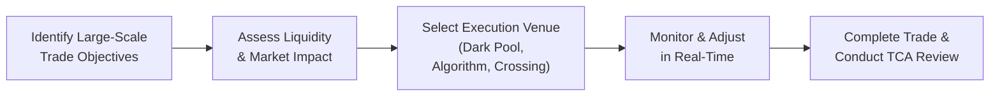

## Introduction
Have you ever watched a friend rush into a big purchase—maybe a car or a big chunk of real estate—and noticed how they had to pay a premium because the seller realized they were super anxious to buy? In the stock and bond markets, something similar can happen on a much bigger scale when investors place large buy or sell orders. These big orders can actually shift the market price against them. That shift, which typically makes the trade more expensive, is part of what we mean by “transaction costs”—especially market impact. In this section, let’s explore best practices for Transaction Cost Analysis (TCA) when dealing with large-scale trades, also known as block trades. We’ll talk about strategies to minimize market impact costs, tools like dark pools and algorithmic slicing, and how to measure performance before and after trade execution.

## Understanding the Challenges of Large-Scale Trades
Large-scale trades are often tricky because they can be so big compared to the daily trading volume of the security in question. A well-known pension fund or hedge fund might need to sell (or buy) a massive position in a stock that isn’t super liquid, which means there aren’t enough buyers (or sellers) waiting around at the desired price. The result? Slippage—the price moves away from us as soon as the market detects a big buyer or seller, causing higher costs.

In Chapter 6.1, we introduced explicit and implicit transaction costs—commissions, fees, spreads, and market impact. For large-scale orders, market impact (an implicit cost) becomes a major concern, often dwarfing explicit costs like commissions. Meanwhile, in sections 6.2 and 6.3, we discussed measures like the effective spread, VWAP slippage, and implementation shortfall to gauge these costs. In large-scale trades, these measures become even more important because small changes in price per share can add up to large absolute dollar amounts.

## Minimizing Transaction Costs
The key to minimizing transaction costs for block trades is to reduce information leakage and align your trade flow with the market’s liquidity patterns. Let’s break down a few of the more common approaches:

### Dark Pool Execution
Dark pools are private, off-exchange venues where trades are made anonymously. Think of them as a private dining room in a large restaurant. You get to have your dinner conversation without everyone overhearing that you’re in the market for that big stake. When you place a large buy or sell order in a dark pool, neither the size of your order nor your identity is visible to the broader market. This helps reduce the market impact because other traders can’t easily detect that a large order is looming.

Of course, dark pools carry some risks. You might not find enough matching orders, leading to partial fills, or the fill quality might be uneven. But overall, dark pools can be a powerful tool in the TCA playbook for large trades, often used by institutional investors like pension funds, insurance companies, and sovereign wealth funds.

### Algorithmic Slicing
The idea of algorithmic slicing is kind of like splitting a pizza into many small pieces so that it can be served to multiple people over time without anyone noticing exactly how much pizza is being consumed overall. By breaking a large order into smaller, more manageable parts, you can feed those orders into the market strategically, reducing the chance of tipping off other market participants that a big buy or sell order is in progress.

Algorithms can be designed to track volume patterns throughout the day (e.g., adjusting execution in line with volume spikes or lulls) and to respond to changing market conditions. In sections 6.6 (Types of Electronic Traders and Their Characteristics) and 6.11 (Algorithmic Trading Strategies), we looked at how these sophisticated algorithms assess real-time quotes, volumes, volatility, and other data points to decide the size and frequency of each sliced order.

### Crossing Networks
Crossing networks let large institutional orders get matched internally—sometimes within a single broker’s client base—so trades can be executed without going through the lit (i.e., publicly quoted) market. Picture a big family: sometimes, if a cousin wants to sell something, another cousin wants to buy it, and the two can make a deal in-house without announcing it to the public. Crossing networks can be a win-win because both sides often achieve a better price than they would in lit markets, and the overall market impact is heavily reduced. 

Crossing networks sometimes come with timing and liquidity constraints. If a crossing system can’t find a matching counterparty, you might still have to route the remaining portion of your trade to the public market. But generally, crossing is helpful for quick and relatively invisible block fills.

## Implementing Advanced TCA Tools
While the strategies above help mitigate transaction costs, advanced TCA tools go one step further by systematically collecting and analyzing trade data—for example, comparing expected costs (like those predicted by a market impact model) against actual costs after the trade is done.

### Market Impact Models
Market impact models attempt to predict how a trade might move the price, given the size of the order and the liquidity characteristics of the stock. Factors like historical volatility, average daily volume (ADV), and supply-demand dynamics all feed into these models. If you know ahead of time that placing your entire position in five minutes will blow out the bid-ask spreads, you can spread the trade over a longer window, or try alternative venues. Integrating these model outputs into real-time execution decisions is crucial for large trades, where the difference between a 0.1% and 0.2% market impact can be enormous in dollar terms.

### Trade Scheduling
Trade scheduling is the art (and science) of placing your sliced orders in alignment with the daily or intraday liquidity patterns. In some cases, trading desks look at “volume curves” that show how volume typically fluctuates throughout the trading day. For instance, you might see high volumes near market open and close, or near major macroeconomic announcements (e.g., interest rate decisions). Placing bigger slices during these high-volume windows could help you get filled with less slippage.

This scheduling approach is a bit like traffic management. If you know the roads will be jammed at certain hours, you either wait for a quieter time or you accept the traffic as a cost if that congested period also happens to be when you can “blend in” with high volume trades. Large-scale clients commonly coordinate with their brokers or specialized algorithm providers to plan for the daily volume patterns and reduce the market impact of their trades.

### Real-Time Market Conditions
While a trade schedule might look great on paper the night before, real markets often have unpredictable events—company earnings surprises, central bank announcements, or unexpected economic data. Real-time dashboards let traders adjust the pace and timing of orders mid-execution. If volatility spikes, or the market runs sharply in the opposite direction, a trader can switch algorithms, pause the trade, or reroute the remaining shares to a dark pool. 

## Integrating TCA Metrics into Performance Reviews
Ever keep track of how much you spent on groceries across several months, noticing patterns in how you buy certain items more expensively on weekends or near holidays? TCA metrics help do a similar thing for trading. By comparing actual execution costs against pre-trade estimates (e.g., from a market impact model or from a benchmark like VWAP), you can identify which strategies worked best under certain market conditions and which ones didn’t.

Integration of TCA metrics into performance reviews also encourages accountability. Traders, portfolio managers, and compliance officers can see how the choice of a dark pool, an algorithmic approach, or a crossing network impacted execution quality. Over time, TCA becomes a feedback loop: it informs future decisions and fosters continuous improvement.

## Real-World Example
Let’s consider a large family office that wants to sell 300,000 shares of a mid-cap tech company. The average daily volume for this stock is around 600,000 shares. Selling 300,000 shares in one go might scare off potential buyers, pushing down the price. Instead, the family office uses an algorithm designed to target a percentage of volume throughout the day. The algorithm sees that volume usually peaks around mid-morning (perhaps because that’s when many day traders and institutional investors are most active). It places larger “child” orders during these peak times. Meanwhile, overnight, it routes some of the limit orders to a dark pool, hoping to find a buyer interested in off-exchange liquidity. 

After the trade day ends, the family office does a post-trade TCA to check the difference between the stock’s opening price, the volume-weighted average price (VWAP), and the final execution price. They discover that they followed the day’s volume pretty well, paying only a slight spread, and that they avoided the large slump that might have happened with a single big block in the lit market.

## A Quick Mermaid Diagram

The above workflow (from identifying objectives to post-trade TCA review) helps ensure large-scale trades are executed efficiently.

## Best Practices and Pitfalls
• Coordination Is Key: For large trades, it’s not just the trader at the keyboard who needs to know the plan—portfolio managers, risk managers, and compliance teams should share relevant information, especially if the portfolio is sensitive to short-term price moves.  
• Don’t Underestimate Liquidity Risk: Some stocks or markets look like they have enough liquidity, until you try to sell a big chunk in a hurry. Always double-check that your expected volume isn’t based on outdated or “normal” volumes that might not hold when volatility spikes.  
• Beware of Timing: Avoid letting time constraints force you into pushing through a trade when the market is illiquid or volatile. Use trade scheduling to your advantage.  
• Overreliance on Automated Tools: Algorithms are powerful, but they’re only as good as their inputs and real-time data feeds. Don’t forget to maintain a human-in-the-loop approach, especially around major market events.  
• Neglecting Post-Trade Analysis: If you never measure how well you did, you’ll keep repeating the same mistakes. Post-trade TCA is your best friend—it helps you refine strategies going forward.

## Final Exam Tips
For the CFA Level III exam, you might see scenario-based questions that test your ability to evaluate different trading strategies for a large institutional trade. They could ask you to critique the use of a particular algorithm, or to compare the costs of hitting the market in one big block versus slicing it up over the day. Be ready to discuss topics like market impact, timing, liquidity constraints, and TCA measures such as VWAP and implementation shortfall. Also, prepare to comment on how to incorporate TCA metrics into the investment decision-making process and performance review. In an essay (constructed response) format, you may be required to provide a brief rationale for which approach best fits a specific scenario.

Remember that your best bet is to combine your knowledge of market microstructure (introduced earlier in this chapter) with practical cost mitigation strategies. Show you understand not only what TCA is, but also how to interpret its metrics and feedback loops for continuous improvement.

## References and Further Reading
• Kissell, R. (2006). Institutional Trading: Algorithmic Strategies and Programs.  
• CFA Institute. (2025). CFA Program Curriculum, Level III, Volume 2: Portfolio Construction (especially Section 6).  
• Pochini, M. & Yang, Z. (2020). “Measuring Market Impact: A Comparative Analysis.” Journal of Trading, 15(2).  

## Glossary
• Block Trade: A large trade—often tens of thousands or even millions of shares—usually executed through specialized venues or desks to minimize market impact.  
• Trade Scheduling: Strategically timing large orders to coincide with periods of higher liquidity or lower volatility, thus reducing the risk of unfavorable price movements and slippage.

## Test Your Knowledge: Transaction Cost Analysis for Large-Scale Trades



### Which of the following best describes a key advantage of executing large trades in a dark pool?

- [ ] Lower commissions per share compared to exchange trading
- [x] Reduced visibility of trade size and intent, minimizing market impact
- [ ] Elimination of all counterparty risk when trading large blocks
- [ ] Guaranteed price improvement relative to the primary exchange

> **Explanation:** Dark pools allow large trades to be executed anonymously, which helps reduce the information leakage and market impact costs associated with block trades.

### Which execution strategy involves breaking up a large order into smaller parts to reduce market impact?

- [ ] Crossing-network approach
- [ ] Block trade desking
- [x] Algorithmic slicing
- [ ] High-frequency scalping

> **Explanation:** Algorithmic slicing divides a large order into smaller component trades, releasing them over time to avoid drastic price movements.

### What is a primary risk associated with relying heavily on dark pool execution?

- [ ] Auto-cancellation of orders when liquidity is high
- [x] Partial or incomplete fills due to limited matching liquidity
- [ ] Lop-sided price improvements that advantage retail traders
- [ ] A guaranteed higher traded price than the displayed market

> **Explanation:** Because dark pools are private and rely on matching large orders away from the lit markets, there is no guarantee that there will be sufficient matching interest to fill the entire order at a desirable price.

### A market impact model is typically used to:

- [ ] Evaluate changes in accounting standards
- [ ] Forecast the GDP growth rate
- [x] Estimate how a trade of a certain size might influence market prices
- [ ] Determine credit ratings for bonds

> **Explanation:** Market impact models are designed to anticipate the price reaction to sizable trades in the market, helping identify optimal execution strategies.

### When scheduling trades for a large order, trading desks often look at intraday volume patterns. One primary reason for this is:

- [x] Liquidity often fluctuates throughout the day
- [ ] Traders are required to report trades at specific times
- [x] Market news is never released in the afternoon
- [ ] Transaction costs remain constant during all trading hours

> **Explanation:** By aligning large trades with peak liquidity periods (such as early morning or near market close), traders can reduce slippage. Also, volume patterns are influenced by scheduled corporate news and analyst updates, making some times more active than others.

### Which of the following best describes an advantage of crossing networks for large trades?

- [ ] They provide a guaranteed lower bid-ask spread
- [ ] They require no regulatory oversight or reporting
- [ ] They rely solely on algorithmic slicing to hedge trade risk
- [x] They match large positions internally, reducing public market exposure

> **Explanation:** Crossing networks allow large trades to be matched internally—often within a broker’s client base—thus minimizing exposure to the public market and lowering market impact.

### In real-time market condition monitoring, why might a trader pause a large sell execution?

- [x] Sudden volatility spikes could increase slippage
- [ ] The algorithm demands daily rest periods
- [x] They have fulfilled all cross-network commissions
- [ ] They want to increase total trading costs

> **Explanation:** A spike in volatility might cause the stock price to move sharply, so pausing could allow the trader to wait for the market to stabilize or for higher liquidity windows to come back.

### Post-trade TCA primarily helps traders and portfolio managers:

- [ ] Eliminate all trading errors
- [x] Review how the actual trade execution costs compare to pre-trade expectations
- [ ] Hide large orders from regulatory oversight
- [ ] Negotiate preferential interest rates on margin loans

> **Explanation:** Post-trade TCA compares realized costs with estimated costs (including expected market impact), allowing traders to revise future strategy and improve execution outcomes.

### Which of the following is a common pitfall when using complex algorithmic execution strategies?

- [ ] Overestimation of daily volumes on major exchanges
- [ ] Too few points of data for model calibration
- [ ] Missing out on partial liquidity in dark pools
- [x] Overreliance on automated systems, ignoring real-time human oversight

> **Explanation:** Automated strategies must be monitored by experienced traders. Algorithmic models can fail due to data-feed issues, unusual volatility, or significant market news.

### True or False: Integrating TCA metrics into performance reviews can help institutional investors refine their future trading strategies.

- [x] True
- [ ] False

> **Explanation:** By analyzing TCA results, institutions gain insights into which methods and venues have been most successful, allowing them to adjust and improve future execution strategies.


