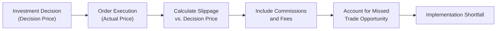

## Introduction and Key Concepts

Implementation shortfall (IS) is one of those concepts that, at first glance, might look like a fancy way of saying, “Whoops, our trade didn’t work out the way we wanted.” But in reality, it’s a very powerful analytical tool for measuring the difference between a hypothetical (or “paper”) trade and the actual cost of executing that trade in the real market. It’s all about understanding how much performance “slippage” occurs between the moment a portfolio manager decides to buy or sell a security and the prices the manager actually gets as the order goes through. 

In finance terms, Implementation Shortfall is the difference between:  
• The return on an imaginary portfolio where trades occur instantly at the decision (benchmark) price with no costs.  
• The return on the real portfolio, incorporating actual execution prices, commissions, fees, bid–ask spreads, delay, or partial fills.

Anyway, why does this matter? Well, if you’re in charge of placing trades for a multimillion-dollar fund, every fraction of a percentage point in transaction costs can add up to big bucks. When you see that difference magnified across thousands of transactions, you begin to appreciate why measuring—and controlling—implementation shortfall is a big deal. 

## Dimensions of Transaction Costs

Implementation Shortfall lumps together several cost components:

• Explicit Costs: These are familiar—commissions, fees, taxes. Think of them like the “in-your-face” costs you can’t avoid whenever you bundle up trades.  
• Implicit Costs: More subtle but often more costly. Market impact, spreads, slippage, and the opportunity cost of not completing trades at all are included here. If you place a large order and the stock price moves upward as you buy, it’s an implicit cost.  

As we’ll see, Implementation Shortfall effectively rolls these costs into a framework that portfolio managers can’t easily ignore.

## Calculating Implementation Shortfall

Let’s say you, as a portfolio manager, decide to buy 1,000 shares of XYZ at $100. That price at the moment of your decision is effectively the benchmark, or "paper" price. If you could magically buy 1,000 shares at $100 instantly, you’d spend $100,000. Of course, reality is a bit more complicated:

1. You might end up buying 400 shares at $100.20, 300 shares at $100.50, and 200 shares at $101.00 (the remaining 100 shares simply don’t fill at all).  
2. You pay commissions of, say, $30 total.  
3. If the last 100 shares are never filled, and the price later moves to $102, you effectively miss out on that gain—this is the opportunity cost of missing the trade.

In a nutshell, Implementation Shortfall tries to capture all these differences between the perfect trade (the “paper” trade) and the real one. More formally, we can express the Implementation Shortfall percentage (IS%) as:


\text{IS\%} = \frac{\sum (\text{Actual Execution Price} - \text{Decision Price}) \times \text{Shares Executed}}{\text{Decision Price} \times \text{Total Shares Intended}} + \frac{\text{Missed Trade Opportunity Cost}}{\text{Decision Price} \times \text{Total Shares Intended}} + \frac{\text{Commissions}}{\text{Decision Price} \times \text{Total Shares Intended}}


Now, that might look a bit heavy, but just remember: it’s basically “difference in prices for filled shares plus missed trade costs plus explicit fees,” all divided by the “ideal cost” (decision price × total intended shares).  

One of the strengths of Implementation Shortfall is that it forces you to consider partial fills and missed trades. If 200 shares never get executed and the price moves away in your favor or against you, that difference also matters.  

## Practical Example

Let’s walk through a quick numerical walkthrough. Suppose:

• Decision price: $50/share  
• Target: 1,000 shares  
• Executions: 600 shares total, at an average price of $50.25  
• Commissions: $20  
• 400 shares never got filled, and the price shot up to $51, meaning you would have benefited an extra $0.75/share if you had gotten those 400 shares at $50.  

So, your “ideal cost” for 1,000 shares is $50×1,000 = $50,000.  

Cost for filled shares = $50.25 × 600 = $30,150  
Missed trade opportunity (for 400 shares) = ($51 – $50) × 400 = $400  
Commissions = $20  

Implementation Shortfall = [(30,150 – 50×600) + 400 + 20] / 50,000  

We see that (30,150 – 30,000) = 150, plus 400 for missed trades plus the $20 commission = 570 total. Dividing by 50,000 yields 1.14%. This 1.14% is the “slippage,” so to speak, from your original plan. 

It’s a neat summary measure telling us how much worse off we are compared to that happy scenario of buying everything at $50 with no friction.

## Stages in Monitoring and Measuring IS

Implementation Shortfall can be broken down into daily or even intraday segments, letting managers see how different slices of the order were executed and missed. For large or time-staggered trades, each partial fill has its own price, which might drift away from the decision price. You can measure:  

• Market Impact: If your own trading pressure moves the market.  
• Delay Cost: If the price rises (for a buy) or falls (for a sell) before your order gets filled.  
• Opportunity Cost: If you fail to execute part of the order at all.  
• Explicit Fees: Commissions, taxes, or exchange fees.

It’s sometimes surprising how the biggest chunk of IS might come from waiting too long to place an order, or deciding to slice the trade into small pieces to minimize the market impact. There’s always a trade-off.  

## Visualizing the Process

Below is a simple Mermaid diagram to illustrate the logical flow. We mark each step to see how partial fills, missed orders, and costs are tallied in the final Implementation Shortfall computation.

Although the diagram looks straightforward, the actual data collection can be painful: you need exact timestamps, partial fill details, and volumes at each price.

## Why Portfolio Managers Use IS

• Alignment with Actual Returns: By seeing the shortfall between a paper portfolio and your real portfolio, you get a compelling measure of the “real” cost.  
• Holistic: IS captures both explicit and implicit costs, partial fills, and missed trades in one number.  
• Actionable Insight: With a single metric in hand, you can track how quickly you executed trades, how effectively you avoided moving the market, and how well you timed your orders.  

## Best Practices and Pitfalls

• Choose the Right Benchmark Price: Some managers use arrival price, while others use open price or VWAP. The “decision point” is important; pick a standard that accurately reflects the moment you decided to trade.  
• Comprehensive Data: Implementation Shortfall is only as good as your data. Missing partial fill prices or ignoring unfilled orders leads to an incomplete (and deceptive) measure.  
• Manage Large Orders Carefully: The bigger the trade, the larger the potential slippage. Breaking trades into smaller chunks helps, but it can also increase delay and missed opportunities.  
• Watch Out for Volatile Securities: Stocks that jump around a lot can cause significant differences in realized vs. expected prices. Implementation Shortfall can spike if you’re chasing a fast-moving price.  

Personally, I remember a time I tried to buy shares of a small-cap biotech stock in my personal account, thinking it was all straightforward. The price was $10 at my decision. By the time I’d gradually finished my order over a few days, my average cost crept up to $10.70. It stung. That difference taught me more about Implementation Shortfall than any lecture could!

## Linking to Other Methods of Transaction Cost Analysis

Implementation Shortfall complements other measures like VWAP or effective spreads (which we discussed in Section 6.2). While VWAP focuses on how the execution price compares to the actual volume-weighted average price over a window, Implementation Shortfall focuses on your own decision price. Typically, portfolio managers try to keep track of multiple metrics; no single measure fully captures every nuance of execution quality.  

## Exam Relevance and Key Takeaways

In exam questions, you may be asked to calculate Implementation Shortfall using partial fills or missed trades, or to compare it with other cost metrics. Often, a vignette might present a scenario where some fraction of an order was executed at different prices, a portion was left unexecuted, and commissions were charged. You’ll be expected to parse the details, compute the opportunity cost, and arrive at the correct Implementation Shortfall figure.  

The main tips for exam success:  
• Carefully track how many shares were filled at each price.  
• Identify the correct reference (decision or benchmark) price.  
• Don’t forget to factor in missed trades if they matter in the question.  
• Add explicit costs and fees.  

## References and Further Exploration

• Perold, A. F. (1988). “The Implementation Shortfall: Paper vs. Reality.” The Journal of Portfolio Management.  
• CFA Institute. (2025). CFA Program Curriculum, Level III, Volume 2: Portfolio Construction.  
• Chapter 6.2 of this volume (Effective Spreads and VWAP) for complementary transaction cost measures.  
• For a deeper dive into partial fill data analysis, see advanced readings on broker algorithms or microstructure courses.

## Implementation Shortfall for Measuring Transaction Costs: Practice Questions



### Which of the following best describes Implementation Shortfall (IS) in equity trading?

- [ ] An estimate of the difference between the bid and ask prices over a trading day.  
- [ ] A measure of how commissions compare to total potential returns.  
- [x] The difference between the paper portfolio performance and the actual portfolio performance due to trading costs.  
- [ ] The net effect of currency translations on international trades.  

> **Explanation:** Implementation Shortfall is specifically about comparing a hypothetical, frictionless portfolio outcome with the actual outcome, factoring in both implicit and explicit costs.

### A portfolio manager decides to buy 1,000 shares at a decision price of $100 each. Ultimately, 900 shares are filled at $102 each, and 100 shares remain unfilled while the stock price moves to $105. Which statement accurately addresses the missed trade portion?

- [ ] Missed trades have no impact on Implementation Shortfall.  
- [x] The missed 100 shares should be included as an opportunity cost.  
- [ ] The 100 shares are irrelevant to calculating transaction costs.  
- [ ] Implementation Shortfall includes only commissions and fees.  

> **Explanation:** Opportunity cost from unfilled orders is integral to Implementation Shortfall. Here, the manager effectively “missed” potential gains on 100 shares.

### In calculating Implementation Shortfall, the “paper portfolio” assumes:

- [x] All trades are executed at the decision price, with no transaction costs.  
- [ ] All trades are gradually executed throughout the day’s VWAP.  
- [ ] Only commissions and fees are ignored.  
- [ ] Orders are executed at the midpoint of the bid–ask spread.  

> **Explanation:** The paper portfolio is purely hypothetical, assuming zero market impact or costs, making it a perfect reference for cost measurement.

### Which is a key advantage of using Implementation Shortfall for transaction cost analysis?

- [x] It combines both explicit and implicit costs in a single measure.  
- [ ] It ignores the effects of missed trades.  
- [ ] It primarily focuses on the time-weighted average execution price.  
- [ ] It is only useful for very small orders.  

> **Explanation:** Implementation Shortfall offers a comprehensive view of all trading costs, including partial fills and missed trades.

### If a portfolio manager times trades poorly and the stock moves substantially before orders fill, this typically results in:

- [ ] Lower Implementation Shortfall.  
- [x] Higher Implementation Shortfall.  
- [ ] No effect on Implementation Shortfall.  
- [x] Elevated explicit and implicit costs but no effect on missed trades.  

> **Explanation:** Delays that lead to worse pricing raise Implementation Shortfall because they increase price slippage and opportunity costs.

### A manager calculates Implementation Shortfall for multiple trades and discovers that opportunity costs are by far the highest driver of IS. This most likely reflects:

- [x] A large number of unfilled or partially filled orders that subsequently moved in the manager’s intended direction.  
- [ ] Minimal price slippage but very high commissions.  
- [ ] Adherence to a strict algorithmic trading strategy that avoids market impact.  
- [ ] A high trading volume that lowers liquidity.  

> **Explanation:** Opportunity cost is highest when the market moves away from you on those shares you failed to execute (e.g., missed gains if you’re buying or avoided losses if you’re selling).

### An approach that calculates a transaction cost by comparing the actual price paid to the volume-weighted average price (VWAP) over a period is distinct from Implementation Shortfall mainly because:

- [x] VWAP focuses on the market’s average transaction price, while IS focuses on the decision price.  
- [x] VWAP excludes explicit costs but IS includes them.  
- [ ] Implementation Shortfall is the same as VWAP in all respects.  
- [ ] IS measures only partial fills, whereas VWAP is for full fills only.  

> **Explanation:** VWAP references the average trading price over a certain period, while IS anchors itself to the decision price and includes missed trades and explicit expenses.

### During a high-volatility session, a portfolio manager decides to hold off on trading until the market stabilizes. In Implementation Shortfall terms:

- [x] The delay cost might be significant if prices move adversely during the wait.  
- [ ] There can be no impact on Implementation Shortfall because no trades were executed.  
- [ ] Only partial executions are tracked, so the manager’s decision is irrelevant.  
- [ ] It reduces Implementation Shortfall by avoiding immediate market impact.  

> **Explanation:** Delaying trades in a high-volatility market could lead to adverse price movements that increase the shortfall relative to the original decision price.

### Which choice below is typically included as part of Implementation Shortfall’s explicit costs?

- [ ] Opportunity cost due to unfilled orders.  
- [ ] Market impact portion from large trades.  
- [x] Commissions paid to a broker.  
- [ ] The slippage from the decision price to the execution price.  

> **Explanation:** Explicit costs, such as commissions, are costs you directly pay. The other items are considered implicit costs or opportunity costs.

### A manager sees that the Implementation Shortfall for a recent large buy order is 2.5%. This best reflects:

- [x] The difference in performance between a “perfect” trade at the decision price and the actual trade, including partial fills, missed trades, and fees.  
- [ ] The difference between the day’s opening and closing prices.  
- [ ] The difference between the bid price and the ask price at the time of trade.  
- [ ] A measure that is strictly about how the market spread has changed.  

> **Explanation:** Implementation Shortfall is exactly about comparing the “paper” (ideal) scenario to the actual execution, capturing all the costs in between.


