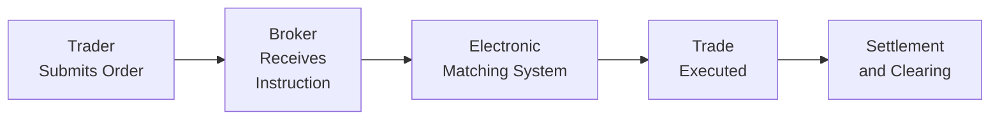

## Introduction  
I remember chatting with a former floor trader back in my early days—he had all these stories about shouting orders in the trading pit, sums scribbled on notepads, and actual shoving matches when the market got frantic. It sounded so dramatic (and sort of fun), but the reality was that it was inefficient, prone to human error, and often just plain exhausting. Well, times have certainly changed. Today’s trading environment is dominated by computers zipping around complex instructions at breakneck speed, sometimes executing trades in mere microseconds.  

In this section, we’ll dive into a topic that impacts everyone involved in equity and fixed-income trading—how electronic trading systems developed and, more importantly, why. We’ll see that reducing transaction costs, improving liquidity, enhancing speed, and boosting transparency weren’t just side benefits. They were the big reasons the industry collectively moved away from face-to-face trading floors.  

## The Shift from Floor-Based to Electronic Trading  
Before we get into the nitty-gritty of “why,” let’s make sure we fully grasp the “how.” Historically, trading occurred on physical exchange floors—the iconic image of red-jacketed traders calling out buy and sell prices. Over time, though, you started seeing these huge sets of monitors and blinking lights. Then, market participants realized that digital communication could do the job faster and more efficiently than people could by voice alone.  

Once the necessary infrastructure—like faster internet networks and more powerful computers—came of age, the transition to electronic platforms became almost inevitable. At the same time, regulatory changes in various parts of the world (think: Europe’s Markets in Financial Instruments Directive (MiFID) or the United States’ Regulation NMS) started prodding exchanges to support more transparent, accessible, and competitive electronic environments.  

## Key Drivers of Electronic Trading System Development  

### Speed of Execution  
One of the biggest catalysts behind electronic trading is the need for speed. I mean, who hasn’t felt that ever-growing pressure to do tasks quicker and more efficiently in our daily lives, right? In trading, speed—often described using the term “latency”—literally translates into potential profit.  

• Latency: This is the time delay between initiating an order and having it completed. In electronic markets, it can be measured in microseconds. A low-latency platform helps traders capture fleeting opportunities, especially in fast-moving, high-volume markets.  

In the old days (which, by the way, isn’t that old—just a couple of decades ago), you were stuck with phone lines, manual order entry, or physically being on the floor. Now, algorithms can react to market data almost instantly, placing trades based on set rules without any conscious human decision in the loop. That’s not just about convenience—it can lead to major advantages or disadvantages, depending on a trader’s speed.  

### Accessibility  
If you were a retail investor in the 1980s and 1990s, you probably had to call your broker, get quoted a price, and pay a hefty commission just to get shares. Today, you can be in a remote location—I once tried trading from a burger joint with decent Wi-Fi on a smartphone, believe it or not—and place an order in seconds.  

• Electronic platforms: By enabling online brokerages and direct market access, these systems open up trading to a much wider participation base. Retail investors, small institutions, and even global participants from different time zones can seamlessly access the markets.  

• Wider participation fosters liquidity: More traders mean more orders, which in turn reduces spreads and (theoretically) leads to better price discovery. The synergy of technology and accessibility helps keep markets humming.  

### Transparency  
Floor-based trading was often opaque, with deals occurring in pockets of the pit (yes, literally small clusters on the floor). The rest of the market might have had limited visibility into real-time quotes. That lack of transparency could hinder fair price discovery.  

Electronic limit order books, on the other hand, display buy and sell orders at different price levels for everyone to see. Sure, some innovations—like dark pools—offer less transparency, but overall, the shift to electronic trading has made market data more visible and more detailed, allowing participants to quickly assess supply, demand, and depth.  

• Order book: This is the real-time list of buy and sell orders for a security, organized by price level, which is typically displayed on electronic venues. Having these public quotes fosters a more efficient price discovery process, reduces the knowledge advantage once held by exclusive floor traders, and generally supports fairer conditions for all.  

### Cost Reduction  
Honestly, it’s tough to overestimate the importance of cost savings. For exchanges, operating an electronic system requires fewer overhead expenses than maintaining a physical floor with lots of personnel. For investors, bid-ask spreads and commission rates often come down as competition intensifies.  

• Floor-based systems can be labor-intensive, with additional operational costs.  
• Electronic platforms, while requiring meaningful tech investment, can handle a higher volume of trades at lower marginal costs.  

When competition and accessibility increased, brokerage fees declined, and we all know that excessive trading costs can ruin portfolio returns—so cost reduction has been a massive draw for both institutional and retail market participants.  

## The Transformation of Market Structure  
It’s not just about traditional exchanges flipping a switch to go from physical to digital. The entire market ecosystem has evolved. Shifting to electronic venues spurred the rise of:  

• Alternative Trading Systems (ATS): These include crossing networks and dark pools, where large institutional investors can match buy and sell orders away from the primary exchange, potentially minimizing market impact and front-running.  
• High-Frequency Traders (HFTs): Firms that use ultra-low-latency technologies and algorithms to capitalize on minute price discrepancies across different venues, or within the order book itself, sometimes holding positions for only milliseconds.  
• Dark Pools: Private exchanges that let participants trade without disclosing their identity or trade intention until after execution—useful for big trades that could otherwise move prices if the broader market caught wind of them too early.  

As a result, the concept of a single “stock exchange” has expanded to include myriad venues, each vying for different segments of order flow. Market fragmentation—once thought to be detrimental—can actually improve liquidity and reduce transaction costs when properly regulated and interconnected.  

### Illustration of the Electronic Execution Process  
Below is a simple diagram of how a trade order moves through an electronic execution cycle. You can see how quickly we get from “place order” to “execution,” thanks to technology.  

## Technology Innovations and Regulatory Support  
Technological innovations are obviously front and center. As computing power soared, so did the ability to process millions of quotes and trades every second. Fiber-optic networks, co-location services (physically placing your servers next to an exchange’s matching engine for speed), and ultra-fast application programming interfaces (APIs) have all enabled a more fluid trading arena.  

Regulatory changes further fueled adoption. For instance, in the United States, the Regulation National Market System (Reg NMS) required that exchanges route orders to the market with the best price, thereby encouraging electronic order matching, narrower spreads, and best-execution protocols. In the European Union, MiFID and MiFID II forced competition among exchanges by allowing new entrants to set up alternative trading venues and requiring more transparent reporting of trades and quotes.  

## Enhanced Market Efficiency and Liquidity  
Electronic trading has largely improved market liquidity by minimizing friction. Larger volumes can transact seamlessly, and in many cases, assets have become more liquid. For instance, even lesser-known stocks can trade more frequently since market participants anywhere in the world can place orders without physically being on an exchange floor.  

Better liquidity means:  
• Tighter bid-ask spreads.  
• Lower trading costs.  
• Faster order execution.  

In advanced derivatives markets, electronic trading supports rapid quoting, complex order types (like immediate-or-cancel or fill-or-kill), and robust risk management capabilities (like auto-cancels if margin thresholds are breached).  

## Challenges and Potential Pitfalls  
That said, electronic trading isn’t all sunshine and roses. I recall once seeing a “flash crash” unfold on-screen—an electronic meltdown where liquidity dried up in seconds, and prices plummeted precipitously. Gone are the days when humans on the floor could intervene by simply refusing to trade at ridiculous prices or even pausing momentarily. Algorithmic systems sometimes behave unexpectedly, which introduces new complexities.  

• Liquidity Crises: Automated systems can “pull” liquidity in response to certain triggers, amplifying volatility.  
• Fragmentation: While multiple trading venues may reduce costs, it can also split order flow, complicating best execution.  
• Technology Overdependence: Outages, cyber-attacks, or even basic software errors can profoundly disrupt markets.  

From a regulatory angle, ensuring fair access, preventing market abuse, and managing systemic risk becomes far more complex. This complexity itself has spurred development of sophisticated real-time surveillance tools that track suspicious trading patterns.  

## Practical Considerations for Portfolio Managers  
For those of us managing portfolios—be it equities, fixed income, or multi-asset—the rise of electronic trading means rethinking execution strategies, transaction cost analysis (TCA), and even which trading venues we should consider to optimize results.  

• Algorithmic Trading Tools: We can use algorithms to break large orders into smaller pieces, reducing market impact.  
• TCA: A thorough transaction cost analysis (such as implementation shortfall, VWAP, or effective spreads) helps decide the best way to route orders.  
• Relationship Management: Some of the old relationship-based aspects of trading remain relevant. Even though the execution is electronic, brokers and counterparties provide specialized solutions or direct market access that might suit certain strategies.  

In that sense, portfolio managers have gained more control over their trades. But the flip side is, we need stronger technical and quantitative skills to navigate the variety of order types and trading platforms effectively.  

## Best Practices in Electronic Trading  
• Use Real-Time Risk Controls: Rapid markets mean losses can occur instantly. Automated stop-loss orders or real-time margin checks are prudent.  
• Evaluate Venue Quality: Each electronic platform has different rules, liquidity, and operational characteristics. Some might be better for large block trades, while others excel at executing small-lot retail orders.  
• Monitor Latency and Execution Quality: If your strategy depends on speed, be sure you’re measuring how quickly your orders go through—and what market conditions look like if there’s a spike in volatility.  

## Final Exam Tips  
On the CFA Level III exam, questions about electronic trading often focus on how speed, cost, transparency, and liquidity improvements affect portfolio execution strategies. You might also see scenario-based questions about how a manager should direct trades across multiple electronic venues (like a question pitting a dark pool against a lit exchange).  

• Pay attention to key definitions: “Latency,” “Order Book,” “Dark Pool,” “Implementation Shortfall,” etc.  
• Be ready to illustrate how cost savings from tight bid-ask spreads can improve portfolio returns, or how certain algorithmic executions might mitigate market impact.  
• Recognize potential pitfalls: flash crashes, algorithmic errors, or regulatory concerns around high-frequency trading.  

Remember, this is less about pure memorization and more about addressing real-world scenarios that test your understanding of the trade-offs.  

## References and Further Reading  
• Hasbrouck, J. (2007). Empirical Market Microstructure: The Institutions, Economics, and Econometrics of Securities Trading. Oxford University Press.  
• CFA Institute. (2025). CFA Program Curriculum, Level III, Volume 2: Portfolio Construction.  
• CFA Institute Codes and Standards for Market Integrity and Transparency.  
• Regulation National Market System (Reg NMS), U.S. Securities and Exchange Commission.  
• Markets in Financial Instruments Directive (MiFID), European Union.  

## Test Your Knowledge: Drivers Behind Electronic Trading



### 1. Which of the following is a primary reason for the shift from floor-based trading to electronic trading?  
- [ ] Manual order matching is more accurate.  
- [x] Automation reduces latency and enhances execution speed.  
- [ ] Trading floors allow for more negotiation flexibility.  
- [ ] High trading costs make electronic markets appealing.  

> **Explanation:** Reducing latency is critical in modern markets. Automated systems enable high-speed execution and real-time price updates.

### 2. Regarding market accessibility, which statement is correct?  
- [ ] Retail investors find it harder to trade in electronic markets.  
- [ ] Accessibility to electronic markets has not impacted liquidity.  
- [ ] Only institutional traders benefit from electronic access.  
- [x] Electronic trading platforms allow broader participation worldwide.  

> **Explanation:** Electronic systems let a wide range of participants—from small retail investors to large global institutions—trade with fewer barriers.

### 3. Which of the following best describes a dark pool?  
- [ ] A venue with public, transparent quotes.  
- [x] A private forum that allows trading without revealing identities until after execution.  
- [ ] A regulated exchange with high transaction fees.  
- [ ] A system that enforces a price floor for all trades.  

> **Explanation:** Dark pools keep order information hidden to minimize market impact, revealing trade details only after execution.

### 4. Why do electronic limit order books enhance transparency?  
- [x] They display all buy and sell orders in real time for everyone to see.  
- [ ] They hide large institutional orders to prevent front-running.  
- [ ] They only show top-of-book quotes and nothing else.  
- [ ] They limit high-frequency traders’ ability to see order flow.  

> **Explanation:** Electronic limit order books typically list orders at multiple price points, fostering better visibility of market depth.

### 5. In what way has fragmentation impacted modern markets?  
- [ ] It reduces liquidity and drives spreads higher.  
- [ ] It centralizes trading on one global exchange.  
- [x] It introduces multiple venues competing for order flow, potentially tightening spreads.  
- [ ] It mandates standardized pricing across all market participants.  

> **Explanation:** Fragmentation allows competition and can lead to lower trading costs, though it also introduces complexities in best execution.

### 6. How do high-frequency traders (HFTs) use latency advantages?  
- [x] They detect and react to small price discrepancies faster than other participants.  
- [ ] They trade exclusively through dark pools to avoid discovery.  
- [ ] They hold positions for weeks to capture long-term trends.  
- [ ] They rely on manual order entry for trade execution.  

> **Explanation:** HFTs leverage ultra-fast execution to exploit price differences and execute high volumes of trades in fractions of a second.

### 7. Which factor most directly contributes to cost reduction in electronic trading?  
- [ ] Expanded reliance on voice brokers.  
- [x] Lower overhead and reduced trading fees compared to floor-based systems.  
- [ ] Increased manual processing of trade settlements.  
- [ ] Strict capital requirements on brokers.  

> **Explanation:** Electronic venues operate with less overhead than physical floors and can process trades at lower marginal costs.

### 8. One of the main risks associated with electronic trading is:  
- [x] The potential for flash crashes where liquidity vanishes swiftly.  
- [ ] Guaranteed liquidity at consistent price levels.  
- [ ] Inflexible order types in dynamic markets.  
- [ ] Absence of any regulatory oversight.  

> **Explanation:** With electronic venues, sudden spikes in volatility can lead to liquidity being pulled almost instantly, exacerbating rapid price swings.

### 9. Which governing principle helps ensure that orders are routed to the market with the best price?  
- [ ] No regulation covers order routing.  
- [x] Regulation National Market System (Reg NMS).  
- [ ] The Volcker Rule.  
- [ ] International Financial Reporting Standards (IFRS).  

> **Explanation:** Reg NMS requires brokers in U.S. markets to route orders to the venue offering the best price, supporting best execution.

### 10. True or False: Lower latency always guarantees lower transaction costs.  
- [x] True  
- [ ] False  

> **Explanation:** Generally, lower latency can contribute to tighter spreads and faster trades, which in turn can reduce certain explicit (and sometimes implicit) transaction costs.


