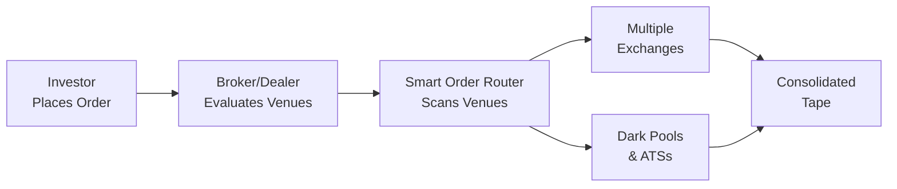

Understanding Market Fragmentation  
Market fragmentation, put simply, is what happens when a single financial instrument trades on multiple venues. You’ve got exchanges, alternative trading systems (ATSs), dark pools, you name it. Instead of funneling orders through one centralized marketplace (which might feel a little old-school these days), trades end up scattered all over the place. In some ways, this trend has unlocked efficiency, competition, and better liquidity for certain instruments. In other ways—well, it can complicate your life as an investor or a portfolio manager looking for the best prices.  

I remember once speaking with a client who was baffled as to why the price she saw on her favorite news outlet never matched the fills she was getting from her broker—she didn’t realize her orders were being routed to a whole host of alternative trading venues competing for flow, each posting slightly different quotes at different times. She simply thought real-time data was real-time data and everyone got the same feed. Um, about that... not exactly.  

Causes of Market Fragmentation  
One of the biggest drivers behind market fragmentation is regulation. But it’s not like some single regulator said, “Let’s fragment the market.” Instead, regulators often push for competition among trading venues in the hope of fostering better execution quality, narrower bid-ask spreads, and more innovative products and services. Look no further than changes in Europe under MiFID II or in the United States under Regulation NMS. These frameworks encourage venues to step up and compete, fueling new exchanges, crossing networks, and dark pools.

Technological progress plays a role, too. Low-latency networks and advanced order routing technologies let trades zip around at incredible speeds, so the barriers to launching a new exchange or ATS have come down dramatically. Remember when opening a new exchange was a big event involving physical trading floors, membership seats, telephones, and all the drama of open outcry? Now, it’s mostly about servers, matching engines, connectivity, and regulatory approvals. With technology in the driver’s seat, new venues pop up relatively easily, each tailoring to unique demands—maybe some cater to large block trades in dark pools to minimize market impact, while others aim to attract high-frequency market-making strategies.

Investors themselves drive fragmentation, too. Everyone wants a specialized environment that suits their strategy. A pension fund wanting to quietly offload a big block of shares might choose a dark pool. Meanwhile, a high-frequency trader chasing arbitrage opportunities might prefer a lit exchange with lots of volume. This patchwork of investor preferences means liquidity is never concentrated in just one place. That can be great for price competition—but it makes the markets look like a kaleidoscope of quotes scattered across multiple platforms.

Effects on Trading  
The big question is: how does fragmentation affect trading? Let’s look at some of the common themes:

• More Complex Price Discovery: Since quotes and trades are sprinkled across multiple venues, the challenge of price discovery grows. An investor trying to determine the “true” current price might need to aggregate data feeds from a handful of different platforms. Delays or incomplete data from even one major venue can warp your view of what’s happening in the market.  
• Smart Order Routing: Over time, the market responded to this fragmentation with sophisticated order routing algorithms. These “smart” routers dynamically scan multiple venues for the best price and liquidity. They also consider fees, speed, and the probability of getting filled. This is crucial for achieving best execution, especially when you’re dealing with large orders or highly liquid currencies and stocks that trade on countless platforms every second.  
• Liquidity Challenges: If you’re focusing on a less liquid stock—maybe a mid-cap with moderate volume—having that liquidity chopped up into smaller slices scattered across 10 or more venues can actually raise your transaction costs. More time spent chasing liquidity can produce slippage, because you might have to move prices more to fill an entire block. This effect magnifies for large institutional trades.  
• Competition for Spreads: Where fragmentation works best is often in highly liquid securities. The competition among venues compels market makers to produce narrower spreads. Everyone’s jockeying for order flow, so they offer better pricing. For widely traded assets, such as big-name equities or major sovereign bonds, fragmentation can actually lower cost. The flip side is the confusion around consolidated market data. Without a single “tape” where everything’s combined and synchronized, market participants can miss out on certain trades or quotes.  
• Potential for Latency Arbitrage: Some participants who measure time in microseconds or nanoseconds can exploit minor latencies between venues. In a fragmented environment, an ATS might update its quotes a split second later than a major exchange, opening a fleeting arbitrage. This phenomenon can further complicate price discovery and may disadvantage slower-moving participants.

Smart Order Routing and Best Execution  
Smart order routing (SOR) is the system that acts as the traffic cop for your trades, searching out the best possible execution across multiple venues. If you’re a portfolio manager trying to grab 50,000 shares at the best price, you definitely don’t want to just slam your entire order onto one exchange. Instead, your broker or internal trading desk will (hopefully) have an SOR in place.  

Think about it from a bit of a “kitchen-sink approach”: SOR checks all the different pools— major exchanges, dark pools, crossing networks, maybe even a bigger block liquidity platform. It finds where the best combination of price, depth, and speed exists, then splits or routes your order accordingly. That’s all in the name of “best execution,” an obligation driving professional investment firms and their brokers to obtain trades at the most favorable terms for their clients, given constraints like speed, likelihood of execution, and cost.

Here’s a quick diagram illustrating how an order might bounce around in a fragmented market:

The investor places an order with a broker/dealer, which uses a smart order router to check multiple venues. Trades from these venues are eventually reported to a consolidated tape, enabling (in theory) a consolidated market view.

Consolidated Market Data  
One of the trickiest bits about fragmentation is simply keeping track of everything. Consolidated market data aims to gather quotes and transactions from multiple venues into a single feed (or tape). This aggregates the National Best Bid and Offer (NBBO) in the United States, for instance, or the European consolidated tape (though that’s an evolving situation).  

Consolidated data offers the benefit of a more complete snapshot. But ironically, in some regions, regulators and technology providers still struggle to create a perfect consolidated feed. Different reporting standards, data latencies, and licensing fees add to the complexity. Not to mention, those who want the bleeding-edge data (like high-frequency traders) typically buy direct feeds from individual exchanges or ATSs—a step faster than any consolidated feed can manage.  

Spreads, Depth, and Impact on Transaction Costs  
From a portfolio management viewpoint, you know that transaction costs can eat into returns. When your asset allocation calls for rebalancing or you need to adjust equity or bond positions, you want to do so at low cost. In a fragmented market, your implicit costs might inch up because you have to “hunt” for liquidity. If your trades are large, you may split them further into smaller slices or send them to dark pools to minimize market impact. These solutions require sophisticated technology, specialized knowledge, and can take time—time that might cause you to miss a rapidly changing price.

That said, well-structured fragmentation and robust competition can tighten spreads for actively traded names. Let’s say you’re trading a well-known technology giant with a huge daily volume. Chances are you’ll benefit from narrower bid-ask spreads thanks to multiple exchanges vying for your order flow. But for smaller, less liquid securities, liquidity can become patchy across venues—like rummaging through multiple grocery stores all over town to assemble your shopping list.

Case Studies and Real-World Examples  
• Dark Pool Surges: Over the last decade, institutional investors have flocked to dark pools for large block trades, mitigating price impact. At times, the dark-pool share of equities trading volume in major markets soared to around 15%–20%. This shift points to a direct fragmentation away from lit exchanges.  
• High-Frequency Competition: As HFT shops became more prevalent, they sought the best opportunities across all sorts of lit venues. Exchanges recognized that attracting these traders (and charging colocation or data fees) could boost their bottom lines. In response, new exchange models popped up, offering unique incentives (like maker-taker pricing) that further spread out liquidity.  
• Cross-Border Variations: In Europe, MiFID II contributed to a proliferation of Multilateral Trading Facilities (MTFs) and Organized Trading Facilities (OTFs). These are basically alternative venues to national stock exchanges. Fragmentation soared, driving the need for robust consolidated tape solutions—though the discussion around achieving comprehensive real-time consolidation in Europe is still ongoing.

Common Pitfalls and How to Manage Them  
One pitfall is failing to appreciate the real cost of trading in a fragmented environment. For instance, you might see a tight quote in one venue, only to realize the liquidity you need is somewhere else, or that the displayed size is minuscule. Without a solid order-routing strategy and skilled execution, your fills could slip.

Another pitfall is ignoring the speed factor. Maybe you have a trading algorithm that hunts down the best price, but it’s not set up for the microsecond differences among venues. Suddenly, someone with a faster direct feed can pick off the better quote (latency arbitrage). Yet, an appropriate approach—like implementing a more dynamic routing algorithm or using broker algorithms that have fast connections—can help you avoid this pitfall.

Links to Transaction Cost Analysis and Other Topics  
Market fragmentation is closely tied to many of the issues discussed throughout Chapter 6. For example:  
• Implementation Shortfall (Section 6.3): Fragmentation can amplify market impact and delay fills, leading to possible slippage and differences between decision prices and execution prices.  
• Types of Electronic Traders (Section 6.6): Fragmentation fosters different participant profiles—some are seeking large hidden liquidity, others thrive on speed. Knowing who is on the other side of your trade is key to anticipating how order flow might get snatched away.  
• Algorithmic Trading Strategies (Section 6.11): Algo strategies can incorporate venue selection logic, order routing parameters, and dark-pool access. Market fragmentation is precisely why these strategies exist—to navigate this labyrinth effectively.

Exam Tips for CFA® Level III Candidates  
• Know Your Definitions: Be prepared to define and discuss concepts like smart order routing, best execution, and consolidated market data. These come up often in item-set vignettes and essay questions that require you to explain or recommend a trading strategy.  
• Quantify the Impact: You might be asked how fragmentation affects trading costs. Break it down into explicit costs (like commissions) and implicit costs (like market impact, spreads, and opportunity cost). Show that you understand how fragmentation specifically influences these components.  
• Link to Portfolio Management: Don’t forget that the ultimate goal is portfolio construction and management. You might see a question about whether a manager should use multiple dark pools or a specific electronic crossing network for a large trade. Tying the rationale back to best execution, liquidity constraints, and risk is crucial.  
• Watch for Regulatory Angle: The exam might throw in a scenario referencing MiFID II or Regulation NMS, asking for an explanation of how regulatory frameworks push or hinder fragmentation.  
• Time Management: In essay questions, keep your answers concise and link your points to the question’s direct guidance. You may have to address the pros and cons of fragmentation in a single multi-part question, so structure your response well.

References and Further Reading  
• Gomber, P., et al. (2017). The Impact of Dark Trading and Visible Fragmentation on Market Quality. CFA Institute Research Foundation.  
• CFA Institute. (2025). CFA Program Curriculum, Level III, Volume 2: Portfolio Construction.  

Market fragmentation might feel complicated at first glance, but once you grasp its causes—like tech innovation and regulatory changes—and how it impacts liquidity, cost, and volatility, you’ll see the logic behind all the fancy order-routing tools. In many ways, it’s a reflection of capital markets continuously pushing for new ways to trade, price assets, and manage risk. If you keep these insights in mind next time you watch an order zip around different exchanges, you’ll be well-prepared for both the CFA® exam and real-world trading challenges.

## Market Fragmentation Mastery Quiz



### Which of the following is the primary regulatory intention behind encouraging multiple trading venues?  
- [ ] To limit cross-border trades to a single venue.  
- [x] To promote competition among exchanges and improve execution quality.  
- [ ] To simplify the pricing of derivatives.  
- [ ] To centralize liquidity in a single national exchange.  

> **Explanation:** By encouraging competition, regulators aspire to foster better pricing and innovation, potentially benefiting end investors with narrower spreads and better execution opportunities.

### What is a key impact of market fragmentation on price discovery?  
- [ ] It simplifies the dissemination of consolidated data.  
- [ ] It reduces the importance of having a smart order router.  
- [x] It makes price discovery more complex as quotes and trades are spread out across multiple venues.  
- [ ] It eliminates the need to analyze volume trends.  

> **Explanation:** With prices and volumes scattered across various platforms, traders must work harder to form a complete picture of an asset’s pricing and liquidity.

### How can dark pools be beneficial to large institutional traders in a fragmented market?  
- [ ] Dark pools offer only high-speed executions for retail investors.  
- [ ] Dark pools charge higher commissions relative to public exchanges.  
- [x] Dark pools allow large block trades to be executed with reduced market impact.  
- [ ] Dark pools provide fully transparent trade data for all participants.  

> **Explanation:** Large traders often use dark pools to minimize market impact and avoid tipping their hand with big orders in lit markets.

### When does competition from multiple trading venues typically result in narrower spreads?  
- [x] In heavily traded, highly liquid securities.  
- [ ] In thinly traded stocks that frequently show zero volume.  
- [ ] In markets where only a single exchange is allowed to operate.  
- [ ] In markets that completely ban short selling.  

> **Explanation:** In liquid securities, multiple venues compete to attract order flow, forcing spreads to tighten to remain attractive to traders.

### Which of the following statements regarding best execution is correct?  
- [x] It involves achieving the most favorable terms for clients, taking into account price, speed, and likelihood of execution.  
- [x] It means always finding the absolute lowest available price in the marketplace, regardless of other factors.  
- [ ] It is exclusively determined by the bid-offer spread.  
- [ ] It only applies to institutional traders.  

> **Explanation:** Best execution is more nuanced than just “lowest price” and requires considering order size, market impact, speed, commission costs, and likelihood of fill.

### Which factor is most likely to exacerbate transaction costs in a fragmented market for a mid-cap security?  
- [x] Liquidity being dispersed across several venues.  
- [ ] A consolidated tape making quotes easily accessible.  
- [ ] Limited use of smart order routing.  
- [ ] Uniform regulation across all exchanges.  

> **Explanation:** When liquidity for a mid-cap is split up, large orders may have to chase small pockets of volume on different venues, increasing market impact and slippage.

### What is the primary purpose of a consolidated tape in fragmented markets?  
- [ ] To hide institutional block trades from the market.  
- [x] To aggregate quotes and trades from multiple venues.  
- [ ] To incentivize users to send orders only to dark pools.  
- [ ] To raise regulatory fees for high-volume trades.  

> **Explanation:** A consolidated tape aims to assemble a broad, real-time snapshot of market activity across diverse venues so participants can more effectively evaluate price and volume data.

### How might latency arbitrage arise in a fragmented market?  
- [ ] When all venues instantly share the exact same quote updates.  
- [ ] If a single consolidated feed is used by everyone.  
- [x] When there are microsecond differences in how venues update their best quotes.  
- [ ] If only one market maker provides quotes.  

> **Explanation:** Fragmentation plus tiny time delays across venues can let high-frequency traders profit from price discrepancies.

### Which of the following best describes a common pitfall for investors in fragmented markets?  
- [ ] Believing that all trading venues offer identical liquidity.  
- [ ] Using a smart order router for large trades.  
- [x] Underestimating hidden liquidity pockets or ignoring speed/latency differences.  
- [ ] Consulting consolidated market data feeds.  

> **Explanation:** Ignoring different data latencies and not considering hidden liquidity in other venues can lead to suboptimal fills and surprising execution costs.

### Market fragmentation can sometimes benefit investors by:  
- [x] Intensifying competition and narrowing spreads in liquid securities.  
- [ ] Eliminating the need for multiple trading algorithms.  
- [ ] Removing the requirement for best execution compliance.  
- [ ] Simplifying broker-dealer responsibilities.  

> **Explanation:** In many liquid securities, venue competition can improve pricing, though it also adds complexity in terms of data consumption and order routing.


