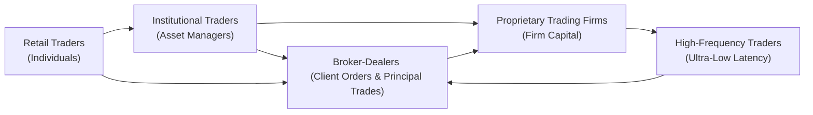

## Introduction

When we talk about electronic trading, it’s easy to imagine a fast-paced environment filled with flashing screens, millisecond-order executions, and a global array of participants all racing to buy or sell securities at the “right” price. I still remember the first time I placed an online trade in college—it felt almost surreal that I could purchase shares of a global conglomerate within seconds. But as we dive deeper, we discover there's a whole lot more to electronic trading than meets the eye. 

In this section, we’ll walk through the major types of electronic traders—Retail Traders, Institutional Traders, High-Frequency Traders (HFTs), Proprietary Trading Firms, and Broker-Dealers. Each type comes with distinct motivations, investment horizons, technology usage, trading volumes, and regulatory considerations. It’s crucial to see how they each fit into the broader market ecosystem because their behaviors help shape liquidity, volatility, and price discovery. We’ll also highlight some common pitfalls, potential challenges, and practical strategies for engaging with these participants. 

## Retail Traders

Retail traders are individuals like you and me, although each person’s level of experience may vary significantly—from the casual saver dabbling in ETFs for retirement, to the adrenaline-charged day trader scalping micro-cap stocks. In modern electronic markets, retail traders typically connect through online brokerage platforms offering direct access to exchanges or alternative trading venues. 

Why are retail traders so important? For starters, they often collectively provide significant liquidity in certain segments. While each retail order is usually pretty small—maybe fewer than a thousand shares or even a single-lot contract—aggregate retail activity can add up across millions of individuals. In highly liquid large-cap stocks, these smaller orders typically have a negligible direct price impact. 

That said, retail traders sometimes face higher transaction costs relative to institutions, because their orders often are executed at market quotes plus commissions or platform fees. On the plus side, many brokerage platforms now offer free (or near-free) trading for certain securities—this can reduce explicit costs for retail investors but can sometimes lead to hidden implicit costs, such as less price improvement or sometimes being routed to less-competitive markets.

### Key Characteristics of Retail Traders
• Generally small order sizes.  
• Less sophisticated algorithmic strategies (though this is changing with retail “copy trading” or “robo-advisory” platforms).  
• More prone to behavioral biases, such as fear-of-missing-out (FOMO) or panic selling.  
• Typically less frequent trading compared to institutional or high-frequency players.  

Personally, I still recall a friend who traded penny stocks based on social media hype. And, well, let’s just say it did not end well. That’s often the risk with retail trading: less research and more impulsive decision-making. Still, retail traders form a massive part of the market’s foundation and provide liquidity and diversity in order flow.

## Institutional Traders

On the opposite end of the spectrum, we have institutional traders—major players that manage pension funds, sovereign wealth funds, mutual funds, hedge funds, or insurance portfolios. These folks (and hopefully some “you folks,” once you complete the CFA Program) often have advanced tools, large IT infrastructure, and specialized knowledge. Many use algorithmic trading to slice huge orders into smaller child orders to minimize market impact. In a nutshell, if you see a multi-million-share trade in a single block, chances are an institutional trader is behind it. 

### Large Order Requirements
Institutional traders typically manage enormous portfolios and need to adjust positions without unduly moving the market price. Instead of dumping 2 million shares at once (which might drive the price down abruptly), they’ll rely on algorithms that do things like schedule trades over time, target a volume-weighted average price (VWAP), or even match real-time quote patterns to conceal their true trading intentions.

### Sophisticated Execution Tools
Institutional traders often integrate Transaction Cost Analysis (TCA) into their workflows, as discussed in Section 6.12 of this volume. They measure the execution quality of each child order and then optimize strategies to reduce slippage. And if you recall from earlier sections on Implementation Shortfall (Section 6.3), institutions will carefully track the total cost of not only commissions but also missed opportunity costs, market impact, and timing delays.

### Key Characteristics of Institutional Traders
• Large block trades, often disguised using advanced algorithms (e.g., VWAP, TWAP)  
• A focus on minimizing transaction costs and market impact  
• Rigorous risk management and governance structures  
• May employ internal crossing networks or dark pools to trade large blocks privately  

Honestly, watching an institutional execution desk in action is like seeing a well-choreographed dance: traders juggle multiple markets, time zones, and instruments while conferring with portfolio managers, risk officers, and compliance all at once. 

## High-Frequency Traders (HFTs)

High-frequency trading (HFT) is a subset of algorithmic trading, but with the nuance that HFT strategies emphasize extremely short holding periods, often mere seconds or milliseconds, combined with lightning-fast order routing. The name of the game for HFTs is speed—think direct market access connections, collocation next to exchange servers, and an insatiable appetite for new technology to shave nanoseconds off a round trip order. They might exploit fleeting arbitrage opportunities across markets or act as de facto market-makers by continuously posting bids and offers.

### Speed Advantage
HFT firms spend heavily on advanced hardware and proprietary software to achieve minimal latency in analyzing the market and placing orders. In some cases, microwave towers or fiber connections with specialized routes are used to reduce data transmission time by fractions of a millisecond. 

### Short Holding Periods
HFTs typically hold positions for very short durations, sometimes just seconds or less, and aim to benefit from incremental price discrepancies or liquidity rebates. By the end of the trading day, many HFTs prefer to hold minimal overnight positions to avoid “gap risk,” where the market might open with a big price move.

### Key Characteristics of HFTs
• Ultra-high-speed order execution, often with direct exchange access  
• High daily volume and turnover, but small net positions by end of day  
• Strategies often include market-making, statistical arbitrage, or event-driven trades  
• Can magnify short-term volatility or reduce bid-ask spreads, depending on market conditions  

There’s an ongoing debate about whether HFT adds liquidity or just adds noise. Probably a bit of both. Critics argue that HFT can exacerbate flash crashes or create illusions of liquidity that vanish in a crisis. Supporters note that HFT often narrows spreads and provides continuous two-sided quotes.

## Proprietary Trading Firms

Proprietary trading firms trade with their own capital, not client money, aiming to capture returns for the firm’s partners or shareholders. They can be large broker-dealers that run proprietary desks or smaller boutiques focusing on specific niches (e.g., energy futures arbitrage, commodity spread trading, or exotic derivatives).

### Firm Capital vs. Client Capital
A key differentiator is that proprietary firms don’t owe their returns to outside investors—imagine a family office or a small group of traders who pool resources. This freedom allows them more latitude in strategy choice, leverage usage, and risk tolerance. However, it also means it’s their own money at stake. 

### Trading Styles
Proprietary trading strategies can overlap with HFT or institutional approaches, but they’re not constrained by the same compliance or fiduciary obligations as, say, a pension fund. They might day trade, swing trade, or hold for weeks—it all depends on their preferences and market outlook.

### Key Characteristics of Proprietary Trading Firms
• Use firm capital rather than client funds  
• Freedom to pursue short-term or long-term alpha strategies  
• Potentially large risk-taking capacity, depending on capital base  
• Typically nimble in decision-making with fewer bureaucratic constraints  

I still recall a prop firm in my neighborhood that specialized in indexing anomalies—it was fascinating how they used “live data scrapes” to track index rebalancing trades and then front-run predictable flows. That’s the kind of opportunistic approach you might only see in a nimble proprietary shop.

## Broker-Dealers

Broker-dealers serve a dual role: they act as brokers by executing client orders, and they act as dealers (or principals) when they trade for their own accounts. From a regulatory standpoint, broker-dealers have obligations to clients (best execution, for example), but they may also engage in proprietary or principal trading lines of business.

### Principal Trading
When a broker-dealer trades as a principal, it uses its own inventory to fulfill a client order or to speculate. This is referred to as principal trading. By contrast, acting as a broker means simply matching buyers and sellers and charging a commission. Principal trading is profitable when they acquire securities at a price below where they sell them later. However, it comes with heightened risk since the broker-dealer owns the position (and the potential losses).

### Source of Liquidity
Broker-dealers often provide liquidity by continuously buying and selling securities, creating an internal order book or “inventory.” In some contexts, major broker-dealers set up Automated Trading Systems or use internal crossing networks to match large trades off-exchange. They also might publish research or coordinate block trades for institutional clients.

### Key Characteristics of Broker-Dealers
• Dual role as agent (broker) or principal (dealer)  
• Access to wide client order flow  
• Potential for conflicts of interest if proprietary trading competes with client orders  
• Subject to comprehensive regulatory oversight  

Remember, from a portfolio management perspective, you want to keep an eye on execution quality. Sometimes, broker-dealers can route trades in ways that benefit their own book unless carefully monitored. This is why the broader conversation around best execution and regulatory compliance is so important—we want to ensure that clients and the marketplace benefit from a broker-dealer’s role.

## Comparing Electronic Traders

To visualize the relationships between these trader types, consider the following diagram:

Although the paths in the diagram are simplified, they hint that most trading activity flows through broker-dealers at some point. Even proprietary traders might rely on broker-dealer infrastructure for custody or prime brokerage services. High-frequency traders often connect directly to exchanges but also cross paths with broker-dealers for clearing. 

## Practical Examples

To bring these ideas down to Earth, let’s walk through a hypothetical trading day focusing on how these participants interact:

• Morning volatility triggers: An institutional desk receives a mandate to buy $50 million of a certain tech stock. The desk’s execution algorithm starts slicing trades into smaller increments to reduce market impact.  
• Meanwhile, a high-frequency market-making algorithm offers tight bid-ask spreads in that same tech stock, ready to snap up any ephemeral mispricing.  
• Retail traders, reacting to social media buzz, begin placing buy orders. They execute quickly at current market prices, often paying the inside ask.  
• A proprietary trading firm sees an arbitrage between the futures market and the cash market for that tech stock. They deploy short-term capital to capture the spread.  
• Finally, the broker-dealer in the background ensures these orders find each other or route to the right trading venues, either as an agent or by filling from their inventory as a principal.

At day’s end, the high-frequency trader likely closes all positions and pockets some spread revenue or arbitrage profits, the institutional desk might still have partial shares left to fill on slower, passive limit orders, and retail buyers are left with a new stock in their portfolio. 

## Challenges, Pitfalls, and Best Practices

• Technological Arms Race: For HFTs and proprietary traders, the difference between winning and losing might be measured in nanoseconds. The cost of maintaining top-tier technology is high, and failing to do so can render a firm uncompetitive.  
• Slippage and Market Impact: Institutional traders face the challenge of large orders. Even a slight price drift can translate to millions in extra costs, so careful scheduling or algorithmic strategies are crucial.  
• Conflicts of Interest: Broker-dealers that trade on a principal basis must adhere to strict ethical and regulatory guidelines to ensure client trades receive best execution.  
• Behavioral Biases: Retail traders often let emotion override logic. Placing market orders during panic can lead to poor fills, especially in volatile conditions.

A best practice for all market participants, ironically enough, is robust risk management. Whether you’re a giant pension fund or a day-trading enthusiast, recognizing your risk tolerance, your liquidity needs, and your technology constraints is essential for sustainable success. 

## Glossary

• High-Frequency Trading (HFT): A subset of algorithmic trading characterized by extremely short holding periods, high order-to-trade ratios, and ultra-low-latency execution.  
• Principal Trading: Transactions where a broker-dealer buys or sells securities from its own inventory, acting as a dealer rather than just an agent.

## Final Exam Tips

As you prepare for potential exam questions on electronic traders:

• Be sure you can distinguish each participant type—their motivations, typical strategies, and the characteristics of their trading activity.  
• Consider how each type of trader interacts with market structure components (e.g., fragmentation, electronic communication networks, transaction cost analysis).  
• Pay attention to how each might create or reduce liquidity, cause or mitigate volatility, or influence the bid-ask spread.  
• Practice scenario-based questions that ask you to evaluate how a certain order size or strategy might be executed differently by a retail vs. an institutional participant.  
• Time management is key. If you see an exam question requiring deep conceptual analysis—like describing how HFTs might arbitrage micro-inefficiencies—outline your main points clearly before writing your response.  
• In essay (constructed response) format, you may need to link the characteristics of these traders to broader portfolio management or risk management objectives (for instance, how an institutional portfolio manager might adapt execution strategy after identifying the presence of HFTs in the order book).

## References and Further Reading

• Aldridge, I. (2013). High-Frequency Trading: A Practical Guide to Algorithmic Strategies and Trading Systems. Wiley.  
• CFA Institute. (2025). CFA Program Curriculum, Level III, Volume 2: Portfolio Construction.  

## Test Your Knowledge: Electronic Traders and Market Dynamics



### Which of the following most accurately describes retail traders in electronic markets?

- [x] Their small individual order sizes typically do not significantly move prices.
- [ ] Their aggregate volume always exceeds that of institutional traders.
- [ ] They frequently use ultra-low-latency strategies for arbitrage gains.
- [ ] They tend to trade only through large block transactions.

> **Explanation:** Individual retail traders often place relatively small orders and typically do not move markets. While retail flows can be significant in aggregate, it is institutional and high-frequency trading that usually dominates total volume.

### One major reason institutional traders use algorithmic execution strategies is to:

- [x] Mitigate market impact when placing large orders.
- [ ] Ensure high-frequency arbitrage opportunities.
- [ ] Guarantee faster execution than retail traders.
- [ ] Eliminate commissions altogether.

> **Explanation:** Institutions frequently break up large trades into smaller ones to minimize the effect on the market price. High-frequency arbitrage strategies and zero commissions are not typical goals of institutional algorithmic execution.

### High-frequency traders (HFTs) typically:

- [x] Seek to close out positions by day’s end to reduce overnight risk.
- [ ] Take long-term views on securities, holding positions for weeks.
- [ ] Rely on fundamental research for value investing.
- [ ] Have lower order-to-trade ratios than retail investors.

> **Explanation:** HFTs often close out positions by the end of the trading day to avoid overnight risk. Their approach is short-term, and they have very high order-to-trade ratios, unlike typical retail investors or long-term value-oriented players.

### Proprietary trading firms primarily differ from institutional traders because:

- [x] They exclusively trade their own capital rather than client funds.
- [ ] They are legally required to hold positions for a minimum of one trading day.
- [ ] Their trading volumes are generally higher than institutional asset managers.
- [ ] They cannot execute algorithmic trades.

> **Explanation:** Proprietary traders use their own capital and are not bound by fiduciary duties to clients, unlike institutional managers who manage investor or client funds.

### Which of the following best describes a broker-dealer’s role when engaging in principal trading?

- [x] The broker-dealer uses its own inventory to buy or sell a security.
- [ ] The broker-dealer charges a commission for facilitating a trade.
- [ ] The broker-dealer is never at risk since it matches buyers and sellers.
- [ ] The broker-dealer is not subject to regulatory oversight in proprietary trading.

> **Explanation:** In principal trading, a broker-dealer acts as a dealer by transacting from its own inventory, assuming market risk. Commissions are typically considered brokerage (agency) charges, and broker-dealers are always subject to regulatory rules, including best execution.

### Retail traders are often at a disadvantage compared to high-frequency traders because:

- [x] They do not usually have the same ultra-low-latency infrastructure.
- [ ] Their orders are always front-run by institutional traders.
- [ ] They cannot purchase exchange-traded funds.
- [ ] Their trades are banned from dark pools.

> **Explanation:** Retail traders rarely have access to the advanced technology setups that high-frequency traders do. Front-running is illegal, and retail investors can indeed buy ETFs. Dark pools are used by institutions, but they are not banned outright for retail.

### In markets with significant high-frequency trading, institutional investors may:

- [x] Adjust execution strategies to minimize information leakage.
- [ ] Eliminate the use of limit orders.
- [ ] Only trade in the premarket or postmarket sessions.
- [ ] Require broker-dealers to cancel all orders each day.

> **Explanation:** Institutions adapt their execution tactics in the presence of HFT to reduce possible market impact and reveal less information. They do not necessarily cease using limit orders or restrict themselves to only extended hours trading.

### A major concern regarding HFT is:

- [x] Potential contribution to short-term market volatility or “flash crashes.”
- [ ] Inability to hedge positions quickly during times of volatility.
- [ ] Excessive reliance on multi-week fundamental research.
- [ ] Lower turnover compared to institutional investors.

> **Explanation:** HFT has been implicated in episodes of short-term market dislocation, such as flash crashes. By definition, HFT does not rely on multi-week research—its strategies focus on ultra-short-term trades.

### Which of the following is a key advantage of institutional traders in electronic markets?

- [x] Access to sophisticated algorithms and execution strategies.
- [ ] Guaranteed price improvement compared to retail orders.
- [ ] Freedom from regulatory reporting.
- [ ] 24/7 trading without the need for clearing or settlement.

> **Explanation:** Institutions typically have superior access to advanced technology and algorithmic strategies, but they do not have guaranteed price improvement. They must meet regulatory requirements and settlement cycles like everyone else.

### True or False: Proprietary trading firms are required to serve as fiduciaries and act in the best interest of outside clients.

- [x] True
- [ ] False

> **Explanation:** Tricky! In many jurisdictions, a proprietary trading firm may have a fiduciary duty if it manages outside capital or client relationships. However, if it trades purely for its own account with no external investors, it typically does not have that requirement. This question highlights that regulatory frameworks can differ, but in practice, many pure “prop-only” firms have no outside clients and owe no fiduciary duty. In certain setups, though, they may face fiduciary obligations if they also manage external capital. Context matters.


