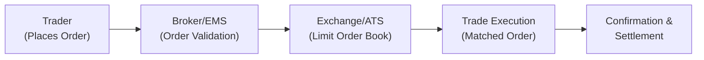

## Introduction

So, if you’ve ever seen those old movies where traders shout across a noisy trading pit—waving their hands and scribbling prices on tickets—that was the world before electronic trading really took over. Seems kind of chaotic, right? Well, electronic trading systems changed the landscape by automating and digitizing the entire process. Today, many markets worldwide rely heavily on these electronic platforms for matching bids and offers, streaming real-time price data, and giving investors of all sizes the same global access.

This section explores how electronic trading systems came to dominate modern markets, how they work, why portfolio managers and traders use them, and some major benefits (and pitfalls) to keep on your radar. You’ll also find real-life examples, a handy mermaid diagram illustrating basic system flows, and best practices on integrating electronic trading into institutional portfolio strategies.

## Key Features of Electronic Trading Systems

### Matching Bids and Offers in Real Time
At the heart of any electronic exchange is a digital “limit order book.” Basically, it collects buy orders (bids) and sell orders (offers), ranks them by price and then time, and matches up counterparties in a blink of an eye. This is faster than humanly possible on a trading floor—often in milliseconds or microseconds—drastically reducing the chance of missed trades, stale quotes, or plain old human error.

If we think about the old floor-based approach, mistakes like reading someone’s hand signals incorrectly or misplacing an order slip were not that uncommon. Electronic platforms mitigate these issues by instantly verifying order details and executing with high precision.

### Order Automation and Routing
Electronic trading systems allow participants to enter, modify, or cancel orders through computerized interfaces. This might sound simple, but it’s a big deal: it means an asset manager sitting in Tokyo can place a trade directly on the New York market, or even simultaneously route an order to multiple venues to seek out the best price. And, well, automation also means the days of phone calls or pit brokers passing around tickets are pretty much over.

Many portfolio managers link their order management systems to broker-dealer networks or direct-market-access platforms. This integration helps them react to market changes quickly, line up trades programmatically, and minimize the chance of slippage (the difference between expected and actual transaction prices).

### Continuous Trading and Market Data
Modern markets—stocks, bonds, currencies, you name it—largely operate continuously during open sessions. Electronic systems provide 24-hour or extended-hour trading capabilities in certain asset classes. Alongside that, real-time market data streams keep everyone informed on current bid/offer prices, volumes, and the last trade information. This transparency is often a stark contrast to older days when you had to wait for an end-of-day price or rely on specialized connections to glean intraday quotes.

The moment a trade is executed, the price and volume are published to subscribed users, which fosters market efficiency. Also, you can set up your analytics to automatically process these monstrous data feeds and identify patterns or pricing anomalies to act on.

## Advantages of Electronic Trading Systems

### Lower Transaction Costs
One of the biggest transformations is cost reduction. Open-outcry floors were labor-intensive, requiring brokers, clerks, and a lot of overhead. By automating order matching, electronic venues cut out many middle layers. This generally leads to narrower bid–ask spreads, lower commissions, and, ultimately, a more cost-effective environment for all participants. In Section 6.1, we discussed “Components of Transaction Costs.” You might recall how spreads and market impact factor into total costs; well, materials inside an electronic system often reduce both.

### Expanded Global Participation
Electronic trading opens the door for everyone from local retail investors to massive global institutions. Remote trading access means you don’t need to be physically near a trading pit. Plus, smaller firms that used to be left out of the game (maybe they didn’t have the capital for a seat on an exchange) can now trade on an equal footing, provided they meet technology and regulatory requirements.

### Enhanced Transparency
Markets have become more transparent because electronic platforms display quotes and trades to virtually anyone connected. Investors can see the current state of the order book, or at least a portion of it (depending on data subscription and market rules), which levels the playing field. This helps ensure trades get executed at competitive prices.

### Speed and Accuracy
I remember hearing from a colleague who used to manage orders on the Chicago Mercantile Exchange floor in the 90s. He joked about how “losing your voice on a busy day” was normal. Now, everything is typed in or captured automatically by algorithms. The matching engine does the rest, removing manual errors. Faster execution also reduces slippage and the risk that markets move away from your desired price while you’re confirming details.

## Potential Drawbacks and Challenges

### Overload and Extreme Volatility
During periods of market stress—think major geopolitical events or surprising economic data—electronic platforms may face an avalanche of orders. High-frequency traders, algorithmic strategies, and everyone else floods the market simultaneously. This can overwhelm systems, leading to slower response times or trading suspensions. While systems are generally robust, the possibility of a meltdown lingers.

### System Outages and Flash Crashes
Automated markets are not immune to technical glitches. System failures or connectivity issues can disrupt trading, sometimes at an inopportune moment (like that big order you really need to fill). Also, “flash crashes” can occur when algorithms feed off each other’s orders in a self-reinforcing spiral, sending prices plummeting (or soaring) in seconds. These events highlight the importance of risk controls, circuit breakers, and real-time market surveillance.

## Common Venues and How They Function

### Traditional Exchanges vs. Alternative Trading Systems (ATS)
A traditional exchange—like the New York Stock Exchange (NYSE) or NASDAQ—is a regulated marketplace with listing standards. An Alternative Trading System (ATS) is not regulated as an exchange but still matches buy and sell orders. ATSs are popular in equities and bonds, often providing more flexibility and fewer listing and reporting requirements, though each jurisdiction’s regulations might differ.

### Crossing Networks
A crossing network is a venue that matches large buy and sell orders at a predefined reference price—often by taking the midpoint of the National Best Bid and Offer (NBBO). This helps large institutional trades move blocks of shares anonymously, minimizing market impact and revealing less information. It may not be ideal if you need immediate liquidity, but if you’re trying to avoid spooking the market with your big trade, a crossing network can be a nifty solution.

#### Glossary Terms
• **Crossing Network**: A venue that allows participants to trade large blocks of shares at reference market prices, often the midpoint of the NBBO. This helps reduce market impact.  
• **ATS (Alternative Trading System)**: A trading platform functioning similarly to an exchange but not regulated under exchange laws. It offers an alternative to centralized venues for matching orders, often with specialized niches or less stringent listing requirements.

## Mermaid Diagram: Simplified Electronic Order Flow

Below is a simple diagram illustrating how an electronic order might journey through different systems—just to visualize the sequence:

• The trader initiates an order through a brokerage platform (electronic management system).  
• The broker ensures the order is valid and compliant, then routes it.  
• The electronic matching engine at the Exchange or ATS matches the order if price and volume conditions line up.  
• Execution details are sent back to the broker and the investor, and the completed trade continues to settlement.

## Practical Considerations for Portfolio Managers

### Order Types and Algorithms
Because electronic systems handle billions of orders every day, how you slice and schedule your trades can matter just as much as the decision to buy or sell. Algorithmic trading strategies—like VWAP (Volume-Weighted Average Price) or TWAP (Time-Weighted Average Price)—help spread orders out over time to minimize market impact. In Section 6.11, we discuss Algorithmic Trading Strategies in more depth, including how to measure their effectiveness through transaction cost analysis (see also Section 6.12).

### Liquidity Assessment
Liquidity still varies by venue. Some ATSs might specialize in dark liquidity (where quotes aren’t displayed publicly). Others, like crossing networks, might have periodic matches or scheduled crosses. This means portfolio managers should do a bit of research on which venue offers the best liquidity at the best price.

### Risk Control and Monitoring
Given the inherent risks of automated markets (flash crashes, system outages), robust risk controls are non-negotiable. This includes using kill switches on algorithms, real-time monitoring of positions, circuit breakers for abnormal price moves, and backup connectivity to multiple venues. Also, keep an eye on your counterparties’ credit and operational risk—if they can’t settle trades, your returns might be impacted.

## Real-World Examples
• **High-Frequency Mechanics**: In 2010, the “Flash Crash” showed how quickly automated systems could spiral when market liquidity thins out or algorithms respond blindly to price anomalies.  
• **Fragmented Equity Markets**: In the United States, equity trading is distributed among multiple exchanges and ATSs. Some brokers use “smart order routers” that automatically search across these venues for the best price—talk about technology saving you time.

## Best Practices and Exam Tips

• **Integrate with a Robust Order Management System (OMS)**: Minimizes manual input errors and ensures all trades align with compliance guidelines and portfolio constraints.  
• **Use Transaction Cost Analysis (TCA)**: Evaluate the cost-effectiveness of each venue and strategy. TCA helps isolate the price impact of your trade and can be used to optimize execution steps.  
• **Stay Vigilant with Risk Controls**: Flash crashes happen. Circuit breakers, stop orders, and supervised algorithms are essential for risk management.  
• **Diversify Venues**: Don’t overly concentrate your orders in one venue. Different platforms might suit different trading objectives—liquidity seeking, block trading, or crossing.  
• **Remember Regulatory Nuances**: While an ATS may look similar to an exchange, regulatory oversight differs. Managing compliance in multi-jurisdictional trades can get complex.  
• **Manage Time Wisely on the Exam**: If presented with a scenario-based question about electronic trading costs, break the question down into how electronic systems help reduce explicit costs (like commissions) and implicit costs (like market impact). Illustrate your answer using the relevant measures (e.g., implementation shortfall from Section 6.3).

Take time to relate your knowledge of electronic trading systems to other parts of portfolio management, such as rebalancing in real time or executing large block trades. In a constructed-response setting, you might need to justify a choice of venue based on cost, speed, or anonymity.

## Conclusion

Electronic trading systems have drastically transformed the way financial markets operate, offering efficiency, transparency, and cost savings. However, these platforms are not foolproof: extreme volatility, system outages, and flash crashes are cautionary tales reminding us that technology always carries risk. For CFA Level III candidates, understanding the nuts and bolts of these venues—and how they intersect with portfolio management strategies—is critical. You’ll be better prepared to evaluate transaction costs, manage liquidity, and apply risk-mitigation tactics in both the exam and real-world scenarios.

## References

• CFA Institute. (2025). CFA Program Curriculum, Level III, Volume 2: Portfolio Construction.  
• Johnson, B. (2010). Algorithmic Trading & DMA: An Introduction to Direct Access Trading Strategies. 4Myeloma Press.

## Test Your Knowledge of Electronic Trading Systems



### Which of the following best describes the core function of an electronic limit order book?

- [ ] It coordinates manual matching of orders on the trading floor.  
- [ ] It matches orders only once per day after the market close.  
- [x] It electronically collects, ranks, and matches buy and sell orders in real time.  
- [ ] It provides securities underwriting services for newly issued stocks.  

> **Explanation:** An electronic limit order book stores, ranks, and automatically matches orders based on price and time priority, allowing continuous and transparent trading.

### What is a typical advantage of using electronic trading systems compared to traditional floor-based trading?

- [x] They generally reduce transaction costs via automated matching.  
- [ ] They rely heavily on human brokers, which reduces algorithmic risks.  
- [ ] They eliminate market impact for large orders.  
- [ ] They cannot be accessed by smaller market participants.  

> **Explanation:** Electronic trading systems automate order routing and matching processes, cutting down overhead and lowering transaction costs. Floor-based trading is typically more expensive and less accessible.

### In periods of extreme market volatility, what is a recognized concern for electronic trading systems?

- [ ] Lower volumes of trades across all venues.  
- [x] Potential overload and slower response times due to a flood of orders.  
- [ ] Automatic price stabilization by the exchange’s limit order book.  
- [ ] Reduced market fragmentation across different platforms.  

> **Explanation:** During extreme volatility, automatic order matching systems can be overwhelmed by large volumes of orders, potentially straining system capacity and causing execution delays.

### How do crossing networks help large institutional investors?

- [ ] By guaranteeing the best possible bid or ask price on the exchange.  
- [x] By matching large trades at reference market prices with minimal market impact.  
- [ ] By publicly displaying all orders to encourage price competition.  
- [ ] By offering a continuous open-outcry environment for price discovery.  

> **Explanation:** Crossing networks match large block orders away from the primary quoted market at reference prices. This helps conceal the size and intent of block trades, thus minimizing market impact.

### Which of the following statements about Alternative Trading Systems (ATSs) is correct?

- [x] They are not regulated as exchanges but still match buy and sell orders.  
- [ ] They are fully regulated national exchanges with formal listing standards.  
- [x] They often provide anonymity to traders and can be used for dark pool activities.  
- [ ] They are designed only for commodity futures and cannot handle equities.  

> **Explanation:** ATSs are platforms for matching orders without being regulated as full-fledged exchanges; many operate with less stringent listing or reporting requirements. They’re common for equity dark pools too.

### What mechanism protects markets from cascading price declines due to electronic order flow anomalies?

- [x] Circuit breakers or trading halts triggered at preset price thresholds.  
- [ ] Broker phone calls that verify each large transaction by hand.  
- [ ] Manual overrides from exchange clerks on the trading floor.  
- [ ] Consolidated feed that stops all trades for 24 hours after a rapid shift.  

> **Explanation:** Circuit breakers pause trading if prices move beyond a threshold, preventing uncontrolled price spirals (flash crashes) or other anomalies in electronic markets.

### Which of the following best describes a “smart order router”?

- [x] Software that searches across multiple venues to fill orders at the best possible price.  
- [ ] A device that physically connects investors to a single trading floor.  
- [x] A tool that splits large orders into smaller pieces and routes them systematically.  
- [ ] A standardized coding system for labeling securities on the exchange.  

> **Explanation:** Smart order routers use real-time data to find the best execution price across various exchanges and ATSs, often slicing orders to minimize market impact.

### An investor wants to reduce the likelihood that a large equity sale will move the market significantly. Which venue might they consider?

- [x] A crossing network executing trades at a midpoint price.  
- [ ] A highly visible auction market with open-outcry.  
- [ ] A single dealer platform that shares order details with the public.  
- [ ] A regulated exchange that publishes all order sizes immediately.  

> **Explanation:** A crossing network allows large trades to be matched at reference prices, minimizing market impact by keeping order details hidden.

### Which feature is least likely to be associated with an electronic trading system?

- [x] Manual floor brokers shouting bids and offers for immediate matching.  
- [ ] Real-time trade confirmations and execution reports.  
- [ ] Automated cancellation, modification, and routing of orders.  
- [ ] Continuous streaming of bid/ask quotes to market participants.  

> **Explanation:** Electronic trading systems replace the manual matching processes of floor-based systems. Everything else—real-time confirmations, updated quotes, and automated order handling—are fundamental to electronic platforms.

### True or False: Dark pools are classified as a type of Alternative Trading System.

- [x] True  
- [ ] False  

> **Explanation:** Dark pools function as an ATS, matching orders off-exchange without displaying pre-trade quotes, thereby reducing market impact and maintaining participant anonymity.


