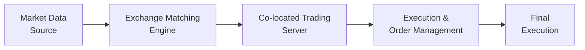

## Introduction
Low-latency trading is—well, let’s just say—kind of the Formula 1 of financial markets. It’s all about speed, precision, and making the most of tiny windows of opportunity that open and shut faster than you might blink. If you’ve ever heard stories of sophisticated traders installing their servers a stone’s throw from an exchange’s data center just to shave off a few microseconds, that’s what we’re talking about here. And you know, it might seem extreme, but in highly competitive markets, every microsecond matters.

In this article, we’ll discuss what low-latency trading is, why it matters for modern electronic markets, how it’s used to capture comparative advantages, and which best practices CFA Level III candidates need to know for exam success and real-world application. We’ll also share some common pitfalls and highlight ways to mitigate the associated risks. So buckle up—and yeah, we’re going to move fast!

## Defining Low-Latency Trading
At its core, low-latency trading is about trying to achieve ultra-fast order execution. In many cases, the latency—or round-trip delay from receiving market data to sending out trade instructions—shrinks all the way down to microseconds. The rationale is simple: if I can spot a market opportunity (like a tiny pricing mismatch), and I can move on it faster than you can, I’ll snag the profits first. 

Low-latency strategies often rely on advanced computing infrastructure, specialized data connections, and highly optimized software to manage thousands of orders in near real-time. Given the right market conditions, they can exploit fleeting inefficiencies—some lasting mere milliseconds—before the rest of the market adjusts.

## Key Comparative Advantages of Low-Latency Trading
Low-latency traders leverage their technological edge to secure tangible market advantages:

• Rapid Response to Market Data  
  Imagine you’re in a small-group discussion, and a piece of crucial information drops—like an unexpected policy statement from a central bank official. Low-latency traders can react in microseconds, sending out trades before other market participants have even finished reading the headline. This speed advantage lets them capitalize on any immediate price dislocations.

• Fleeting Arbitrage Opportunities  
  Arbitrage is often a big winner for low-latency traders. Let’s say the same security is trading at slightly different prices on two exchanges. If you blink, you might miss the anomaly. But a low-latency trading system can detect and execute a pair of offsetting trades almost instantaneously, profiting from the difference.

• Market-Making with Tighter Spreads  
  Market-making strategies rely on continuously quoting bid and offer prices for securities. If you can quickly adjust quotes in response to changing market conditions, you can tighten the spread without taking on much additional risk. Low-latency technology allows firms to handle elevated quote traffic and reposition faster, limiting inventory risk. Essentially, they can be “in and out” faster, with fewer surprises.

• Minimizing Adverse Selection  
  Rapid order placement and cancellation enable traders to avoid getting “picked off” by faster participants when they’re quoting stale prices. This helps reduce adverse selection costs—where your quotes get filled precisely when market conditions turn against you.

## The Infrastructure Behind Low-Latency
Humans might handle logic and strategy, but low-latency operations hinge on specialized infrastructure. Whether you’re a global investment bank or a boutique hedge fund, you’re going to need:

### Co-location
Co-location means placing trading servers in the same data center as an exchange’s matching engine. This proximity significantly reduces the time it takes for an order to travel from the trader’s server to the exchange’s server (and vice versa). For a real-world analogy, think about texting a friend who lives in the same city vs. across the world. The local message might only take a few milliseconds to deliver, while the international one takes much longer—bouncing through multiple servers around the world.

• Definition: Co-location is the practice of positioning your trading systems in the same physical location as the exchange’s core infrastructure to reduce transmission delays.

• Why It Matters: In markets where spread capture or arbitrage opportunities are measured in microseconds, being even 10 kilometers away from the exchange can cost you valuable time—and money.

### High-Speed Transmission Lines
Fiber-optic lines have long been the mainstay of high-speed trading, but microwave or millimeter-wave connections—and even laser-based data links—have gained popularity. These new channels can transmit signals faster than fiber (due to straighter paths and the physics of signal transmission). However, they can be susceptible to weather interference. Even a bit of fog or rain can wreak havoc on microwave signals, so it’s not without operational risk.

### Optimized Software & Hardware
It’s not just about plugging in a fast internet connection. Low-latency shops often use powerful field-programmable gate arrays (FPGAs) or specialized network cards that process information at the hardware level—a step faster than typical software solutions. Every aspect of the system is streamlined, from the network stack to the operating system kernel. It’s like an Olympic sprinter shaving off fractions of a second from their hundred-meter dash by wearing aerodynamic clothing and perfecting their starting block technique.

### Simplified Routing and Execution Logic
Reducing the number of “hops” in a data path is another big goal. If a piece of data has to pass through an extra server, or a few more lines of code, that’s additional latency. With low-latency strategies, you typically see minimalistic code, aggressively optimized compilers, and carefully designed algorithms, sometimes to the point where the slightest computational overhead is avoided.

Below is a simplified depiction of the flow of market data to a co-located trading server.

## Practical Examples and Case Studies
Let’s say we have a small but aggressive proprietary trading firm called LightningTrades. They’re co-located at the main stock exchange in New York. LightningTrades invests heavily in specialized hardware to speed up its order routing. During a routine trading day, it notices that a stock’s price on a secondary market lags its primary listing price by a fraction of a cent. That difference may not even register on a typical investor’s radar, but LightningTrades can immediately buy on the cheaper market and sell on the pricier one, locking in a near riskless profit. The entire trade might only last a handful of milliseconds.

In another scenario, consider an emerging market where the exchange is slowly adopting advanced electronic trading protocols. A low-latency player who invests in direct connections to that exchange and employs real-time data analytics can benefit from local currency or cross-asset mispricing. Because some participants still rely on older, slower infrastructures, there can be moments—often triggered by market-moving events—where significant arbitrage windows arise.

## Implementation Considerations and Challenges
So, does that mean everyone should hop on the low-latency bandwagon? Well, not necessarily. Achieving ultra-fast execution is expensive and resource-intensive. Here’s what you might need to consider:

• Costs vs. Benefits: Setting up co-location or purchasing specialized microwave links might be overkill if your strategy doesn’t need near-instant execution.  
• Regulatory Issues: Different exchanges and regulators set strict guidelines about fair access to pricing data, order types, and co-location. You might have to navigate cross-jurisdictional complexities.  
• Technology Lifecycles: Hardware and software get outdated fast. Maintaining a competitive edge requires constant upgrades.  
• Security and Reliability: Low-latency systems must be stable enough to handle real-time updates without freezing or crashing. Even a sub-second outage during a big release of macroeconomic data could cause catastrophic losses for a high-speed trading desk.  

Plus, there’s the human element—managing high frequency or low-latency strategies can be stressful. Errors happen in microseconds, so by the time a trader says “um, wait a second,” the readout might have moved on, and you’ve already lost money. As with any advanced trading strategy, robust risk management is absolutely crucial.

## Potential Risks and Pitfalls 
Low-latency trading comes with a unique set of risks, some of which can be subtle:

• Algorithmic Glitches: If your system malfunctions, it can send out hundreds or thousands of erroneous orders in seconds. This can lead to “flash crashes.”  
• Market Impact: The speed at which you trade can move prices, especially in relatively illiquid markets.  
• Operational Risk: Highly complex systems are prone to hardware failures or latency spikes. Even a single glitch can translate to big losses.  
• Regulatory Scrutiny: Regulatory bodies often keep a close eye on high-speed traders. Practices deemed manipulative—like quote stuffing or layering—can carry severe penalties.  

## Glossary at a Glance
• Co-location: Placing trading servers in the same data center as an exchange’s matching engine to minimize data transmission times.  
• Arbitrage: A strategy that seeks to profit from price discrepancies in equivalent or related securities, often executed across different markets.  

## Exam Relevance and Key Takeaways
For CFA Level III candidates, mastery of low-latency trading concepts is beneficial in a few ways. First, it broadens your understanding of modern electronic markets and helps contextualize topics like market microstructure, transaction costs, and advanced trading strategies. Second, you might see scenario-based questions presenting a situation involving fleeting arbitrage opportunities, and you’ll need to articulate how low-latency infrastructure can exploit them—or, conversely, describe why a certain client’s profile might not benefit from adopting these strategies.

Remember:  
• Know the infrastructure (co-location, hardware, network).  
• Understand how speed translates into capturing tiny but meaningful price differences.  
• Recognize the risk management constraints and regulatory environment for such strategies.  
• Draw connections to other topics in this chapter, such as transaction cost analysis and VWAP (discussed in prior sections), because when you’re trying to measure the impact of latency on execution performance, tools like Implementation Shortfall can come into play.

## Final Exam Tips
• Be prepared to explain or evaluate whether low-latency trading would fit a client mandate or portfolio objective. For instance, a pension fund seeking stable returns may not need such infrastructure, whereas a proprietary desk might defend heavy technological investments.  
• Pay attention to how you would hedge or manage risk for a low-latency strategy. Rapid trades can also imply rapid losses if market conditions change or the algorithm malfunctions.  
• Practice scenario-based questions where you might be asked to compare potential performance under normal conditions vs. stressed times or high volatility.  
• Keep in mind that any exam question might ask you to incorporate ethics—like the CFA Institute Code and Standards—and determine whether certain high-speed practices are manipulative or simply advanced.  

## References and Further Reading
• Aldridge, I. & Krawciw, S. (2017). Real-Time Risk: What Investors Should Know About FinTech, High-Frequency Trading, and Flash Crashes. Wiley.  
• CFA Institute. (2025). CFA Program Curriculum, Level III, Volume 2: Portfolio Construction.  
• Hasbrouck, J., & Saar, G. (2013). Low-Latency Trading. Journal of Financial Markets.  

## Test Your Knowledge: Low-Latency Trading Quiz



### Low-latency market makers typically reduce inventory risk by:

- [x] Rapidly adjusting bid-ask quotes in real time.
- [ ] Holding large inventories for extended periods.
- [ ] Relying exclusively on fundamental research.
- [ ] Trading only in high-volume blue-chip stocks.

> **Explanation:** Because low-latency firms can instantly update quotes and exit positions, they face lower exposure to adverse price moves, thus reducing inventory risk.

### Which of the following is generally true of co-location for low-latency trading?

- [x] It physically places servers near the exchange to reduce data transmission times.
- [ ] It requires obtaining a broker-dealer license in most jurisdictions.
- [ ] It ensures full immunity from market-wide volatility shocks.
- [ ] It eliminates the need for any network security protocols.

> **Explanation:** Co-location places trading servers in the same data center as the exchange’s matching engine. This shortens the distance data must travel, but does not remove the need for licensing, security, or protect against macro-level volatility.

### The main purpose of microwaves or millimeter-wave networks in low-latency trading is to:

- [ ] Expand the broadcast range of television signals.
- [x] Transmit trade data more quickly than fiber in certain routes.
- [ ] Provide specialized encryption for large-scale trades.
- [ ] Simplify the matching process in over-the-counter markets.

> **Explanation:** Microwave networks can transmit signals along straighter paths compared to fiber, reducing travel time. However, they can be more sensitive to weather conditions.

### One risk unique to low-latency trading is:

- [ ] Quarterly earnings announcements driving stock prices.
- [x] Algorithmic glitches causing thousands of faulty orders in microseconds.
- [ ] Competition from private equity investments in illiquid markets.
- [ ] Differences between IFRS and US GAAP in income statements.

> **Explanation:** Rapid trade execution magnifies the impact of errors. A simple glitch can trigger a cascade of orders in fractions of a second.

### Which best describes the typical approach of a low-latency arbitrage strategy?

- [x] Exploit brief price discrepancies across markets.
- [ ] Take positions based on long-term macroeconomic forecasts.
- [x] Hedge trades in a way that aims for near riskless profit.
- [ ] Publish research reports to influence marketplace sentiment.

> **Explanation:** Low-latency arbitrage strategies mostly focus on short-lived pricing inefficiencies. They often hedge offsetting positions to reduce exposure to general market trends.

### Achieving ultra-fast execution typically requires:

- [ ] Outsourcing all tech infrastructure.
- [x] Minimizing “hops” or additional processing layers.
- [ ] Relying on older software systems to avoid complexity.
- [ ] Replacing order management systems with manual processes.

> **Explanation:** Low-latency trading demands streamlined networks, optimized code, and dedicated hardware with minimal data routing to reduce processing delays.

### Adverse selection cost in low-latency trading can be reduced by:

- [x] Quickly canceling or adjusting quotes when new data arrives.
- [ ] Obtaining inside information before official announcements.
- [x] Having the ability to reprice in microseconds.
- [ ] Slowing down trade execution.

> **Explanation:** Because low-latency systems can react quickly to fresh information, they can avoid filling stale quotes. This reduces the risk of being “picked off” by faster traders.

### Which of the following statements about low-latency trading is correct?

- [x] It demands constant technological updates due to hardware obsolescence.
- [ ] It is fully regulated in exactly the same way worldwide.
- [ ] It is guaranteed to produce higher returns than any other strategy.
- [ ] It is rarely used in modern equity markets.

> **Explanation:** Low-latency strategies rely on cutting-edge technology, so firms need frequent updates to maintain speed advantages. Regulation varies by jurisdiction, and the strategy is not risk-free nor a guaranteed profit venture.

### A primary motivation for a firm to co-locate servers is to:

- [x] Avoid needless data transmission delays.
- [ ] Eliminate the role of exchange matching engines.
- [ ] Reduce data center rental fees.
- [ ] Restrict trading hours to off-peak times.

> **Explanation:** By reducing the physical distance between the trading server and the exchange, co-location helps minimize round-trip latency, enhancing the speed of order execution.

### In low-latency strategies, achieving microsecond-level execution primarily helps traders to:

- [x] React faster to market changes and capture fleeting opportunities.
- [ ] Engage in purely fundamental, long-term investing.
- [ ] Eliminate compliance requirements from regulators.
- [ ] Remove market volatility entirely.

> **Explanation:** The main purpose of microsecond—or even nanosecond—execution is to grab short-lived advantages or correct short-term mispricings before slower participants do.


