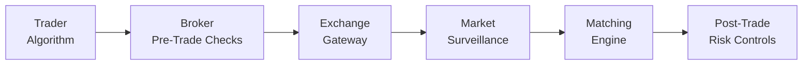

## Introduction and Context

So—electronic trading. It’s fascinating and, let’s be honest, sometimes a bit nerve-racking. We’ve seen how the trading landscape has evolved steadily from open outcry floors to electronic limit order books, matching engines, and lightning-fast algorithmic strategies. Back in earlier sections (6.4 and onward), we talked about the key drivers behind electronic trading systems, market fragmentation, and the inherent shift from the traditional model to one that’s highly automated. Now, we’ll turn our attention to some of the more sobering aspects: the myriad risks that can arise—and how regulators, exchanges, and market participants step in to keep things (relatively) under control.

Anyway, let's think of a scenario. You’re at your desk, minding your own business, placing a few trades in a well-diversified equity portfolio, when suddenly—bam—your trading software fries because of an unexpected glitch. Or maybe a lightning bolt hits the data center (I’ve heard of it happening!). Even in low-volatility conditions, these surprises can happen. That’s what this section is all about: understanding these risks more concretely and seeing how the industry at large (including major regulatory agencies) tries to control them. We’ll talk about operational hazards, the dreaded flash-crash scenario, and systemic contagion. And we’ll also walk through the primary regulatory tools—circuit breakers, kill switches, real-time surveillance, and more.

## Key Risks in Electronic Trading

Electronic trading systems have revolutionized the speed and efficiency of markets, but let’s not fool ourselves: with great speed comes great risk. Below are the major categories of risk where problems tend to manifest.

### Operational Risk

Operational risk captures those day-to-day bumps in the road that come from technology failures, human errors, or plain old bad luck. These can include:

• Hardware and Software Failures: Servers can crash, cooling units can fail, software can be buggy—you name it.  
• Connectivity Failures: If your internet connection is down or the exchange’s gateway is momentarily inaccessible, you could be sending orders into a void, or not sending them at all.  
• Cybersecurity Threats: Malicious hackers might exploit system vulnerabilities, intercept your trading data, or even shut down your trading infrastructure if they really want to push your buttons.

Speaking from a friend’s experience: he once placed what he thought was a single-lot futures trade, only to realize later that the interface had glitched and the system was sending repeated buy orders. It took him frenzied calls to the broker and a painful margin call to figure it out. That’s operational risk in action.

### Market Integrity Risk

Electronic markets move with breakneck speed, which is both good (for efficient price discovery) and terrifying (because mistakes can escalate quickly). Market integrity risk refers to situations where misaligned algorithms or erroneous trades lead to unmanageable volatility or flash crashes. We’ve all heard stories of “fat finger” errors—where a trader puts an extra zero at the end of an order. But in electronic markets, these errors can echo through the entire market, triggering automated stop-loss orders and pushing prices into bizarre territory.

The famous 2010 “Flash Crash” remains a cautionary tale. Within minutes, major equity indices plummeted, only to rebound just as quickly. Regulatory investigations later suggested that algorithmic trades and lack of liquidity at critical moments contributed to extreme, short-lived volatility. This kind of incident calls into question how robust our market structure really is under stress.

### Systemic Risk

Electronic trading can sometimes sow seeds of broader financial instability. What if a small shock—like a sudden drop in a single large-cap stock—sets off a chain of margin calls, liquidity squeezes, and panicked selling across multiple markets? In a heavily interconnected market, this ripple can turn into a tidal wave, jeopardizing entire financial systems.

Algorithmic or high-frequency trades can exacerbate the problem. They see signals (like abrupt price moves) and respond near-instantaneously, possibly magnifying the volatility. If leveraged positions blow up, we move from a local shock to a global meltdown in no time. You can’t help but feel a bit uneasy realizing how reliant we are on the assumption that everyone’s systems will keep working together just fine.

## Regulatory Responses and Mitigation Measures

Now—there’s a bright side. Market regulators, exchanges, and financial authorities around the globe actively work to mitigate these electronic trading risks. Let’s delve into some of the key mechanisms.

### Circuit Breakers and Trading Halts

Circuit breakers are like those big red “Stop!” buttons on a factory assembly line. If prices move too far too quickly (for example, a 7% decline in a major equity index), the exchange can halt trading. It’s a forced “time-out,” giving participants a chance to rethink their positions and calm the panic. A typical approach includes tiered thresholds: a modest drop might trigger a five-minute pause, a larger drop triggers a longer one, and so forth.

• Circuit Breaker: A regulatory measure to temporarily pause trading if prices pass a preset threshold to curb extreme volatility.

Sometimes these breakers can even isolate individual stocks that are in free fall, placing them in a trading pause to let liquidity rebuild. For instance, many exchanges worldwide have protective schemes to slow down or freeze trades if the price moves too fast. In many ways, it’s like blowing the whistle in a sporting event to settle an on-court scuffle.

### Pre- and Post-Trade Risk Controls

Many regulators require brokers and trading venues to install automated checks that can detect suspicious or erroneous orders before they’re executed. Called “pre-trade risk controls,” these typically:

• Validate whether an order’s size or value surpasses risk limits.  
• Check for anomalies, like a wildly deviant price from the market best bid or ask.  
• Halt or reject orders that fail these checks.

Post-trade risk controls come into play after the trade but allow for real-time analysis of trading flows to catch suspicious activities. If, post-execution, someone’s positions go way above their allocated capital, it might trigger alerts or automated account restrictions.

### Real-Time Surveillance Systems

How do you spot unscrupulous or manipulative behavior in a market that sees thousands or even millions of trades per second? Exchanges, self-regulatory organizations, and regulatory commissions deploy sophisticated surveillance tools. These platforms can quickly flag:

• Unusual volumes or repetitive order patterns that indicate possible spoofing.  
• Price jumps that look like momentum ignition or wash trades.  
• Large client exposures that might present systemic risk if not monitored.

Modern surveillance often relies on machine learning algorithms for pattern recognition in real time—a necessity for sifting through that massive data pile. And yes, these systems are still evolving and becoming more advanced to stay ahead of cunning market manipulators.

### The Kill Switch

A kill switch is, quite literally, a “panic button” for algorithms:

• Kill Switch: Automated mechanism allowing instant cancellation of all open orders and halting or disabling a trading algorithm if anomalies are detected.

If your trading algo goes haywire—sending repeated unintended orders or spamming the market with trades—you can (or the risk department can) hit the kill switch. This shuts down all trading activity. A single moment’s hesitation can mean big losses, so regulators require many firms to have these kill switches in place to lock things down swiftly.

### Cybersecurity Regulations

Given the daily headlines about cyberattacks, it’s no surprise that regulatory bodies worldwide are pressing firms to boost cybersecurity. Requirements often include:

• Strong encryption of order and quote data.  
• Firewalls, intrusion detection, and advanced threat monitoring.  
• Frequent security audits.  
• Contingency planning, like real-time failover to backup data centers.

The last thing anyone wants is a scenario where hackers manipulate real-time prices or jam up entire markets. Trust is the foundation of any financial market, and robust cybersecurity protocols are fundamental in safeguarding that trust.

## Diagram: Flow of Orders and Key Regulatory Gateways

Below is a visual depiction of how an electronic order might traverse from the trader to the final matching engine, highlighting where some key risk control and regulatory measures come into play.

In this simple flow:

• The trader’s algorithm (A) generates the order.  
• The broker or trading venue applies initial pre-trade checks (B).  
• The exchange gateway (C) routes the order for potential matching.  
• Real-time surveillance (D) monitors trades.  
• Once executed, the matching engine (E) confirms the transaction.  
• Post-trade risk controls (F) then ensure the positions remain within allowed limits.

## Case Study: Knight Capital’s 2012 Incident

You may recall Knight Capital Group’s infamous glitch in 2012, a prime example of how operational risk can become a market integrity fiasco within minutes. Knight Capital inadvertently deployed a new code module that sent erratic orders, resulting in large, unwanted positions almost immediately. Their risk controls apparently didn’t detect or stop the problem in time.

Some lessons from that meltdown:

• Ensure thorough testing before rolling out software.  
• Keep robust real-time detection of abnormal order flow.  
• Have a kill switch ready, tested, and easy to deploy.  
• Evaluate the independence of your production environment from your test environment.

With these steps, Knight Capital might have minimized the chaos—and the massive losses. This story underlines the interplay of operational, market integrity, and even systemic risk. If Knight’s meltdown had occurred during a period of broad market stress, the outcome could have been far worse.

## Best Practices for Mitigating Electronic Trading Risks

Beyond regulatory requirements, many market participants implement further measures to keep risk under control:

• Stress Testing and Simulations: Running “what if” scenarios for a variety of potential market shocks.  
• Redundant Systems: Having backup servers, power supplies, and connectivity.  
• Layered Risk Limits: Setting progressively stricter checks as your trades escalate in volume or notional value.  
• Governance and Oversight: Assigning accountability to a risk committee, with the authority to halt trading if something looks fishy.  
• Regular Audits: Reviewing logs, verifying compliance with internal procedures, and ensuring readiness for external regulatory audits.

## Potential Pitfalls and Challenges

• Overreliance on Automated Systems: When you trust the machine too much, you might miss red flags.  
• “Race to Zero” Latency: The fiercest competitors in high frequency or algorithmic trading might push risk controls to the side in pursuit of microsecond advantage.  
• Fragmented Regulatory Landscape: In cross-border trading, rules vary. A setup that’s acceptable in one market might violate regulations in another.  
• Human Complacency: Even with robust frameworks, humans can become complacent if crisis events are rare.

## Exam Tips and Strategies

As you prepare for the CFA Level III exam, remember that scenario-based questions on electronic trading risks often test your ability to apply critical thinking. Here are a few pointers:

• Know Each Risk Modality: Be ready to identify whether an event is primarily operational, market integrity, or systemic—and then explain why.  
• Familiarize Yourself with Regulatory Tools: Understand the function of circuit breakers, kill switches, and real-time surveillance, and be able to discuss why or when each one might be necessary.  
• Connect to Risk Management Frameworks: Link these tools to the broader risk management principles covered throughout the curriculum (for instance, scenario analysis in fixed-income or enterprise risk management for institutions).  
• Use Real-World Examples: Citing Knight Capital or the 2010 Flash Crash can add color to your exam answers.  
• Practice Structured Responses: For essay-style questions, structure your arguments logically—risk identification, explanation, potential outcomes, and recommended controls.

## References and Further Reading

• Securities and Exchange Commission (SEC). (2010). Concept Release on Equity Market Structure.  
• CFA Institute. (2025). CFA Program Curriculum, Level III, Volume 2: Portfolio Construction.  
• IOSCO (International Organization of Securities Commissions). (2011). Principles for Dark Liquidity.  

These resources shed more light on how electronic markets operate, the intricacies of risk controls, and ongoing debates about market structure reforms.

--------------------------------------------------------------------------------

## Test Your Knowledge: Risks and Regulatory Responses in Electronic Trading



### Which of the following scenarios is an example of operational risk in electronic trading?

- [ ] A sudden market-wide sell-off triggered by investor panic over central bank interest rate changes.
- [ ] Traders engaging in collusive practices to manipulate closing prices, causing a major investigation.
- [ ] A liquidity squeeze in the bond market leading to higher borrowing costs for all participants.
- [x] A software glitch that accidentally sends hundreds of unintended orders to the exchange.

> **Explanation:** Operational risk involves technology or human errors. A software glitch is a classic operational failure.

### What is the primary purpose of a circuit breaker in equity markets?

- [ ] To automatically cancel all outstanding customer orders upon detection of a suspicious trade.
- [ ] To enforce margin requirements more strictly across high-frequency traders.
- [ ] To systematically adjust settlement times for large or illiquid trades.
- [x] To temporarily halt trading if prices move too far, too fast, helping to curb severe volatility.

> **Explanation:** Circuit breakers halt trading when prices exceed preset thresholds, providing a cooling-off period for market participants.

### A “kill switch” in electronic trading is designed to:

- [x] Cancel all orders and halt automated trading if an algorithm malfunctions.
- [ ] Initiate new trades during times of high volatility to stabilize the market.
- [ ] Lock in profits automatically once the portfolio hits a target return.
- [ ] Lower transaction fees when trading volumes surpass a certain threshold.

> **Explanation:** A kill switch is a risk control that allows immediate shutdown of a malfunctioning trading algorithm.

### Which of the following is considered a key advantage of real-time surveillance systems?

- [x] They can quickly flag suspicious activity within massive volumes of trade data.
- [ ] They guarantee no flash crashes will ever occur.
- [ ] They eliminate the need for circuit breakers and kill switches.
- [ ] They significantly reduce the operational costs of an exchange’s technology infrastructure.

> **Explanation:** Real-time surveillance supports rapid detection of abnormal trades or patterns that may indicate market manipulation or technical errors.

### In the aftermath of a flash crash, what role do post-trade risk controls typically play?

- [ ] They primarily shut down markets for an indefinite period to allow for investigation.
- [x] They monitor newly opened positions in real time and trigger alerts if risk limits are breached.
- [ ] They serve as the main mechanism to prevent further trading halts.
- [ ] They automatically correct all trades made during the crash period.

> **Explanation:** Post-trade risk controls focus on ensuring that executed trades still meet risk constraints and do not exceed capital limitations.

### Which regulatory tool provides a short-term “time-out” when an individual stock experiences unusual volatility?

- [ ] Kill switch
- [x] Circuit breaker
- [ ] Real-time surveillance system
- [ ] Post-trade risk analysis

> **Explanation:** Circuit breakers (or trading pauses) are triggered by drastic price moves, creating a brief pause intended to restore order in the market.

### An example of systemic risk in electronic trading would be:

- [ ] A single portfolio manager’s internet failure causing a personal trading loss.
- [x] A chain reaction of forced liquidations across multiple markets due to a rapid market drop.
- [ ] An isolated software glitch that only impacts one small trading firm’s order flow.
- [ ] A front-office employee inputting incorrect trade tickets manually.

> **Explanation:** Systemic risk involves potential contagion effects that can cascade across the broader financial system.

### Faulty or malicious code that triggers significant market price swings within minutes exemplifies:

- [ ] Regulatory non-compliance.
- [x] Market integrity risk.
- [ ] Normal market fluctuation risk.
- [ ] Enforceable real-time auditing.

> **Explanation:** Market integrity risk is about issues that compromise orderly, fair, and stable markets. Rapid unintended price swings due to malicious or faulty algorithms fit the category.

### What is the main goal of pre-trade risk controls?

- [ ] To identify potentially manipulative trades after execution has occurred.
- [ ] To adjust the capital adequacy requirements of market makers.
- [x] To detect and reject erroneous or excessive orders before they can execute.
- [ ] To ensure that all trades are reported to regulators within standard deadlines.

> **Explanation:** Pre-trade risk controls analyze orders before they hit the market, filtering out those that violate established risk or regulatory rules.

### True or False: Real-time surveillance systems can entirely eliminate flash crashes.

- [x] True
- [ ] False

> **Explanation:** Trick question: Actually, it’s false. Real-time surveillance can help mitigate or identify issues quickly, but it doesn’t guarantee prevention of flash crashes. (Apologies, this was a bit of a sneaky one! In reality, flash crashes can still occur even with surveillance. The correct stance is “False.”)


