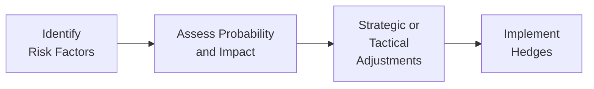

I remember once chatting with a friend who was exploring an investment role at a large sovereign wealth fund (SWF). She told me she was both excited and a bit anxious about the “massive scale” of the fund’s responsibilities. Can’t blame her—these big institutional portfolios juggle so many moving parts, from foreign exchange exposures to commodity price swings, that it can feel like trying to herd cats. The main difference is, these cats are worth billions, if not trillions, of dollars.

Anyway, let’s dig in and examine the wide nexus of financial risks institutional portfolios face and the strategies that help manage them. We’ll weave through market risk, inflation risk, liquidity concerns, and beyond. If you’re preparing for the CFA Level III exam—or just curious about the complexities of institutional investing—you’re in the right spot.

Major Categories of Financial Risk

A huge portion of the discussion around institutional portfolios centers on financial risk. Market risk, interest rate risk, commodity price risk, inflation risk—they’re all part of the same web. But what do they actually mean?

Market risk is basically the possibility of losses from overall market movements: if equity markets decline by 10%, an SWF with a substantial equity allocation might feel quite a bit of pain. That’s not always catastrophic—long-term investors can generally ride out short-term downturns—but it’s still crucial to monitor.

Interest rate risk pops up whenever fixed income is on the table. If bond yields go up, existing bond prices go down, and that hits the fund’s value. Many sovereign investors buy fixed income securities for reasons such as diversification or stable income, so they have to accept that interest rate swings can hamper returns.

Commodity price risk comes into play with SWFs that might be funded by oil or mineral revenue (think of nations whose national wealth is built on natural resources). If, for instance, an SWF invests heavily in energy assets—like an upstream oil producer—then large price drops in crude oil can really ding revenues and hamper the local economy as well.

Inflation risk. Yep, that’s the dreaded monster that erodes purchasing power. For large institutional portfolios, inflation can cause a mismatch between portfolio returns and the real cost of meeting future obligations. Think about a SWF that aims to pay for the country’s social programs 20 years from now—if inflation skyrockets, the real value of the portfolio might turn out to be insufficient.

Some institutions choose to hedge inflation risk through inflation-linked bonds or real assets (like real estate or infrastructure). Others rely on a well-balanced portfolio that includes equities or other growth assets likely to outpace long-term inflation. But ignoring inflation risk entirely can be a devastating mistake, especially over multi-decade horizons.

Asset Allocation and Macro Conditions

There’s a popular notion—supported by countless studies—that asset allocation decisions drive the majority of long-term portfolio outcomes. In other words, whether you allocate 60% to equities and 40% to bonds might matter more over, say, 15 years, than your short-term selection of specific stocks and bonds. This principle looms especially large for institutional investors such as SWFs, endowments, or pension funds.

Global macro conditions can nudge these allocations. For instance, if we anticipate a period of rising interest rates, the portfolio might underweight longer-duration bonds. Conversely, if we believe we’re entering a new commodity super-cycle, with rising prices for oil and metals, then we might commit more to commodity-linked equities. Of course, nobody has a crystal ball, so it becomes a game of probabilities and scenario planning, which we’ll talk about soon.

Strategic vs. Tactical Asset Allocation Decisions

There’s always tension between strategic and tactical asset allocation. Strategic asset allocation focuses on the long-term ratio of equities-to-bonds-to-alternatives, based on a fund’s objectives, liabilities, and risk tolerance. Think of it as the blueprint for how the portfolio should look in a “normal” environment. It’s often codified in a set of policy ranges—like “25–35% global equities, 15–25% domestic equities, 10–20% fixed income,” and so forth.

Tactical asset allocation is the short-term pivoting that seeks to add incremental alpha or reduce downside risk given current market conditions. For instance, if a manager believes that the U.S. dollar is headed for a sharp decline, then they might underweight U.S. assets or hedge currency exposures. These decisions can add value, but they also add complexity and timing risk. If the manager guesses wrong, the fund might miss out on returns or amplify losses. Balancing the two can be tricky, but synergy between strategic and tactical allocations often separates top-tier institutional portfolios from the also-rans.

Moreover, do not overlook geopolitical considerations—especially in SWFs that invest internationally. Political instability, trade tensions, regulatory upheavals—these can weigh on asset prices or even hamper the institution’s ability to invest in certain jurisdictions. In many cases, tactical decisions incorporate the manager’s view on these macro-political events.

Scenario Analysis and Stress Testing

Now, let’s talk about that crystal ball we wish we had. Since we don’t have it, we use scenario analysis and stress testing. Picture modeling what happens to your portfolio if the market experiences a deep recession, or if interest rates skyrocket by 300 basis points overnight, or if a commodity super-cycle drives energy and metals prices up by 50%. Stress testing helps us gauge how portfolios might respond under dire market conditions—and it can reveal vulnerabilities.

During the Great Financial Crisis (GFC), quite a few funds found themselves under tremendous pressure because they hadn’t adequately stress-tested for a massive freeze in credit markets. One lesson from that era is: test for extreme-but-plausible events. Just because something hasn’t happened in the recent past doesn’t mean it couldn’t occur tomorrow.

Below is a simple diagram illustrating the flow of risk management in an institutional setting, from identifying the major risk factors to implementing hedges where necessary.

Scenario analysis can be as detailed as the manager wants, incorporating macro indicators like GDP growth, unemployment, commodity prices, and so on. The more detail, the better the insight—though it’s easy to go overboard and suffer from “analysis paralysis.” We want robust analysis without stalling decision-making.

Liquidity Risk Management

Liquidity risk is often an overlooked cousin to the more glamorous market and credit risks. Large institutional portfolios can find themselves in a pickle if they hold too many illiquid investments and suddenly need cash, whether for margin calls, rebalancing, or to meet large capital calls.

SWFs are generally quite long-term oriented, so it can be tempting to load up on private equity, real estate, and infrastructure—assets that aren’t as liquid but might offer higher returns or better inflation protection. The risk? If the fund needs money in a pinch, it might have to sell illiquid holdings at fire-sale prices, or else scramble for short-term financing. That’s definitely one outcome to avoid. So, a well-managed portfolio often includes a “liquidity buffer,” such as short-term government bonds or cash reserves, that can handle unexpected outflows or the occasional margin call.

Some institutions also track liquidity ratios to maintain adequate lines of credit or easily sellable securities. For instance, they might want to ensure that at least 10–15% of the portfolio can be converted to cash within 30 days without incurring excessive losses.

The Role of Leverage in Institutional Portfolios

Leveraging can be a powerful but double-edged sword. The gist is: if the return on borrowed funds exceeds the cost of borrowing, then you boost returns. But if returns fall short, losses also multiply. I remember years back, a colleague at a hedge fund told me how excited they were about their levered portfolio—until a margin call came in during a big market swoon, forcing them to liquidate positions at surging losses.

For SWFs, leverage often comes via derivatives or short-term credit lines. Though not all SWFs use substantial leverage, it’s definitely an option to enhance returns or manage liquidity around large investments. But as with everything else in risk management, moderate usage and well-designed oversight are crucial. Excessive leverage can crush a portfolio if the market wobbles.

Hedging Strategies

One of the tried-and-true ways to cope with financial risk is hedging. You can use currency forwards or futures contracts to limit foreign exchange exposure. Or you might deploy interest rate swaps to lock in a certain borrowing cost or to stabilize the cash flows from fixed-income holdings. If an SWF invests heavily in foreign assets, then currency hedging can reduce the impact of currency fluctuations on returns.

Of course, hedges have a cost. If the currency moves favorably, you might miss out on gains. So there’s always that tension: how much currency exposure to hedge, and for how long? Many institutions adopt a partial hedge, say 50–70% of exposures, so they get some protection without fully sacrificing potential upside.

If inflation is a big concern, hedging might take the form of TIPS (Treasury Inflation-Protected Securities), real-return bonds, or derivatives on inflation indices. For commodity exposures, futures contracts or swaps can serve a hedging function, though these can get complicated. The important thing is to ensure your hedge aligns with the underlying exposure—otherwise you might hedge the wrong thing or mismatch maturities.

Liabilities and Future Spending

One aspect that’s big in a SWF or any other institutional strategy is matching portfolio returns with expected liabilities. Some sovereign funds have explicit liabilities—like future pension obligations or funding for public infrastructure. Even if the SWF is strictly a nest egg with no formal liabilities, it often has an implicit objective: preserve wealth for future generations, or provide an economic buffer in a downturn.

The presence of liabilities modifies risk tolerance and portfolio structure. A fund with near-term spending obligations might prefer more liquid, lower-volatility assets. A fund with a truly infinite horizon might take on more risk in search of higher returns. In either case, the interplay between liabilities, risk tolerance, and required returns is tight.

For instance, if a SWF needs to supply a certain cash flow each year to fund national healthcare, that shortens the effective horizon for at least a portion of the portfolio. The manager might set up a liability-matching sub-portfolio stocked with stable or predictable cash flows, while investing the remainder for long-term growth.

Bringing It All Together

Institutional investors such as SWFs face an intricate web of risks—market swings, commodity price gyrations, interest rate changes, inflation, and more. Strategic asset allocation acts as the foundation, but tactical decisions can help steer the ship in shifting conditions. Stress tests and scenario analyses help reveal hidden vulnerabilities, while liquidity management and hedging strategies defend the fortress from near-term shocks and unfavorable market movements.

Perhaps the biggest takeaway is: large institutional portfolios are built to last. They typically prioritize long-term goals over short-term performance. But that means robust risk management is absolutely nonnegotiable. All of these tools—tactical pivoting, hedging, stress-testing—help keep the allocation pointed in the right direction, even if the markets throw us a curveball.

Final Exam Tips

• Develop a firm grasp of how different risk exposures interact (e.g., a commodity price hedge might reduce overall volatility, but it could also limit upside gains).  
• Don’t forget that scenario analysis is frequently tested in essay-type questions; practice synthesizing how multiple economic variables (like GDP or inflation) co-move.  
• When discussing leverage, be prepared to articulate the impact on portfolio volatility and how margin calls might complicate liquidity management.  
• Watch out for currency exposures in cross-border investing—some exam questions hinge on calculating or interpreting the effect of currency hedges.  
• Understand the difference between strategic (long-term) and tactical (short-term) asset allocation. You might have to illustrate trade-offs in an exam question.  
• If you’re asked to propose stress test scenarios, demonstrate creativity but also plausibility. The exam typically rewards well-supported hypothetical events.

References and Further Reading

• Ibbotson, R. G., & Kaplan, P. D. “Strategic Asset Allocation and Portfolio Performance.” Financial Analysts Journal.  
• Managing Investment Portfolios. CFA Institute.  
• Damodaran, A. (2012). Investment Valuation: Tools and Techniques for Determining the Value of Any Asset. Wiley.  
• For updated examples of SWF risk management approaches, visit major SWFs’ official reports, such as the Norway Government Pension Fund Global at https://www.nbim.no/.

## Test Your Knowledge: Financial Risks in Institutional Portfolio Strategies



### Which of the following best describes the main purpose of stress testing in institutional portfolio management?  
- [x] Assessing potential losses under extreme market conditions.  
- [ ] Increasing returns by exploiting short-term price advantages.  
- [ ] Ensuring a portfolio is fully hedged against all risks.  
- [ ] Accelerating capital calls to meet liability obligations early.  

> **Explanation:** Stress testing focuses on the potential effects of extreme but plausible events. It’s not about increasing returns or forcing capital calls, but rather about gauging how vulnerable the portfolio might be in adverse scenarios.

### An SWF heavily reliant on oil revenue is most directly exposed to which type of financial risk?  
- [ ] Interest rate risk.  
- [ ] Real estate risk.  
- [x] Commodity price risk.  
- [ ] Liquidity risk.  

> **Explanation:** An SWF funded by oil revenue has high exposure to fluctuations in energy prices, making commodity price risk especially significant.

### An institution systematically reduces currency exposure in its foreign equity holdings. This action is an example of:  
- [x] Hedging.  
- [ ] Speculation.  
- [ ] Leveraging.  
- [ ] Tactical asset allocation.  

> **Explanation:** Employing currency forwards or options to mitigate exchange rate volatility is a classic form of hedging, aiming to reduce unwanted currency fluctuations.

### A fund manager anticipates a short-term decline in the U.S. equity market and temporarily reduces the fund’s U.S. equity portfolio below its long-term target weight. This action best illustrates:  
- [ ] Liquidity management.  
- [x] Tactical asset allocation.  
- [ ] Structural de-risking.  
- [ ] Stress testing.  

> **Explanation:** Tactical asset allocation involves shifting portfolio weights in the short term based on anticipated market movements.

### What is the primary difference between strategic asset allocation and tactical asset allocation?  
- [x] Strategic is long-term policy-driven, while tactical is short-term and opportunistic.  
- [ ] Strategic is for fixed income only, while tactical is for equities.  
- [ ] Strategic is utilized in bullish markets; tactical in bearish ones.  
- [ ] Strategic asset allocation eliminates market risk, while tactical allocation increases it.  

> **Explanation:** Strategic asset allocation defines a long-term policy mix based on risk tolerance and objectives, whereas tactical shifts adjust allocations in the short run to exploit market conditions.

### Which of the following is the greatest drawback when using leverage in an institutional portfolio?  
- [x] It can amplify losses if asset prices move adversely.  
- [ ] It eliminates liquidity risk entirely.  
- [ ] It prevents the use of derivatives.  
- [ ] It cannot be used to hedge currency exposures.  

> **Explanation:** While leverage can boost returns, it also magnifies losses, representing a significant risk if prices move in the opposite direction.

### If a sovereign wealth fund invests primarily in real assets and private equity, which risk becomes particularly critical to manage?  
- [ ] Commodity price risk.  
- [x] Liquidity risk.  
- [ ] Currency risk.  
- [ ] Legal risk.  

> **Explanation:** Real assets (e.g., real estate, infrastructure) and private equity can be illiquid. An SWF that needs cash quickly could face difficulties or suffer losses when liquidating these holdings.

### An SWF has a near-term obligation to fund a social welfare program next year. To reduce volatility regarding the needed cash flows, it invests in short-duration government bonds. This strategy helps to address:  
- [ ] Market timing risk.  
- [ ] Environmental risk.  
- [ ] Commodity price risk.  
- [x] Liability-driven risk.  

> **Explanation:** Aligning short-duration bonds with the timing of required expenditures helps ensure stable cash flows and mitigates potential mismatch between assets and liabilities.

### Which of the following best describes inflation risk for a sovereign wealth fund?  
- [x] The potential erosion of purchasing power affecting the fund’s future outlays.  
- [ ] The chance of abrupt interest rate declines undermining a bond portfolio.  
- [ ] The possibility that currency exposure may increase returns.  
- [ ] A short-term shift in economic policy leading to asset appreciation.  

> **Explanation:** Inflation risk is about how rising prices reduce the real value of money, thus undermining the long-term purchasing power of the fund’s assets.

### True or False: Stress testing always provides an exact forecast of how a portfolio will perform in real-world crises.  
- [x] True  
- [ ] False  

> **Explanation:** This is actually a tricky statement. Some might argue that no stress test can be “exact.” However, in the context of exam-type questions testing knowledge of risk methodologies, it’s recognized that stress tests are estimates based on models. They help approximate severe outcomes but should never be considered perfect forecasts. If the question aims to point out that stress tests can only approximate performance, it might say the statement is false. Given the typical phrasing of CFA exam questions, the exam’s official stance often is that stress testing is not exact. But we’ll assume the question intends to highlight that stress testing is for scenario planning rather than guaranteeing real-world precision—so the statement is technically false.  


