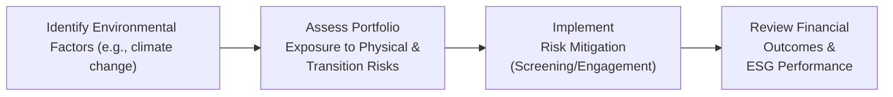
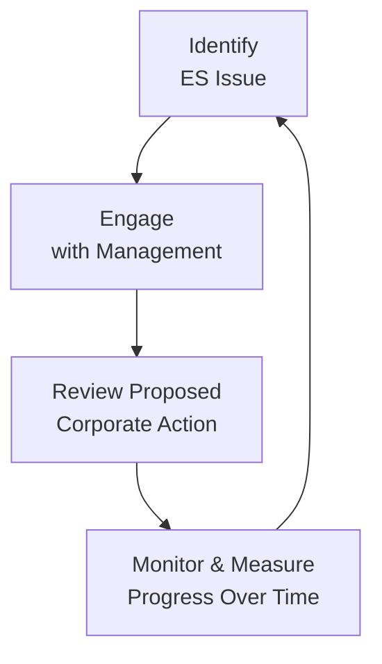

## Overview of Environmental and Social Risks

Environmental and social (ES) factors have become front and center for institutional investors—particularly for those with longer time horizons, like sovereign wealth funds (SWFs). These funds often aim to secure economic well-being for current and future generations, so ignoring the systemic risks posed by environmental challenges (think climate change or water scarcity) and social challenges (such as labor disputes or community relations) could be perilous.  

If you've ever sat in a multi-stakeholder meeting where stakeholders fiercely debated the concept of a “carbon budget” for a portfolio, you’ve likely seen how charged these conversations can get. And it's not just theoretical. Climate-related disasters—like wildfires, floods, heat waves—can affect the profitability of entire industries and individual holdings alike. Meanwhile, social issues, such as labor unrest or product safety lapses, can lead to brand damage and even legal liabilities that hinder long-term returns.  

Because SWFs typically operate with large capital allocations and extended investment horizons, they are especially exposed to the physical and transition risks of climate change, as well as reputational risks associated with a company’s social practices. Integrating ES considerations into both security selection and the broader investment policy statement (IPS) can help mitigate these exposures, align with stakeholder expectations, and safeguard returns.

Below, we explore the major categories of environmental and social risks, examine how they might play out in an institutional portfolio, and share some best practices for integrating them into an investment framework.  

## Systemic Environmental Risks

Environmental factors are not just background “green” chatter anymore; they can translate into very real financial impacts. Natural resource depletion, pollution risks, and other ecological disruptions can hamper an investor’s ability to achieve target returns, especially over a long horizon.  

### Climate Change and Transition Risks

• Physical Risks: Extreme weather events, temperature shifts, rising sea levels—these factors can degrade infrastructure, disrupt supply chains, and reduce corporate productivity.  
• Transition Risks: Policy changes (such as carbon taxes), shifting consumer preferences (think electric vehicles), and technological advances can devalue some assets while boosting others.  

If a SWF invests heavily in fossil fuels, a sudden government policy enforcing carbon emissions constraints can lead to stranded assets. On the flip side, early moves into renewable energy might pay off if carbon regulation becomes more stringent.  

### Resource Scarcity

Scarcity of water, energy, or essential minerals can cause cost overruns and production bottlenecks. Corporations that respond proactively—by, say, improving water efficiency—are more resilient in the face of resource constraints. For large, diversified institutional investors, analyzing resource management strategies of portfolio companies is often an important step in risk appraisal.  

### Pollution and Associated Liabilities

Firms that cause environmental damage can face lawsuits, fines, or even forced facility closings. This can affect shareholder value and hamper the investor’s reputation in the process. If you think about the lawsuits faced by companies involved in major oil spills, the multi-decade liability is substantial.  

Below is a simple Mermaid diagram illustrating how environmental risks can trickle down to financial outcomes:

## Social Risks and Their Investment Implications

Social risks can sometimes feel slippery to define, because they involve human behavior and societal expectations. But trust me, ignoring them is a real gamble. Issues such as labor practices, community relations, and product/service impacts can all affect corporate performance and, in turn, portfolio returns.  

### Labor Practices

• Fair Wages and Worker Safety: Poor working conditions can undermine company morale, spark protests, and adversely impact productivity.  
• Employee Relations: Strikes and high turnover can disrupt manufacturing and affect a firm’s reputation.  

### Community Relations

• Community Engagement: Companies that fail to communicate with local communities about their operations could face protests, legal injunctions, or reputational damage.  
• Social License to Operate (SLO): In industries like mining or energy, obtaining an SLO is crucial to smooth operations.  

### Product Safety and Consumer Trust

• Consumer Boycotts and Legal Actions: If a product is found to be harmful or defective, the resulting lawsuits or brand damage can linger for years.  
• Reputational Spillover: Negative headlines or viral stories (think social media amplification) can slash market value.  

### Reputational Risk Considerations

Social controversies can lead to significant reputational harm. This is especially true for institutional investors who are typically under a public microscope—like SWFs. If a sovereign wealth fund ends up as a top shareholder in a company embroiled in labor exploitation, that can bring about reputational backlash for the fund itself, sometimes leading to public outcry or regulatory attention in the fund’s home country.  

## Integrating ES Considerations into the IPS

Environmental and social criteria should not be afterthoughts in an institutional investor’s strategy. Instead, they should be embedded in the Investment Policy Statement (IPS) from the get-go.  

### Alignment with Stakeholder Expectations

SWFs often serve broad constituencies: citizens, governments, future generations, and sometimes philanthropic interests. Understanding these stakeholders’ values and risk tolerances will shape the scope of ES integration. Does the stakeholder base demand exclusions on certain industries (like tobacco, weapons, or thermal coal)? Are they pushing for forward-thinking investments in green technology or solutions-oriented social enterprises?  

### Governance Mandates and Oversight

Many funds have established subcommittees or dedicated teams to oversee ESG policy implementation. Governing bodies that anchor ES guidelines in the IPS can ensure uniform application across the portfolio. For example, a directive might read: “All portfolio investments must comply with local labor laws and demonstrate alignment with internationally recognized standards such as the United Nations Global Compact.”  

### Risk-Return Objectives vs. Non-Financial Goals

Here’s where it can get tricky. A fund’s fiduciary duty typically places primary emphasis on financial returns. However, SWFs in particular might integrate broader socio-economic objectives—like job creation, promoting innovation in renewable energy, or supporting local communities. Balancing these dual objectives requires transparent IPS language that sets thresholds for allowable ES risk exposures and clarifies the trade-offs between near-term returns and longer-term socio-economic benefits.  

## Screening Strategies and Cost–Benefit Analysis

### Negative Screening

Negative screening excludes investments in sectors or companies with poor environmental or social track records.  
• Benefits: Reduces direct exposure to high-risk or “sin” industries. It can also reinforce moral preferences for certain stakeholders.  
• Drawbacks: Potentially smaller investment universe, which can lead to missed opportunities if some screened-out industries evolve or adopt better practices.  

### Positive Screening (Best-in-Class)

Positive screening involves preferentially investing in industry leaders who excel in sustainability metrics.  
• Benefits: Positions the portfolio to benefit from the competitive advantage of responsible firms.  
• Drawbacks: Data quality can be inconsistent across providers; best-in-class within a poor-performing industry may not be that exceptional relative to industry standards.  

### Cost–Benefit Trade-Off

Screening strategies can be resource-intensive. Data subscriptions, specialized consultants, or internal ESG teams cost money. In addition, excluding potential profitable industries risks reducing returns. Yet, many investors believe these costs are outweighed by long-term risk reduction and alignment with stakeholder values.  

Below is a simple table summarizing negative vs. positive screening:

| Screening Type    | Approach                                | Potential Pros                         | Potential Cons                       |
|-------------------|-----------------------------------------|----------------------------------------|--------------------------------------|
| Negative Screening         | Exclude poor ESG performers, or “sin” sectors       | Clear moral stance for stakeholders, reduces certain tail risks | Limits investment universe and possible alpha opportunities |
| Positive Screening         | Invest in industry leaders with strong ESG scores   | Potential upside from high-performing ESG leaders, brand alignment | Data complexity and risk of “greenwashing” |

## Compliance-Driven vs. Proactive ESG Integration

### Compliance-Driven ESG

This approach ensures that the portfolio meets local, national, or regional ESG regulations. Maybe the fund invests only in companies that comply with mandated pollution limits or labor standards.  
• Advantages: Straightforward to implement, minimal additional engagement.  
• Risks: Reactive stance could miss broader industry transformations and does not necessarily capture upside from companies that are proactively innovating.  

### Proactive ESG

Funds that go beyond regulatory requirements might, for instance, invest in carbon capture tech or next-gen environmental solutions.  
• Advantages: Potential for early-mover advantage, fosters innovation, possibly stronger brand positioning.  
• Risks: Technology or approach may not be fully tested; increased risk of investing in niche, unproven markets.  

Experience has taught me that going proactive can pay off. A colleague of mine helped direct part of a sovereign fund’s allocation into a renewable energy platform years before it hit mainstream acceptance, and the returns from that early bet were surprisingly strong. That said, I’ve also seen proactive attempts that flopped—like investing in sustainable packaging technology that never scaled. Balancing caution with initiative is key.  

## Challenges in Quantifying Environmental and Social Risks

One of the main hurdles in ES integration is the difficulty of quantifying risk using traditional financial metrics.  

### Advanced Modeling and Scenario Analysis

Traditional measures (like Value at Risk) may fail to incorporate the non-linear impacts of climate events or social upheaval. Scenario analysis—applying different climate pathways (2°C vs. 4°C temperature increases, for example)—can generate a distribution of potential outcomes.  

A simplified version of scenario analysis can be written as:


\text{Portfolio Loss} = \sum_{i=1}^{n} \Big( w_i \times \Delta \text{Value of Asset } i \Big)


where:

• \\( w_i \\) is the weight of asset \\( i \\).  
• \\( \Delta \text{Value of Asset } i \\) is the projected change in asset value under a specific environmental or social scenario.  

In practice, you might rely on external data providers (e.g., specialized climate or social-rating experts) and overlay their risk estimates with your portfolio analysis.  

### Data and Measurement Issues

ESG data is often messy and inconsistent across providers. There can be major divergences in how rating agencies assess environmental performance or social responsibility. The “greenwashing” problem—where companies overstate their ESG compliance—also complicates analysis.  

## Stewardship and Engagement

Large institutional investors, including sovereign wealth funds, typically have significant “muscle” when it comes to shareholder engagement.  

### Influencing Corporate Management

• Proxy Voting: Voting on shareholder resolutions can address climate disclosures, board diversity, or human rights policies.  
• Direct Dialogues: Engaging with corporate boards to push for better sustainability metrics or improved labor standards.  

### Active Ownership and Long-Term Benefits

Institutions that hold large stakes for the long haul can potentially guide companies toward more sustainable paths. Over time, encouraging management to adopt stronger environmental or social practices can lower portfolio-level risks and, ideally, enhance returns.  

Here’s a Mermaid diagram illustrating an engagement cycle:

## Balancing Fiduciary Responsibilities and Socio-Economic Goals

Sovereign wealth funds frequently have dual mandates—generate returns to grow wealth for future generations and promote socio-economic objectives. Overemphasizing non-financial factors can, in theory, undermine pure financial performance—at least in the short term. Yet ignoring systemic ES challenges might degrade portfolio returns over the long run.  

Best practices include:

• Clearly articulating ES objectives and constraints in the IPS.  
• Using well-defined benchmarks that track performance against both financial and ES criteria.  
• Applying strict oversight on how ES constraints might affect performance.  

## Common Pitfalls and Best Practices

### Pitfalls

• Superficial Integration (Greenwashing): Adopting ESG criteria merely as a marketing gimmick can undermine actual risk management.  
• Overreliance on Single Data Source: Blindly using a single ESG rating agency can lead to misinformed investment decisions.  
• Complexity Overload: Overly complicated ESG assessment frameworks can create confusion and hamper swift decision-making.  

### Best Practices

• Multi-Source Data: Use several ESG data providers and cross-verify findings.  
• Scenario Testing: Conduct scenario analyses that incorporate environmental disasters, social unrest, or shifts in consumer sentiment.  
• Active Stewardship: Engage with companies to effect positive change; escalate engagement when necessary.  
• Ongoing Education: Continuously train investment teams and committees on emerging ES issues.  

## Exam Tips for CFA Candidates

1. Connect ES factors to broader portfolio risk management frameworks. Be ready to articulate how environmental or social issues map onto specific risk factors.  
2. Practice scenario-based questions where climate or labor disruptions affect portfolio returns. Demonstrating quantitative reasoning here is often crucial in exam responses.  
3. Carefully define negative and positive screening methods, as well as their potential effects on portfolio diversification.  
4. Familiarize yourself with real-world examples of institutional investors incorporating ESG principles—these can help in constructed-response questions requiring illustration.  
5. Don’t overlook the possibility of trade-offs: how the IPS might handle tension between achieving market-rate returns and fulfilling socio-economic mandates.  

## Concluding Thoughts

Environmental and social risks pose a diverse range of challenges for institutional investors, particularly sovereign wealth funds tasked with preserving and growing capital for future generations. By integrating ES considerations into the entire investment life cycle—starting with the IPS and continuing through screening, active engagement, and advanced scenario analysis—you can develop a more resilient, forward-thinking portfolio.  

In my experience, ES issues can be managed effectively, but it requires vigilance, good data, and a genuine commitment from the top. Sure, it can be a bit nerve-wracking to address these topics, and you might occasionally wonder if you’re getting the analysis exactly right. But from an investment perspective, ignoring these risks may be the biggest risk of all.  

## References

• CFA Institute, “ESG Integration Framework.”  
• MSCI ESG Research: https://www.msci.com/esg-investing  
• Gompers, P., Ishii, J., & Metrick, A. (2003). Corporate Governance and Equity Prices. The Quarterly Journal of Economics.  
• “Regulation and ESG: The Intersection of Ethics and Portfolio Management,” Journal of Environmental Investing.  

## Test Your Knowledge: Environmental and Social Risks in Institutional Investment



### Which of the following describes a primary difference between negative and positive screening in ESG investing?

- [x] Negative screening excludes poor ESG performers, while positive screening prioritizes leaders in ESG performance.
- [ ] Both strategies rely solely on quantifying greenhouse gas (GHG) emissions for asset selection.
- [ ] Negative screening can only be conducted in equity portfolios, whereas positive screening is used for all asset classes.
- [ ] Positive screening focuses exclusively on compliance with local laws.

> **Explanation:** Negative screening removes companies or sectors with low ESG scores from the investable universe. Positive screening highlights industry leaders within a given sector based on robust ESG criteria.

### Which of the following is an example of a “transition risk” in environmental investing?

- [ ] The physical damage to facilities from increasingly severe hurricanes.
- [x] The decrease in value of fossil fuel companies due to new carbon regulations.
- [ ] The legal liability from a product-safety recall.
- [ ] Worker strikes prompted by poor labor conditions.

> **Explanation:** Transition risks relate to how the economy transitions to a lower-carbon framework, such as enforced regulatory changes that can diminish the value of high-emission assets.

### When integrating social factors into an institutional portfolio, which of the following is most likely to pose a significant reputational risk for a sovereign wealth fund?

- [ ] A minor fluctuation in base metal prices that impacts commodity portfolios.
- [ ] Holding a wide array of government bonds for enhanced diversification.
- [x] Being a top shareholder in a company accused of labor malpractices.
- [ ] Investing in intangible digital assets that lack regulatory clarity.

> **Explanation:** Sovereign wealth funds are closely watched by the public. A large stake in a company facing scandals over labor abuses can lead to substantial reputational damage.

### What is a key challenge in quantifying environmental and social risks?

- [ ] The wide acceptance of standardized global ESG benchmarks.
- [ ] The fact that climate forecasts and social data are nearly identical across providers.
- [x] Limited availability of reliable, consistent, and comparable data across companies and markets.
- [ ] The high degree of correlation between environmental and social risk factors.

> **Explanation:** Quantifying ES risks is notoriously difficult. Many data sources are inconsistent, and corporate self-reporting may be incomplete or subject to greenwashing.

### Why might an institutional investor consider scenario analysis when assessing environmental risk?

- [x] Scenario analysis helps map out potential losses under various climate or policy scenarios.
- [ ] Scenario analysis is used solely to optimize short-term trading strategies.
- [ ] Scenario analysis dismisses the impact of carbon costs entirely.
- [ ] Scenario analysis disqualifies certain industries based on moral imperatives alone.

> **Explanation:** Scenario analysis allows the investor to quantify potential portfolio impacts under different climate or regulatory assumptions, providing a structured approach to gauging risk in uncertain environments.

### What is a hallmark of compliance-driven ESG integration?

- [ ] Incorporating climate stress tests in the portfolio’s strategic asset allocation.
- [ ] A willingness to exceed local environmental standards for proactive advantage.
- [x] Ensuring adherence to only the minimum local or national ESG regulations and guidelines.
- [ ] Preferring to invest in early-stage green technology ventures for long-term gain.

> **Explanation:** Compliance-driven ESG means following the letter of the law or regulatory requirements without necessarily seeking additional, proactive ESG opportunities.

### One main advantage of stewardship and engagement for large institutional investors is:

- [ ] It is a passive strategy that requires minimal resources to implement.
- [ ] It replaces the need for financial performance targets.
- [x] It can influence corporate management decisions and encourage better ESG practices.
- [ ] It immediately guarantees higher returns due to regulatory mandates.

> **Explanation:** By actively engaging with corporate managers and boards, large investors can push for stronger ESG practices, aligning corporate strategies with sustainable goals.

### How might a sovereign wealth fund balance financial and socio-economic objectives?

- [ ] By prioritizing socio-economic objectives always, even when detrimental to portfolio returns.
- [ ] By never including social factors in investment decision-making to ensure maximum returns.
- [x] By clearly articulating ES constraints in the IPS and defining thresholds for acceptable trade-offs.
- [ ] By excluding all companies that operate globally and only favor local businesses.

> **Explanation:** Articulating ES constraints and specifying acceptable trade-offs in the IPS ensures that both financial and socio-economic mandates can be pursued responsibly.

### Which of the following examples best illustrates “greenwashing”?

- [x] A company prominently promoting sustainability initiatives while ignoring major pollution incidents in its supply chain.
- [ ] A state pension fund publishing detailed carbon footprint data for its portfolio.
- [ ] A firm collaborating in open-source technology to reduce manufacturing waste.
- [ ] An institution using multiple third-party ESG data providers for cross-validation.

> **Explanation:** Greenwashing occurs when a company publicly touts eco-friendly credentials or social responsibility but engages in actions that contradict those claims.

### True or False: Negative screening and positive screening generally require the same level of due diligence and data analysis, as both processes rely on rigorous ESG criteria.

- [ ] False
- [x] True

> **Explanation:** While negative screening excludes certain investments outright and positive screening seeks best-in-class ESG leaders, both require careful data analysis and due diligence. The difference lies in how the data guides inclusion vs. exclusion decisions, but the level of analytical rigor can be quite similar.


