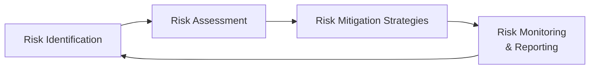
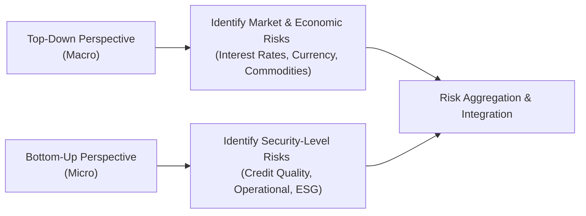

In the world of sovereign wealth funds (SWFs), evaluating risk involves far more than just crunching numbers and scanning credit ratings. Sure, we often talk about standard deviation, Value at Risk (VaR), and all those “traditional” financial risk measures. But, as any investment professional who has spent time in a trading room (or even a boardroom!) can confirm, intangibles like reputational risk or geopolitical pressures can pack a punch, too. Sometimes a bigger one, actually. 

Below, we explore how SWFs can identify, measure, and manage both financial and non-financial risks in a way that’s holistic and—dare I say it—less panic-inducing when market or external shocks arrive.

Understanding the Distinction Between Financial and Non-Financial Risks

Financial risks typically include all the usual suspects: market risk (think equity volatility, interest rate shifts), credit risk, liquidity risk, currency fluctuations, and so on. These are quantifiable. We have mathematical tools like VaR, stress tests, and scenario analyses. We can even talk about “data-driven” risk metrics, for instance, how a portfolio’s expected standard deviation might balloon if interest rates rise by 2% and credit spreads widen.

Non-financial risks, however, wander into more elusive territory. Operational risk focuses on internal systems, processes, and, well, human mistakes. Reputational risk can rear its head if there’s a scandal related to a portfolio company’s governance or a questionable public statement by the fund’s leadership. Geopolitical risk can originate from changing domestic or foreign policies, sanctions, or even social unrest. These intangible exposures don’t always show up clearly on a Bloomberg terminal, but they can severely disrupt an SWF’s objectives.

Let’s be honest: distinguishing these risk categories is a starting point, not an end goal. The real challenge is recognizing that they all interconnect—sometimes in complicated, unexpected ways.

Comprehensive Risk Register: Integrating Quantitative and Qualitative Factors

This is where a risk register becomes invaluable. A risk register is kind of like a well-organized “master list” of everything that could derail the portfolio or compromise the SWF’s mandate. Picture one giant spreadsheet or database (whatever you prefer) that categorizes each risk, assigns an “owner,” and outlines how likely it is to happen, how severe the impact might be, and how you might mitigate it.

For financial risks, you’d typically incorporate data such as:
• Historical price volatility  
• VaR at various confidence levels (e.g., 95% or 99%)  
• Credit ratings of counterparties or bond issuers  
• Asset correlations  

For non-financial risks, you might capture:
• Possible reputational damage from controversial investments  
• Operational “health check” indicators (e.g., system downtime incidents)  
• Political developments that could lead to sanctions or capital controls  
• Environmental or social controversies that might spark public backlash  

The key is to fit these varied items into a unified format where everything is given a risk rating or classification that can be read side by side. You might see a heat map for both sets of risks to show likelihood (low, medium, high) versus severity (low, moderate, high).  

Below is a simple conceptual flow of building and maintaining a risk register:

Cross-Functional Risk Assessments: Collaboration Beyond the Investment Team

This is probably one of the biggest lessons I learned early on: Don’t silo your risk management to just the “numbers folks.” Yes, the investment committee tends to be the final authority on taking positions, but you also need input from compliance, legal, public relations, and even your government relations teams. 

Why? Because when reputational or geopolitical risk materializes, it’s often the PR or legal experts who first realize the magnitude of the blow—and how it could spread. For example, investing in a company with subpar environmental policies might look fine from a purely quantitative standpoint (the stock might even be a bargain). But from a reputational angle, it could cause uproar among stakeholders, spark negative media coverage, or prompt government bodies to step in.  

Collaborating with all departments creates a cross-functional risk assessment that is more robust. Think of it as a 360-degree view of your risk profile. The result is a more proactive stance that can nip problems in the bud.

Risk Budgeting and Alignment with SWF’s Risk Tolerance

Risk budgeting is about deciding how much “risk capital” you’re willing to allocate to different segments of your portfolio. If you recall from earlier chapters, risk budgeting allows an institution to align exposures with overall objectives and constraints. 

Imagine you have an SWF that invests globally. You could break your risk budget down by region (e.g., certain fraction for emerging markets), asset class (equities vs. real estate vs. infrastructure), or strategy (growth vs. value vs. alternative strategies like private equity). Each of these compartments gets a certain slice of the total risk “pie.” 

But here’s the rub—how do you handle non-financial risks in your budgeting? One approach is to create a “penalty” or “risk charge” for intangible but high-impact possibilities. For instance, if an investment is in a region with volatile politics, you can assign a higher risk budget cost to reflect potential geopolitical shocks. That might deter the fund from over-concentrating in one frontier market.

Correlation and Compound Effects of Risk

Most of us know about correlation from the vantage point of portfolio diversification. But correlation extends beyond just “asset correlation.” When the media flags a scandal about questionable working conditions in a portfolio company, you might see an exodus of other investors who fear reputational association. Then your equity lose value, plus you face potential fines or lawsuits (operational risk), and you might see rating agencies revise the outlook for the SWF. That’s a cascade of correlated outcomes triggered by a single non-financial event.

What this means is that risk managers can’t just measure items in isolation. We need integrated risk models that treat each financial and non-financial risk factor as part of a greater ecosystem. Stresstests are a way to see how multiple risk drivers might react simultaneously in a crisis. The 2008 financial meltdown taught us that risk factors can quickly become correlated when markets are in panic mode.  

Potential Domino Effects: When Non-Financial Risks Trigger Financial Turmoil

Non-financial events can act as domino tiles that topple one after another, leading to heavy financial losses. Sometimes, a simple policy change in the SWF’s home country sets off negative media coverage, which then leads to investor hesitation in global markets. Or a smaller operational glitch—for instance, a risk management system update that goes haywire—could cause inaccurate trades or missed margin calls.  

Because of these domino effects, scenario planning should incorporate “worst-case chain reactions.” For instance, how would the SWF handle mounting global tensions if a certain region faced immediate sanctions? Could there be forced asset liquidations, capital restrictions, or a freeze on cross-border transactions?  

Top-Down vs. Bottom-Up Approaches to Risk Assessment

There’s an old debate among risk professionals: do you start from macro risk drivers and work your way down (top-down), or do you aggregate up from granular security-level exposures (bottom-up)? The truth is, you need both.  

In a top-down approach, you watch global macro indicators such as GDP growth, interest rates, inflation rates, and political stability. This might help you anticipate broad waves of market volatility or capital flows. Meanwhile, a bottom-up approach forces you to examine each security—like a single bond in a volatile emerging market—and ask, “What’s the credit quality here? Is there a governance issue? What ESG controversies might be lurking?”  

Here’s a simple illustration of these dual perspectives:

Combining these two approaches helps ensure you don’t miss hidden pockets of vulnerability.

Communicating Risk Insights: Dashboards, Heat Maps, and Scenario Analysis

Even the most thorough risk analysis is only as good as the decisions it informs. That’s why you want to communicate risk findings in a way that resonates with both technical experts and non-technical stakeholders. Dashboards with real-time metrics can show how the portfolio is evolving day-to-day, while heat maps can highlight your largest risk exposures in a color-coded snapshot.

Scenario analyses are invaluable for “what if?” discussions—like what if inflation spikes rapidly in developed markets, or what if a certain commodity’s price plunges? By layering both financial and non-financial insights onto these scenarios, you get a comprehensive narrative to bring to board and committee meetings.

Case Examples: Real-World SWF Scenarios

I remember a case where an SWF had a significant stake in a telecom company that was praised for strong dividends and stable cash flows. Everything looked financially sound. Then came a sudden media storm about that company’s alleged data privacy violations—social media exploded, regulators stepped in, and customers started pulling out. The SWF’s investment plunged in value almost overnight, plus the fund faced questions from lawmakers about why it continued to hold a stake in the company. Indeed, a major reputational challenge.

Another example might be a large SWF heavily invested in infrastructure across multiple emerging markets. Political unrest in one region threatened to nationalize foreign-owned infrastructure projects. On top of the potential asset seizure, the fund also had to worry about reputational fallout and possible legal disputes if it tried to recover its investments.

Such scenarios highlight the need for integrated risk management, a strong risk register, and a cross-functional approach—where the legal, compliance, PR, and investment teams come together to keep the SWF’s objectives intact.

Conclusion and Exam Tips

Evaluating both financial and non-financial risks is a balancing act for SWFs. A purely quantitative method easily overlooks intangible vulnerabilities, while over-focusing on intangible risks might hinder legitimate investment opportunities. The sweet spot lies in combining robust data analytics with qualitative insights. And just because you’ve measured something once doesn’t mean you’re done—risks evolve with the market environment, global politics, technology, and societal values.

From an exam standpoint, especially if you’re facing the CFA Level III essay or item set questions, consider these suggestions:

• Show how you’d integrate quantitative metrics like VaR with qualitative checks for reputation, geopolitical, and operational issues.  
• Demonstrate knowledge of risk budgeting, but highlight it in the context of multi-asset or multi-region portfolios.  
• Be prepared to discuss how correlated risks (especially in a crisis) can undermine diversification strategies.  
• Don’t forget to mention scenario analysis, stress testing, and cross-functional collaboration as practical ways to manage risk.  
• Use case examples—a short scenario about a specific risk event can show exam graders that you understand real-world applications.  

Remember, it’s not just about identifying a single type of risk. It’s about building a cohesive framework that ties them all together in service of your institution’s long-term objectives.

References and Further Reading

• Jorion, P. (2006). Value at Risk: The New Benchmark for Managing Financial Risk. McGraw-Hill  
• Basel Committee on Banking Supervision – Operational Risk Guidelines  
• CFA Institute Research Foundation briefings on total risk and integrated risk management  
• Risk Management Association articles on enterprise risk frameworks: https://www.rmahq.org/  

Now, let’s put your knowledge to the test. Good luck out there!

## Assessing Institutional Risk Exposures for SWFs: Practice Questions for the CFA Level III Exam



### Which of the following best describes a “risk register” in the context of SWF risk management?

- [ ] A technical tool that focuses only on financial risks such as VaR, standard deviation, and credit spreads 
- [x] A comprehensive repository detailing both financial and non-financial risks, their potential impact, and mitigation steps 
- [ ] A quantitative model that assigns risk budgets to each asset class based on volatility 
- [ ] A government-mandated document listing local economic indicators

> **Explanation:** A risk register captures both quantitative and qualitative risks, assigning ownership and potential mitigation. It is more than a purely technical or quantitative tool.

### What is the primary function of risk budgeting in a multi-asset SWF portfolio?

- [ ] Maximizing return through unconstrained leverage 
- [x] Allocating acceptable levels of risk across various portfolio segments 
- [ ] Limiting investment only to government bonds for safety 
- [ ] Reducing all risk exposures to zero

> **Explanation:** Risk budgeting involves systematically distributing the total risk a fund is willing to accept among different asset classes or strategies, ensuring alignment with overall portfolio objectives and risk tolerance.

### In a risk management context, how can operational risk lead to financial losses for an SWF?

- [ ] By causing short-term price fluctuations in the equity market 
- [ ] Through errors, system failures, or fraud that compromise the fund’s assets or reputation 
- [ ] By lowering the SWF's credit rating with rating agencies 
- [x] Both (2) and (3) are correct

> **Explanation:** Operational issues can erode trust (leading to reputational risk) and potentially compromise the fund’s assets or credit standing. Errors or fraudulent activity within operations often translate to acute financial damage.

### Which statement most accurately describes the downside of siloed risk evaluations?

- [ ] They ensure concentrated expertise in each risk area 
- [ ] They reduce the complexity of the portfolio by focusing on one version of risk 
- [ ] They are effective in preventing overlap between different departments 
- [x] They overlook correlated or compounding risks that arise during market stress

> **Explanation:** Siloed approaches can miss how different risks amplify each other. During crises, what seemed distinct can become correlated, leading to larger losses than initially predicted.

### What is one advantage of using an integrated risk model over a siloed approach?

- [x] It combines various risk types (market, credit, operational, etc.) into a unified assessment 
- [ ] It prevents diversification by focusing only on top-down analysis 
- [ ] It entirely eliminates portfolio risk 
- [ ] It prioritizes reputational risk above all other risk categories

> **Explanation:** Integrated risk models allow SWFs to see how different categories of risk interrelate, providing a more complete picture of vulnerabilities and potential losses.

### Which of the following is an example of geopolitical risk for an SWF?

- [x] Potential sanctions imposed by foreign governments affecting SWF holdings 
- [ ] Integration of financial risk metrics into the portfolio’s risk register 
- [ ] Underperformance relative to a global equity index 
- [ ] Sudden changes in commodity prices due to a local marketing campaign

> **Explanation:** Geopolitical risk comes from external political or economic environments (e.g., sanctions). Underperformance or marketing campaigns are not direct examples of geopolitical risk.

### In the context of a heat map, a risk that is very likely but has a moderate impact on the portfolio would be represented how?

- [ ] In the top-left corner, indicating high impact and low likelihood 
- [x] In a color-coded area corresponding to high likelihood, moderate severity 
- [ ] As a sector outside the conventional boundaries of the heat map 
- [ ] In a separate category exclusively for financial risks

> **Explanation:** Heat maps generally show likelihood (e.g., along one axis) and severity (on the other). A highly likely but moderately severe risk will be placed accordingly on the grid—often in a distinct color zone.

### What is the primary goal of top-down risk assessment?

- [x] Identifying macroeconomic and broader market factors that could affect the entire portfolio 
- [ ] Performing due diligence on each security at a granular level 
- [ ] Assessing the operational risk of internal systems 
- [ ] Conducting a credit rating analysis on a single bond issuer

> **Explanation:** Top-down risk assessment focuses on macro-level influences such as interest rates, currency moves, and political stability, providing a big-picture perspective.

### An SWF invests heavily in infrastructure in a single emerging market country. Which statement best summarizes the “domino effect” of non-financial risk?

- [ ] Infrastructure is generally immune to non-financial risk, so the SWF only faces market risk 
- [ ] Any reputational damage is isolated from other portfolio components 
- [x] Political unrest could trigger policy changes, causing operational disruption and financial losses 
- [ ] The SWF can simply divest overnight without incurring any losses or reputational setbacks

> **Explanation:** In emerging markets, shifts in policy or stability can lead to sudden changes in the legal and operational environment, potentially causing severe financial damage—an example of the domino effect of non-financial risk triggering monetary losses.

### True or False: Cross-functional collaboration is unnecessary for effective SWF risk management.

- [x] True
- [ ] False

> **Explanation:** This is a tricky one. Actually, that statement is false in practice—cross-functional collaboration is essential to gather insights from all corners (legal, compliance, operations) that can reveal hidden or intangible risks. But since the question might invert the sense, reading carefully is key. (Please note: the correct answer is logically “False” in a real-world sense, but the question as framed lumps it into the “True or False” structure. If you see such a tricky question, carefully re-check the statement itself and the provided answers in an exam context.)


