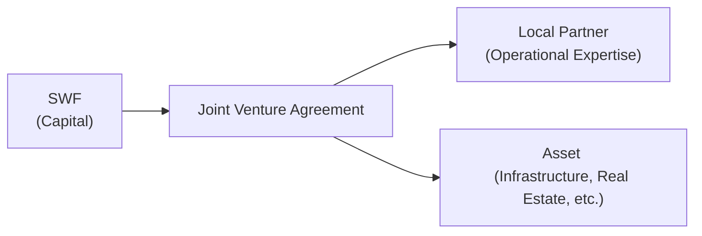
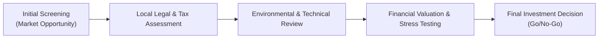

## Introduction and Context

So, let's talk about large, direct investments. When we say “direct,” we’re referring to deals struck without the usual intermediaries—think huge purchases of infrastructure projects, real estate, or private companies. For sovereign wealth funds (SWFs), this stuff can be especially captivating. Instead of handing capital to outside managers—like a private equity fund or real estate investment trust—SWFs might take a hands-on approach by owning a toll bridge outright or buying an entire logistics center. This might sound exciting (and it is!), but there's also an enormous range of risks that come bundled with these investments. My friend who worked at a major SWF once joked, “It's like buying a small city,” because you’re not just investing in financial instruments—you’re inheriting operational, legal, and sometimes even local political complexities.

In earlier chapters of this book (for instance, Chapter 1’s discussion of equity management and Chapter 3’s exploration of alternative investments), we highlighted various forms of active strategies. But direct investments are often lumped under the broader category of “alternatives” because they can include private equity, real estate, and unlisted infrastructure. They do, however, carry their own distinctive bandwidth of strategic risks, governance complexities, and unique liquidity constraints that set them apart from more liquid, tradeable alternatives.

Below, we’ll explore the multiple dimensions of these challenges: liquidity constraints, the intensity of operational due diligence, the effect of local politics, and the specialized processes needed to ensure these massive, sometimes multi-decade investments remain aligned with a SWF’s mandate and risk tolerance. We’ll also sprinkle in a few real-world anecdotes and highlight best practices for a strong, multi-pronged risk management framework.

## The Nature of Direct Long-Term Investments by SWFs

Direct, long-horizon investments generally serve a couple of key objectives for SWFs:  
• Building stable capital appreciation over decades.  
• Capturing the illiquidity premium that can come from holding real estate, infrastructure, or private equity for lengthy periods.  
• Aligning with national objectives (e.g., supporting domestic growth or establishing a global portfolio for strategic influence).  

In these investments, because the SWF typically bypasses third-party managers, they must handle governance, oversight, and operational issues in-house or at least coordinate heavily with co-owners and partners. This can grant a large measure of control: you directly manage strategic decisions, which can be particularly beneficial if you have highly specialized expertise on staff. It can also streamline returns—fewer layers of fees, potentially more direct involvement in how the asset is managed daily. However, it certainly doesn’t come free of burdens.  

## Unique Risks in Direct Investments

### 1. Liquidity and Concentration Risk

First, direct investments tie up capital for an extended period—sometimes 10 years, sometimes 30 years or more. Could you easily sell an entire privately owned hydroelectric dam if you needed quick cash? Probably not. That’s precisely why we talk about illiquidity. This means an investor (especially a SWF) could face a scenario in which they desperately need funds but can’t liquidate the asset promptly without suffering a massive discount—if they can sell at all.

Moreover, direct investments require big checks that often exceed the scale of typical public-market transactions. That’s a lot of eggs in a single basket, so to speak. If that real estate portfolio or infrastructure project hits a snag, it can significantly ding overall performance. Indeed, many SWFs set internal mandates specifying limits on how much can be invested in a single asset or region. If that single investment is too large or too undiversified, the entire portfolio’s risk level rockets upward.

### 2. Governance and Operational Oversight

One overlooked challenge? Operational governance. If a SWF owns and directly oversees, say, a chain of properties or a large pipeline, that implies an internal team to monitor day-to-day performance, manage local managers or employees, and uphold best-in-class corporate governance. There’s also the question of White Elephant projects—assets that look good on paper but are inefficiently run or become subject to political meddling, especially in emerging markets.  

I recall a friend who worked on a large real estate deal in an emerging economy. She discovered enormous discrepancies in building maintenance budgets and even found out that local contractors were inflating costs. That’s the sort of operational risk that might not be discovered if the oversight systems are inadequate. SWFs need processes to ensure alignment of local operations with the overall strategic plan—a robust internal control system, external audits, and real-time performance monitoring.

### 3. Political and Local Economic Risks

Political risk can be enormous. A regulatory shift—like new taxes on foreign property owners—could quickly destroy the profitability of a real estate project. In some countries, a leadership change might freeze or even expropriate foreign-owned assets. So direct investments in certain locales require strong legal frameworks, stable political conditions, and a decent level of comfort with local policy.  

Additionally, the local economy’s health influences the investment’s returns. If the SWF invests in, say, a cargo port for the export of commodities, and the host country’s economic outlook deteriorates, the investment’s projections might degrade fast. You can examine Chapter 3 (about assets in alternative investments) for an overview of how macroeconomic shocks can ripple through these non-traditional assets.

### 4. Exit Constraints

Well, reading a liquidation clause in a private contract can be like reading an ancient scroll—it’s complicated, the conditions can be tight, and you may face all sorts of lockups, preemptive rights, and regulatory approvals. If the SWF wants (or needs) to exit early, the market for that unlisted direct asset might be super thin. One reason many direct investments are structured with joint ventures (JVs) is to have pre-defined exit routes or rights of first refusal within the partnership.

### 5. Public Scrutiny and Fiduciary Duty

SWFs often face the watchful eye of the press and the general public—these are public funds, after all. If a direct investment flops, or if it runs into controversies around labor rights or environmental degradation, the reputational fallout can be severe. Consequently, SWFs may be subject to fiduciary obligations that are stricter or more transparent than those faced by a private institutional investor. Decision-makers must carefully weigh not only financial metrics, but social and political ramifications.  

The fiduciary duty also extends to ensuring the governance structure is robust—after all, poor oversight of these direct investments can cause real repercussions for a nation’s wealth.

## Using Partnerships and Joint Ventures to Mitigate Risks

Co-investments and JVs have become popular strategies for SWFs. Rather than going it alone, a SWF can pool resources and spread risk with a partner—potentially a local firm that knows the political landscape intimately or a seasoned manager who understands specialized operational aspects.

Below is a simple Mermaid diagram illustrating how a SWF might structure a JV to reduce local political and operational risk:

In such an arrangement, the SWF puts up capital and some strategic direction. The local partner knows the lay of the land—managing day-to-day operations or navigating policy issues. The risk is spread, and the local partner’s incentives can be aligned via careful structuring of equity stakes or performance-based fees.

## Currency Exposure in Cross-Border Direct Investments

Say an SWF invests in a toll road project in Country X, which uses a currency that’s historically volatile. Even if the local currency returns on the project are robust, the SWF’s ultimate gains (or losses) in its home currency could differ drastically if exchange rates swing. Emerging markets especially pose currency risk. Some SWFs might partially hedge using forward contracts or currency swaps, but the cost of hedging can be high. Also, if the investment horizon stretches 20+ years, rolling hedges can be expensive and generate basis risk.

This is where the alignment of currency flows with the fund’s liabilities is essential. If the SWF’s liabilities are denominated in the same currency as the investment’s cash flows, the currency risk is somewhat mitigated. Of course, many SWFs have multi-currency liabilities or no explicit liabilities in the short term (depending on their mandate). So portfolio managers must carefully examine how cross-border investments line up with their portfolio’s overall currency exposure. If you want more on risk analytics, check out the discussion of scenario analysis and currency correlation in Chapter 2’s sections on fixed-income risk and scenario testing.

## Specialized Due Diligence for Direct Investments

Thorough due diligence is crucial. When simply investing in a public equity or a corporate bond, standard due diligence revolves around analyzing the corporate financials, credit risk, etc. But direct investments can necessitate deeper dives: engineering reports for an infrastructure project, complex environmental studies for a real estate development, or specialized industry analyses for a private manufacturing company.  

This also ties back to operational oversight. You might need local legal counsel with knowledge of property rights and tax regulations, environmental consultants who can weigh in on permitting issues, or even a technical consultant who understands how to measure the operational efficiency of a hydro plant.

The due diligence process might look like this:

Each step is designed to catch red flags, refine valuations, and incorporate scenario analyses that reflect the real-world complexities of these large-scale assets. The deeper and more specialized the due diligence, the lower the chance of hidden liabilities or structural vulnerabilities that sabotage IRR down the line.

## Long Investment Horizons and NPV Sensitivity

For direct investments, we’re not just talking about next quarter or even next year. We’re thinking in multi-decade increments. Infrastructure, in particular, can run for 30 to 50 years. That means the discount rate you use to evaluate cash flows can drastically change your net present value (NPV).  

In a simplified formula:  

\text{NPV} = \sum_{t=1}^{T} \frac{CF_{t}}{(1+r)^{t}}
  

where \\(CF_{t}\\) is the expected cash flow at time \\(t\\), and \\(r\\) is the discount rate, which typically includes a risk premium for political, operational, and liquidity risks. Over 20 or 30 years, slight variations in \\(r\\) can dramatically alter your valuation. Even a 1% change can shift the NPV by a large amount. That’s why scenario planning and stress tests (like those outlined in Chapter 2.11) are so essential—SWFs must be prepared for interest rate changes, inflation surges, or major economic recessions decades later.

## Setting Portfolio-Level Guidelines for Direct Investments

Many institutional investors—SWFs included—maintain internal frameworks or “mandates” to control exposure to high-concentration, illiquid direct deals. You might see rules such as:  
• No more than 10% of total AUM in a single deal.  
• No more than 15% of total AUM in any single sector or country.  
• Minimum credit rating standards for co-investors or local partners.  
• Maximum permissible leverage ratios in infrastructure deals or real estate developments.  

All these constraints aim to ensure that one ill-timed or ill-conceived direct investment doesn’t compromise the overall health of the fund.

## Practical Implementation Insights

1. Build an Experienced Internal Team: If you’re going direct, you need folks who understand property management, local laws, infrastructure engineering, or private corporate governance.  
2. Partner with Seasoned Operators: Forming JVs with established local players helps mitigate risk.  
3. Politically Aware Investing: Evaluate political stability, policy frameworks, and the local environment thoroughly.  
4. Hedge (Selectively) for Currency Risk: But weigh the ongoing costs against the potential benefits.  
5. Scenario Analysis, Always: Stress test the big assumptions of your discounted cash flow model—project how the investment fares if the discount rate shifts or if demand plummets.  
6. Transparent Governance: Keep a robust audit trail, comply with local laws, and anticipate a high level of scrutiny from the public and stakeholders.  

## Exam Tips and Common Pitfalls

• Over- or Underestimating the Illiquidity Premium: One classic pitfall is assuming an overly generous illiquidity premium in your discount rates or return targets. Make sure you have robust data to justify it.  
• Ignoring Exchange Controls: Some emerging markets impose currency controls. This can hamper repatriation of profits and should be factored into your risk analysis.  
• Letting Political Risk Slip off the Radar: A sudden policy shift can change the entire game. Keep a close eye on local political reliability.  
• Under-budgeting for Operational Costs: Often, the real cost is discovered years into the project thanks to maintenance, repairs, or environmental compliance expansions. Prepare for these from day one.  
• Neglecting the Impact of Public Scrutiny: If you’re investing public funds, negative headlines or controversies can hamper the strategy or trigger forced divestments.  

## References

• Inderst, G. (OECD). “Infrastructure as an Asset Class”  
• Private Equity Demystified: An Explanatory Guide (ICAEW)  
• Preqin research on sovereign wealth funds’ direct investment trends: https://www.preqin.com/  
• Clark, G. L., & Monk, A. H. B. (2017). Institutional Investors in Global Markets. Oxford University Press.  

--------------------------------------------------------------------------------

## Test Your Knowledge: Managing Risks in Direct Long-Term Investments



### For a sovereign wealth fund investing directly in real estate, which major factor most influences liquidity risk?

- [ ] The fund’s short-term obligations.  
- [x] The difficulty or time it takes to sell large physical assets.  
- [ ] The level of interest rates in global markets.  
- [ ] Whether the real estate is residential or commercial.  

> **Explanation:** Direct real estate assets are often cumbersome to unload quickly, contributing to higher liquidity risk for a SWF. Even short-term obligations or interest rate trends won’t necessarily force a buyer to emerge.  

### What is a primary advantage of a SWF forming a joint venture with a local partner when investing in infrastructure?

- [x] It can mitigate local operational and political risks.  
- [ ] It eliminates currency risk entirely.  
- [ ] It allows the SWF to invest without capital outlay.  
- [ ] It eliminates any exit constraints on the SWF.  

> **Explanation:** A joint venture with a local partner can help share operational oversight and political connections, reducing local risks. Currency or exit constraints are separate considerations.  

### Which of the following best describes a potential aim of an internal “mandate” regarding direct investments?

- [x] Limiting the proportion of the fund allocated to a single sector or country.  
- [ ] Boosting the public profile of certain domestic industries.  
- [ ] Eliminating the need for external audits.  
- [ ] Encouraging active day-trading within the portfolio.  

> **Explanation:** An internal mandate often sets concentration thresholds and related guidelines to protect the fund from excessive risk in one sector or region.  

### What is a common characteristic of direct infrastructure investments over a 30-year horizon?

- [x] Return sensitivity to unexpected changes in discount rates.  
- [ ] Immediate liquidity in secondary markets.  
- [ ] Overnight changes in valued capital stock.  
- [ ] Zero correlation with economic cycles.  

> **Explanation:** Direct infrastructure involves cash flows that are discounted over many years, making the final valuation highly sensitive to shifts in the discount rate.  

### What is one reason political risk is more pronounced in direct investments versus some liquid public securities?

- [x] Direct investors are often subject to local operational, regulatory, or property-right changes.  
- [ ] Public equity markets always protect foreigners from policy changes.  
- [x] Funds can short-sell politicians to hedge the risk.  
- [ ] Custom derivatives are always cheaper for direct investors.  

> **Explanation:** Direct owners of physical or private assets can face sudden policy shifts, expropriations, or regulatory complications. Public securities may not fully avoid these risks, but they’re widely held and often regulated differently, and can be sold more quickly.  

### The illiquidity premium in direct investment typically arises because:

- [x] Investors require higher expected returns for locking up capital in less-tradeable assets.  
- [ ] Such investments are always risk-free.  
- [ ] Capital is actively traded in a highly efficient market.  
- [ ] Investors enjoy unlimited exit flexibility.  

> **Explanation:** Direct deals in private markets tie up capital for prolonged periods with limited exit options, so investors demand extra return for that inconvenience and risk.  

### Which is an appropriate approach to currency management for a SWF investing in an emerging market project?

- [x] Partial hedging using forward contracts or swaps, with careful evaluation of costs.  
- [ ] Ignoring currency exposure altogether.  
- [x] Hedging currency using local political guarantees.  
- [ ] Assuming parity between local currency and the investor’s home currency.  

> **Explanation:** Many SWFs use partial hedging solutions or cross-currency swaps. It’s not always undertaken at full scale because hedging can be costly, complex, or restricted.  

### Why are specialized due diligence processes critical for direct long-term investments?

- [x] They help detect governance, legal, and environmental issues early on.  
- [ ] They replace the need for risk-adjusted discount rates.  
- [ ] They shorten the investment horizon.  
- [ ] They eliminate any concentration risk.  

> **Explanation:** You want to uncover operational, legal, and environmental red flags before you lock in major capital commitments. This is central to controlling risk.  

### Which of the following demonstrates a best practice in direct investment governance?

- [x] Maintaining a robust internal control system and leveraging external audits.  
- [ ] Delegating all decision-making power to a single individual.  
- [ ] Avoiding all forms of transparency to the public.  
- [ ] Fully eliminating scenario analysis from the process.  

> **Explanation:** Sound governance means multiple layers of checks and balances, with periodic internal and external reviews.  

### In the context of multi-decade direct investments, is it true or false that a 1% change in the discount rate can significantly alter the NPV?

- [x] True  
- [ ] False  

> **Explanation:** Over such long timelines, even a small change in the discount rate can produce a large swing in the present value of projected cash flows.  


