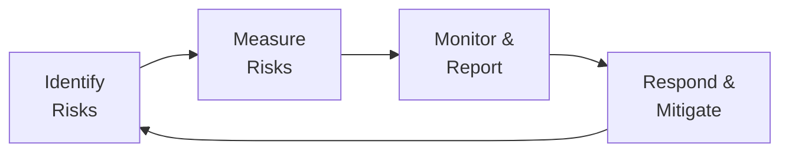

Introduction  
Enterprise Risk Management (ERM) might sound like another buzzword tossed around corporate boardrooms—sort of like the trendy acronym of the day. But let me tell you, once you see the entire house of cards tumble because someone overlooked a small but significant risk, an ERM framework starts to feel as essential as oxygen. I recall an old colleague who used to say, “A well-run ERM system is like the backstage of a theater: invisible to most but essential for the show to go on.” And honestly, from my personal experience at a mid-sized bank, that quip feels spot-on.  

In many institutional contexts, including Sovereign Wealth Funds (SWFs), ERM serves as the bedrock of how leadership sets the “tone from the top,” ensuring that risk-taking—while necessary—never becomes reckless. This discussion explores the building blocks of ERM, explains why an integrated approach matters, and shows how SWFs can leverage (or fail to leverage) an ERM system for strategic objectives.

Core Components of an ERM System  
A holistic ERM approach typically includes several interrelated components: risk identification, measurement, monitoring, reporting, and—very importantly—dynamic feedback loops that help the organization respond to changes. Regardless of an entity’s size, these elements are crucial for ensuring the most significant hazards don’t catch you off guard.

• Risk Identification  
  This is the detective work stage of ERM, where you figure out the full spectrum of threats. It’s not just the markets or a single investment. ERM frameworks also consider operational risk (like a cyber breach), strategic risk (like a major shift in public policy), and even intangible risk (like reputational knocks). Identifying systemic correlations is a big part of proper risk identification. If your equity and bond holdings both lose value in a global sell-off, that’s not two separate problems—it’s one giant correlated meltdown.

• Risk Measurement  
  Measurement starts by assigning metrics to each identified risk. For some organizations, especially those in complex environments, Key Risk Indicators (KRIs) are employed to give early warning signals. These might be debt-to-cash-flow ratios, open derivative positions relative to capital, or even real-time liquidity coverage metrics. In SWFs, it’s common to measure risk both in terms of conventional financial metrics (e.g., Value at Risk, or VaR) and national economic objectives (like maintaining currency stability).

• Risk Monitoring and Reporting  
  Efficient reporting lines—and robust data processing—are at the core of a well-functioning ERM structure. A monthly or weekly risk dashboard, circulated among key stakeholders, is typical. Some institutions even generate real-time dashboards that feed directly into the C-suite’s decision-making process. In many SWFs, such dashboards must satisfy not just internal compliance but also sovereign-level audit and oversight committees.

• Risk Response and Mitigation Planning  
  Even the best analysis doesn’t help if there’s no plan for what to do when a risk materializes. Generally, this includes strategies to hedge exposures, shift portfolios, adjust asset allocations, or, in extreme cases, exit entire markets. In cases like liability-driven investing—a concept discussed in earlier chapters—risk mitigation is woven into the entire investment process.

Below is a simplified diagram of the ERM cycle, illustrating how these core steps typically interact.

Integrating Multiple Dimensions of Risk  
A key hallmark of ERM is that it integrates multiple dimensions—market, credit, operational, strategic, reputational—under one comprehensive framework. In older systems, each risk type might have lived in a silo—for instance, credit risk in one department, market risk in another, and so on. Under a unified ERM approach, all these risk perspectives feed into a single governance framework.

This comprehensive view allows for a deeper understanding of correlations and concentrations. Measuring a single position’s risk exposure tells you one story, but capturing a portfolio’s aggregated risk picture might reveal a more severe or entirely different narrative. Think of it like cooking: you can’t just evaluate each ingredient individually. You need a sense of how they interact. ERM frameworks function similarly, giving you a holistic vantage point from which to manage uncertainty.

Strengths of a Robust ERM System  
Because of how broad it is, ERM invites oversight from all corners of the organization. A well-oiled approach brings a host of advantages:

• Enhanced Risk Awareness and Culture  
  Elevated awareness fosters a risk culture aligned with the broader strategic objectives. From junior analysts to senior executives, everyone begins to see risk as a shared responsibility. The idea of “risk ownership” fosters accountability.

• Foreseeing Risk Concentrations  
  One of the biggest review points in any ERM framework is detecting correlated positions or exposures that might blow up in a market firestorm. That multi-layer perspective is especially critical in SWFs, where large, long-term positions can accumulate systemic risk.

• Data-Driven Decision-Making  
  A robust ERM system encourages decisions that aren’t driven solely by gut instinct or political directives. In an SWF, where political influences can creep in, having empirical data on how certain risks interact can bring discipline and transparency.

• Better Governance  
  ERM typically enforces consistent governance structures. The typical governance framework clarifies who’s accountable for each risk category, how risk exposures are escalated, and what committees or boards need to approve risk-limiting actions.

Weaknesses and Pitfalls of ERM  
For all its virtues, ERM isn’t a cure-all. Let’s face it, even the best framework can show cracks. A few common pitfalls include:

• Resource Intensiveness  
  Establishing an ERM system can be a time sink—especially at large institutions. If the company or fund invests in complicated strategies (like leveraged private equity or multi-layered derivatives), risk specialists need to run elaborate models around the clock. That often means building large teams, acquiring expensive analytics tools, and implementing advanced technology platforms.

• Bureaucratic Inefficiencies  
  Some organizations can become so bogged down by compliance checklists that they lose the forest for the trees. I’ve seen places where managers produce hundreds of pages of risk reports every month that nobody reads. That’s the ultimate sign that the ERM system is being treated as a mere “compliance exercise” rather than as a strategic tool.

• Potential Blind Spots  
  When operational or non-financial risks are perceived as “somebody else’s problem,” it’s easy for intangible threats to go unexamined. For instance, reputational risks from taking socially unpopular positions (see ESG controversies from earlier chapters) might be inadvertently neglected.

• Organizational Culture Mismatch  
  If senior management doesn’t “walk the talk” on risk oversight, employees quickly learn to game the system. This results in a toxic culture where forms are filled and boxes are checked, but no real insight is gleaned.

Organizational Culture and Tone from the Top  
Culture is arguably the linchpin. People sometimes say the biggest risk management tool is simply having the right people in place with the right mindset. If top executives see ERM as a necessity, this attitude trickles down through manager and analyst ranks. Conversely, if pace-setting leaders publicly champion risk discipline but privately ignore or override the risk process, the contradictory signal confuses the entire workforce.

For ERM to succeed, there must be a clear, consistent message: risk management matters at every level. Risk appetite (the level of risk an institution is willing to accept) must be well-defined, openly communicated, and reinforced in performance metrics—otherwise, it’s just empty words. SWFs can face unique challenges here because they may juggle purely financial goals with broader national or political considerations.

Unique ERM Considerations for SWFs  
Sovereign Wealth Funds often have specialized mandates. Some might be focused on stabilizing local currency fluctuations, while others are meant to preserve national wealth for future generations—that’s a very different risk appetite from a typical hedge fund. Additionally, political influence can shape (or distort) the objectives of an SWF. For instance, a government might push the fund to invest in certain domestic projects with questionable financial returns but substantial social or political benefits.

The “tone from the top” in an SWF is often set by a board representing government interests. If risk management is championed as essential for preserving wealth across generations, the ERM system will reflect that. Alternatively, if the fund is under pressure to finance short-term government budget shortfalls or unpopular infrastructure expansions, risk exposures can escalate quickly.

Continuous Review and Evolving Practices  
Global markets change constantly, and so do regulations. We saw in earlier chapters (like the scenario analyses in fixed-income, or how alternative investments adapt to changing liquidity conditions) that a static risk model quickly becomes outdated. Conducting periodic stress tests, scenario analyses, and macroeconomic forecasts can reveal structural shifts that require a retooling of the ERM process.

Moreover, new technologies—like advanced, cloud-based risk platforms or artificial intelligence–driven analytics—can speed up or refine risk detection. SWFs with cross-border portfolios must also stay abreast of regulatory changes in each market. Continuous improvement means adopting cutting-edge methodologies while preserving the organizational knowledge gleaned from previous risk events.

Quantifying Intangible Risks  
It’s easy to measure credit risk or market volatility, but intangible or non-financial risks, such as reputational harm or cybersecurity threats, don’t always translate neatly into a single financial metric. That’s where qualitative assessments, scenario planning, and other non-financial Key Risk Indicators can make a difference. No, you can’t always put a perfect price tag on brand damage. But you can track social media sentiment, press coverage, or stakeholder surveys as proxies. You can also define risk ownership so certain departments “take charge” of intangible risks.

Key Takeaways  
• Holistic Integration  
  ERM weaves together diverse threats, from commodity price fluctuations to cyber vulnerabilities, and shapes them into a unified framework that fosters consistent governance.

• Strategic Edge  
  It’s not just about checking compliance boxes. Used effectively, ERM surfaces hidden exposures and helps you rebalance proactively before trouble hits. It can even guide you on how to exploit market dislocations.

• Cultural Imperative  
  Without the right culture, well-intentioned ERM efforts devolve into paperwork and checklists. Genuine support from senior leaders is vital.

• Evolving Tools and Practices  
  Continuous improvement is the name of the game. Each year brings new risks, new technologies, and new regulations, reinforcing the need for an agile, forward-looking ERM program.

• Special Focus for SWFs  
  From balancing national objectives to managing political sensitivities, SWFs have unique priorities that shape the scope and objectives of their ERM frameworks.

Final Exam Tips  
As a candidate for the CFA Level III exam, you’ll want to be comfortable understanding how ERM can inform strategic asset allocation decisions, especially for institutional entities such as SWFs. The exam may place you in scenarios where you need to:

• Apply stress testing and scenario analyses to hypothetical portfolios (e.g., an SWF deciding whether to invest in domestic infrastructure versus foreign equities).  
• Evaluate the costs and benefits of a robust ERM platform, pointing out where bureaucratic inefficiencies might harm performance.  
• Suggest communication strategies to align risk appetite across different stakeholders.  
• Identify intangible or non-financial risks that might undermine stated investment objectives.  

Be prepared to recommend adjustments to an ERM framework based on evolving market conditions, just as you would discuss rebalancing a portfolio. Also, watch out for questions that ask you to reconcile the conflicting interests of a SWF’s political oversight with its portfolio management best practices.  

References & Further Reading  
• COSO (Committee of Sponsoring Organizations) ERM Framework (https://www.coso.org/)  
• ISO 31000 Risk Management Guidelines (International Organization for Standardization)  
• McKinsey & Company white papers on enterprise risk management at large institutions  
• “Implementing Enterprise Risk Management: Case Studies and Best Practices” by John R. S. Fraser, Betty J. Simkins  

## Test Your Knowledge: Enterprise Risk Management in Sovereign Wealth Funds



### A robust ERM framework typically includes all of the following EXCEPT:
- [ ] Risk identification  
- [ ] Risk measurement  
- [ ] Risk monitoring and reporting  
- [x] Guaranteed elimination of all risks  

> **Explanation:** ERM helps identify, measure, monitor, and report risks, but it cannot eliminate risk altogether.

### Which of the following BEST describes a potential disadvantage of ERM systems?
- [ ] They unify oversight by integrating risk from multiple departments  
- [x] They can become overly bureaucratic and compliance-focused  
- [ ] They reduce the need for governance  
- [ ] They eliminate intangible risks  

> **Explanation:** If not properly scaled, ERM frameworks can become bureaucratic, producing extensive reporting that lacks strategic benefit.

### In the context of Sovereign Wealth Funds, “tone from the top” mainly refers to:
- [x] Signals from senior leadership or government officials about the importance of risk management  
- [ ] A risk measurement technique focusing on intangible risk  
- [ ] Implementation of advanced analytics for credit risk mitigation  
- [ ] The use of social media to report performance  

> **Explanation:** “Tone from the top” refers to leadership attitudes and signals that shape organizational culture, especially critical for SWFs with political oversight.

### A well-implemented ERM system is LEAST likely to:
- [ ] Provide a multi-dimensional view of organizational risk exposures  
- [ ] Improve governance by clarifying lines of accountability  
- [x] Completely remove the possibility of reputational damage  
- [ ] Use Key Risk Indicators to detect potential risk escalations  

> **Explanation:** ERM cannot guarantee zero reputational damage—it can only help identify and address reputational risks more effectively.

### Which is a PRIMARY advantage of using an integrated ERM approach instead of silo-based risk management practices?
- [x] Correlated risk exposures can be identified across different operations  
- [ ] Lower capital requirements in all cases  
- [x] Enhanced synergy between credit and market risk but not operational risk  
- [ ] Reduced need for regulatory reporting  

> **Explanation:** One of the main benefits of an integrated ERM approach is identifying correlated risks and concentrations, which silo-based methods might overlook.

### In a powerful risk culture, risk ownership typically means:
- [x] Specific individuals or teams are responsible for managing designated risks  
- [ ] Only top-level executives make all risk decisions  
- [ ] Risks can be completely outsourced to third parties  
- [ ] No accountability for any particular business unit  

> **Explanation:** Risk ownership is the practice of assigning accountability for risks to those with the expertise or authority to address them.

### Sovereign Wealth Funds may face political pressures that:
- [x] Alter risk appetites and strategic assumptions  
- [ ] Eliminate all market-based exposures  
- [ ] Guarantee unlimited funding for ERM programs  
- [x] Automatically increase correlation among risk factors  

> **Explanation:** Political factors often influence the SWF’s investment choices, which can affect risk appetite and strategic planning. They do not necessarily eliminate or guarantee any single type of exposure.

### Continuous review of an ERM framework is essential because:
- [x] The global macroeconomic environment and regulatory landscape constantly evolve  
- [ ] It automatically eliminates intangible risks  
- [ ] It reduces the need for scenario analysis  
- [ ] Management usually wants to ignore compliance-based requirements  

> **Explanation:** Market conditions, technologies, and legislative environments are always changing, so ERM practices must adapt accordingly.

### An example of a Key Risk Indicator (KRI) in an SWF context could be:
- [x] The ratio of foreign direct investments to total capital  
- [ ] A guaranteed risk-free rate  
- [ ] A measure that always stays constant over time  
- [ ] A single investment’s annual return  

> **Explanation:** KRIs are forward-looking measures (e.g., ratio of foreign ownership, liquidity coverage) that help gauge risk exposure more holistically.

### True or False: ERM frameworks solely focus on quantifiable risks and do not address intangible or non-financial risks.
- [x] False  
- [ ] True  

> **Explanation:** ERM frameworks include both financial and non-financial risks, including reputational, strategic, and operational risks.


