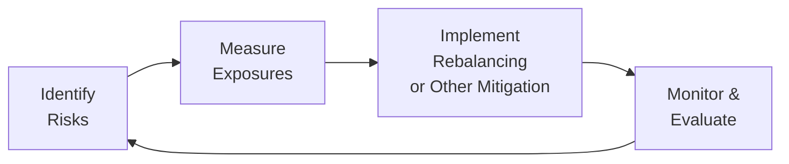

## Introduction
Sometimes, when people talk about sovereign wealth funds (SWFs), there's this aura of endless resources and infinite time horizons—like they're impervious to market turmoil. But oh boy, markets can be pretty humbling, right? And SWFs, despite their size and clout, have to grapple with risks just like any other institution. In fact, you’d be surprised by how many of them have faced serious drawdowns. In this section, we’ll take a close look at several real-world cases—both the success stories and the not-so-pretty ones—and then tease out critical lessons on crisis navigation, contrarian investing, stakeholder relationships, and more. 

At the end of the day, the goal is to figure out how these institutions keep their heads above water when markets go haywire and how they manage risk over long time horizons. We’ll see that even the best can stumble, especially when governance falters or leverage gets a bit out of hand. But by examining what works and what doesn’t, we can walk away with a blueprint for robust institutional risk management. 

## Real-World SWFs That Navigated Crises
One of the leading lights in SWF management is Norway’s Government Pension Fund Global (often informally called “the Norwegian oil fund”). During the Global Financial Crisis (GFC), it withstood turbulence by adhering to a systematic policy of rebalancing—meaning they sold assets that had risen above strategic allocation targets and increased positions in those that had underperformed. Sure, that might sound plain and simple, but the discipline to carry out this approach in the face of plummeting equity markets is what really stood out.

### The Norwegian Model and the Global Financial Crisis
• Rebalancing (definition reminder): The process of adjusting portfolio allocations back to target levels when market movements cause drift in allocations.  
• Contrarian investing (definition reminder): Purchasing assets that are out of favor or have fallen in price while others are selling.

The Norwegian fund’s contrarian investing stance might have seemed contrarian to the nth degree when markets were tanking in 2008. But it ultimately reduced the portfolio’s average cost basis, setting them up for stronger gains when markets bounced back.

A key point is that the Norwegian fund had clear governance structures in place. The Ministry of Finance sets strategies, and Norges Bank Investment Management (NBIM) executes them. Because roles and responsibilities were well-defined, the rebalancing approach was implemented systematically—even though it was a “buy more equities” move during a deep market slump. Imagine the fortitude that required.

Here’s a simple visual diagram of a cyclical approach to risk management, similar to what the Norwegian fund practices:

The cyclical nature—Identify, Measure, Implement, and Monitor—ensures that the fund remains dynamic and doesn’t just “set it and forget it.” 

## Rethinking Risk in Commodity-Driven SWFs
I recall chatting with a friend who worked for a smaller commodity-driven SWF in the Middle East. When oil prices crashed from over $100 per barrel to below $50 around 2014–2015, the fund took a major hit on its domestic investments, which were heavily tied to petroleum revenues. They responded by intensifying their commodity price hedges and diversifying away from local energy stocks. 

That might sound like a no-brainer, but it was politically sensitive because these funds often support local industries and government projects. By focusing on rebalancing toward global equities and fixed income—plus taking advantage of subdued valuations in certain overseas markets—this SWF not only weathered the storm but also earned pretty decent returns when global markets recovered.

### The Drawdown Challenge and Commodity Price Swings
• Drawdown (definition reminder): A peak-to-trough decline during a specified period of an investment, portfolio, or fund.  
• Commodity price swings (definition reminder): Fluctuations in the prices of raw materials (e.g., oil, metals, agriculture) that can drastically impact returns for resource-focused SWFs.  

Technically, the SWF faced massive drawdowns in its local portfolio, but by adjusting allocations and leveraging a mixture of alternative assets—including real estate and private equity—they effectively mitigated some of the pain from oil’s free fall. This demonstrated how the ability to pivot amid market shifts is critical, even for institutions that might have a stated “ultra-long-term” horizon.

## ESG Integration Success Stories
Another angle on SWFs’ risk management is environmental, social, and governance (ESG) integration. We’ve seen some funds adopt sustainable infrastructure investments, like renewable energy projects, not just to appease stakeholder demands but also to hedge long-term environmental risks and diversify revenue streams. 

Singapore’s Temasek Holdings is recognized for its forward-looking approach to sustainable portfolios. It invests in clean energy, technology, and healthcare—sectors it sees as having long-term growth potential. More notably, Temasek has taken the stance that emerging ESG themes can be an alpha generator—i.e., they’re not just a “feel-good” measure but a genuine strategy for risk-adjusted performance. 

Some critics have been skeptical—wondering if ESG is more about marketing. But results suggest that certain SWFs have successfully used ESG or sustainability themes to their advantage. Over the years, Temasek has reported relatively strong returns while also championing developmental goals in the regions it invests in. This synergy between strong financial performance and broader societal impact underscores how robust ESG practices can serve as a form of crisis navigation (SWF context) if you think about climate adaptation or regulatory shifts as potential crises in slow motion.

## Pitfalls: Tales of Missteps
No discussion of risk management would be complete without acknowledging that some funds have stumbled. Over-reliance on leverage and poor governance structures have, at times, led to substantial losses.

### Example of Excessive Leverage
In the mid-2000s, a certain SWF in Asia took substantial leveraged bets in global financial stocks right before the GFC. The fund quickly saw its capital evaporate when those bank shares nosedived. Because the leverage magnified losses, the SWF’s credit lines were also put at risk. A key factor was the unclear governance: the fund’s leadership was subject to frequent political pressure, with minimal checks to slow down risk-taking. As a result, the fund had to be recapitalized under a new mandate.

### Example of Poor Governance
There’s a case (no need to name names) where an SWF had an overly centralized decision-making process in the hands of a few political figures. Due diligence on alternative investments proved half-hearted, resulting in investments that were more about political relationships than actual risk-return optimization. As soon as commodity prices dropped, the fund realized huge losses in multiple questionable projects. Later, a reformed governance structure was introduced, adopting a more transparent approach with a formal external advisory board.  

## The Role of Stakeholder Relationships
Strong stakeholder relationships (definition reminder): Partnerships or communication channels with all parties (governments, local communities, beneficiaries) that affect or are affected by the fund's operations.

SWFs are often managed on behalf of entire nations. So you can imagine the political heat that can arise if a fund’s returns slump or if it invests in projects deemed socially controversial. Open dialogue and transparent reporting—together known as **transparency initiatives**—help ease these tensions.

• In Norway, for instance, the central government has established regular reporting processes to Parliament on how its SWF invests.  
• Singapore’s Temasek publishes detailed annual review statements, explaining portfolio composition, performance, and strategy.  
• Some Middle Eastern funds have begun “roadshows” to local communities to communicate the rationale behind infrastructure spend.

This stakeholder engagement can reduce the risk of sudden policy reversals from a new government or public outcry if certain investments are misunderstood. In many cases, consistent engagement fosters trust, thereby shielding the SWF from abrupt changes in investment mandates.

## Importance of a Knowledge-Sharing Culture
A **knowledge-sharing culture** (definition reminder): An environment that promotes continual learning, feedback loops, and experimentation to refine investment strategies.

Institutions that encourage frequent internal reviews and welcome external experts or consultants tend to respond more deftly to rare events. For instance, during the GFC, several SWFs brought in global fixed-income specialists and macro strategists to help them shape more nuanced policy responses. A similar dynamic was observed during COVID-19 disruptions in 2020: some funds re-convened investment committees at shorter intervals to integrate real-time insights from external counsel. 

A friend of mine working in a top-tier SWF mentioned that “the willingness to think we don’t have all the answers in-house” was what helped them pivot quickly at the onset of COVID, shifting capital to sectors like telemedicine and remote work solutions. That’s a subtle example of knowledge-sharing meets humility.

## A Look at Proactive Communication During Sensitive Times
When SWFs invest internationally, they sometimes get entangled in geopolitical tensions. For example, if a fund invests in a strategically sensitive technology sector in a foreign country, there can be accusations of political influence or data security concerns. SWFs that proactively communicate their governance structure and commercial objectives can mitigate these “reputational risks.” 

• In 2008, certain Middle Eastern SWFs received scrutiny in the U.S. for large stakes in domestic banks. They eased tensions by publicly clarifying that their intentions were purely investment-driven—no desire to influence business operations.  
• More recently, some funds have introduced annual or quarterly calls with foreign regulators to maintain open lines of communication, further reducing the chance of negative press or policy backlash.

## Summing It Up
Putting it all together, successful SWFs have adopted risk management frameworks that blend discipline, flexibility, and transparency. The best among them appear to rely on a few foundational pillars:

• Clear (and enforced) governance: No system is perfect, but successful SWFs maintain structured oversight that ensures strategic decisions don’t run wild.  
• Disciplined rebalancing and contrarian investing: Buying low and selling high sounds easy, but it takes serious guts to act in the face of panicked markets.  
• ESG integration for long-term resilience: Sustainable infrastructure investments and comprehensive ESG frameworks can protect from emerging risks and yield competitive returns.  
• Engagement with external advisors and internal knowledge-sharing: Humility and the willingness to adapt can be a hallmark of resilience.  
• Strong stakeholder and community relationships: Minimizing the potential for political or social backlash ensures more stable long-term mandates.

In contrast, those that have taken on excessive leverage or put too much faith in politics tailwinds (instead of thorough due diligence) often face brutal corrections. But from each misstep, there have been valuable lessons—lessons about the need for robust governance, dynamic portfolio adjustment, and transparent communication. 

## Final Exam Tips
• Know the “why” behind rebalancing. It’s not just about returning to target weights; it’s about exploiting market dislocations.  
• Understand the interplay of commodity price swings and SWFs heavily reliant on resource revenue.  
• Whether you’re writing an essay response or item set answer, show how contrarianism can provide alpha if done under disciplined frameworks.  
• Be prepared to reference real-world examples, such as Norway’s GFC playbook or Temasek’s ESG integration. Examiners often like to see how you connect theory to practice.  
• For scenario-based questions, consider how knowledge-sharing and governance structures are the backbones that enable funds to pivot effectively during crises.

Encourage deeper reading on each of these points, including the references below. In the exam, you might be asked to suggest risk management solutions for an SWF that’s reliant on a single commodity or to evaluate how stakeholder relationships impact an SWF’s strategic flexibility. Bring in relevant examples and clarify how the structure of the SWF influences its capacity to execute contrarian investment plays.

## References & Further Reading
• “The Norwegian Model of SWF Management” (Norges Bank Investment Management)  
• Case studies of Temasek Holdings in various economic cycles: https://www.temasek.com.sg/  
• “A Decade of SWF Investment: Key Trends and Lessons Learned,” IE Center for the Governance of Change  
• “The Resilient Investor” articles by Mercer, exploring strategies for institutional investors dealing with systemic shocks  

## Test Your Knowledge: Institutional Risk Management in SWFs



### Which of the following best describes "rebalancing" in an SWF context?
- [ ] Adjusting strategic asset allocation to permanently hold less equity.  
- [ ] Continuously buying more of the best-performing asset class.  
- [x] Returning the portfolio’s weightings to predetermined target levels.  
- [ ] Halting all trading during a market downturn.  

> **Explanation:** Rebalancing means periodically adjusting the portfolio back to target weights, often requiring the sale of assets that have outperformed and the purchase of assets that have underperformed.

### In the Global Financial Crisis, the Norwegian SWF’s risk management approach included:
- [ ] Exiting all equity positions at the hint of crisis.  
- [x] Maintaining a disciplined contrarian stance and buying equities as they fell.  
- [ ] Blocking out external market data to avoid panic selling.  
- [ ] Avoiding large equity stakes altogether.  

> **Explanation:** The Norwegian fund maintained discipline, rebalancing into equities while prices were low, epitomizing a contrarian approach.

### When commodity prices crash, a commodity-driven SWF might:
- [ ] Stick to a single sector and wait for a rebound.  
- [x] Diversify into broader global markets and hedge exposure.  
- [ ] Permanently freeze all new investments.  
- [ ] Avoid seeking external expertise to minimize costs.  

> **Explanation:** Commodity-dependent SWFs often mitigate drawdown risk by hedging commodity exposures and diversifying internationally.

### Which of the following can be a direct result of poor governance in an SWF?
- [ ] Increased transparency in investment decisions.  
- [x] Excessive leverage and politically motivated investments.  
- [ ] Superior long-term performance from politically influenced trades.  
- [ ] Automatic crisis navigation through rigorous checks and balances.  

> **Explanation:** Poor governance often results in unchecked risk-taking, politically driven investments, and little to no risk accountability.

### ESG integration in institutional portfolios:
- [ ] Is always detrimental to returns in the long run.  
- [ ] Focuses exclusively on philanthropic objectives with no concern for returns.  
- [x] Can align financial performance with sustainable and developmental goals.  
- [ ] Hardly ever leads to tangible risk mitigation.  

> **Explanation:** Many SWFs have found that well-executed ESG strategies contribute to strong returns while supporting broader societal objectives.

### A knowledge-sharing culture within an SWF typically involves:
- [ ] A top-down managerial framework with no input from external experts.  
- [x] Frequent internal reviews, external consultations, and openness to new insights.  
- [ ] Eliminating mid-level decision-making to accelerate processes.  
- [ ] Sticking to a single, rigid investment policy to avoid confusion.  

> **Explanation:** A culture that encourages feedback loops and engagement with experts is key to adapting quickly to shifting market conditions.

### Why are strong stakeholder relationships crucial for large institutional investors like SWFs?
- [ ] They help SWFs circumvent government oversight.  
- [x] They reduce the likelihood of public or political backlash and ensure mandate stability.  
- [ ] They allow SWFs to opt out of transparency initiatives.  
- [ ] They eliminate the need for a formal governance framework.  

> **Explanation:** Because SWFs manage wealth on behalf of nations, clear communication with governments, communities, and beneficiaries preserves trust and policy continuity.

### During volatile markets, contrarian investing in SWFs means:
- [ ] Chasing assets with the highest recent returns.  
- [x] Buying securities that others are heavily selling, under a disciplined framework.  
- [ ] Selling off losing positions immediately.  
- [ ] Disregarding any form of risk management procedures.  

> **Explanation:** Contrarian investing involves going against prevailing sentiment in a disciplined manner, potentially buying securities at lower prices.

### Excessive leverage in SWFs often leads to:
- [x] Greater vulnerability to market downturns.  
- [ ] Lower overall portfolio volatility.  
- [ ] Guaranteed higher returns in the long term.  
- [ ] Permanent protection from adverse commodity price swings.  

> **Explanation:** Leverage magnifies both gains and losses, so a leveraged SWF can be more susceptible to severe drawdowns if markets move unfavorably.

### A transparent communication strategy during politically sensitive investments:
- [x] Helps manage reputational risks by clarifying the fund’s intentions and governance.  
- [ ] Encourages regulatory hostility toward the SWF’s operations.  
- [ ] Is primarily a marketing gimmick with no real impact on stakeholder trust.  
- [ ] Reduces the SWF’s ability to innovate.  

> **Explanation:** Proactive communication about structure and objectives often preempts misunderstandings and fosters geopolitical goodwill.


