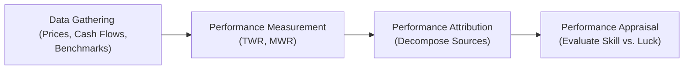

## Introduction and Context

Have you ever tried to figure out why your portfolio’s return is higher (or, let’s be honest, sometimes lower) than you expected? Maybe you’ve had that moment where you tallied up the gains only to scratch your head about what actually caused them. Well, that’s pretty much what we do when we talk about measurement, attribution, and appraisal of portfolio performance. It’s a fancy way of saying: “Let’s figure out how much the portfolio made, how it made it, and whether that’s good or bad relative to our goals.”

I remember early in my career as a junior analyst at a boutique investment firm. I’d spend countless hours building spreadsheets that tried to calculate “the real return” for the quarter. My boss insisted on accuracy down to the cent (which was, you know, somewhat crazy) because even small errors could lead to big misunderstandings about a manager’s skill. That’s where I got convinced that measurement, attribution, and appraisal are like the Holy Trinity of performance evaluation.

Below, we’ll explore each component in depth, see how they interrelate, and discuss best practices. While these concepts can be detailed, don’t worry—we’ll break them down in an almost chatty way so you can apply them confidently in real life.

## The Three Pillars of Performance Evaluation

In practice, portfolio performance evaluation comprises three crucial elements:

• Performance Measurement  
• Performance Attribution  
• Performance Appraisal  

But let’s not keep it so abstract. Here’s a quick visual to keep us on track:

### Why These Components Matter

• Measurement: Accurately quantifying the portfolio’s return is the foundation. If we mess up the basics, everything else quickly falls apart.  
• Attribution: We want to know what drove the returns—was it the right sector calls? A well-timed currency hedge? Lucky picks in small-cap stocks?  
• Appraisal: Ultimately, even if someone’s returns are stellar, it’s essential to see if they took on a commensurate (or excessive) level of risk. Or perhaps they used strategies that don’t align with the client’s expectations.  

Next, let’s break down each pillar and explain why they’re so fundamental for investment managers, asset owners, and (inevitably) exam-takers.

--------------------------------------------------------------------------------

## Performance Measurement

Performance measurement typically answers one big question: “How did we do?” Maybe you’ve heard of different ways to measure returns, like total return, time-weighted return (TWR), or money-weighted return (MWR). Each method has its own spin, and you can think of them as your measurement toolkit for different scenarios.

### Total Return

Total return simply captures the percentage change in the portfolio’s value over a period, including price change plus reinvested income (like dividends or interest). It’s nice and straightforward but doesn’t incorporate the timing or magnitude of cash flows.

### Time-Weighted Return (TWR)

Time-weighted return is designed to measure the manager’s skill without letting client-driven inflows and outflows skew the results. In other words, TWR is the return you’d get if you hypothetically invested at the start of the period and never added or withdrew money. Each “subperiod” return is calculated, then chained together to produce the overall return.

A short conceptual example:  
• Start with $1,000. End of first quarter, portfolio has $1,100. Then the client invests another $500, so you’re at $1,600 total. By the end of the second quarter, the portfolio is $1,760.  
• TWR breaks it down into (first quarter) + (second quarter) subperiods. By ignoring the impact of the extra $500 added midstream, we get a better sense of whether the manager performed well across both quarters, independent of the client’s actions.

### Money-Weighted Return (MWR)

Money-weighted return is basically the internal rate of return (IRR) for the portfolio, reflecting the timing and magnitude of cash flows. It’s from the investor’s perspective: if you put in more money right before the market soared, MWR will look brilliant. Conversely, invest a chunk right before the market tanked and—ouch!—MWR will appear worse. MWR is commonly used by private equity managers or in contexts where clients have major control over contributions and withdrawals.

### Data Quality and Frequency

Performance measurement rests on robust data. If prices, corporate actions, or benchmark data are riddled with errors, everything else collapses. Many institutional managers rely on custodians or third-party data providers. Just keep in mind that a “garbage in, garbage out” scenario is still all too possible.

### Linking to the Curriculum

In upcoming sections of this volume, you’ll see specialized scenarios like multi-currency portfolios (Section 1.16) or multi-period performance measurement (Section 1.14) that build on these basics. For now, just remember that TWR, MWR, and total return form the core measurement approaches.

--------------------------------------------------------------------------------

## Performance Attribution

Once we know “how much” the portfolio returned, the next question is “Why?” or “How?” Performance attribution tries to break down the drivers of returns, typically focusing on decisions around asset allocation, sector positioning, individual security selection, and possibly timing or factor exposures (as we’ll see in Section 1.13).

### The Building Blocks

1. Asset Allocation: Did the manager over- or underweight certain asset classes (like equities vs. bonds vs. alternatives)? How did that contribute to excess return compared to a benchmark?  
2. Sector/Industry Allocation: Within equities, for instance, the manager might tilt toward technology over utilities or vice versa. This tilt can add or subtract from overall performance.  
3. Security Selection: Here, it’s about picking winners (and, well, avoiding losers) within each sector. Did the manager’s stock picks in (for example) emerging markets outperform or underperform?  
4. Timing/Trading Decisions: Sometimes, managers shift allocations at opportune times—something like rotating out of growth stocks and into value stocks right before a market shift. This is trickier to measure and often lumped into a “residual” or “interaction” effect.  

### Common Attribution Frameworks

• Brinson-Fachler Model: A widely used framework that breaks out the performance differential (portfolio vs. benchmark) into allocation and selection effects.  
• Factor-Based Attribution: Instead of analyzing performance strictly by asset class or sector, you look at how exposures to certain risk factors (like size, momentum, value) explain returns. Refer ahead to Section 1.13 for a deeper look at factor-based approaches.  
• Fixed-Income Attribution: This can get complicated (hello, yield curve shifts), so we’ll dive into it separately in Section 1.5.

### Bridging the Gap Between Measurement and Appraisal

Attribution is directly fed by your performance measurement results—if the TWR for the portfolio is 10% and your benchmark’s TWR is 8%, you have a 2% excess return to “explain.” That 2% gets carved up into asset allocation decisions, security selection brilliance (or not), plus a residual.

--------------------------------------------------------------------------------

## Performance Appraisal

By the time we get to appraisal, we’re done answering: “How much did we earn?” and “Why did we earn it?” Now we’re onto, “Was it any good, given the level of risk and the market environment?” Appraisal might ask, “Sure, you made 2% alpha, but the manager took on 50% more risk than the benchmark, so is that really skill?” Or “Does the strategy align with the investor’s policy statement and constraints?”

### Risk-Adjusted Return Measures

• Sharpe Ratio: A classic, though it uses total risk (standard deviation) in the denominator. (Section 1.11 references other risk-adjusted measures, like Sortino and Information ratio, for a deeper dive.)  
• Information Ratio: Focuses on active risk (tracking error against a benchmark) as opposed to total volatility.  
• Appraisal Ratio: Compares alpha to non-systematic risk.  
• Sortino Ratio: Emphasizes downside risk over total volatility.  

The point: a manager might show up with the same TWR as some peers, but if they did so with fewer drawdowns or less tail risk, that’s generally considered a superior outcome.

### Qualitative Factors

Numbers never tell the whole story. Sometimes you want to consider:  
• Does the manager’s style drift away from stated objectives?  
• Are risk controls properly in place?  
• Has the investment team changed drastically, or do they have consistent leadership?  
• Are they transparent with fees and trades?

### Alignment with Objectives

Finally, performance appraisal wants to see if all of this is in line with the investor’s objectives. Think of an asset owner who invests for a long time horizon. Sure, short-term performance might matter, but it’s not the only yardstick. Appraisal then leads to next steps: keep the manager, fire them, or maybe change the policy portfolio.  

--------------------------------------------------------------------------------

## Core Interrelationships

We can’t just think of these as one-and-done concepts. They create a loop:

1. Measurement provides the numeric returns.  
2. Attribution reveals the “why,” dividing performance into different sources (allocation, selection, etc.).  
3. Appraisal uses the findings to judge whether the manager is meeting the overall objectives given the risk.  

Then, guess what? The next period begins, more performance data accumulates, and we do it all again!

--------------------------------------------------------------------------------

## Implementation Considerations

### Data Integrity

We can’t stress it enough: your entire performance evaluation is only as good as the data. Corporate actions, dividends, interest payments, fees, currency conversions—these must be captured accurately. Modern portfolio systems often automate, but even the best systems need oversight.

### Benchmark Alignment

Your benchmarks should reflect the portfolio’s intended style, risk level, or mandate. If you’re using the S&P 500 as a benchmark for a small-cap portfolio, the results will be all over the place (we see the harmful effects of misspecified benchmarks in Section 1.9). Always choose something that truly represents the manager’s investment universe.

### Regular Appraisals

Markets evolve, and manager fortunes can shift. Performance attribution and appraisal aren’t “set and forget” tasks. Many institutional investors review managers monthly or quarterly, with deeper annual (or even multi-year) reviews to capture skill more reliably.

### Common Pitfalls

• Overemphasizing short-term performance: One quarter is typically too little to judge skill.  
• Misaligned time horizons: If an investor’s mandated horizon is 10 years, daily or weekly performance might be interesting but not conclusive.  
• Neglecting risk: A manager who uses leverage or invests in illiquid securities can generate high returns but with a commensurately bigger risk.  
• Ignoring cost: Transaction costs, management fees, taxes—these all can alter performance measurement.

--------------------------------------------------------------------------------

## Best Practices and Future Outlook

• Maintain consistency: Ensure all performance reporting uses the same definitions of returns, standard time frames, and updated benchmarks.  
• Embrace transparency: Provide attribution details so stakeholders don’t suspect “black box” investing.  
• Use multiple metrics: Don’t rely on just one number (like Sharpe) to judge a manager. Combine risk-adjusted stats, drawdown analysis, and qualitative reviews.  
• Evolve with technology: New analytics platforms can track performance across different geographies, currencies, and asset classes in real time.

--------------------------------------------------------------------------------

## Real-World Example (A Tiny Case Study)

Let’s imagine a fixed-income manager who invests in both government and corporate bonds. Over the last year, she outperformed by 1.5% relative to a standard government-only benchmark. Measurement shows the portfolio’s total TWR is 6.5%, while the benchmark is 5%. Good news, right?

Attribution reveals that the manager made a brilliant overweight call in shorter-duration corporate bonds that gained more when interest rates stabilized. That accounted for 0.8% of the outperformance. Another 0.7% came from skillful security selection in high-yield segments. 

Finally, an appraisal asks if the manager took on excessive credit risk or if they stayed within guidelines. Suppose she adhered to all guidelines, avoided undue leverage, and showed consistent decision-making with the portfolio’s objectives. That outperformance might indeed reflect skill. The investor would likely continue to allocate funds to her strategy, trusting that she can replicate such a process longer-term.

--------------------------------------------------------------------------------

## Exam Tips

• Show your calculations clearly. Time-weighted vs. money-weighted returns can pop up in both item sets and short-answer questions.  
• Always consider the timeframe for evaluating manager skill. The CFA exam might give scenarios that highlight a difference between short-term outperformance and long-term consistency.  
• Understand how to interpret attribution results (e.g., separate asset allocation from security selection). That’s often tested in a multi-part question.  
• Practice writing a short performance appraisal commentary. Examiners love to see your ability to integrate risk, return, benchmark comparisons, and qualitative insights.  

--------------------------------------------------------------------------------

## References

• Maginn, Tuttle, McLeavey, & Pinto (eds.): “Managing Investment Portfolios: A Dynamic Process,” CFA Institute Investment Series.  
• Bacon, Carl: “Practical Portfolio Performance Measurement and Attribution.”  
• CFA Institute’s “Standards of Practice Handbook” for ethical considerations in performance reporting.

--------------------------------------------------------------------------------

## Test Your Knowledge: Performance Evaluation Essentials



### Which of the following best describes the purpose of Time-Weighted Return (TWR)?

- [ ] It reflects the effect of all cash inflows and outflows when measuring returns.  
- [ ] It calculates returns that heavily depend on contributions and withdrawals.  
- [x] It measures a manager’s performance irrespective of external cash flows.  
- [ ] It is the same method as the Money-Weighted Return (MWR).  

> **Explanation:** TWR removes the impact of external cash flows by breaking the overall period into subperiods. This allows performance to be attributed purely to the manager’s decisions.

### What is the key distinction between Performance Measurement and Performance Attribution?

- [ ] Performance Measurement uses absolute returns, while Performance Attribution relies on total returns.  
- [ x ] Performance Measurement focuses on how much was earned, whereas Performance Attribution explains why those returns occurred.  
- [ ] They are identical terms referring to calculating portfolio returns.  
- [ ] Performance Attribution requires market data; Performance Measurement does not.  

> **Explanation:** Performance Measurement simply quantifies total or risk-adjusted returns. Performance Attribution dissects those returns to reveal the contribution of investment decisions and strategies.

### Which of the following is most likely included in the Performance Appraisal stage?

- [ ] Decomposing sector selection effects within the fixed-income portion of the portfolio.  
- [ ] Calculating total return over the measurement period.  
- [ ] Aggregating daily benchmark prices for comparison purposes.  
- [x] Assessing whether returns exceeded benchmarks by enough to justify the risk taken.  

> **Explanation:** Appraisal is about evaluating the level and appropriateness of risk taken relative to the returns achieved—the crucial question of whether the performance was “worth it.”

### Suppose an equity-focused investment manager significantly outperforms a benchmark during a short-term market rally, but employs high leverage. In a performance appraisal, which factor is most relevant?

- [ ] Whether the manager beat the benchmark in absolute return terms.  
- [ ] The timing of inflows and outflows across different quarters.  
- [x] The additional leverage-induced risk taken to achieve the excess returns.  
- [ ] The manager’s sector allocation decisions.  

> **Explanation:** Appraisal looks into the risk–return trade-off. High leverage can amplify returns but also increases downside risk, relevant when assessing the manager’s skill and alignment with risk constraints.

### Performance attribution typically focuses on:

- [ ] The total risk assumption of a portfolio in absolute terms.  
- [x] Identifying and isolating the effect of allocation, selection, and potential timing decisions relative to a benchmark.  
- [ ] Only long-term performance outlets.  
- [ ] Minimizing the effect of external cash flows.  

> **Explanation:** Attribution techniques decompose total excess return from individual decisions linked to asset allocation (top-down) and security selection (bottom-up), among other factors.

### How does the Money-Weighted Return (MWR) differ from the Time-Weighted Return (TWR)?

- [x] MWR incorporates the timing and magnitude of cash flows, reflecting the investor’s experience.  
- [ ] MWR focuses on subperiod returns chained together.  
- [ ] TWR calculates net present value of all cash flows.  
- [ ] TWR includes consideration of corporate actions; MWR does not.  

> **Explanation:** MWR is basically an IRR calculation that weighs each cash flow, capturing how investors’ contributions and withdrawals affect the realized return.

### What is a common pitfall if an asset owner frequently changes managers based on short-term underperformance?

- [x] The asset owner might miss out on long-term alpha once short-term volatility resolves.  
- [ ] The performance measure can be inaccurate.  
- [x] Manager rotation increases transaction costs and administrative overhead.  
- [ ] It assures stable returns in the future.  

> **Explanation:** Firing managers too quickly can result in higher turnover costs and forfeit potential rebound. Frequent changes also complicate performance attribution due to portfolio rebalancing.

### Which statement best highlights the difference between Sharpe Ratio and Information Ratio?

- [ ] The Sharpe Ratio measures alpha, whereas the Information Ratio measures beta returns only.  
- [x] The Sharpe Ratio uses total risk (standard deviation); the Information Ratio uses active risk (tracking error).  
- [ ] They differ only in time horizon.  
- [ ] They both measure total risk.  

> **Explanation:** Sharpe Ratio employs the portfolio’s standard deviation in its denominator, whereas the Information Ratio focuses on tracking error relative to a benchmark (i.e., active risk).

### In which situation might a performance-based appraisal be considered incomplete?

- [ ] When it incorporates both qualitative and quantitative details about the manager.  
- [x] When it relies solely on a single risk-adjusted metric like the Sharpe Ratio.  
- [ ] When it benchmarks performance against a relevant index.  
- [ ] When it references relevant factor exposures.  

> **Explanation:** Using one metric alone can mask important nuances, including portfolio composition changes, style drifts, or liquidity considerations. A holistic appraisal should consider multiple indicators.

### True or False: A well-specified benchmark is optional for effective performance attribution.

- [ ] True  
- [x] False  

> **Explanation:** An appropriate benchmark is critical. Without a relevant and representative benchmark, attribution would struggle to isolate allocation or selection effects, undermining performance evaluation.


