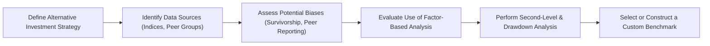

## Introduction and Context

Anyone who has ever tried to compare private equity funds or hedge fund returns can attest that it’s not as straightforward as comparing large-cap equity managers to, say, the S&P 500. “What if I told you…”—and this is something that happened to me when I was helping a friend evaluate her real estate fund—“that the data might not reflect reality because of irregular valuations, self-reported returns, or infrequent pricing?” The confusion, I admit, can be pretty overwhelming. Still, the fundamental principle in performance measurement remains: you want a benchmark that truly captures the investment’s characteristics, so you can judge whether the manager’s performance is good, bad, or indifferent.

In traditional asset classes like publicly traded stocks or bonds, the frequency of pricing and trading volume ensures that constructing benchmarks is relatively straightforward. But once you step into alternative investments—private equity, real estate, hedge funds, infrastructure, timber, farmland, and so on—your neat assumptions about continuous market prices, consistent reporting, and standardized methodologies go out the window. This article focuses on the intricacies of benchmarking these alternative investment strategies, covering issues like survivorship bias, appraisal-based valuations, self-reported data, custom factor-based methodologies, and peer-group reliance. We’ll also consider ways to work around these hurdles and show you some practical tips for your CFA Level III exam, especially in scenario-based questions.

## Illiquid Asset Classes: Private Equity and Real Estate

Private equity—along with real estate—often represents the first big foray into illiquid strategies for multi-asset portfolios. They’re not traded on exchanges, so valuations aren’t updated tick-by-tick. Instead, they might be valued quarterly, semi-annually, or only when appraisals occur. If you think about performance measurement, that’s a serious challenge. You see a net asset value (NAV) that might be based on an appraisal from three months ago, while the underlying property or company has evolved significantly since then.

### Valuation Inconsistencies

Private equity funds employ something known as appraisal-based valuation. Let’s say a real estate fund invests in a commercial complex. The property’s value might be based on an annual or quarterly appraisal rather than daily market transactions. Consequently, the reported returns might “smooth out” actual volatility, understating risk and making performance appear more stable.

In private equity, the comparable valuation multiples come infrequently from transaction data or peer-group analysis. The danger is the mismatch between the real-time strategic decisions and the slowed pace of revaluation, resulting in performance metrics that are “lagging indicators.” You see a reported internal rate of return (IRR), but it’s always playing catch-up to actual market realities.

### Self-Reported and Non-Standardized Data

For private equity or real estate benchmarks, the data often originates from providers who aggregate self-reported performance figures by the managers themselves. And managers, well, they might have different interpretations of fair value or different reporting cutoffs. Data sets from institutions like Preqin or Cambridge Associates try to standardize these inputs, but comparability can remain imperfect.

### Example: Vintage Year and Why It Matters

To compare two private equity funds meaningfully, you want them to start around the same period—this is called the vintage year. If one fund launched in 2015 and another in 2018, they’re investing through different economic conditions, which can skew performance comparison. To illustrate, maybe a 2015 vintage fund began investing in a slightly depressed real estate market, acquiring properties at lower prices. By the time the 2018 vintage fund started deploying capital, prices might have been higher, altering potential returns.

## Hedge Funds and Their Benchmark Dilemmas

As soon as you say “hedge funds,” your typical conversation might be, “Well, there are so many strategies. Which benchmark are we talking about?” And that pretty much captures the main dilemma. Hedge fund strategies range from long/short equity to global macro, event-driven, CTA (commodity trading advisor) approaches, and more. Using a single hedge fund index is often too simplistic.

### Survivorship Bias

Hedge fund datasets notoriously suffer from survivorship bias, meaning poor-performing or defunct funds exit the database and only “survivors” remain. That artificially inflates the average performance. I still remember a conversation with a colleague who exclaimed, “This long/short equity strategy index seems to beat the Russell 3000 every year!” But guess what? Funds that failed or closed shop during that period were removed. So we’re left with a subset of the “successful” funds. You can see how that taints any attempt to benchmark a prospective manager.

### Diverse Strategies Make A Single Benchmark Less Relevant

One hedge fund can be predominantly credit-focused; another can be equity market neutral. Should they be compared against the same index? Probably not. That leaves us with a tricky choice: rely on broad-based “hedge fund” indices (which might be too generic) or build narrower peer groups that still may not capture the nuance of each strategy. This is where factor-based approaches, sometimes called alternative beta, come into play. You identify and decompose the hedge fund’s return drivers to compare them against an appropriate factor index.

### Factor Analysis in Hedge Funds

Think about a global macro fund. It may have exposures to interest rates, currencies, commodities, or equity markets. A factor-based approach tries to replicate what portion of the returns can be explained by standard factors—for example, equity beta (β), credit spreads, commodity price movements, or volatility strategies. Then, you see if the manager is adding value over and above those factors. That factor-based “benchmark” could be a custom basket of instruments or factor indices. It’s not perfect, but it’s often more robust than a standard hedge fund index that lumps everything together.

## Infrastructure, Timber, and Farmland

You might categorize these “real asset” strategies together, but each carries its own unique set of drivers and complexities. Infrastructure—think roads, bridges, airports, utility assets—faces regulatory and political risks. Timber invests in forestry, requiring specialized knowledge of harvesting cycles and environmental factors. Farmland invests in agricultural properties, dependent on crop yields, commodity prices, and weather patterns.

### Long Time Horizons and Irregular Cash Flows

All of these investments share several characteristics: long duration, illiquid structures, and unpredictably timed cash flows. Benchmarking farmland might involve farmland indices that track average farmland values, but these are still typically updated infrequently. Infrastructure indexes might be built from a small population of deals that vary widely in scope. The net result is a less precise estimate of actual market performance.

### Distinct Risk Profiles

Regulatory, environmental, and operational risks also differ widely among these assets. For farmland, rainfall patterns or crop diseases can drastically affect returns in ways a broad-based real asset index might not capture. Meanwhile, timber depends on the cyclical demand for lumber and housing markets. Because these are so narrow in scope, we often see custom-built benchmarks that rely heavily on aggregator or consultant data—again, reliant on self-reporting or appraisals.

## Overcoming Benchmarking Challenges

The question remains: Are we completely stuck or do we have ways to mitigate these issues? Fortunately, there are strategies you can adopt. But let’s not pretend it’s a perfect science. As a portfolio manager or an institutional investor, you have to accept certain limitations. You just want to minimize them or at least be aware of them.

### Peer-Based Indices: Exercising Caution

Many benchmarks in alternative investments are “peer-based,” compiled from the performance of multiple funds. If you’re using peer-based indices, ensure that:
• The data coverage is broad enough to be representative of the strategy or sector.
• The data includes defunct or poorly performing funds to reduce survivorship bias.
• The methodology for weighting is transparent—asset-weighted, equal-weighted, or vintage-year-specific.

Peer groups can provide a sense of the “average manager’s” performance, but you have to confirm that average is real, not inflated by the best performers. Always double-check your provider’s disclaimers.

### Factor-Based Approaches for Hedge Funds

An alternative approach for hedge funds is to build or purchase factor-based indexes that replicate exposures. For example:
• Equity factors (value, momentum, quality, size)
• Credit or bond factors
• Commodity price exposure
• Volatility-based strategies (variance swaps or option overlays)

You use regression techniques to estimate how much of the hedge fund’s performance can be explained by these factors. The residual, or alpha, is presumably the portion due to the manager’s skill. This “alternative beta” approach also helps you spot style drift (see the broader discussion in the Table of Contents on style drift in Section 2.14), because you’ll notice the manager picking up new factor exposures over time.

### Second-Level Analysis

Even if you have a robust index, you’ll want second-level analysis methods, such as:
• Economic exposures: Evaluate how sensitive the fund or asset is to macroeconomic variables—interest rates, inflation, GDP growth.
• Drawdown analysis: Look at how the strategy performed during stressed market periods. Did the reported NAV remain stable because valuations were delayed, or was it genuinely more resilient?
• Vintage year comparisons: For private equity specifically, measure performance against other funds from the same vintage, especially during the same investment window.

## Diagram: Benchmarking Process Overview

Below is a simple flowchart illustrating the overall steps you might take to handle the complexities of benchmarking alternative investments:

## Practical Implementation Example

Imagine you’re evaluating a private equity real estate fund. You have:

• Quarterly appraisals from an external valuation firm.  
• A real estate private equity index from a data provider that aggregates dozens of funds.  
• Factor-based real estate exposures—like a REIT factor or a property price index.  

First, you’d check exactly how your chosen real estate private equity index is constructed: Is it an equal-weighted average of fund returns, or does it incorporate vintage year? Then you’d question whether it includes defunct funds. Finally, you might want to incorporate a factor-based approach to separate the portion of returns driven by, say, overall property market appreciation from the manager’s skill in property selection.

Such a combination approach reduces your reliance on a single flawed benchmark. You compare the fund’s performance to the peer-based index (for a broad sense of the competitive landscape) and a factor-based method (for deeper insight into risk exposures). If both indicate outperformance, you can be more confident in attributing real skill to the manager.

## Additional Considerations

It’s also worthwhile to consider currency exposure, especially if these alternative investments are global in nature (see Section 1.16 in this volume on multi-currency portfolios). Appraisal-based valuations reported in foreign currency might hide exchange rate risk. When building a custom benchmark, you may need currency hedging overlays or multi-currency factor exposures to capture true performance.

Transaction costs are another factor (discussed in Section 1.17) that can significantly affect net returns in alternative assets. Because these assets are less liquid, transaction costs can be steep, so your benchmark should reflect realistic frictional costs if possible.

## Best Practices and Common Pitfalls

Exaggerating the reliability of a single data set is probably mistake number one. You want multiple angles: a carefully selected peer group, a factor-based decomposition, and supplemental risk measures like maximum drawdown. Here are a few more do’s and don’ts:

• Don’t treat peer groups as infallible. They might not perfectly represent your investment’s strategy, especially if your fund is niche or invests in unique geographies or sectors.  
• Do investigate the frequency of rebalancing in your benchmark. If your hedge fund has high turnover, but your benchmark rebalances annually, you’re comparing apples to oranges.  
• Don’t overlook the role of economic environment mismatch. If you compare a fund’s entire track record to an index that includes a different time horizon—and especially if a recession period is missing from your data—conclusions can be misleading.  
• Do incorporate scenario analysis. Identify how your manager or fund would have behaved in major market disruptions, based on available data. This can help you identify window-dressing or reporting lag errors.

## Glossary

Survivorship Bias: The tendency for failed or underperforming managers, funds, or companies to drop out of a dataset, leading to an inflated performance picture of the “survivors” in the index.

Appraisal-Based Valuation: A valuation derived periodically by professional appraisers instead of a continuously traded market price. These valuations can smooth out volatility and may lag changing market conditions.

Vintage Year: In private equity, the year a fund first calls capital or starts investing. Performance comparisons across funds usually focus on the same vintage year to align economic conditions.

## Concluding Exam Tips

For the CFA Level III exam, especially regarding performance evaluation and alternative investments, you may see a scenario that depicts a private equity fund using faulty data sources or a hedge fund manager referencing a broad global hedge fund index that fails to account for strategy-specific exposures. The exam might call on you to:

• Identify the bias in the data (like survivorship bias or appraisal lag damage) and articulate how to correct for it.  
• Suggest an appropriate alternative or a customized benchmark approach.  
• Perform a partial factor-based decomposition to see how a particular hedge fund’s returns align with known risk factors.

Time management tip: Be succinct but thorough in addressing these points. Candidates often lose time over-explaining. Provide crisp definitions and back them up with direct references to the alternative investments in question.

Remember also to reference the concept of style drift (which is elaborated in the manager selection and monitoring sections of Volume 3, especially in 2.14) if relevant. And watch out for the pitfalls of ignoring currency exposures or missing transaction costs. In multi-part item sets, the exam might ask you to recommend the top two best approaches for constructing a benchmark or gauge performance for a given alternative investment scenario. Keep your answers structured: explain “why” it matters and “how” it improves the accuracy of performance measurement.

## References

• Preqin. Data and Analyses on Private Equity, Hedge Funds, and Other Alternatives.  
• Cambridge Associates. Private Equity and Venture Capital Benchmark Statistics.  
• CFA Institute Publications on Alternative Investments and Performance Measurement Topics.  
• Additional recommended reading: Sections 1.14 (Multi-Period Performance), 1.16 (Multi-Currency Portfolios), and 1.17 (Transaction Costs and Performance Measurement) in this volume.

---------------------------

## Test Your Knowledge: Alternative Investment Benchmarking Essentials



### Which of the following statements about private equity performance measurement is most accurate?

- [ ] Private equity valuations are updated on a daily mark-to-market basis.
- [x] Private equity returns are usually based on appraisal methods and can lag real market conditions.
- [ ] Private equity funds generally offer continuous liquidity and daily NAV pricing.
- [ ] Private equity benchmarks are rarely affected by survivorship bias.

> **Explanation:** Private equity returns typically rely on appraisal-based valuations. There is a lag relative to real-time market economic shifts, and survivorship bias can affect peer-based private equity benchmarks.

---

### Which factor creates the largest discrepancy between reported Hedge Fund Index returns and actual investor experiences?

- [ ] Frequent updates of hedge fund portfolio holdings
- [ ] Low correlation to equity markets
- [x] Survivorship bias in hedge fund data
- [ ] The use of factor-based replication techniques

> **Explanation:** Survivorship bias greatly skews hedge fund index data since failing funds drop out of the dataset, artificially boosting average returns.

---

### In evaluating a farmland investment, which feature poses one of the biggest challenges for constructing a reliable benchmark?

- [ ] Public and transparent pricing in the farmland market
- [x] Irregular cash flows due to environmental and seasonal factors
- [ ] High-frequency returns reported daily
- [ ] Uniform risk constraints across farmland portfolios

> **Explanation:** Farmland often has significant irregular cash flows driven by crop cycles, environmental conditions, and changing commodity prices, which makes constructing a typical benchmark challenging.

---

### Which strategy would best capture a hedge fund’s underlying risk exposures?

- [ ] Using the broad S&P 500 Index for all hedge funds
- [ ] Relying solely on a peer-based hedge fund index
- [x] Conducting factor-based decomposition of returns
- [ ] Using an investment bank’s prime brokerage data without adjustments

> **Explanation:** Factor-based decomposition allows performance analysts to identify exposures to equity, credit, commodity, and other systematic risk factors specific to hedge fund strategies.

---

### What is one key advantage of measuring private equity performance against vintage-year-specific benchmarks?

- [x] It accounts for the economic environment in which capital was deployed.
- [ ] It totally eliminates survivorship bias.
- [ ] It ensures daily market pricing consistency.
- [ ] It reduces the need for internal rates of return.

> **Explanation:** Vintage-year-specific benchmarks allow for comparing funds that invested under similar economic conditions, improving comparability of performance metrics.

---

### Why might relying on only peer-based real estate fund benchmarks be problematic?

- [ ] Peer-based indices are usually published daily, which is too frequent.
- [ ] Real estate funds have no correlation to broad economic factors.
- [x] Some funds may not report performance or may report inconsistently, introducing data bias.
- [ ] Real estate indices always overstate performance relative to private equity indices.

> **Explanation:** Peer-based indices often depend on voluntary fund performance reporting. Funds that underperform might be less likely to report, causing skewed data.

---

### In constructing a custom benchmark for infrastructure investments, which step is most critical?

- [ ] Ignoring sub-sector differences in regulatory policy
- [x] Evaluating data sources for completeness and survivorship bias
- [ ] Assuming daily pricing is readily available
- [ ] Excluding the possibility of using factor-based analysis

> **Explanation:** Infrastructure investments often have a limited number of data points and potentially high survivorship bias. Ensuring the data is representative and accounts for funds that left the market is critical.

---

### How does the appraisal-based approach commonly affect reported volatility in private real estate investments?

- [ ] It increases the reported volatility substantially.
- [ ] It reflects the real-time market volatility precisely.
- [x] It smooths returns, hence understating the actual volatility.
- [ ] It inflates returns while keeping volatility unaffected.

> **Explanation:** Appraisal-based valuations are updated infrequently and lead to artificially smooth performance patterns, understating the true variability in property values.

---

### When comparing a multi-strategy hedge fund’s performance, which approach is typically the most comprehensive?

- [ ] Using a single global hedge fund index
- [ ] Comparing returns only during peak market cycles
- [x] Blending a factor-based approach with peer-group comparisons
- [ ] Ignoring the fund’s exposure to credit and commodity markets

> **Explanation:** Multi-strategy funds can have exposure to multiple risk factors. A combination of factor-based analysis and peer comparison helps identify both skill-based alpha and relative positioning.

---

### True or False: Survivorship bias generally leads to an understatement of hedge fund index returns.

- [ ] True
- [x] False

> **Explanation:** Survivorship bias usually leads to an overstatement of average returns because the funds that fail or underperform are dropped from the index, leaving a healthier group of survivors in the dataset.


