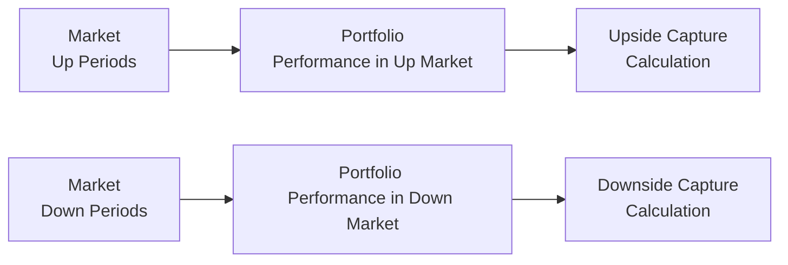

## Understanding the Importance of Risk-Adjusted Returns

When evaluating portfolio performance, it’s often tempting to look only at returns: “Hey, my portfolio made 10% last year—everything’s great!” But seasoned investors (and definitely CFA charterholders and candidates) know we can’t assess performance in a vacuum. If you took massive risk to earn that 10%, you need additional perspective to figure out whether that 10% is decent, mediocre, or extraordinary. That’s where risk-adjusted return measures come in.

We’ll explore three noteworthy metrics in this section:
• Sortino Ratio: Like a Sharpe Ratio’s more selective cousin, it penalizes only downside risk.  
• Appraisal Ratio: How much alpha you’re generating per unit of idiosyncratic risk.  
• Capture Ratios: How effectively you “capture” upside market moves and defend against downside moves.  

At the end of the day, these measures help us figure out whether an investment or manager truly adds value relative to the risk taken. And yep, you can absolutely expect to see them in your performance measurement toolbox (and on the exam).

## The Sortino Ratio

Most folks learn the Sharpe Ratio as soon as they step into the world of performance evaluation. Then they realize: standard deviation punishes both upside and downside volatility equally. But do we really want to chastise a portfolio manager for delivering unexpected positive returns?

### Defining the Sortino Ratio

The Sortino Ratio seeks to address that question. It replaces the standard deviation in the Sharpe formulation with something called “downside deviation.” Instead of measuring all volatility, we focus on the volatility of returns that fall below a particular threshold (often called the minimum acceptable return, or MAR). Formally:

Let:
• Rᵖ = Portfolio return  
• MAR = Minimum acceptable return (some use 0%, others use an expected hurdle rate)  
• DD = Downside deviation of returns relative to MAR  

Then the Sortino Ratio (SR) can be expressed as:
  
( Rᵖ − MAR ) / DD  

Where:
  
Downside Deviation = √( (1/n) × Σ (min(0, Rᵗ − MAR))² )

The summation in the denominator calculates how far below the MAR the returns dip, ignoring returns above MAR. One way to think of it: if the portfolio soared well above your target in a given period, that’s not viewed as “risk” in the Sortino world.

### Why the Sortino Ratio Matters

• Focus on Downside Risk: Many wealth-preservation strategies and protective approaches care more about how much they could lose than how high they could potentially fly.  
• Attracts Certain Managers: Some portfolio managers feel standard deviation isn’t appropriate to penalize them for strong outperformance. They prefer metrics that let them shoot for the stars without being treated as “riskier.”  

### Common Pitfalls

• Threshold Setting: If you pick a MAR that is too high (e.g., 25% annual return), you might artificially inflate your downside deviations. If you pick a MAR that’s too low, you might understate them.  
• Data Frequency: Sortino can be sensitive to how often returns are measured. Monthly data might look different from weekly.  
• Niche Usage: Sortino is sometimes overlooked because many people default to Sharpe. It’s less widely used, so comparisons to peers might be tricky unless the entire industry has aligned on a standard MAR.

### A Quick Personal Story

You know, the first time I stumbled upon a negative Sortino Ratio, I panicked—“What does this even mean?!” Turned out the manager’s MAR was set to 0% at the time, but the returns were consistently negative (not great!). So, the manager’s stats were obviously reflecting some big down moves with no real up offset beyond zero. It was a classic lesson for me: always check your thresholds and interpret the metric in context.

## The Appraisal Ratio

Now, let’s talk about portfolio alpha. If you’re taking unsystematic risk—that is, unique risk not explained by broad market movements—then presumably you want to be compensated for it. The Appraisal Ratio is designed to see if you truly earn enough alpha from that extra risk.

### Defining the Appraisal Ratio

Sometimes referred to as Jensen’s Alpha Ratio or the “risk-adjusted alpha relative to specific risk,” the Appraisal Ratio tells us how much alpha a manager generates (in percentage terms) per unit of idiosyncratic volatility.  

Typically, alpha (α) is measured relative to a market or factor model. Then we look at the unexplained portion of risk, or the residual risk (σ(ε)), which is the standard deviation of the error term in a regression model. Formally:

Appraisal Ratio = ( α ) / σ(ε)

Where:
• α = Jensen’s alpha (the difference between a portfolio’s expected return and the return predicted by the relevant risk model)  
• σ(ε) = Standard deviation of residual returns (a.k.a. the part of returns you can't explain via systematic market factors)  

### Why It Matters

• Spot Manager Skill: If the alpha is consistently positive and big enough to justify the unsystematic risk, you’ve found a strong manager—at least theoretically.  
• Works for Concentrated Portfolios: Some managers intentionally hold fewer names to focus on high-conviction picks. That often increases idiosyncratic risk, so a strong Appraisal Ratio shows they can manage that unique risk well.  

### Caveats and Challenges

• Dependency on the Model: If your factor model or benchmark is not well-specified, alpha might be over- or understated.  
• Residual Risk Volatility: If you track manager returns over short periods, the residual risk can fluctuate, leading to instability in the ratio.  
• Comparability Issues: If two managers use different styles, the same factor model might not be the “best fit” for both.  

## Upside and Downside Capture Ratios

Sometimes, you might want an even more straightforward look. For instance: “When the market goes up, how much of that positive movement does the portfolio capture?” That’s your upside capture. “When the market goes down, how badly am I getting hit?” That’s your downside capture. Higher upside capture with lower downside capture is generally appealing—it means you capitalize (well) on the good times and preserve capital in the bad times.

### Defining Capture Ratios

• Upside Capture Ratio (UCR):  
  ( Portfolio Returns during Up Markets ) ÷ ( Market Returns during Up Markets ) × 100%

• Downside Capture Ratio (DCR):  
  ( Portfolio Returns during Down Markets ) ÷ ( Market Returns during Down Markets ) × 100%

A ratio over 100% on the upside means you’re outperforming the benchmark on the upside. Over 100% on the downside means you’re losing more than the market when things go south, so watch out.

### A Simple Mermaid Diagram

Below is a conceptual illustration of how the broader market environment influences your portfolio’s returns, impacting upside and downside capture. Green arrows indicate returns in up markets; red arrows indicate returns in down markets.

### Why It Matters

• Quick Snapshot: Capture ratios are easy to interpret. If your portfolio’s upside capture ratio is 120%, you typically outrun the market on the way up. If your downside capture ratio is 80%, you typically suffer less than the market on the way down.  
• Complements Other Ratios: While the Sortino or Appraisal Ratios may be more mathematically involved, capture ratios can give a fast sense of how your portfolio behaves in bull vs. bear conditions.  
• Style Analysis: A manager with a defensive style might have a high downside capture ratio only if they are not properly hedged during down markets. Conversely, a growth-oriented manager could have a super-high upside capture ratio but might also get hammered in downturns.

### Practical Limitations

• Doesn’t Account for Risk-Adjusted Context: If markets whipsaw frequently, capture ratios might be incomplete.  
• Time-Period Sensitivity: Could be very different for a 1-year span vs. a 5-year span, so always look at time frames carefully.  
• Doesn’t Distinguish Between Magnitude of Gains or Losses: If you’re up in an up market but the absolute difference is small, the ratio might still look impressive. Put everything in perspective.

## When to Use Each Measure

• Sortino Ratio: Perfect if you or your clients prioritize the avoidance of downside losses. Many wealth-preserving funds highlight Sortino over Sharpe.  
• Appraisal Ratio: Great if your portfolio strategy is about stock picking or any approach heavy on unsystematic risk. You want to see if your idiosyncratic bets are paying off.  
• Capture Ratios: Superb for a quick gauge. If you want a straightforward conversation with a client—“Here’s how we perform when markets do X vs. Y”—capture ratios can be super intuitive.

## Putting It All Together: A Mini Case Study

Imagine a private wealth manager, Carla, who invests in a concentrated set of mid-sized technology stocks. She’s all about picking winners. Carla’s returns end up being more volatile than the overall NASDAQ index. She’s also sometimes quite sensitive to negative announcements in the tech sector.

• Sortino Ratio: If Carla’s top priority is preventing large drawdowns, she might track the Sortino Ratio closely, picking a MAR (like 5%) to reflect a modest expected return.  
• Appraisal Ratio: Because Carla’s entire strategy is about picking tech winners, the Appraisal Ratio will be really important. It will tell us how smart her stock selection is, net of overall sector movements.  
• Capture Ratios: Suppose Carla’s Upside Capture Ratio is 130%—impressive! She capitalizes on the tech sector’s bull runs. But if her Downside Capture is also 120%, that means she often gets slammed during market downturns. Carla might want or need to mitigate some of that downside risk if her clients can’t stomach that level of volatility.

## Best Practices and Common Pitfalls

• Consistent Benchmark or Factor Model: All these measures rely on some type of benchmark or factor model. Make sure you’re consistent and that your model is well-specified.  
• Inconsistent Time Periods: If you shuffle time frames, guess what? You’ll get different results. Always confirm you’re comparing apples to apples.  
• Overreliance on a Single Metric: Each measure has strengths and weaknesses. Combine different angles—e.g., Sortino + capture ratios—to get a robust view.  
• Not Understanding the Data: Is your data monthly, weekly, or daily? Does it adjust for taxes, fees, or transaction costs? A measure can be misleading if the underlying data is incomplete.  

## Exam Tips and Final Thoughts

In a CFA exam context, especially at Level III, you can expect scenario-based questions that test your ability to distinguish which metric is most appropriate under certain conditions. You might see a manager who brags about a sky-high Sharpe Ratio, but once you adjust for downside risk specifically, the Sortino Ratio might reveal a different story. Or you might see an example where high alpha is overshadowed by an even higher level of idiosyncratic volatility, leading to a lackluster Appraisal Ratio.

Get comfortable with:
• The formulas  
• The assumptions behind them  
• The “why and how” of usage  

And definitely be ready to switch from one measure to another in a hypothetical conversation with a client or in an essay scenario. Practicing numerical examples will help you avoid silly mistakes. Good luck, and remember: it’s not just about how much you make; it’s how you make it.

## References

• Sortino, Frank and Van der Meer, Robert: “Downside Risk: Capturing What’s at Stake.”  
• CFA Institute’s “Performance Evaluation” readings introducing risk-adjusted metrics.  
• Various real-world portfolio management resources analyzing alpha, unsystematic risk, and factor-based performance methods.

--------------------------------------------------------------------------------

## Practice Exam Questions: Risk-Adjusted Return Measures and Their Application



### Which of the following best describes the Sortino Ratio?

- [ ] A ratio measuring alpha relative to market risk factors.
- [x] A ratio modifying the Sharpe Ratio by focusing on downside volatility instead of total volatility.
- [ ] A ratio showing the proportion of losses versus gains over a specified period.
- [ ] A ratio comparing idiosyncratic risk to market risk.

> **Explanation:** The Sortino Ratio uses downside deviation in place of standard deviation to more accurately capture “bad” volatility. It is indeed a variant of the Sharpe Ratio but penalizes only downside moves.

### An investor wants to measure how effectively a manager generates alpha specifically in the part of the portfolio that cannot be attributed to broad market movements. Which ratio is most appropriate?

- [ ] Sortino Ratio
- [ ] Sharpe Ratio
- [x] Appraisal Ratio
- [ ] Information Ratio

> **Explanation:** The Appraisal Ratio indicates how much alpha (manager skill) is generated per unit of unsystematic (or idiosyncratic) risk, making it the best tool for this scenario.

### If the upside capture ratio of a portfolio is 130% and the downside capture ratio is 90%, what does that imply?

- [x] The portfolio gains 30% more than the market in up markets but captures 90% of the market’s losses in downturns.
- [ ] The portfolio gains 90% more than the market in up markets and loses 130% in down markets.
- [ ] The portfolio matches the market on the upside, but underperforms on the downside.
- [ ] The portfolio is more volatile than the market in both up and down markets.

> **Explanation:** An upside capture ratio over 100% implies the portfolio outperforms the market in positive periods, while a downside capture below 100% implies it performs better (loses less) than the market in negative periods.

### Which statement is true about the minimum acceptable return (MAR) in the context of the Sortino Ratio?

- [ ] A higher MAR always yields a higher Sortino Ratio.
- [ ] The MAR must always be zero.
- [ ] Using a MAR significantly higher than the risk-free rate typically decreases the denominator of the ratio.
- [x] The choice of MAR can significantly affect the ratio and should align with the investor’s minimum required return.

> **Explanation:** The MAR directly influences how much downside deviation is measured. If the MAR is set very high, more of the portfolio returns will be considered “below threshold,” increasing the downside deviation and potentially lowering the ratio.

### A manager boasts a positive alpha but a low Appraisal Ratio. Which explanation is consistent with this observation?

- [ ] The manager has no unsystematic risk in their portfolio.
- [ ] The manager’s factor model has minimal explanatory power.
- [x] The manager’s unsystematic risk is high relative to the alpha they generate.
- [ ] The manager uses a risk-free benchmark.

> **Explanation:** A low Appraisal Ratio suggests that while there may be positive alpha, it is not sufficient to compensate for the high level of idiosyncratic (unsystematic) risk.

### Which of the following is a potential pitfall when interpreting upside/downside capture ratios?

- [x] They do not account for risk-adjusted returns.
- [ ] They rely on the standard deviation of entire returns.
- [ ] They are rarely used in equity portfolios.
- [ ] They are inversely related to the Sortino Ratio.

> **Explanation:** Capture ratios show how the portfolio behaves in up vs. down markets but do not incorporate a direct risk-adjusted perspective. They are more about directional performance rather than risk-adjusted metrics.

### In a scenario where a hedge fund is only concerned with minimizing losses below a specific target return, which measure might it emphasize?

- [ ] Beta
- [ ] Sharpe Ratio
- [x] Sortino Ratio
- [ ] Treynor Ratio

> **Explanation:** The Sortino Ratio focuses on downside risk only—exactly in line with a strategy solely worried about avoiding returns below a specific threshold.

### When the market experiences significant bear periods, a manager’s strategy fails to outperform. How would this most likely influence downside capture and the overall Sortino Ratio?

- [ ] The downside capture ratio would be below 100%, and the Sortino ratio would increase.
- [ ] The downside capture ratio would be zero, and the Sortino ratio would be indefinite.
- [x] The downside capture ratio would likely rise above 100%, and the Sortino ratio would decrease.
- [ ] The downside capture ratio is unaffected by bear periods.

> **Explanation:** Underperformance in down markets would manifest as a higher downside capture ratio (losing more than the benchmark), which in turn would inflate downside deviation and reduce the Sortino Ratio.

### Which of the following helps illustrate the total alpha a manager generates versus how much can be explained by market factors?

- [ ] Treynor Ratio
- [ ] Sortino Ratio
- [x] Appraisal Ratio
- [ ] Downside Capture Ratio

> **Explanation:** The Appraisal Ratio, by design, evaluates alpha in the context of unsystematic risk, effectively shedding light on how much of the manager’s performance is due to skill (rather than broad market movements).

### A manager has an Upside Capture Ratio of 115% and a Downside Capture Ratio of 125%. Which of the following statements is true?

- [x] The portfolio outperforms the benchmark in up periods but underperforms in down periods.
- [ ] The portfolio outperforms the benchmark in both up and down periods.
- [ ] The portfolio underperforms the benchmark in both up and down periods.
- [ ] The portfolio aligns perfectly with the benchmark in both up and down periods.

> **Explanation:** An Upside Capture percentage above 100% indicates outperformance in up markets, but a Downside Capture above 100% indicates the portfolio loses more than the market in down markets.


