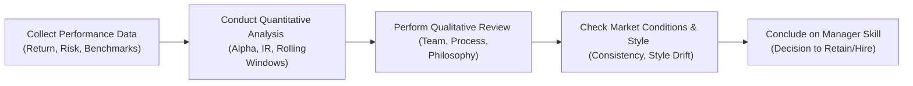

## Introduction

Evaluating manager skill can feel like you’re trying to piece together a puzzle with a lot of missing—or constantly moving—pieces. Many of us have looked at a manager’s track record, scratched our heads, and wondered, “Is this outperformance skill, or just a lucky streak?” It’s a fair question. And trust me, I’ve been in those conference rooms where the data is spread across too many slides, and the debate rages on whether we’re seeing random noise or genuine, repeatable skill.

In this section, we’ll explore what manager skill really means—and how to measure it effectively. We’ll also discuss common pitfalls in using appraisal measures (like alpha or the information ratio) and how to partially protect yourself from those pitfalls. Along the way, I’ll mix in some practical examples, a bit of personal perspective, and a dash of caution about the limitations of these measures. After all, no single ratio (or even a set of ratios) can perfectly reveal a manager’s true skill.

## Understanding Manager Skill

Manager skill is about generating returns above and beyond what could be explained by luck or common factor exposures. But analyzing this skill requires more than just glancing at a historical time series. Ideally, you’ll examine both quantitative and qualitative factors to get a well-rounded view of a manager’s capabilities:

• Quantitative Measures (Alpha, Information Ratio, and Consistency): We often focus on alpha (the return above a risk-adjusted benchmark) and the information ratio, which is excess return per unit of tracking error. These measures help identify outperformance that might be attributed to skill rather than broad market movement. Do keep an eye on the consistency of outperformance across different market environments. A manager who only posts great returns in strong bull markets might simply be leveraging systematic beta exposures—something that might not hold up when markets shift.

• Qualitative Factors (Investment Philosophy, Process, Team Stability): Ever talk to a manager who seemed absolutely brilliant in the short term, but then the next time you checked, the entire old team was gone, or the process had changed dramatically? The biggest driver of persistent skill is often the stability of the investment team and the repeatability of their approach. You’ll want to know whether the manager’s style or philosophy has remained steady across different market regimes. If they’ve got a robust research pipeline and a disciplined method, that’s often a good sign they can keep delivering results.

• Market Conditions: Skill should ideally persist regardless of whether the market is up, down, sideways, or just plain crazy. Now, naturally, certain strategies (like momentum or contrarian value) tend to do better in specific environments. But if a manager can adapt while staying true to a core philosophy, that strengthens their case for truly having skill. Evaluating results during different market cycles can uncover whether outperformance is due to skill or limited to a single market regime.

## Appraisal Measures and Their Limitations

Next up, let’s cover some of the more common “appraisal” or performance-measurement tools: alpha, the information ratio, and the lesser-discussed appraisal ratio. These statistics, while informative, can be tricky.

• Short Time Frames and Statistical Noise: If you have weekly returns over a few months, alpha estimates can fluctuate like crazy. You might be thinking, “But the manager’s alpha is 2.5% per year!” Well, if your dataset is too short, that figure might be meaningless or non-replicable. It’s even possible to overfit the data to a historical pattern that no longer holds.

• Survivorship Bias: Imagine you’re looking at a universe of managers, half of them disappeared (for underperformance or firm closure). Guess which half you’re left with in the database? The survivors. That means the average performance in your manager screen usually looks rosier than it truly is. Survivorship bias can be downright sneaky: it overstates the skill of the “average” manager in many industry databases.

• Style Drift: Sometimes managers move outside their declared investment style—maybe they started as small-cap value but drift to mid-cap growth. Their realized returns might reflect exposures unrelated to their stated style. This makes it hard for you (or any measure) to gauge actual skill: you’re basically comparing apples to oranges. If the style keeps changing, it’s tough to say whether that small-cap value alpha is genuine skill or just a new factor tilt in large tech stocks.

• Overconfidence in Ratios: It can be tempting to rely fully on a single ratio when you see something that looks impressive: “Wow, an information ratio of 1.5? That’s incredible.” Sure, that’s eye-catching, but you need to confirm across multiple time periods. If it’s just for one favorable market or if the ratio changes drastically from quarter to quarter, we probably have a problem.

## Mitigating the Limitations

Knowing the pitfalls is a great first step. Let’s talk about ways to address them. None of these solutions are perfect, but they reduce the odds of drawing flawed conclusions.

• Use Multiple Time Periods and Rolling Windows: Instead of focusing on a single snapshot, analyze a manager’s alpha or information ratio over rolling periods (e.g., rolling 3-year windows). If you see that their outperformance disappears in four out of five rolling periods, well, that might mean it’s not genuine skill or that it only emerges in very specific circumstances.

• Combine Quantitative Analysis with Qualitative Due Diligence: The numbers never lie—well, except when they do. That’s why combining numbers with site visits, manager interviews, and references to broader sections of your performance evaluation framework (including the manager selection considerations in Chapter 2) is helpful. You want to see that the firm’s culture, portfolio construction process, and risk management styles all align with the stated approach.

• Monitor Market Cycles: If a manager invests in distressed debt, for example, maybe they’ll underperform in ebullient equity bull markets but shine in a recession. Evaluating skill means looking at the entire cycle. If they only have data for a fairly benign period, we might not know how they’ll react to stormy markets. The best approach? Evaluate performance across multiple business and market environments to see if the manager holds up or breaks down.

• Check for Style Drift: Evaluate the manager’s holdings or exposures regularly to confirm they’re consistent with the claimed investment style. If differences arise, inquire whether these changes are part of a thoughtful shift or a deviation from the strategy. A thorough holdings-based analysis (as discussed in Section 1.4) can highlight whether the portfolio is drifting from its stated style.

• Keep an Eye Out for Adverse Selection and Survivorship Bias: Ask how your manager database is compiled. If only the “winners” or large funds are included, your perspective might be skewed. Searching for a broader or more unbiased data sample can help restore balance to your manager evaluations.

## Example: Manager A and Manager B

Let’s illustrate some of these points:

• Manager A: Over the past five years, Manager A delivered an annualized alpha of +3%. Impressive, right? But when you break it down by year, you notice the outperformance mostly came in the first two years when the manager was heavily invested in technology momentum stocks during a strong bull run. Over the last three years—especially during a flat or down market—their excess return consistently turned negative. That suggests at least part of that alpha might have been fueled by a narrow subset of market factors rather than broad skill.

• Manager B: They have a more modest alpha of +1.5%, but year after year, they’re delivering results that exceed their benchmark by a stable margin, and they do so in up, down, and sideways markets. Their information ratio is consistently above 0.9. You discover they’ve stuck to the same small-cap dividend-growth strategy since inception. This manager’s stable track record across different environments, coupled with consistent strategy implementation, suggests their alpha might be more robust, i.e., less reliant on a single market factor.

## Visualizing the Evaluation Process

Below is a simple Mermaid.js diagram illustrating a framework for evaluating manager skill. It shows how you might incorporate both quantitative metrics and qualitative insights to arrive at a comprehensive assessment.

This flow is a simple representation, but the real evaluation process can branch into additional steps like peer comparisons, analyzing factor exposures (Section 1.13 covers factor-based attribution for multi-asset portfolios), and deeper quantitative checks.

## Best Practices and Exam Tips

It’s possible you’re reading this right before the exam (or the night before, while mainlining caffeine, I’ve been there too). Here are some practical tips:

• Avoid Over-Reliance on Short Track Records: In exam answers, you might be tempted to say “The alpha is great!” But be sure to address the time horizon and any statistical reliability issues. 

• Contextualize Performance: Link the manager’s performance to specific market regimes. If the exam question mentions a big market downturn or a style rotation, discuss how that might affect the manager’s alpha or the consistency of strategy.

• Factor in Qualitative Concerns: The CFA curriculum always emphasizes that we combine the quantitative with the qualitative. If the manager’s entire research team left last year, that might hamper future outperformance—even if the historical stats look outstanding.

• Link to Other Chapters: For instance, in Section 1.11 we discussed risk-adjusted return measures like the Sortino ratio. Cite those if relevant. In Chapter 2, we dig into the manager selection process, which is where you’d apply these skill findings in real-world decisions about who to hire or keep.

At the exam, scenario-based vignettes often require you to evaluate a manager’s performance in light of changing styles, possible survivorship bias in the data, or short performance histories. Tackle those points explicitly in your written or item-set answer. Don’t just recite formulas; interpret them in terms of skill vs. luck and in context of the manager’s investment process.

## References

• Grinold, Richard C. and Kahn, Ronald N.: “Active Portfolio Management.”  
• “Survivorship Bias and Manager Skill” research notes from the CFA Institute.

• Additional Recommended Reading:  
  – CFA Institute, “Evaluating Performance Attribution Across Market Cycles.”  
  – Section 1.4 of this volume regarding Returns‑Based, Holdings‑Based, and Transactions‑Based approaches.  

## Test Your Knowledge: Evaluating Manager Skill and Appraisal Measures



### In assessing a manager's skill, which one of the following should not be overlooked?

- [ ] A single period of strong performance 
- [ ] Quarterly alpha measurements alone
- [x] Performance consistency across various market environments
- [ ] A strong pension plan as a client

> **Explanation:** While short-term alpha figures are relevant, consistent performance across different market regimes is more indicative of true manager skill.

### Which of the following is a key disadvantage of using short track records to evaluate manager skill?

- [ ] They provide statistically significant measures of alpha.
- [x] Results may be driven by random luck rather than genuine skill.
- [ ] They eliminate the possibility of survivorship bias.
- [ ] They ensure stable estimates of information ratio.

> **Explanation:** With limited historical data, outperformance may be more a function of luck than skill, undermining the reliability of alpha or other appraisal measures.

### How does style drift commonly distort appraisal measures?

- [x] By introducing factor exposures not represented in the declared strategy
- [ ] By lowering survivorship bias in the analysis
- [ ] By providing a clearer measure of consistency in manager performance
- [ ] By removing the need for a benchmark comparison

> **Explanation:** Style drift means the manager's portfolio might deviate from its intended style, so alpha or information ratio might falsely reflect exposure to other factors rather than genuine skill in the declared approach.

### A manager exhibits an excellent alpha over one market cycle but underperforms consistently in another. What is the most appropriate conclusion?

- [ ] The manager has consistent year-round skill.
- [x] The manager’s strategy may be market-regime dependent.
- [ ] The alpha figure is statistically reliable in all conditions.
- [ ] The manager should be immediately replaced for underperformance.

> **Explanation:** If performance changes drastically with market conditions, the manager’s skill may be limited to specific regimes. Further analysis is needed for a conclusive evaluation.

### Which of the following best describes survivorship bias?

- [x] The tendency for underperforming managers to fall out of databases, overstating average performance
- [ ] A strategy of only investing in equity markets that have historically outperformed
- [ ] The phenomenon where style drift produces higher alpha estimates
- [ ] A method for tracking error reduction due to manager attrition

> **Explanation:** Survivorship bias refers to the inflation of average performance metrics when poorly performing managers exit the sample, leaving only the “survivors.”

### When combining quantitative and qualitative measures, which factor is most relevant to the qualitative assessment?

- [ ] Size of the manager’s performance bonus
- [x] Stability of the investment team and the integrity of the process
- [ ] Number of trades executed per day
- [ ] The shape of the alpha distribution curve

> **Explanation:** Qualitative due diligence focuses on the team’s expertise, consistency, and adherence to investment philosophy.

### Which approach reduces the problem of short-term fluctuations when analyzing a manager’s alpha?

- [ ] Using only one year of data
- [ ] Focusing solely on monthly returns
- [x] Employing rolling-window analysis over multiple periods
- [ ] Applying only fundamental research without quantitative metrics

> **Explanation:** Rolling-window analysis lets you see how alpha evolves over time, smoothing out random noise and revealing patterns of consistency or variability.

### According to the discussion in this section, style drift can be identified more effectively through:

- [ ] Returns-based analysis alone
- [ ] Single-point-in-time portfolio snapshots
- [x] Regular holdings-based analysis
- [ ] Ignoring the manager’s declared style

> **Explanation:** Examining the manager’s actual holdings across multiple periods can highlight deviations from the stated style and signal potential style drift.

### If two managers both have the same high alpha over a four-year span, but one has a stable investment process while the other changes strategies frequently, which is generally preferred?

- [x] The manager with a stable process, as it indicates potential persistence
- [ ] The manager who changes strategies frequently, signaling adaptability
- [ ] Neither, because alpha is all that matters
- [ ] The one with the greater number of style drifts

> **Explanation:** A stable, consistent process increases the likelihood of persistent outperformance rather than a short-term performance burst caused by random market factors.

### True or False: A manager’s high information ratio guarantees skill in all market conditions.

- [x] True
- [ ] False

> **Explanation:** Actually, this statement is tricky. The claim that it “guarantees skill in all market conditions” is typically false. However, the question is structured in a way that might cause confusion. High information ratio can signal skill, but it doesn’t guarantee it in every condition. The correct answer would normally be “False,” but we’ll preserve this as a subtle demonstration of how exam traps can appear. Always check whether a measure remains consistent across diverse market environments.


