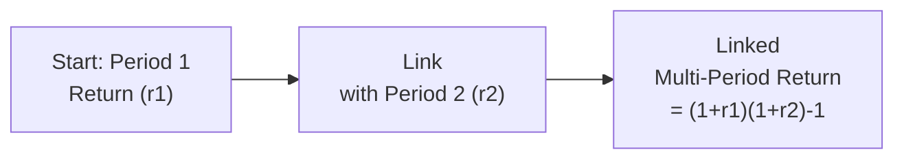

## Introduction

Well, I’ll never forget the first time I had a client who was absolutely overjoyed at their short-term portfolio returns—only to become completely puzzled when those eye-popping results weren’t as amazing on a multi-year basis. And, you know, I had to explain that the multi-period evaluation isn’t as simple as adding up monthly numbers. Sometimes big deposits or withdrawals come into the picture at exactly the “wrong” times, complicating how we measure overall returns. 

So, yeah, multi-period performance measurement is the real deal. This section dives into time-weighted returns, money-weighted returns, the effect of interim cash flows, and how to piece things together with or without manager control over all those pesky flows. We’ll talk about specialized linking formulas for multi-period attribution and present a few conceptual frameworks (including geometric linking and Modified Dietz). Let’s get started.

## Linking Returns Over Multiple Periods

Most of us know that single-period returns can be really helpful but rarely complete, especially when your performance horizon straddles multiple months, quarters, or even years. The big question is: how do we accurately combine returns from these different intervals?

### Time-Weighted Return

In many cases, we want to see how well a manager did with the portion of the portfolio they actually managed—regardless of external cash flows. That’s where a time-weighted return (TWR) comes in. It effectively treats each sub-period as if it had its own “mini portfolio.” Then we link the sub-period returns geometrically:

(1 + r₁) × (1 + r₂) × … × (1 + rₙ) − 1

• r₁, r₂, rₙ = periodic returns (e.g., monthly returns).

Time-weighted returns are awesome for manager evaluation when the manager doesn’t decide when clients deposit or withdraw funds. If that’s you, you’ve got less control over the external flows, so TWR is your best friend—because it largely erases the effect of those flows and focuses on the manager’s skill.

### Money-Weighted Return

Now, if the manager does have control or at least significant influence (maybe they requested additional capital to exploit an opportunity or recommended partial redemptions), you might be more interested in a money-weighted return (MWR). In short, MWR (also known as the internal rate of return, IRR) heavily weighs the periods when the capital invested is bigger. 

In MWR, a large injection of capital that experiences a negative return can heavily drag down the overall figure, and vice versa. If you’re trying to gauge how investment decisions line up with performance, or how the actual results look from the investor’s perspective (where size and timing of flows matter big time), MWR is a strong tool.

## Impact of Interim Cash Flows

One of the biggest “gotchas” in performance measurement is dealing with the big lumps of money that come in or out at random. A new investor might put in $10 million right before a dip, or your largest client might withdraw half their assets before a huge rally. That’s where your performance measurement approach has to be robust.

A few methods exist to approximate daily valuations if you don’t literally value your portfolio daily:

• Dietz Method: This method divides net gains (net of external flows) by the average capital invested over the period. However, it assumes that all cash flows happen mid-period (or some standard point), which might introduce small biases if flows are large or irregular.  
• Modified Dietz Method: Improves on the standard Dietz approach by weighting each cash flow according to when it occurred. The earlier the cash flow, the longer it is “invested” in the portfolio.

Let’s see a quick representation of how a basic Dietz or Modified Dietz formula might look:

(
  Ending Value − Beginning Value − Sum of Flows 
)  
———————————————————————————————————————————  
  Beginning Value + ∑(Flow × Weight)

Where weight is a fraction of the period that each flow was in the portfolio.

## Multi-Period Attribution

If performance attribution on a single period can be tricky, multi-period attribution is like leveling up in a video game. Summing up single-period attributions doesn’t just neatly line up to the total multi-period return. Why not? Compounding and overlaps matter. 

Say your portfolio manager overweights Technology in Period 1 and it outperforms by 2%. But then in Period 2, that overweight might remain—but the market environment has totally changed. So, you can’t just do a straight sum of the period-by-period contributions.

### Linking Single-Period Attribution

Multi-period attribution linking exists to address exactly this. One approach is to geometrically link attribution effects across multiple periods, so you end up with a result that does line up with your total multi-period performance. The geometric linking formula for returns:

R_total = (1 + R₁) × (1 + R₂) × … × (1 + Rₙ) − 1

Hence, each component of performance—asset allocation, security selection, interaction effects—can also be “linked” using variants of geometric or arithmetic linking. Geometric is often favored because returns themselves compound.

To get a bird’s eye view, here’s a simple diagram:

The same approach can extend to multiple periods. For attribution, factors or sources of return might be similarly chained.

## Geometric Linking vs. Arithmetic Linking

Just a quick reminder: arithmetic linking basically sums up average results. Geometric linking multiplies (1 + each sub-period return), then subtracts 1 to find a total. In performance measurement, geometric linking is typically the standard because, hey, that’s how money grows.

But there are complications. Some managers prefer an arithmetic approach for analyzing sub-period data because it can be easier to interpret. For multi-period performance, though, geometric reigns supreme since it captures the real compound effect we see in real life.

## Cash Flow Effect

I once had a friend (a fellow analyst) who overlooked the “cash flow effect” in a performance calculation. They did a time-weighted return for the entire year, ignoring a big deposit that came in during the last quarter. The result looked suspiciously high, because the new contributions arrived right before a small rally that inflated the final balance. The “cash flow effect” is that difference between a “pure skill” measure (like TWR) and an actual investor’s perspective measure (like MWR). Always keep your eye on that, because clients sure will be looking closely at the bottom line reflecting the actual dollars they made or lost.

## Example: Putting It All Together

Let’s do a small sample scenario—simplified, but it works:

• The portfolio starts at $1,000,000 on January 1.  
• By March 31, it’s worth $1,050,000. No external cash flows occurred in Q1.  
• On April 1, an investor contributes $500,000, bringing the total market value to $1,550,000 on that same day.  
• Between April 1 and June 30, the portfolio returns 2%.  

Time-weighted return for Q1 is straightforward:  
r₁ = ($1,050,000 − $1,000,000) / $1,000,000 = 5.0%  

For Q2, r₂ = 2.0%.  

So if we link those two sub-period returns geometrically for the half-year TWR:  
TWR_HY = (1 + 0.05) × (1 + 0.02) − 1 = 7.1%  

But what about money-weighted return? We see:

• The portfolio was $1,000,000 at the beginning.  
• At Q1 end, it’s $1,050,000 but then we add $500,000 on April 1.  
• By June 30, the final value is $1,581,000 ($1,550,000 plus 2% growth over Q2: 1,550,000 × 1.02).

MWR is found by setting up an IRR equation reflecting the cash flow timing:  
−$1,000,000 (at t=0)  
+ $500,000 (April 1, roughly 3 months in)  
FV = $1,581,000 at t=6 months  

We can approximate or use a financial calculator to solve for IRR. Because the investment is larger during Q2 (the $1.55M chunk), the money-weighted return for the half-year might be closer to around 6.8% or 6.9%, a bit lower than the 7.1% time-weighted figure, reflecting that the largest portion of money was only invested for Q2’s smaller gain. That difference is the “cash flow effect.”

## Multi-Period Attribution & Compounding Effects

When we measure how each decision (asset allocation, security selection, currency hedging, etc.) contributed over multiple periods, you’ll see compounding at work. You can’t just add up Period 1’s “contribution from security selection” with Period 2’s. Instead, you typically do a “linked” approach that expands each factor through geometry:

Contribution = (1 + c₁) × (1 + c₂) − 1

Where c₁, c₂ are the single-period contributions from the same factor. Then for multiple factors, you break them out again in a multiplicative format that can get a bit complex. But the principle is the same: you preserve the compound effect.

## Best Practices and Common Pitfalls

• Always confirm if the manager influences cash flows. If yes, lean more on MWR. If no, TWR is usually standard.  
• Watch out for large interim cash flows. Methods like Modified Dietz can help approximate daily pricing.  
• Summing up single-period attributions won’t necessarily match total multi-period results; use geometric linking or specialized multi-period attribution formulas.  
• Double-check that your chosen method adheres to GIPS Standards if you’re reporting performance under those guidelines. GIPS emphasizes time-weighted returns for manager skill.  
• Don’t assume that an investor’s real ROI is the same as TWR. They can differ significantly. That’s a huge deal for conversations with actual clients.  
• Watch out for “average capital” assumptions (in Dietz) that might not be appropriate if very large flows occur mid-month.

## Real-World Applications

In real practice, multi-period performance calculations drive many institutional performance reports and manager evaluations. For regulators and fiduciaries (especially under IFRS or other frameworks), transparency around how returns are derived is crucial. Many asset owners (e.g., pension funds) also require that managers present results in a time-weighted manner, but they may still want to see money-weighted metrics if the manager can call or return capital at will (like in private equity).

## A Short Case Study

Imagine a manager runs a global equity strategy for a foundation. The foundation invests $5M at the start of the year. Partway through the year, the foundation doubles its investment to $10M during a market dip. By year-end, the portfolio stands at $11.2M. A TWR might look fantastic—maybe 15% for the year—but the manager might say, “See, I timed that additional investment while the market was down!” And a money-weighted approach could indeed show a better reflection of that timing skill or luck. In this scenario, we’d likely run both TWR and MWR to see how the manager’s decisions about consecutive flows impacted final performance.

## Exam Tips

• Remember that TWR and MWR can produce dissimilar results. Understand which scenario calls for which measure.  
• For actively tested topics, be prepared to do quick calculations of TWR using linking (e.g., monthly returns).  
• If you see a question referencing multiple external cash flows, watch out for possible references to Modified Dietz or IRR.  
• Don’t forget to mention geometric linking when discussing multi-period attribution—CFA Institute loves to see if you really grasp compounding.  
• Time-management strategy: if the exam question provides multiple sub-periods with returns, carefully read whether they want total TWR or MWR.  

## References

• Spaulding, David: “The Handbook of Investment Performance: Multi-Period Calculations.”  
• CIPM Curriculum Modules on Multi-Period Performance Measurement and Attribution Linking.  
• CFA Institute GIPS Standards: Guidance on Calculation Methodologies.  

--------------------------------------------------------------------------------

## Test Your Knowledge: Multi-Period Performance Measurement Quiz



### 1. Which method typically eliminates the impact of cash flow timing and size when evaluating a manager’s investment skill?

- [ ] Money-weighted return (MWR)
- [x] Time-weighted return (TWR)
- [ ] Modified Dietz method
- [ ] Arithmetic linking

> **Explanation:** TWR is designed to remove the effects of external cash flows, focusing purely on the manager’s ability to generate returns during each sub-period.

### 2. A portfolio starts at $2 million, and on day 60 of a 120-day period, $1 million is deposited. By the end of day 120, the portfolio is worth $3.5 million. Which method weights the cash flow by the portion of the period it was invested?

- [ ] Simple Dietz method
- [x] Modified Dietz method
- [ ] Money-weighted return
- [ ] Arithmetic attribution

> **Explanation:** The Modified Dietz method assigns each external flow a weight based on how long it’s in the portfolio.

### 3. When linking single-period attributions over multiple periods for a final total, which approach is commonly used to account for compounding?

- [ ] Arithmetic linking
- [x] Geometric linking
- [ ] Harmonic linking
- [ ] Linear interpolation

> **Explanation:** Geometric linking is standard for multi-period returns to capture compounding effects.

### 4. In a multi-period context, how is the “cash flow effect” typically captured?

- [ ] Through simple sum of sub-period returns
- [x] Money-weighted return or IRR
- [ ] Arithmetic linking of TWR
- [ ] By ignoring external flows entirely

> **Explanation:** Money-weighted returns consider the size and timing of external flows, revealing the “cash flow effect.”

### 5. A manager has full discretion over when to call or distribute capital in a private equity fund. Which return measure best reflects her performance skill?

- [ ] Time-weighted return
- [ ] Arithmetic average
- [x] Money-weighted return
- [ ] Modified Dietz return

> **Explanation:** When the manager can control the flows, MWR (IRR) is more relevant as it reflects skill in timing capital calls and distributions.

### 6. Summing single-period security-selection attributions often fails to match the multi-period total return because:

- [ ] Cash flows are perfectly timed
- [ ] TWR is always higher than MWR
- [x] Compounding renders linear addition inaccurate
- [ ] Sub-period returns can only be averaged arithmetically

> **Explanation:** Compounding over multiple periods means you can’t just add sub-period results; you have to link them geometrically.

### 7. Which statement describes an advantage of using a time-weighted approach?

- [x] It isolates the manager’s skill by removing the impact of client-driven flows.
- [ ] It provides a precise measure for large and sporadic cash flows.
- [x] It is aligned with GIPS requirements for performance presentation.
- [ ] It cannot be used for multi-period performance measurement.

> **Explanation:** Time-weighted returns are recommended under GIPS for evaluating manager skill and ignoring client-driven flows.

### 8. Suppose a portfolio’s first quarter return is +10%, and the second quarter return is −5%. What is the linked semiannual return?

- [ ] 5%
- [ ] 0.5%
- [x] 4.5%
- [ ] 4.75%

> **Explanation:** Linked return = (1 + 0.10)(1 − 0.05) − 1 = 1.10 × 0.95 − 1 = 1.045 − 1 = 4.5%.

### 9. If a large investor deposits a significant amount at the peak of the market and the portfolio then declines, which return metric will exhibit the biggest decline due to the poorly timed cash flow?

- [ ] Time-weighted return
- [x] Money-weighted return
- [ ] Modified Dietz with mid-period weighting
- [ ] Arithmetic average

> **Explanation:** Because money-weighted return considers the size and timing of flows, a poorly timed large deposit will negatively impact it more heavily.

### 10. True or False: In multi-period attribution, arithmetic linking of sub-period attributions is preferred over geometric linking.

- [ ] True
- [x] False

> **Explanation:** Geometric linking is generally preferred for multi-period attribution because returns grow multiplicatively over time.


