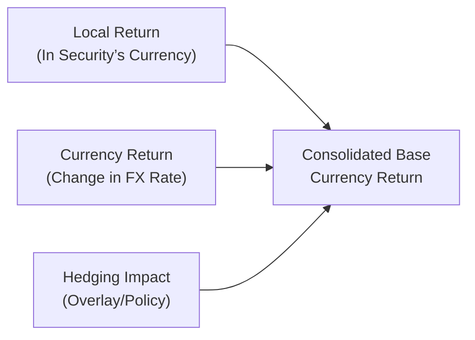

## Overview

I remember the first time I managed a portfolio that invested in several different countries. I felt pretty confident about the fundamentals of each stock and bond I’d chosen. But then—bam—the portfolio’s performance in our base currency was all over the place, even though local returns looked stellar. It was a humbling moment, and it quickly taught me how currency fluctuations can make, or break, a carefully constructed multi-asset strategy. Anyway, in this section, we'll dive into the nitty-gritty of how currency exposure affects portfolio performance measurement, how to attribute returns across multiple currencies, and how to report results in a consistent fashion that won't leave anyone confused.

## Currency Effects in Performance Measurement

Let’s start with a simple truth: whenever you hold assets denominated in a currency that’s not your base currency, your total return will partly come from the price changes in the underlying asset and partly from exchange rate movements. The standard formula to convert local asset returns into your base currency might look like this (and it’s slightly mathy, but bear with me):

$$
R_{\text{base}} = (1 + R_{\text{local}}) \times (1 + R_{\text{FX}}) - 1
$$

Here,  
• \\(R_{\text{base}}\\) is your total return in the base currency,  
• \\(R_{\text{local}}\\) is the asset’s local currency return, and  
• \\(R_{\text{FX}}\\) is the currency return (essentially the percentage change in the exchange rate).

Perhaps you bought a Japanese equity that returned 5% in yen terms, but your base currency is USD. If the yen weakened by 2% against the USD in that period, that currency movement would reduce your total return in USD. And that’s sort of a simplified illustration of how big a deal currency can be. Even if the underlying asset does great in local terms, currency depreciation can wipe out much of those gains.

### Hedging vs. Non-Hedging Decision

Managing currency risk can be done passively or actively. A passive currency hedge involves offsetting currency exposures systematically—think using forward contracts to lock in exchange rates. In contrast, active hedging (or active currency management) attempts to generate alpha through strategic decisions about when and how much to hedge. Both choices significantly influence your total returns, so measuring currency effects accurately is vital for evaluating whether these hedging strategies are adding value.

### Example

Let’s say you have EUR-denominated bonds in your portfolio. You’re a USD-based investor. You decide to hedge 50% of your euro exposure. If the euro depreciates 4% against the dollar, the half that’s unhedged sees a 4% currency loss, but the hedged portion is largely protected (ignoring any minor costs and slippages). When you measure performance, therefore, you need to break out how much of your total return came from the bond’s intrinsic performance in euros, how much from currency moves (both hedged and unhedged portions), and how much from your hedging costs or gains.

## Attribution Approaches

Performance attribution in multi-currency portfolios can get tricky, but it typically breaks down into three main pieces:

1. Local Market Return: How well did the security perform in its own currency?  
2. Currency Allocation Effect: How was the overall return impacted by holding certain currency exposures (or hedging them)?  
3. Security Selection Effect: Even for international equities, part of the difference in performance across stocks may come from the underlying currency’s strength or weakness.

### Currency Allocation Effect

This effect refers to the incremental return that arises purely because of the currency exposures you chose relative to your benchmark. For instance, if your benchmark has 40% USD, 30% EUR, 20% JPY, and 10% GBP, but your actual portfolio has 60% USD, 10% EUR, 20% JPY, and 10% GBP, you can bet the currency allocation effect will be front and center in explaining performance difference. If the dollar outperforms the other currencies, your overweight in USD is likely to help the portfolio.

### FX Impact on Security Selection

Sometimes it’s hard to separate currency from the local asset performance, especially if those returns are closely correlated with exchange rates or driven partly by capital flows from abroad. However, you can try to isolate the currency impact by examining how a security’s performance in local terms converts to the same security’s performance in your base currency. For example, if a stock soared 10% in local terms but the currency fell 9%, the net contribution to your base-currency-based performance might be only around 0.1%. That’s a big difference from the local perspective where 10% sounded fantastic.

### Hedging Policy

Many managers directly incorporate currency decisions into overall asset allocation, while others use a currency overlay—a specialized manager or an internal strategy that deals only with currency exposures, separate from the underlying assets. In performance attribution, you can measure how much the hedging strategy (passive vs. active) contributed to active returns. If, for example, your active currency bets netted an extra 2% return over the year, that 2% is credited to the currency overlay or currency management decisions.

## Multi-Currency Reporting

Consolidated reporting is a must for investors who want an overall snapshot of the portfolio, but it introduces complexities. You need a single base currency to present the entire portfolio’s performance, even if it holds assets in USD, EUR, JPY, and a few emerging market currencies. If you’re not careful, you might double count or misrepresent how much of a security’s return came from local fundamentals versus exchange rate movements.

Take a look at the following diagram to see a simplified depiction of how local returns, currency effects, and hedging feed into a base-currency-level performance figure:

The nodes above illustrate that you need to measure each piece—local return, currency return, and hedging impact—separately. You then combine them to see how they influence the final reported performance in the base currency.

### Avoiding Double-Counting

I had a friend who accidentally combined local currency returns with the currency gain/loss calculations in two different ways. The portfolio ended up looking like it had delivered absolutely spectacular performance—until we realized it was an overstatement from double-counting. That was a rather embarrassing conversation with a client. The best practice here is to systematically design your performance measurement system to isolate each effect only once.

## Case Example

Suppose you manage a globally diversified equity portfolio denominated in GBP. Over the quarter, the portfolio invests in:

• US equities (40% of portfolio)  
• Eurozone equities (40% of portfolio)  
• Japanese equities (20% of portfolio)  

Say, US equities (in USD) returned 5% in local terms, while USD appreciated 2% relative to GBP. Eurozone equities gained 1% in local terms, but the euro depreciated 2% relative to GBP. Japanese equities gained 3% in JPY terms, while JPY depreciated 1% against GBP.

If we compute the base-currency returns using the formula \\((1 + \text{Local Return})(1 + \text{FX Return}) - 1\\), we get:  
• US equities in GBP ≈ \\((1 + 0.05) \times (1 + 0.02) - 1 \approx 7.1\%\\)  
• Eurozone equities in GBP ≈ \\((1 + 0.01) \times (1 - 0.02) - 1 \approx -1\%\\)  
• Japanese equities in GBP ≈ \\((1 + 0.03) \times (1 - 0.01) - 1 \approx 1.97\%\\)

Now you’d weight these returns by the portfolio allocations (assuming no rebalancing during the period) to get the overall portfolio’s performance in GBP. If you had partially hedged your dollar exposure, you’d also factor in the cost of the hedge (or any realized gains).

## Best Practices and Pitfalls

• Maintain consistency: Always use a single base currency for performance reporting, even if you hold multiple currencies.  
• Keep a separate record of local returns vs. currency returns: Helps attribute performance properly.  
• Watch out for transaction and hedging costs: If you do a lot of currency trades, those costs add up and should be accounted for in your performance.  
• Avoid complicated layering: If you have partial hedges, forward contracts, or options, outline them clearly in your attribution process.  
• Monitor or specify benchmarks: If your benchmark is unhedged, but you hedge 100%, your currency results might diverge from the benchmark’s significantly. Clarify that in performance reports.

## Glossary

Base Currency: The currency in which portfolio results are typically reported. For instance, a UK manager might use GBP as the base currency, while a US manager would use USD.

Active Currency Management: Taking discretionary stances on currency movements to generate alpha. This method can add or subtract from returns, depending on the manager’s accuracy in forecasting exchange rates.

Currency Overlay: A separate strategy or manager that focuses solely on handling and possibly hedging the currency exposures in a portfolio. It’s like a specialized caretaker for your currency risk.

## References

• CFA Program Curriculum, “Currency Management: An Introduction.”  
• Solnik, Bruno and Dennis McLeavey, “International Investments.”  
• CFA Institute Code and Standards on Performance Reporting.

## Final Exam Tips

• During the Level III exam, you might see scenario-based questions asking how to attribute currency returns vs. local market returns. Be prepared to do the decompositions step by step.  
• Pay attention to currency hedging calculations. The exam might test your understanding of how to measure returns from partially or fully hedged exposures.  
• Review how benchmark currency exposures compare to the actual portfolio’s exposures. Scenario-based item sets often revolve around these differences.  
• If you get a constructed response question about multi-currency attribution, show each step. Vague responses receive partial credit at best.  
• Time management: Don’t let the math slow you down. Practice quick computations for (1 + R_local)(1 + R_FX) - 1 so you can handle them almost automatically.

## Evaluate Your Mastery: Multi-Currency Performance Measurement



### In a performance attribution schema, which component typically measures the impact of currency exposures relative to a benchmark?

- [ ] Local return effect
- [x] Currency allocation effect
- [ ] Security selection effect
- [ ] Market timing effect

> **Explanation:** The currency allocation effect specifically measures the impact of the manager’s relative currency exposures versus the benchmark.

### Which of the following formulas is commonly used to convert local returns to base currency returns?

- [ ] R_base = R_local + R_FX
- [ ] R_base = R_local - R_FX
- [ ] R_base = R_local + (1 + R_FX)
- [x] R_base = (1 + R_local)(1 + R_FX) - 1

> **Explanation:** You first translate local returns into base currency by compounding the local return and the currency movement, then subtracting 1 to get the net effect.

### If a currency appreciates against your base currency, how does it affect the converted return of an unhedged foreign asset?

- [ ] It decreases the foreign asset’s return in base currency
- [ ] It has no effect on investment returns
- [x] It increases the foreign asset’s return in base currency
- [ ] It creates a net zero result

> **Explanation:** When the foreign currency strengthens relative to your base currency, each foreign currency unit is worth more base currency units, so unhedged foreign investments typically see a boost in base currency returns.

### Which statement best describes a “currency overlay” manager?

- [ ] Focuses on selecting specific stocks to exploit international trends
- [ ] Manages only fixed-income instruments in the portfolio
- [x] Directly manages the currency exposures of the portfolio, separate from core security selection
- [ ] Oversees both equity and bond allocation but not currency hedges

> **Explanation:** A currency overlay manager primarily handles currency exposures, typically through derivatives, separate from the portfolio’s main investment strategy.

### In attributing performance for a partially hedged portfolio, which of these factors should be isolated?

- [x] Local asset performance, currency returns on unhedged portion, and gains/losses on hedges
- [ ] Only local asset performance and net currency results
- [ ] Security selection and market timing
- [ ] Hedge gains only; local returns are irrelevant

> **Explanation:** A thorough attribution requires identifying each driver of returns: the local returns, the currency returns for the unhedged piece, and the results of the hedging strategy.

### What is the primary purpose of selecting a consistent base currency for performance reporting?

- [x] To ensure comparability and avoid double-counting returns
- [ ] To automatically hedge the portfolio
- [ ] To eliminate foreign exchange risk
- [ ] To satisfy IFRS reporting rules only

> **Explanation:** Using one base currency across the entire portfolio allows for consistent performance comparisons and reduces the risk of miscounting currency effects.

### Which of the following is a likely outcome of double-counting currency returns?

- [x] Overstated portfolio returns
- [ ] Understated portfolio returns only
- [x] Misleading insights for investors
- [ ] Elimination of foreign exchange risk

> **Explanation:** Double-counting can artificially inflate the stated returns and produce confusing or misleading information for stakeholders.

### If you have an unhedged position in a currency that you expect to decline, which approach might mitigate the unfavorable currency movement?

- [x] Entering forward contracts to sell the foreign currency
- [ ] Buying additional foreign assets
- [ ] Doubling your exposure to that currency
- [ ] Eliminating all derivatives from your portfolio

> **Explanation:** If you expect a foreign currency to lose value relative to your base currency, you can use forward contracts or similar instruments to hedge (sell) that currency exposure.

### Which of the following statements about active currency management is most accurate?

- [x] It aims to generate alpha by forecasting currency movements
- [ ] It always outperforms passive hedging
- [ ] It generally eliminates foreign exchange risk
- [ ] It is prohibited by GIPS

> **Explanation:** Active currency management involves making tactical currency decisions to outperform a passive approach or benchmark, though it’s not guaranteed to succeed.

### True or False: In a multi-currency portfolio, currency gains or losses from hedges should be reported separately to avoid obscuring the underlying portfolio performance.

- [x] True
- [ ] False

> **Explanation:** Tracking currency hedge results independently ensures transparency and helps clarify how the hedge influenced total returns, instead of letting it get blended into local asset returns.




