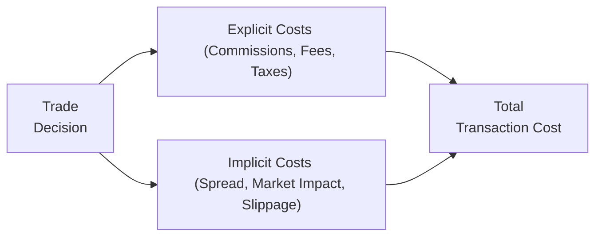

## Overview

Let’s face it: transaction costs can be one of those unseen forces that quietly nibble away at your portfolio returns. You might think you're generating stellar performance, but, well, commissions, bid-ask spreads, and market impact can sometimes rain on that parade. Understanding transaction costs is essential for accurately measuring—and attributing—the true value your portfolio strategy delivers. 

In this section, we’ll explore the different types of transaction costs, how they show up in performance measurement, and how you can attribute those costs so that you’re neither overstating nor understating a manager’s skill. We'll also look at a couple of examples, and—maybe just to keep things a bit more down to earth—I’ll even share a few “ouch” moments I’ve experienced when underestimating these costs. Ready? Let’s jump in.

## Types of Transaction Costs

It’s helpful to think of transaction costs as falling into two main buckets: explicit and implicit costs. These two categories together amount to the total friction investors face when buying or selling securities.

### Explicit Costs

Explicit costs are straightforward. They include things like:

• Commissions: The fees paid to brokers or dealers for facilitating a trade.  
• Taxes: In some jurisdictions, regulators impose transaction taxes or stamp duties on trades (this can vary widely from one market to another).  
• Exchange Fees: Fees charged by exchanges for executing trades on their platforms.

These are the costs that show up on your statement. They’re easy to identify and measure because they’re itemized. You see that line item in your brokerage statement—maybe it’s $7.99 or $12 for an online trade, or multiple basis points for large institutional trades. In any event, explicit costs are the ones that get all the attention because, well, they’re loud and in your face.

### Implicit Costs

Implicit costs, on the other hand, can be a little trickier. They include:

• Bid-Ask Spread: The difference between the price a buyer is willing to pay (bid) and the price a seller is willing to accept (ask).  
• Market Impact: The extent to which your own trading moves market prices. For large trades, especially, your activity may push (or pull) prices away from you.  
• Opportunity Costs (Slippage): The potential gain (or loss) from not getting your intended trade done immediately. If a portfolio manager waits—or tries to slice a large order into smaller pieces—market windows may close, or new ones may open, impacting prices.

It’s this second category, implicit costs, that can surprise you. Remember that time you placed a large order in a thinly traded stock, only to see the ask price jump right when you started buying? That’s market impact at work. These hidden costs can be difficult to forecast accurately, but they often matter more for institutional investors who trade in massive quantities.

Below is a simple diagram highlighting how these different cost elements fit together:

## Inclusion in Performance Measurement

Now, let’s talk about performance. When you measure your portfolio returns, do you net out transaction costs or not? If you don’t, you’re probably overstating your actual performance. I occasionally see managers who “forget” to account for transaction costs, especially when they’re trying to highlight the success of a particular strategy. But ignoring transaction costs produces an inflated and unrealistic sense of how well an approach is working.

To be precise, transaction costs shape your realized returns. Something might look profitable on paper, but once you factor in commissions, spreads, and market impact costs, that profit might shrink significantly. For example:

1. You decide to buy a thinly traded equity at $50 per share.  
2. You end up paying a $0.25 per share spread because of relatively weak liquidity.  
3. By the time you accumulate your desired position, the market price has moved to $50.50 due to your own demand.  
4. You also pay $0.02 per share in commission.

So, in real life, your effective cost is somewhere near $50.52, not $50. If your performance metric was calculated based on $50, you’re now overstating your gains by a material margin. Over the course of many trades, these little bits of friction all add up. Measuring performance without them is like counting your chickens before they hatch.

From a compliance perspective—especially for those who aim to align with frameworks like the Global Investment Performance Standards (see Chapter 3)—it’s crucial to ensure your GIPS-compliant returns reflect the net effect of transaction costs. GIPS includes requirements on how to handle fees, external cash flows, and performance calculations so that investors get a fair representation of net-of-cost results.

## Attribution of Transaction Costs

While we’re on the topic of fairness, attributing transaction costs properly is important for distinguishing between a security selection skill and the cost of trading. Breaking out the piece of underperformance (or outperformance) that’s due to the manager’s skill from the piece that’s due solely to friction helps you see who’s truly adding value.

### Models Attributing Costs to Individual Trades

Some advanced performance attribution systems assign transaction costs to specific trades. For instance, you might associate each purchase of a stock with the relevant commission, spread, and slippage. By doing this, you get a more granular view:

• Security Selection: Did the manager pick a stock that outperformed after controlling for transaction expenses?  
• Market Timing: Did the manager execute trades in a manner that avoided large market impact?

Segmenting transaction costs by trade can also reveal patterns. Maybe you discover that trades above a certain size threshold incur an abnormally large spread. You could then revise your trading execution process to split large orders into smaller ones, or to use limit orders rather than market orders, when appropriate.

### Implementation Shortfall

An especially popular framework for this sort of analysis is the Implementation Shortfall (IS) approach, championed in Perold’s classic paper. The concept is fairly straightforward—though the details can be a bit math-y.

In words, Implementation Shortfall measures the difference between the “paper portfolio” performance (what you would have earned if you could trade instantaneously at the decision price) and the actual performance you realize after accounting for all the real-world trading frictions.

A common formula for Implementation Shortfall looks like this:


\text{Implementation Shortfall (\%)} = 
\frac{\bigl(\text{Decision Price} - \text{Execution Price}\bigr) \times \text{Shares Traded}}{\text{Decision Price} \times \text{Shares Planned}}


The idea is that any deviation from your “ideal scenario” (trading right at the decision price with no delays, no slippage, no extra costs) is tallied as part of your implementation shortfall. This shortfall is, effectively, the sum of all the transaction cost friction plus any market impact and delays.

If you’re managing a large portfolio, the differences can be staggering—especially in fast-moving markets. Realizing that you lost, say, 30 basis points on a trade purely because you waited too long to execute can sting, but it’s valuable feedback to refine trading strategies and mitigate those costs next time around.

## Practical Examples and Case Study

Let’s illustrate with a simplified (and maybe slightly dramatic) example:

• Decision: You want 100,000 shares of a fast-growing technology company that’s trading at $80.  
• Commission + Fees: Let’s assume you pay $0.03 per share in total explicit costs.  
• Spread + Market Impact: In the process of accumulating your 100,000 shares, you push the price to $81.50, incurring a $1.50 per share gap from your initial decision price.  
• Timing: Because you wait over three trading sessions to fill the order, a favorable news story breaks out, sending the stock to $83 before you finish buying.

At the end of your purchase, your average price might be $82.80. So the Implementation Shortfall is calculated relative to your original “decision price” of $80. The shortfall arises from explicit costs ($0.03 / share) and implicit costs ($1.50 due to impact, plus all that additional incremental cost from a rising market). Let’s not forget you still might have done well if the price soared to $90 eventually, but if you measure your performance based only on $80, you’re missing the reality that your actual cost basis was higher.

## Best Practices and Common Pitfalls

Below are some guidelines that can help mitigate transaction costs and integrate them effectively into performance measurement:

• Smarter Order Types: Using limit orders instead of market orders might reduce slippage—but also raises the risk of partial fills or missed trades.  
• Algorithmic Trading: For larger trades, employing specialized execution algorithms (VWAP, TWAP, Implementation, or arrival price algorithms) can help reduce market impact.  
• Trading Venue Selection: Choose the right venue or exchange to match your order’s size and liquidity. Different venues have different fee structures and liquidity profiles.  
• Proper Attribution: Make sure your performance reports separate out transaction cost “hits” from your core alpha generation so that you—and your clients—see a fair reflection of skill.  
• Don’t Overtrade: This might sound obvious, but the more frequently you trade, the more you rack up transaction costs. Ensure that each trade is necessary within your investment strategy.

One of the biggest pitfalls I’ve seen is managers failing to maintain consistent policies. For instance, they’ll measure performance gross of transaction costs at times but then net of transaction costs in other presentations. This inconsistency can be extremely confusing to clients and can lead to compliance nightmares if not remedied.

## ESG Considerations

By the way, it’s worth noting that many asset owners are paying closer attention to ESG factors and responsible investing. Sometimes, that means trading around certain ESG events (for example, rebalancing to exclude high-carbon emitters) can introduce higher turnover. With higher turnover might come higher market impact. So if you’re factoring ESG constraints or filtering your universe, be sure to account for how that influences your trading costs. This is also an important cross-reference to older sections (1.15 Impact of ESG on Attribution and Appraisal).

## Tying Transaction Costs to Risk and Return Attribution

When connecting transaction costs to the broader context of performance measurement, recall that the prior sections (e.g., 1.4 Performance Attribution Approaches) introduced returns-based, holdings-based, and transactions-based methods. Transaction costs are most accurately captured in transactions-based attribution frameworks because they rely on actual trades and prices rather than aggregated or average data.

If you’re using a returns-based or holdings-based approach, you might still attempt to approximate the effect of transaction costs by applying average or estimated spreads. However, those proxies pale in comparison to the detail you get from transactions-based analysis, which helps you see the cost effect for each buy or sell order.

## Conclusion and Exam Tips

Transaction costs represent the “real world” friction that transforms an investing idea from a theoretical plan to an actual portfolio outcome. When you measure performance, ignoring them can lead to inflated visions of success. Further, attributing them incorrectly can blur the distinction between alpha from skill and the negative impact of inefficient execution. 

For the Level III exam, remember these key points:

• Be able to distinguish explicit from implicit costs, and give concise examples.  
• Understand how Implementation Shortfall is calculated and interpreted.  
• Know that trading costs must be included in GIPS-compliant performance measurement and that ignoring them can lead to noncompliance.  
• Be ready to discuss how to attribute these costs effectively—particularly in transactions-based attribution.

During constructed-response or item-set questions, you might get a scenario describing a big trade in an illiquid market. The exam might ask you to identify which portion of the total return shortfall is due to transaction costs. Be prepared to do the Implementation Shortfall calculation and interpret the result in terms of alpha or manager skill. Also, watch out for the difference between the decision price and the actual execution price, as well as additional explicit fees that should be factored in.

## References

• Perold, André F. “Implementation Shortfall: Transaction Costs on Fund Management.”
• CFA Institute, “Trade Strategy and Execution,” official readings.  
• CFA Institute, Global Investment Performance Standards (GIPS).  

-------------------------

## Test Your Knowledge of Transaction Costs in Performance Measurement



### Which of the following are commonly categorized as explicit transaction costs?

- [x] Commissions, fees, and taxes
- [ ] Market impact and slippage
- [ ] Changes in market volatility
- [ ] Portfolio rebalancing costs due to index changes

> **Explanation:** Explicit costs are those that are directly observable and billed, such as commissions, fees, and transaction taxes. Market impact and slippage are examples of implicit costs.

### When considering the effect of transaction costs on performance, ignoring these costs typically:

- [x] Overstates returns
- [ ] Has no impact on reported performance
- [ ] Understates long-term performance
- [ ] Always results in lower alpha

> **Explanation:** Failure to account for transactions costs overstates performance metrics by ignoring the drag caused by commissions, spreads, and other trading expenses.

### The bid-ask spread is best described as:

- [ ] The cost of brokerage commissions
- [x] The difference between the highest price a buyer will pay and the lowest price a seller will accept
- [ ] A fee mandated by regulators
- [ ] An execution algorithm that minimizes pricing error

> **Explanation:** The bid-ask spread is the gap between buyers’ bid prices and sellers’ ask prices and is an example of an implicit transaction cost.

### What is meant by “market impact” in the context of trading?

- [ ] A fixed fee per trade from the stock exchange
- [x] The extent to which an investor’s own trading activity drives market prices
- [ ] A government tariff on high-frequency trades
- [ ] A rating system for ESG compliance

> **Explanation:** Market impact refers to how the act of placing a large order drives the price of the security unfavorably for the trader, especially in less liquid markets.

### Which of the following statements about Implementation Shortfall is correct?

- [x] It measures the difference between the decision price and the actual execution price, reflecting trading frictions
- [ ] It refers to the shortfall caused only by brokerage commissions
- [x] It incorporates implicit costs such as market impact
- [ ] It cannot be applied to fast-moving markets

> **Explanation:** Implementation Shortfall captures both explicit and implicit costs by measuring the deviation from an assumed frictionless trade price to the actual price received when trades occur.

### A transactions-based attribution approach:

- [x] Tracks the effects of each individual trade, including transaction costs
- [ ] Ignores transaction costs and focuses on security selection
- [ ] Only applies to fixed-income portfolios
- [ ] Uses regression analysis on historical returns

> **Explanation:** Transactions-based attribution dissects individual trade costs and timing to attribute performance outcomes accurately.

### In measuring performance under the Global Investment Performance Standards (GIPS):

- [x] Transaction costs must be included in net return calculations
- [ ] Managers can ignore taxes and fees for reporting
- [x] Ignoring transaction costs can lead to noncompliance
- [ ] Trades executed on foreign exchanges are always excluded

> **Explanation:** GIPS standards require that actual trading costs be reflected in performance so that reported returns accurately represent investor experience.

### Which of the following actions can help reduce the impact of implicit transaction costs?

- [x] Breaking large trades into smaller orders
- [ ] Investing solely in high-dividend stocks
- [ ] Moving a portfolio to 100% cash
- [ ] Avoiding all limit orders

> **Explanation:** Large orders executed at once often cause higher market impact. Splitting them into smaller increments or using algos can mitigate slippage and spread costs.

### If a manager consistently disregards transaction costs, the reported alpha will:

- [x] Appear higher than the actual alpha
- [ ] Be unaffected by misreporting
- [ ] Appear lower than the actual alpha
- [ ] Remain unchanged, as alpha is risk-adjusted

> **Explanation:** Failing to subtract transaction costs inflates return measurements, artificially boosting alpha.

### True or False: Implementation Shortfall can only be applied to equity trades and is not relevant for fixed-income or derivative trades.

- [x] True
- [ ] False

> **Explanation:** This statement is actually misleading. Implementation Shortfall can be applied broadly to various asset classes, including equities, fixed income, and derivatives, by measuring the cost of trading relative to a no-cost benchmark price. The correct approach is to note that it’s not limited solely to equities.


