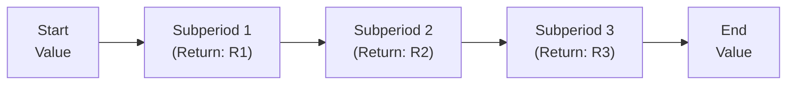

## Introduction and Context

Linking attribution across subperiods is one of those topics that can look deceptively simple until, all of a sudden, you realize your performance numbers just won’t tie out. I remember the first time I tried a multi-month attribution analysis on an equity portfolio where the benchmark changed mid-quarter. I was super confident at the start—then halfway through, I was scratching my head, wondering why the subperiod attribution wouldn’t sum neatly to the total. If you’ve been there or suspect you might end up there, keep reading.

This discussion will give you the broad understanding and practical tools needed to confidently combine returns from multiple subperiods (for instance, monthly or quarterly intervals). We’ll talk about why it’s even necessary (hint: things change a lot in practice), the main approaches (arithmetic vs. geometric linking), how to handle weird real-world complications, and the best ways to stay consistent in your assumptions. We’ll also look at a mini case study and a diagram or two to make all these theoretical points stick.

## Why Linking Over Subperiods Matters

In an ideal world, you’d measure performance from day one to the end of the performance horizon and be done. But real portfolios evolve: managers might change at the end of Q2, there might be a strategic reallocation mid-year, or benchmarks might get redefined at different times. As a result, the overall period disaggregates into smaller subperiods, each with its own set of portfolio characteristics, benchmarks, or net flows.

Linking across subperiods means you’re putting those smaller puzzle pieces back together to capture what happened over the entire horizon. This process ensures that your attribution analysis—where you pinpoint the sources of returns—accurately sums (or compounds) to the actual total return you observe.

## Key Subperiod Challenges

Let’s look at some of the real-life challenges you might face:

• Different managers or strategies might operate in slightly different timeframes. You might have one manager from January to May, while another manager takes over on June 1.  
• Benchmarks can change composition or weightings intraperiod. For example, your fixed-income benchmark might add emerging markets in April. Oh, joy.  
• Transaction data or rebalancing can alter weights significantly from one month to another, making it tricky to apply a single “start-of-period” weighting method.  
• Performance-based fees and flows (common in alternative investments) might complicate how you define “the end” of one subperiod and “the start” of the next.

All these situations require a rigorous and consistent method for linking subperiod attributions so that each mini-attribution reflects what happened when it happened—and the overall result lines up with what you’d see if you just measured from day one to the end.

## Overview of Arithmetic and Geometric Linking

On a high level, there are two main ways to link subperiod attributions. The choice can be somewhat philosophical, but it often boils down to the context of your portfolio reporting and your preference for reconciliation consistency.

### Arithmetic Linking

Arithmetic linking takes each subperiod’s attribution results—like the style effect, sector allocation effect, security selection effect, etc.—and sums them up across all subperiods. Because arithmetic approaches are additive, it might seem straightforward at first. However, in many cases you need an adjustment factor (often called a “reconciliation factor”) to ensure that the sum of the subperiod contributions matches the actual total period return.

Some people prefer the arithmetic method because it aligns with how they interpret absolute performance in each period (adding returns). But ironically, you can end up with a mismatch if you just do simple addition without carefully reconciling. The final numbers might be slightly off due to compounding effects—particularly if returns vary a lot from one subperiod to the next.

### Geometric Linking

Geometric linking is a compounding-based approach. Basically, instead of summing, you multiply each subperiod’s “1 + Return” factor to arrive at the total return for the entire time. If you’re used to weighting subperiod returns geometrically—like how you’d measure cumulative portfolio returns over multiple periods—this might feel more natural. It’s also more consistent with how most performance calculations treat multi-period returns (i.e., compounding over time).

On the downside, some folks find it a bit more involved to interpret. The contributions to selection or allocation might appear trickier to sum up in psychological terms, because we’re dealing in multiplicative increments instead of a simple additive process.

## Digging into the Arithmetic Method

Their biggest selling point: simplicity. If you want to see how the sum of each subperiod’s selection effect contributes to the total, it’s intuitive to think, “Let’s just add them up.” But the economy or market environment rarely cooperates enough for that approach to perfectly match the total return. Why? Because returns are multiplicative in nature. If you make +10% in the first period, you have 1.10 × some base. If you then lose 5%, you’re multiplying that new base by 0.95. Summing +10% and –5% might suggest a net +5%, but in reality, the total gain is 1.10 × 0.95 – 1 = 4.5%. That difference is your reconciliation factor.

### Arithmetic Linking Formula

If we let A₁, A₂, …, Aₖ represent attribution effects (like selection effect, allocation effect, etc.) in each subperiod, a simplified version of the arithmetic link looks like:

A_total = (A₁ + A₂ + ... + Aₖ) + Adjust

Where the “Adjust” is the reconciliation. The precise magnitude of that adjustment depends on how you measure each effect and the portfolio’s performance path. The main principle is:  
• Sum up each subperiod attribution.  
• Compare the sum to the actual difference between final portfolio value and initial portfolio value.  
• Slot in a small “Adjust” term that closes the gap.

## Exploring Geometric Linking

The geometric approach typically multiplies factors like (1 + selection effect). You can think of each effect as a ratio that scales the portfolio upwards or downwards. By combining these factors, you remain consistent with the concept of compounding. If the real world of returns is multiplicative, so is your method.

### Geometric Linking Formula

We might express a subperiod effect Eᵢ as (1 + Eᵢ), so the overall effect is:

1 + E_total = (1 + E₁)(1 + E₂)...(1 + Eₖ)

You then solve for E_total. It’s elegant because you don’t need a separate “adjustment factor.” On the other hand, if your boss (or client) is used to seeing effects in purely additive terms, you might need to explain why the sum of “two good quarters” doesn’t necessarily add up neatly the way they might expect.

## Best Practices in Setting Subperiod Boundaries

No matter which method you choose, try to define your subperiod boundaries clearly and consistently. That alone can save you from a lot of confusion. Here are a few tips:

• Align subperiods to major shifts in portfolio strategy or manager transitions. If you changed your large-cap equity manager on February 10, consider that a boundary date for subperiod 1 vs. subperiod 2.  
• Standardize how you treat flows or rebalancing points. Make sure you specify whether you’re using beginning-of-period or end-of-period weights for each subperiod. Consistency is key.  
• If you do monthly or quarterly increments, keep it that way; don’t switch mid-year from monthly to quarterly (unless absolutely necessary).

### A Quick Example of Subperiod Boundary Definition

Let’s say your portfolio invests in equities and fixed income. You evaluate performance monthly. In January, you significantly rebalance from 60% equities to 45% equities, adding a new manager specialized in alternative credit on January 15. Should you create two subperiods within January (January 1–14, January 15–31) or one subperiod for the entire month? There’s no single right answer, but you definitely need to be explicit. If you swiftly changed your manager mid-month, it might be more logical to define subperiod boundaries around that event.

## Maintaining Consistent Assumptions

It’s not enough to define subperiods vaguely. For an effective linking exercise:

• Decide on a weight measure (beginning-of-period, midpoint, or something else) and use it consistently across subperiods.  
• Keep the same rebalancing method across subperiods.  
• Use consistent start-of-period valuations for the next subperiod.  
• Make sure each subperiod’s attribution lines up with the correct benchmarks—a slight mismatch in benchmark reconstitution dates can create confusion when you try to link them all up.

## Diagram: Visualizing Multi-Period Linking

Below is a small Mermaid diagram illustrating conceptually how subperiod returns combine to a total period return:

In arithmetic linking, you might separately compute the effect of R1, then R2, then R3, sum them, and do an adjustment. In geometric linking, you’d compound returns as (1+R1)*(1+R2)*(1+R3) – 1.

## Handling Intra-Period Benchmark Changes

Suppose your benchmark was 70% equity, 30% fixed income at the start of the year. In June, it changes to 60% equity, 40% fixed income. All your subperiod-based attributions rely on an accurate reflection of how the benchmark compares to the portfolio. Indeed, if the benchmark changes weighting, the attribution logic for subperiod 1 (January–May) is going to differ from that of subperiod 2 (June–December). When linking, it’s crucial to:

• Use the correct, old benchmark composition for subperiod 1.  
• Use the correct, new benchmark composition for subperiod 2.  
• If managers overlap or if the benchmark weightings phased in gradually, define subperiods around that timeline or use a pro rata approach if the weighting changed on a particular day.

## Insights from a Case Study

Imagine a balanced portfolio that invests 50% in equity and 50% in fixed income starting January 1. Then on April 1, the strategy shifts to 70% equities and only 30% fixed income. In Q1, the manager outperforms the original benchmark by 1.5%. In Q2, that new equity-heavy mix outperforms the new benchmark by 2%, even though markets are super volatile. By the end of the second quarter, you want to see how everything combined. If you try an arithmetic approach, you might sum 1.5% + 2% = 3.5%. But if the second period’s performance is measured off the bigger equity base—plus, maybe your portfolio grows in Q1—then the final figure using a geometric approach might be more in line with the actual realized total. You might need an arithmetic reconciliation factor.

In practice, if you absolutely need an additive breakdown, you can still use arithmetic methods. Just make sure you track that reconciliation factor. If your audience or your system is set up to handle multiplicative methods, go geometric.

## Practical Pitfalls and How to Avoid Them

• Mixing Methods: If your subperiod method is arithmetic for selection effect but your total period returns are geometric, you may end up with a mismatch. Choose a consistent approach or, if you must switch, be super clear why.  
• Inconsistent Dates: Make sure subperiod start and end dates match your actual transaction or manager changes. Don’t approximate or you’ll sabotage your own calculations.  
• Benchmark Overlaps: If you have two benchmarks overlapping, do you weigh them or keep them separate during the bridging period? Have a documented approach.  
• Overcomplicating: Don’t define subperiods for trivial events. If every small trade or rebalancing triggers a “new subperiod,” you’ll bury yourself in details.

## Exam Relevance and Tips

• Show Your Work: In a constructed-response exam question, it’s common to see a scenario with partial periods or multiple managers. Label each subperiod, specify which linking method you’re using, and (if arithmetic) show how you handle the reconciliation factor.  
• Know the Formulas: If you get item-set questions about multi-period performance, you might need to identify whether an approach is arithmetic or geometric and compute the final link. Practice with the formulas to avoid last-minute confusion.  
• Common Pitfalls: The exam might show an example where the simple sum of subperiod returns doesn’t match the final portfolio return. You’d need to identify that discrepancy and apply the correct linking approach or an adjustment factor.  
• Time Management: Don’t get lost in the weeds. The exam typically focuses on conceptual mastery and the ability to do relevant calculations quickly and accurately.

## Additional Considerations

Although we’re focusing primarily on how to combine subperiod attributions, don’t forget that other complexities—like partial management fees, currency fluctuations, or changes in how ESG constraints are applied—can also slip into the picture. If you’ve read earlier sections (for instance, the chapters on multi-currency portfolios or ESG), you’re aware that these dynamic factors can significantly alter each subperiod’s returns, making consistent linking even more vital.

## References and Suggested Readings

• Bacon, Carl: “Practical Portfolio Performance Measurement and Attribution,” especially the chapters on multi-period arithmetic and geometric linking.  
• CIPM curriculum materials: For a more methodical step-by-step approach with detailed examples of subperiod linking.  
• GIPS Standards (Global Investment Performance Standards): Several provisions address partial period returns, composite switches, and consistent performance measurement.  
• CFA Institute (2025). Official Curriculum for the CFA® 2025 Level III Program, Volume 3: Performance Measurement.

## Test Your Knowledge: Linking Attribution Across Subperiods Quiz



### Which of the following is a key difference between arithmetic and geometric linking in performance attribution?

- [ ] Arithmetic linking is always more accurate than geometric linking.  
- [ ] Geometric linking ignores subperiod returns.  
- [x] Arithmetic linking adds subperiod returns and may require a reconciliation factor, while geometric linking compounds subperiod returns.  
- [ ] Geometric linking always produces higher final returns.  

> **Explanation:** Arithmetic linking sums up subperiod returns and typically depends on an adjustment or reconciliation factor to match the total return. Geometric linking is a multiplicative method and doesn’t require adding a reconciliation term.

### When defining subperiod attribution boundaries, which of the following is most critical?

- [ ] Selecting subperiods strictly by the calendar year.  
- [ ] Matching subperiods to daily swings in market prices.  
- [x] Aligning subperiods with notable manager or benchmark changes, and using consistent start/end dates.  
- [ ] Minimizing the total number of subperiods to reduce complexity.  

> **Explanation:** Subperiod boundaries should reflect genuine changes—such as a switch in manager, a rebalancing event, or a new benchmark. Consistency in how subperiods are defined helps avoid confusion.

### A manager outperforms a benchmark by 3% in the first subperiod and underperforms by 1% in the second subperiod. Assuming additive (arithmetic) subperiod attribution, which statement best describes the total outperformance, ignoring any reconciliation factor?

- [ ] Exactly +1%  
- [ ] Exactly +2%  
- [x] Exactly +2% before considering any compounding effects  
- [ ] Exactly −2%  

> **Explanation:** Arithmetic linking would add +3% and −1% to get +2%. However, that figure might differ slightly from the actual net effect once you factor in compounding over the entire period.

### Which of the following is a common pitfall in linking attribution across subperiods?

- [ ] Using consistent benchmark composition throughout subperiods  
- [x] Mixing arithmetic linking for some subperiods and geometric linking for others without reconciling  
- [ ] Using a final reconciliation factor in arithmetic linking  
- [ ] Compounding returns in geometric linking  

> **Explanation:** A common mistake is mixing linking methods (arithmetic for some subperiods, geometric for others) which leads to inconsistent results.

### Why might an investor prefer geometric linking over arithmetic linking?

- [x] It reflects the multiplicative nature of returns and typically doesn’t require a separate reconciliation factor.  
- [ ] It’s easier to interpret in short intervals.  
- [ ] It’s the only method recognized by GIPS.  
- [ ] It leads to smaller reported returns in volatile markets.  

> **Explanation:** Geometric linking compounds subperiod returns, which aligns with how portfolio values actually evolve over time. It doesn’t require the same additive reconciliation factor that arithmetic linking does.

### If a portfolio experiences +5% growth in one subperiod and −10% growth in the next subperiod, which approach helps highlight the impact of compounding most directly?

- [ ] Arithmetic linking with no adjustment  
- [x] Geometric linking  
- [ ] Summation of returns less fees  
- [ ] Pure factor-based partial linking  

> **Explanation:** Geometric linking is all about compounding subperiod returns. +5% followed by −10% results in an actual total return of (1.05 * 0.90) – 1 = −5.5%.

### An investor who uses arithmetic linking for subperiod attributions finds that the sum of subperiod returns is +8%, but the portfolio’s actual total return is only +7.6%. What is the difference likely to represent?

- [ ] The total management fee for the period  
- [x] A reconciliation or “residual” factor  
- [ ] The performance of a risk-free asset  
- [ ] Benchmark composition changes  

> **Explanation:** Under arithmetic linking, the “missing” 0.4% is typically the adjustment needed to reconcile the additive subperiod returns with the true total return.

### If market values or weights at the start of each subperiod are inconsistent due to incorrect inputs, which risk is most likely?

- [ ] Understating benchmark risk  
- [ ] Over-reporting transaction costs  
- [ ] Overstated geometric returns but accurate arithmetic returns  
- [x] Performance attribution results that do not properly link across subperiods  

> **Explanation:** If start-of-period values are incorrect, the subperiod attributions won’t reflect the actual distribution of assets, potentially leading to misaligned (and un-linkable) attribution results.

### When a benchmark composition changes partway through a year, which of the following best ensures valid subperiod attribution?

- [ ] Use only the old benchmark for the entire year to maintain consistency.  
- [x] Attribute performance separately under each benchmark weight regime, then link those results.  
- [ ] Average the two benchmarks’ compositions for the whole year.  
- [ ] Ignore the change if it occurred after mid-year.  

> **Explanation:** Proper subperiod attribution demands that each portion of time is attributed against its correct benchmark composition. Then those subperiod results can be linked accurately.

### True or False: Arithmetic linking typically produces an exact match to the portfolio’s total return without any adjustments.

- [ ] True  
- [x] False  

> **Explanation:** Arithmetic linking often requires an additional reconciliation term to match the final total return because returns compound rather than simply add.


