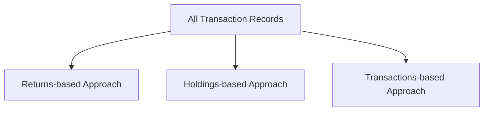

## Conceptual Overview

Performance attribution is like shining a flashlight onto the various nooks and crannies of a portfolio’s returns. After all, it’s one thing to note that a portfolio returned 10% last quarter, but it’s an entirely different exercise to peel back the layers to see what caused that 10% result. That’s where different attribution approaches step in.

We have three main approaches: returns-based, holdings-based, and transactions-based. Each approach answers the question, “How did we get these returns?” but from different vantage points and with different data requirements. If you’ve ever tried to figure out where you spent too much money over the course of a month—by checking your bank statement weekly (rather than daily) or by tracking every single receipt in real-time—you already know the difference in the level of detail and accuracy each method provides. Let’s walk through these approaches in detail.

## Returns‑Based Attribution (RBA)

Returns-based attribution (RBA) offers a quick snapshot of how a portfolio’s performance might be explained by shifts in style or factor exposures. Typically, it uses periodic portfolio returns—often monthly or quarterly—and attempts to decompose those returns into allocations across broad asset classes or factors.

Imagine you’re a manager with only a fund’s monthly returns at your disposal. You notice the fund’s performance seems to mimic a blend of mid-cap and growth indexes. RBA essentially regresses the fund’s returns against these benchmark returns to identify how much performance stems from factor bets (e.g., growth vs. value) and how much comes from timing or manager skill.

### Key Advantages of RBA

• Ease of Implementation: You only need historical returns on the portfolio and some candidate benchmarks. This is like analyzing your average grocery expenditure by simply glancing at your total bank balance each month, without diving into item-by-item receipts.  
• Minimal Data: If the underlying trade data are unavailable—perhaps the manager doesn’t release full holdings or transaction details—RBA still provides insights.  
• Fast Comparison: RBA can offer a quick, high-level indication of style drift or factor exposures relative to a broad reference.

### Drawbacks of RBA

• Reduced Transparency: Since RBA relies on aggregated periodic returns, it can’t disentangle mid-quarter or mid-month (intra-period) trades. If your portfolio had a huge trade on Day 10 of a 31-day month, the short-term effects won’t be measured precisely.  
• Approximation Errors: RBA might incorrectly highlight a sector or factor tilt just because of overlapping return patterns, not necessarily because the manager actually allocated capital that way. Correlation can seduce your analysis into seeing relationships that aren’t truly there.  
• Limited Insight on Specific Security-Level Decisions: You might see that the fund is acting “growth-y,” but you cannot confirm how or when the manager took advantage of specific securities to deliver alpha.

### Simple RBA Formula

One typical approach is a regression of portfolio returns on style or factor index returns:

(1) Rₚ = α + ∑(βᵢ × Rᵢ) + ε

where:  
• Rₚ = portfolio return in each period.  
• Rᵢ = return of selected style index or factor index in each period.  
• βᵢ = the sensitivity of the portfolio to each factor (the weighting).  
• α = the portion of return unexplained by those factors (often interpreted as skill).  
• ε = residual (error term).

## Holdings‑Based Attribution (HBA)

Holdings-based attribution (HBA) zooms in on the actual securities in the portfolio at the start of each measurement period. It tries to see if your chosen stocks, bonds, or other instruments beat or lagged a relevant benchmark. Think of it like analyzing your monthly grocery bill by looking at the items you had in your pantry on Day 1 and seeing how their prices changed by Day 30.

### Mechanics of HBA

Here, you look at the initial weights of each security in your portfolio, multiply by that security’s subsequent return, and compare it to what a benchmark’s corresponding segment or security did. A standard method of holdings-based attribution might be a Brinson-style approach, decomposing active returns into allocation, selection, and sometimes interaction.

### Benefits of HBA

• Greater Detail on Stock Selection: Because it’s based on what you actually held at the start of the period, it highlights where your picks outperformed or underperformed the benchmark.  
• Clearer Signals on Mandate Fulfillment: If you’re supposed to invest primarily in large-cap technology stocks, HBA will clearly show where your chosen securities added or detracted value.

### Drawbacks of HBA

• Ignores Mid-Period Trades: If you sold a security halfway through the period (maybe it soared early, then tanked), those subsequent events might be “lost” in the standard HBA calculation.  
• Misattribution Risk: A manager who does a lot of intraday or intraperiod trading can appear to have done phenomenally well (or poorly) for reasons that aren’t fully captured by an initial snapshot of holdings.

### Illustrative HBA Formula

Below is a simplified take on how HBA tries to slice up active return:

(2) Active Return = ∑[wᵢ × (rᵢ − bᵢ)]

where:  
• wᵢ = weight of security i in the portfolio at the start of the period.  
• rᵢ = return of security i.  
• bᵢ = return of the corresponding benchmark or index segment for security i.

In practice, more refined formulas break out whether outperformance came from asset allocation decisions or from security selection decisions relative to the benchmark. But the big picture is straightforward: HBA depends on starting positions.

## Transactions‑Based Attribution (TBA)

Now, if you absolutely must trace every effect from every buy and sell, you need transactions-based attribution (TBA). Imagine you’re religiously logging every single grocery receipt the moment you exit the store. TBA is that exhaustive. It accounts for the precise timing and size of each trade within the measurement period.

### Core Advantages of TBA

• Most Precise: TBA captures your exact trading decisions and the exact times you put on or took off certain portfolio exposures. If your manager is super active—think day trading or extremely opportunistic calls—TBA is the gold standard for seeing how decisions played out.  
• Better Reflection of Actual Execution: If a manager times trades before earnings announcements, TBA reveals the how and when of this skill.

### Potential Downsides of TBA

• Heavy Data Requirements: For TBA to work, you need complete, accurate information about all trades. That could mean reams of data from custodial files, possibly across multiple systems.  
• Complexity: TBA calculations can become quite elaborate, especially for large portfolios with derivatives, short positions, or complex multi-asset instruments.  
• Resource Intensive: It requires significant staff effort and robust technology to compile and validate transaction-level data.

## When to Use Each Approach

Returns‑Based Attribution might be the best choice when:
• You only have publicly available data or aggregated periodic returns.  
• You need a broad-stroke or “quick and dirty” look at factor exposures.  
• You’re screening managers in an initial due diligence process before diving deeper.

Holdings‑Based Attribution is often perfect for:
• Portfolios that remain relatively stable—like buy-and-hold strategies or funds with minimal turnover.  
• When you want more detail than RBA offers but don’t want—or can’t obtain—full transaction histories.  
• Medium or lower turnover equity funds that confirm stock selection quality.

Transactions‑Based Attribution is the ultimate if:
• You have a portfolio with high turnover or active trading.  
• You’re analyzing a manager with strategies heavily dependent on market timing decisions.  
• Precision is critical—maybe you must justify each trade decision for compliance, or you’re evaluating how quickly the manager invests new cash flows.

## Practical Exploration with an Example

Let’s say you run a global equity portfolio. You have 20 core holdings that you hold for months at a time (75% of the portfolio), but you also do short-term trading in emerging markets stocks (25% of the portfolio). If you pick only RBA, the short-term trades might appear as a random blip in your factor regression. Meanwhile, HBA would capture your 20 core holdings nicely but gloss over the short-term trades in emerging markets. TBA would show the exact contribution from each of those short-term trades—but it also means you have to handle far more data. A balanced approach might be to combine HBA for the stable portion of the book and TBA for the short-term portion, or to adopt TBA only in months when turnover soared above a certain threshold.

## Diagram: Data Inputs for Different Attribution Approaches

Below is a simplified flowchart of the data sources feeding the three attribution approaches:

• As you can see, RBA uses aggregated return data, HBA uses the portfolio composition at the beginning of each period, and TBA ingests full transaction datasets.

## Common Pitfalls and Best Practices

• Pitfall: Overreliance on RBA for active managers. You risk missing out on the nuances of skillful intraperiod trades.  
• Best Practice: Use RBA primarily for broad manager screening or factor-based style analysis.  

• Pitfall: Treating mid-period trades as negligible under HBA. Even if trades represent a small fraction of your total portfolio, those could be exactly where your alpha is coming from (or going).  
• Best Practice: For moderate turnover portfolios, perform HBA but keep a separate log of significant mid-period transactions to evaluate whether the results might be distorted.  

• Pitfall: Jumping into TBA without robust systems. You could drown in data or, worse, end up with inaccuracies if your transaction logs aren’t fully reconciled.  
• Best Practice: Ensure you have strong operational infrastructure before adopting TBA. Consider partial transaction-based methods or apply TBA only to certain segments of the portfolio.

## Case Study: Reconciling Attribution Gaps

I remember a firm I consulted for years ago—let’s call them BlueRock Advisors—who suspected their returns-based attribution was oversimplifying their portfolio story. They had consistent monthly data plus a stable set of core holdings, but occasionally made big mid-month trades on biotech stocks ahead of FDA announcements. HBA didn’t catch those frequent trades fully, leading to confusion as to why the performance attribution didn’t match the actual returns. When we introduced TBA just for the biotech segment, the performance “mystery” was solved—we discovered that over 40% of the portfolio’s alpha came from a handful of well-timed compound trades. That taught me the real power of TBA for certain strategies (and also the complexity of explaining that to stakeholders).

## Relationship to Other Topics

Performance attribution, particularly TBA, connects closely to transaction cost analysis (discussed in Section 1.17 of this book). After all, if you’re diving into each transaction, you’ll also want to know how much of your alpha was eaten away by market impact, commissions, and other trading costs. Similarly, factor-based analysis from RBA can dovetail with multi-asset portfolios (Section 1.13) or with ESG overlays (Section 1.15) to see how changing factor exposures across geographies or sustainable investments might have influenced performance.

## Final Exam Tips

• Carefully define your benchmark. Poor benchmark choice can lead to flawed attributions across all three approaches. Watch Section 1.8 on Benchmark Types and Liability-Based Benchmarks if you need a refresher.  
• Subperiod Linking: If you do multi-period attribution, be mindful of the linking process (Section 1.18). HBA or TBA might complicate how you string together daily or monthly returns.  
• Manage Time Wisely: On the CFA exam, if a question provides transaction data, it’s a hint they want you to do TBA or a more granular form of HBA. If only returns or factor data are provided, expect RBA-based calculations.  
• Understand the Purpose: The exam might ask you to recommend an approach based on the specific manager strategy or data availability. Cite the cost-benefit trade-off in data complexity vs. precision.  

## References for Further Exploration

• Bacon, Carl: “Practical Portfolio Performance Measurement and Attribution.” This is the go-to for real-world practical tips.  
• CFA Institute’s CIPM Program Materials: Offer deeper technical dives into the mathematics and interpretation of attribution.  
• Maginn, Tuttle, Pinto, and McLeavey (CFA Institute Investment Series): Another robust resource for performance measurement and evaluation.  



### Performance Attribution Approaches Quiz

- [x] They capture factor exposures using aggregated data
- [ ] They rely on actual buy/sell records throughout the period
- [ ] They require detailed holdings data
- [ ] They inherently track each mid-period trade

> **Explanation:** By design, returns-based attribution uses top-level periodic returns from which it infers factor exposures or style tilts. It doesn’t use full transaction data or starting portfolio holdings.

### With holdings-based attribution, which of the following is a primary limitation?

- [ ] It offers clear visibility into each intraperiod trade
- [ ] It uses publicly available returns
- [x] It may overlook the impact of large mid-period trades
- [ ] It’s the simplest form of performance attribution

> **Explanation:** Holdings-based attribution focuses on the portfolio’s composition at the start of each measurement period, so significant mid-period trades can be underrepresented or misattributed.

### Which statement best describes transactions-based attribution?

- [ ] It’s ideal for managers who rarely trade
- [x] It captures the timing and size of every trade
- [ ] It only uses summary data from the prior year
- [ ] It’s less accurate than returns-based methods

> **Explanation:** TBA analyzes each executed trade, making it more accurate for active managers who frequently adjust their positions.

### A portfolio manager claims they frequently rotate sectors within a month. Which attribution approach would most accurately reflect this activity?

- [ ] Returns-based
- [ ] Holdings-based
- [x] Transactions-based
- [ ] Peer-based

> **Explanation:** Sector rotation within a month implies high turnover and timing nuances that only transactions-based attribution can fully capture.

### Holding a stock from the start of the month to the end of the month and benefiting from its appreciation is best measured by:

- [ ] Returns-based attribution
- [x] Holdings-based attribution
- [ ] Transactions-based attribution
- [ ] None of the above

> **Explanation:** If you hold the stock continuously over the period, HBA cleanly shows how the security’s performance contributed to the portfolio return, assuming minimal intraperiod trades for that position.

### What is a typical drawback of returns-based attribution when comparing managers?

- [ ] It provides excessive details on trades
- [x] It might group different strategies under similar factor exposures
- [ ] It requires heavier transaction tracking
- [ ] It’s too slow to calculate

> **Explanation:** RBA can lump dissimilar managers together if their returns merely correlate with the same factor indexes. It lacks the precise trade-level data to differentiate truly distinct strategies.

### In a scenario where data availability is low, and the manager only discloses monthly returns and a broad investment objective, which method usually fits?

- [x] Returns-based attribution
- [ ] Holdings-based attribution
- [ ] Transactions-based attribution
- [ ] Peer group comparison

> **Explanation:** RBA is the logical choice when you mainly have monthly or quarterly returns. Holdings or transactions-based approaches require much more granular data.

### Which approach generally requires the greatest data-management capability?

- [ ] Returns-based approach
- [ ] Holdings-based approach
- [x] Transactions-based approach
- [ ] None of these

> **Explanation:** TBA demands capturing, storing, and analyzing all trades. This is data-intensive and typically more complex than RBA or HBA.

### A fund invests in 50 stocks, reconstituted only at quarter-end. Which method is likely sufficient to capture most of its active decisions?

- [x] Holdings-based
- [ ] Returns-based
- [ ] Transactions-based
- [ ] Factor-based

> **Explanation:** Since the fund rebalances only once per quarter, holdings-based captures these discrete changes well. TBA might be overkill, and RBA might be too opaque.

### True or False: Transactions-based attribution is always the preferred approach regardless of portfolio style or data availability.

- [x] True
- [ ] False

> **Explanation:** While TBA is often the most accurate, in practice it’s not always feasible or preferred due to data complexity, operational costs, and the manager’s trading style. However, it’s commonly considered the “gold standard” for capturing intraperiod decisions, so if data and resources allow, TBA is typically the most comprehensive option.


